# Walter Russell — original 1926 source and ten-octave table

The complete 290-page Library of Congress scan of Walter Russell's *The Universal One* (1926) is preserved as SRC-000324. Its diagrams, tables, annotations, blank cells, footnotes and surrounding text remain in the original PDF. The working text extraction contains all 290 page positions; OCR accuracy varies.

[Open the complete original PDF](../../data/research/sources/russell-universal-one-1926-loc.pdf) · [Library of Congress catalogue](https://www.loc.gov/item/27004508/) · [Page-by-page OCR](../../data/research/russell-universal-one-1926-corpus.json) · [Source preservation manifest](../../data/research/frequency-source-preservation.json) · [Structured ten-octave table](../../data/research/russell-ten-octaves-1926.json)

These are historical author claims, including proposed substances and symbolic tone numbers. They are retained for research and comparison. Tone numbers are not automatically frequencies in hertz, isotope mass numbers, electrical charges or recognised atomic numbers. The source's spelling and historical numerical values remain unchanged in the research layer. Modern MAT records retain their own sources and UK spelling Aluminium.

**Preservation is complete for this retrieved 1926 PDF. Semantic transcription and scientific comparison remain partial.** This does not claim coverage of every later Russell edition or chart. The separate source-copy manifest also covers both Spooky2 PDFs and the supplied Rife Handbook introduction; the full handbook was not supplied.

The older MAT nine-octave file remains available as an explicitly unverified reconstruction. It conflicts with this ten-octave source, and its electromagnetic frequency ranges are not substantiated by this citation. No legacy records were deleted.

## Original charts and table pages

The images below are source-page facsimiles, not generated reinterpretations. PDF page numbers are one-based; printed book pagination differs. Open the PDF for the original scan resolution.

### General periodicity diagram

SRC-000324, PDF page 16.

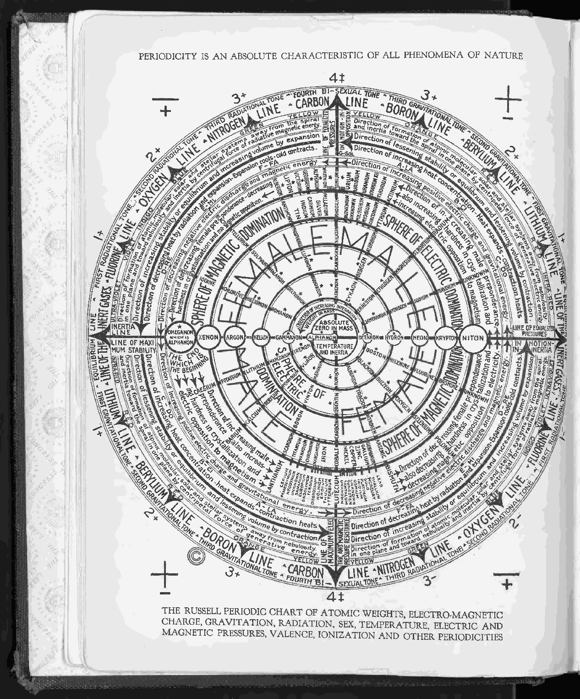

### First four octaves

SRC-000324, PDF page 109.

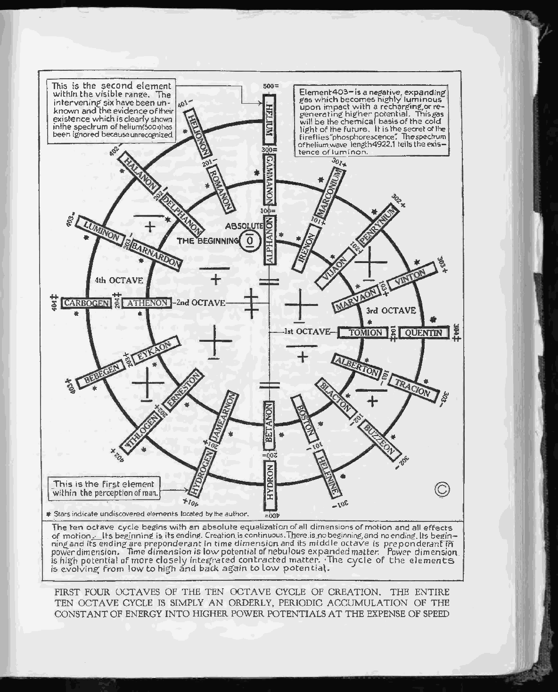

### Fourth, fifth and sixth octaves

SRC-000324, PDF page 111.

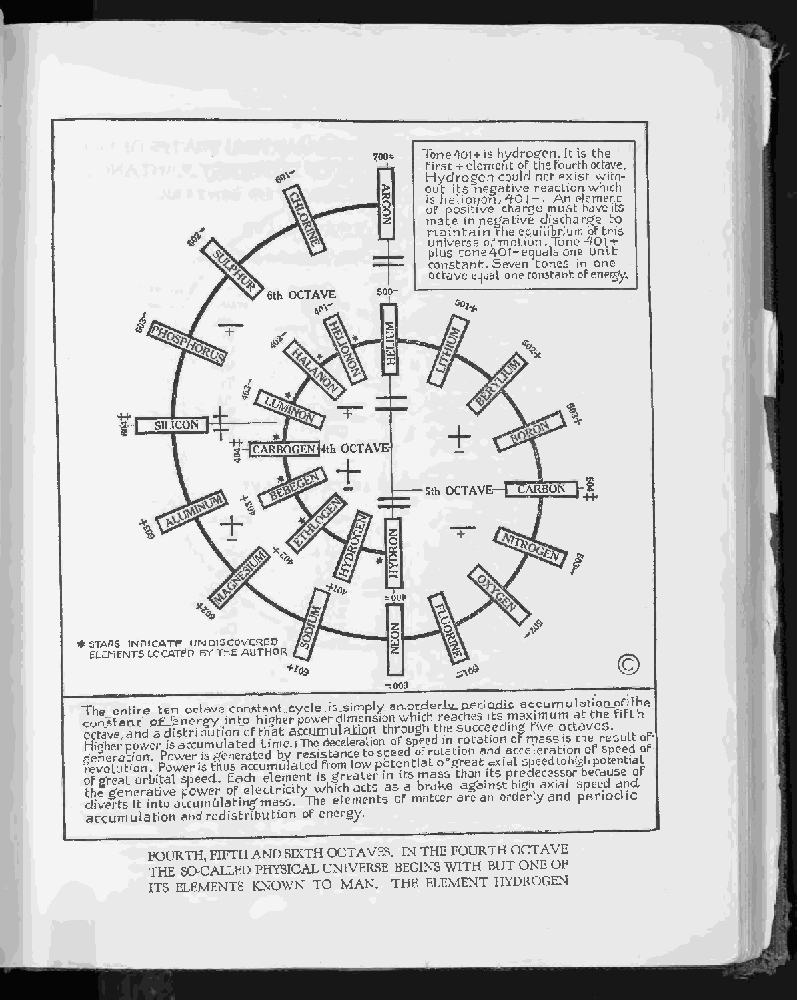

### Table: first, second and third octaves, printed page 92

SRC-000324, PDF page 112.

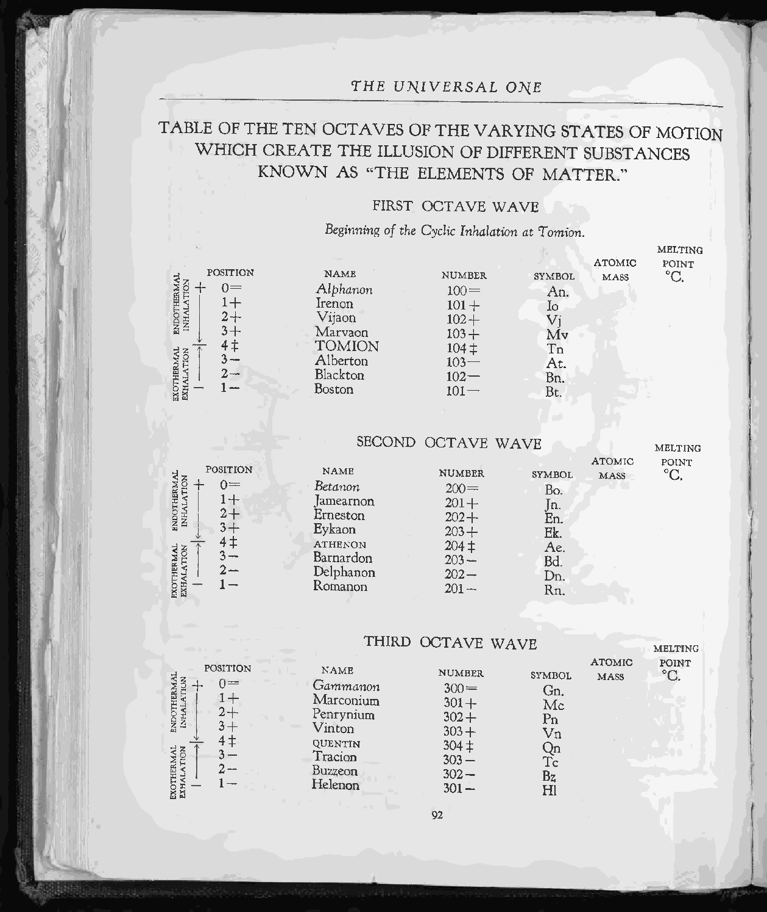

### Seventh and eighth octave diagram with mid-tones

SRC-000324, PDF page 113.

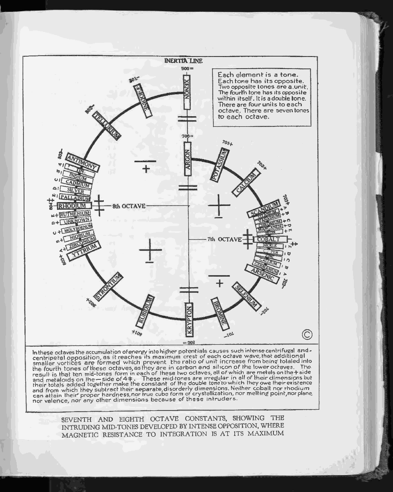

### Table: fourth, fifth and sixth octaves, printed page 94

SRC-000324, PDF page 114.

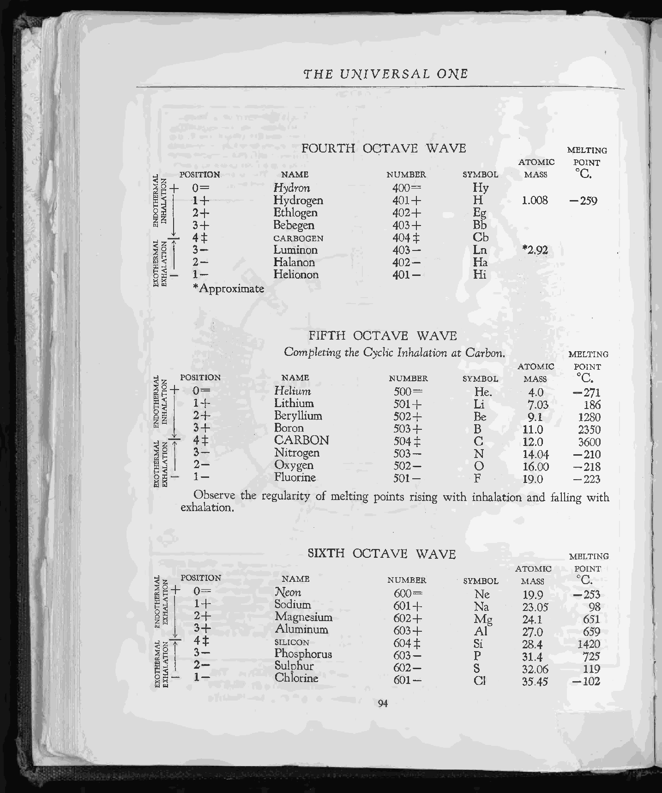

### Ninth octave diagram

SRC-000324, PDF page 115.

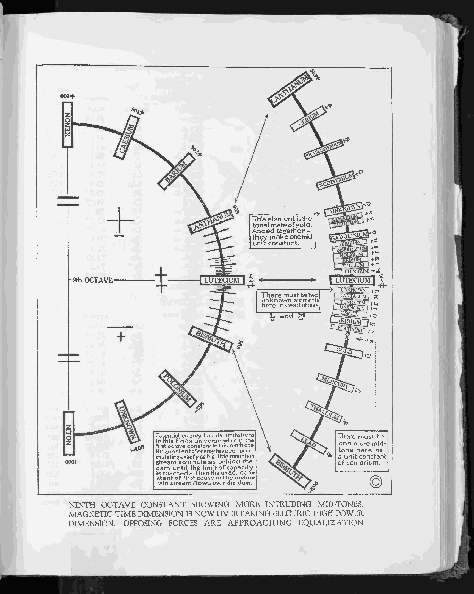

### Table: seventh and eighth octaves, printed page 96

SRC-000324, PDF page 116.

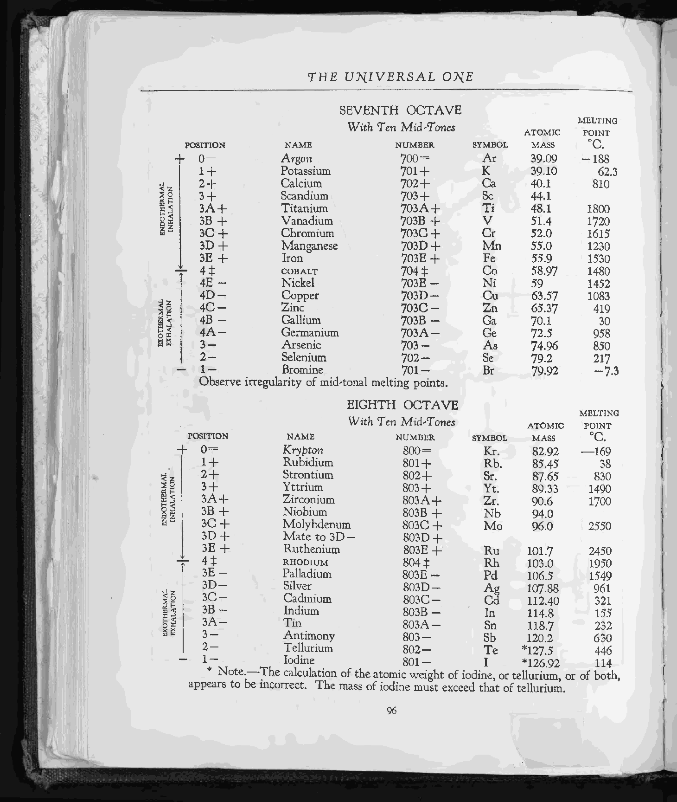

### Tenth octave diagram

SRC-000324, PDF page 117.

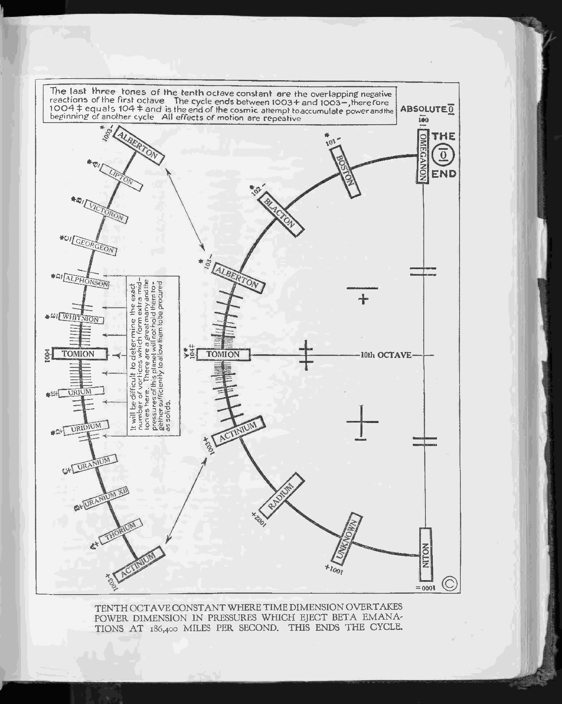

### Table: ninth octave, printed page 98

SRC-000324, PDF page 118.

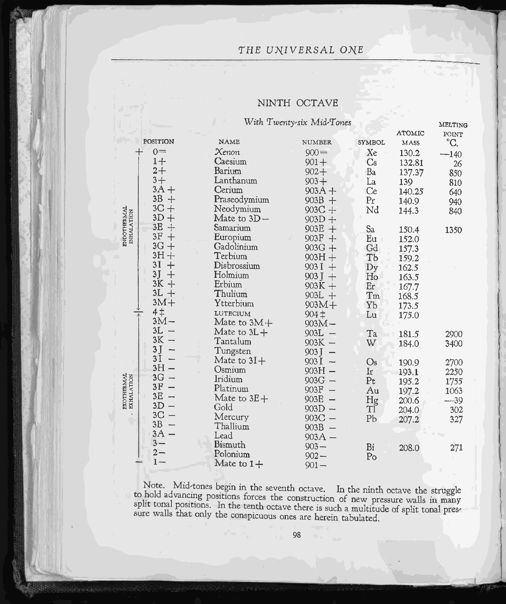

### Table: tenth octave and accompanying claims, printed page 100

SRC-000324, PDF page 120.

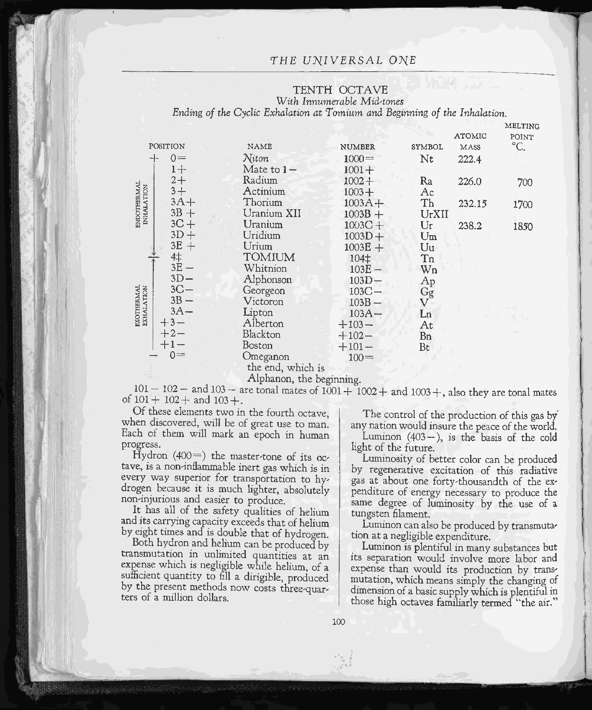

## Searchable table index

All 137 printed name/position/number rows across ten octaves are indexed below. These are historical rows, **not 137 recognised chemical elements**. Duplicate names at different model positions remain separate source occurrences. The [JSON table](../../data/research/russell-ten-octaves-1926.json) retains the visually transcribed property cells where alignment is clear; the ninth-octave columns remain explicitly unresolved because the original typography is offset. Their full content remains in the page image and OCR.

The original double-tone symbol is written as `[double-tone]` here. Plus/minus/equality signs retain symbolic source meaning. A second transcription review, diagram-label extraction and evidence comparison are open tasks.

| Octave | Source name | Position | Source number | PDF page |
|---:|---|---|---|---:|
| 1 | Alphanon | 0= | 100= | 112 |
| 1 | Irenon | 1+ | 101+ | 112 |
| 1 | Vijaon | 2+ | 102+ | 112 |
| 1 | Marvaon | 3+ | 103+ | 112 |
| 1 | TOMION | 4[double-tone] | 104[double-tone] | 112 |
| 1 | Alberton | 3- | 103- | 112 |
| 1 | Blackton | 2- | 102- | 112 |
| 1 | Boston | 1- | 101- | 112 |
| 2 | Betanon | 0= | 200= | 112 |
| 2 | Jamearnon | 1+ | 201+ | 112 |
| 2 | Erneston | 2+ | 202+ | 112 |
| 2 | Eykaon | 3+ | 203+ | 112 |
| 2 | ATHENON | 4[double-tone] | 204[double-tone] | 112 |
| 2 | Barnardon | 3- | 203- | 112 |
| 2 | Delphanon | 2- | 202- | 112 |
| 2 | Romanon | 1- | 201- | 112 |
| 3 | Gammanon | 0= | 300= | 112 |
| 3 | Marconium | 1+ | 301+ | 112 |
| 3 | Penrynium | 2+ | 302+ | 112 |
| 3 | Vinton | 3+ | 303+ | 112 |
| 3 | QUENTIN | 4[double-tone] | 304[double-tone] | 112 |
| 3 | Tracion | 3- | 303- | 112 |
| 3 | Buzzeon | 2- | 302- | 112 |
| 3 | Helenon | 1- | 301- | 112 |
| 4 | Hydron | 0= | 400= | 114 |
| 4 | Hydrogen | 1+ | 401+ | 114 |
| 4 | Ethlogen | 2+ | 402+ | 114 |
| 4 | Bebegen | 3+ | 403+ | 114 |
| 4 | CARBOGEN | 4[double-tone] | 404[double-tone] | 114 |
| 4 | Luminon | 3- | 403- | 114 |
| 4 | Halanon | 2- | 402- | 114 |
| 4 | Helionon | 1- | 401- | 114 |
| 5 | Helium | 0= | 500= | 114 |
| 5 | Lithium | 1+ | 501+ | 114 |
| 5 | Beryllium | 2+ | 502+ | 114 |
| 5 | Boron | 3+ | 503+ | 114 |
| 5 | CARBON | 4[double-tone] | 504[double-tone] | 114 |
| 5 | Nitrogen | 3- | 503- | 114 |
| 5 | Oxygen | 2- | 502- | 114 |
| 5 | Fluorine | 1- | 501- | 114 |
| 6 | Neon | 0= | 600= | 114 |
| 6 | Sodium | 1+ | 601+ | 114 |
| 6 | Magnesium | 2+ | 602+ | 114 |
| 6 | Aluminum | 3+ | 603+ | 114 |
| 6 | SILICON | 4[double-tone] | 604[double-tone] | 114 |
| 6 | Phosphorus | 3- | 603- | 114 |
| 6 | Sulphur | 2- | 602- | 114 |
| 6 | Chlorine | 1- | 601- | 114 |
| 7 | Argon | 0= | 700= | 116 |
| 7 | Potassium | 1+ | 701+ | 116 |
| 7 | Calcium | 2+ | 702+ | 116 |
| 7 | Scandium | 3+ | 703+ | 116 |
| 7 | Titanium | 3A+ | 703A+ | 116 |
| 7 | Vanadium | 3B+ | 703B+ | 116 |
| 7 | Chromium | 3C+ | 703C+ | 116 |
| 7 | Manganese | 3D+ | 703D+ | 116 |
| 7 | Iron | 3E+ | 703E+ | 116 |
| 7 | COBALT | 4[double-tone] | 704[double-tone] | 116 |
| 7 | Nickel | 4E- | 703E- | 116 |
| 7 | Copper | 4D- | 703D- | 116 |
| 7 | Zinc | 4C- | 703C- | 116 |
| 7 | Gallium | 4B- | 703B- | 116 |
| 7 | Germanium | 4A- | 703A- | 116 |
| 7 | Arsenic | 3- | 703- | 116 |
| 7 | Selenium | 2- | 702- | 116 |
| 7 | Bromine | 1- | 701- | 116 |
| 8 | Krypton | 0= | 800= | 116 |
| 8 | Rubidium | 1+ | 801+ | 116 |
| 8 | Strontium | 2+ | 802+ | 116 |
| 8 | Yttrium | 3+ | 803+ | 116 |
| 8 | Zirconium | 3A+ | 803A+ | 116 |
| 8 | Niobium | 3B+ | 803B+ | 116 |
| 8 | Molybdenum | 3C+ | 803C+ | 116 |
| 8 | Mate to 3D- | 3D+ | 803D+ | 116 |
| 8 | Ruthenium | 3E+ | 803E+ | 116 |
| 8 | RHODIUM | 4[double-tone] | 804[double-tone] | 116 |
| 8 | Palladium | 3E- | 803E- | 116 |
| 8 | Silver | 3D- | 803D- | 116 |
| 8 | Cadmium | 3C- | 803C- | 116 |
| 8 | Indium | 3B- | 803B- | 116 |
| 8 | Tin | 3A- | 803A- | 116 |
| 8 | Antimony | 3- | 803- | 116 |
| 8 | Tellurium | 2- | 802- | 116 |
| 8 | Iodine | 1- | 801- | 116 |
| 9 | Xenon | 0= | 900= | 118 |
| 9 | Caesium | 1+ | 901+ | 118 |
| 9 | Barium | 2+ | 902+ | 118 |
| 9 | Lanthanum | 3+ | 903+ | 118 |
| 9 | Cerium | 3A+ | 903A+ | 118 |
| 9 | Praseodymium | 3B+ | 903B+ | 118 |
| 9 | Neodymium | 3C+ | 903C+ | 118 |
| 9 | Mate to 3D- | 3D+ | 903D+ | 118 |
| 9 | Samarium | 3E+ | 903E+ | 118 |
| 9 | Europium | 3F+ | 903F+ | 118 |
| 9 | Gadolinium | 3G+ | 903G+ | 118 |
| 9 | Terbium | 3H+ | 903H+ | 118 |
| 9 | Disbrossium | 3I+ | 903I+ | 118 |
| 9 | Holmium | 3J+ | 903J+ | 118 |
| 9 | Erbium | 3K+ | 903K+ | 118 |
| 9 | Thulium | 3L+ | 903L+ | 118 |
| 9 | Ytterbium | 3M+ | 903M+ | 118 |
| 9 | LUTECIUM | 4[double-tone] | 904[double-tone] | 118 |
| 9 | Mate to 3M+ | 3M- | 903M- | 118 |
| 9 | Mate to 3L+ | 3L- | 903L- | 118 |
| 9 | Tantalum | 3K- | 903K- | 118 |
| 9 | Tungsten | 3J- | 903J- | 118 |
| 9 | Mate to 3I+ | 3I- | 903I- | 118 |
| 9 | Osmium | 3H- | 903H- | 118 |
| 9 | Iridium | 3G- | 903G- | 118 |
| 9 | Platinum | 3F- | 903F- | 118 |
| 9 | Mate to 3E+ | 3E- | 903E- | 118 |
| 9 | Gold | 3D- | 903D- | 118 |
| 9 | Mercury | 3C- | 903C- | 118 |
| 9 | Thallium | 3B- | 903B- | 118 |
| 9 | Lead | 3A- | 903A- | 118 |
| 9 | Bismuth | 3- | 903- | 118 |
| 9 | Polonium | 2- | 902- | 118 |
| 9 | Mate to 1+ | 1- | 901- | 118 |
| 10 | Niton | 0= | 1000= | 120 |
| 10 | Mate to 1- | 1+ | 1001+ | 120 |
| 10 | Radium | 2+ | 1002+ | 120 |
| 10 | Actinium | 3+ | 1003+ | 120 |
| 10 | Thorium | 3A+ | 1003A+ | 120 |
| 10 | Uranium XII | 3B+ | 1003B+ | 120 |
| 10 | Uranium | 3C+ | 1003C+ | 120 |
| 10 | Uridium | 3D+ | 1003D+ | 120 |
| 10 | Urium | 3E+ | 1003E+ | 120 |
| 10 | TOMIUM | 4[double-tone] | 104[double-tone] | 120 |
| 10 | Whitnion | 3E- | 103E- | 120 |
| 10 | Alphonson | 3D- | 103D- | 120 |
| 10 | Georgeon | 3C- | 103C- | 120 |
| 10 | Victoron | 3B- | 103B- | 120 |
| 10 | Lipton | 3A- | 103A- | 120 |
| 10 | Alberton | +3- | +103- | 120 |
| 10 | Blackton | +2- | +102- | 120 |
| 10 | Boston | +1- | +101- | 120 |
| 10 | Omeganon | 0= | 100= | 120 |

## Interpretation and review tasks

- Preserve distinctions among source transcription, historical interpretation and independently tested physical claims.
- Compare each historical material name against a dated chemical reference before linking to a canonical element. Do not assign modern identities to Russell's proposed substances from name similarity alone.
- Review the original ninth-octave column alignment, the seventh-octave position/number discrepancy and historical atomic-mass/melting-point definitions.
- Treat spectral predictions as testable claims requiring target state, wavelength medium, measurement method, calibration, uncertainty and independent evidence. Pattern similarity alone does not establish a new element or mechanism.
- Review later Russell charts as separate editions. Do not overwrite the 1926 source with a later reconstruction.

[Frequency comparison guide](Frequency-Comparison-and-Discovery.md) · [Historical-model collection](Historical-Models.md) · [Complete work ledger](../../data/quality/MAT-TODO.json)
