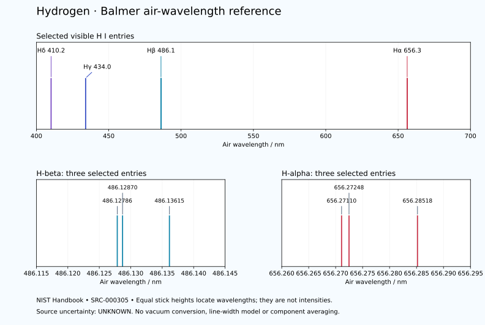

# Hydrogen — Balmer air-wavelength reference

<!-- generated-by: sync-hydrogen-balmer.mjs -->

Eight selected visible lines from the [NIST Handbook](https://physics.nist.gov/PhysRefData/Handbook/Tables/hydrogentable2.htm) (SRC-000305). These are neutral atomic Hydrogen (H I) entries in the **air** section. No air-to-vacuum conversion is made. NIST does not give numerical wavelength uncertainties in this table, so uncertainty remains **UNKNOWN**.

[Parent record](0001-Hydrogen-H.md) · [Structured spectrum](data/spectra/0001-Hydrogen-H-Balmer-Reference.yaml) · [A05 standalone illustration](0001-Hydrogen-H-Standalone-Panels.md#a05--spectral-emission-balmer-series)

| Member | Principal n transition | Source wavelength / Å | Air wavelength / nm | Native reference | Source line |
|---|---|---:|---:|---|---:|
| H-delta | 6 → 2 | 4101.74 | 410.174 | RCWM80 | 76 |
| H-gamma | 5 → 2 | 4340.462 | 434.0462 | MK00a | 77 |
| H-beta | 4 → 2 | 4861.2786 | 486.12786 | MK00a | 78 |
| H-beta | 4 → 2 | 4861.2870 | 486.1287 | MK00a | 79 |
| H-beta | 4 → 2 | 4861.3615 | 486.13615 | MK00a | 80 |
| H-alpha | 3 → 2 | 6562.7110 | 656.2711 | MK00a | 81 |
| H-alpha | 3 → 2 | 6562.7248 | 656.27248 | MK00a | 82 |
| H-alpha | 3 → 2 | 6562.8518 | 656.28518 | MK00a | 83 |

Conversion: wavelength in nm = wavelength in Å ÷ 10, exactly. These eight unit conversions introduce no new measurement or precision. H-beta and H-alpha retain three distinct source entries each; no centroid is invented. Principal-series grouping does not identify all angular-momentum components. The [persistent-line table](https://physics.nist.gov/PhysRefData/Handbook/Tables/hydrogentable3.htm) preserves the detailed level/state context.

## Wavelength chart

The overview and two expanded windows use the actual listed wavelengths. Equal-height sticks indicate positions only; no line strengths, widths or error bars are inferred. Colour is illustrative.

## A05 display labels

410.2 nm (Hδ), 434.0 nm (Hγ), 486.1 nm (Hβ) and 656.3 nm (Hα) are labels rounded to one decimal place. Each selected component within a named member rounds to that display label; it is not a measured line centre. The artwork explicitly identifies schematic spacing, colours and brightness.
