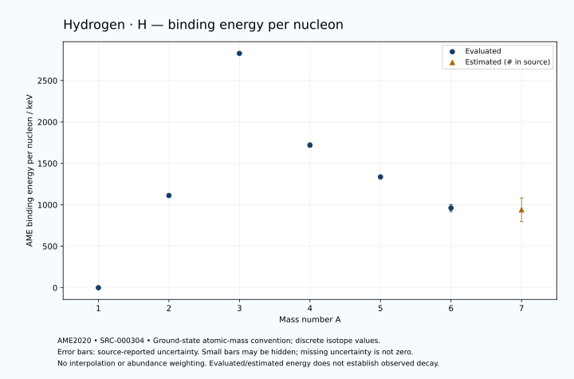

# Hydrogen — Atomic Masses and Reaction Energies

<!-- generated-by: sync-ame2020.mjs -->

**Dated evaluated data · scientific coverage remains partial.** 7 ground-state nuclides from AME2020. Values and uncertainties are transcribed from the retained unrounded analysis files; estimated quantities remain labelled.

- [Parent Hydrogen record](0001-Hydrogen-H.md) · [NUBASE states and decays](0001-Hydrogen-H-Nuclear-Evaluation.md)
- [Structured data](data/isotopes/0001-Hydrogen-H-AME2020-Evaluation.yaml)
- [Original mass table](../../data/catalog/sources/ame2020-mass_1.mas20.txt) · [Original reaction table](../../data/catalog/sources/ame2020-rct1.mas20.txt)
- [AME2020 methods](https://doi.org/10.1088/1674-1137/abddb0) (SRC-000303) · [Tables and definitions](https://doi.org/10.1088/1674-1137/abddaf) (SRC-000304)

## Reading the data

All table energies and uncertainties are in keV; binding energy is per nucleon. A # replaces a decimal point in the original estimated value. UNKNOWN (*) retains the source's not-calculable entry; it is neither zero nor automatically NOT APPLICABLE. Source lines are one-based in the retained files. Uncertainties remain those published by the evaluation, with no replacement by independent-mass quadrature.

Atomic-mass conventions apply. Qα is total decay energy, not alpha-particle kinetic energy. Positive Q alone does not establish a decay branch, rate or observation. He-4's source Qα of zero is a bookkeeping identity. These tables describe ground-state combinations, not isomer or excited-daughter transitions. Nuclear state and daughter lookups are explicit in the structured companion. The binding quantity follows [Z M(¹H) + N mₙ − M(A,Z)]c²/A; it has not been converted to a bare-nucleus convention.

## Mass and binding table

| Nuclide | N | Atomic mass excess / keV | AME binding per nucleon / keV | Mass-file line |
|---|---:|---|---|---:|
| H-1 | 0 | 7288.971064 ± 0.000013 | 0.0 ± 0.0 | 38 |
| H-2 | 1 | 13135.722895 ± 0.000015 | 1112.2831 ± 0.0002 | 39 |
| H-3 | 2 | 14949.81090 ± 0.00008 | 2827.2654 ± 0.0003 | 40 |
| H-4 | 3 | 24621.129 ± 100.000 | 1720.4491 ± 25.0000 | 43 |
| H-5 | 4 | 32892.447 ± 89.443 | 1336.3592 ± 17.8885 | 46 |
| H-6 | 5 | 41875.725 ± 254.127 | 961.6395 ± 42.3545 | 50 |
| H-7 | 6 | 49135# ± 1004# | 940# ± 143# | 55 |

## Q-values and separation energies

| Nuclide | Qβ− / keV | Qα / keV | S₂n / keV | S₂p / keV | Reaction-file line |
|---|---|---|---|---|---:|
| H-1 | UNKNOWN (*) | UNKNOWN (*) | UNKNOWN (*) | UNKNOWN (*) | 37 |
| H-2 | UNKNOWN (*) | UNKNOWN (*) | UNKNOWN (*) | UNKNOWN (*) | 38 |
| H-3 | 18.59202 ± 0.00006 | UNKNOWN (*) | 8481.7963 ± 0.0009 | UNKNOWN (*) | 39 |
| H-4 | 22196.2131 ± 100.0000 | UNKNOWN (*) | 4657.2300 ± 100.0000 | UNKNOWN (*) | 42 |
| H-5 | 21661.2131 ± 91.6515 | UNKNOWN (*) | -1800.0001 ± 89.4427 | UNKNOWN (*) | 45 |
| H-6 | 24283.6294 ± 254.1268 | UNKNOWN (*) | -1111.9594 ± 273.0942 | UNKNOWN (*) | 49 |
| H-7 | 23062# ± 1004# | UNKNOWN (*) | -100# ± 1000# | UNKNOWN (*) | 54 |

Qβ− comes from the mass-file line in the first table. The other three columns come from the reaction-file line. Definitions and original source strings are retained in the structured data.

## Binding-energy chart

Discrete source values and source-reported uncertainties. No interpolation, natural-abundance weighting or observed-decay claim is implied. This quantitative chart supplements the 22 separate illustrative panels.

## Remaining review

Later measurements, state-specific decay branches, isomer Q-values, additional reaction channels and full claim-level review remain open. Existing authored values retain their own provenance; this companion does not overwrite them.
