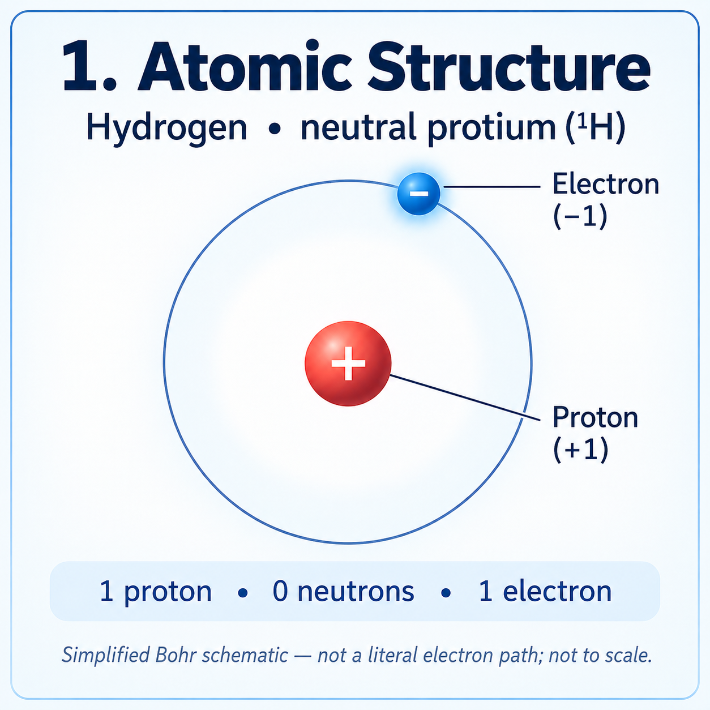
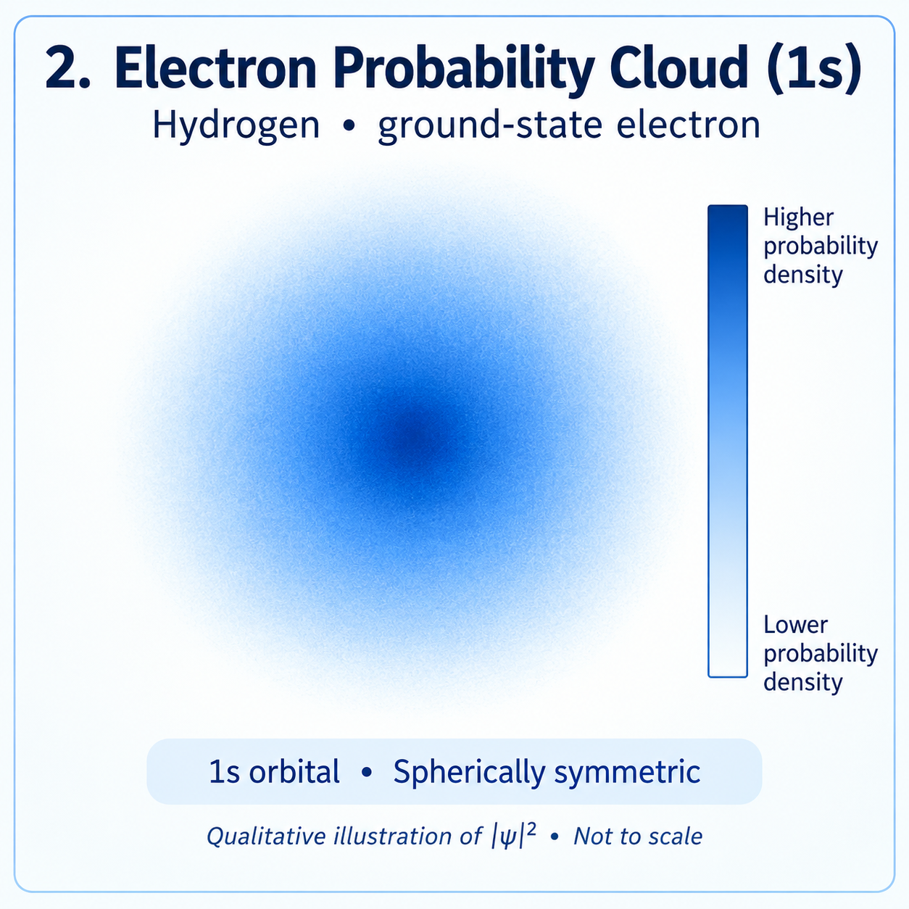
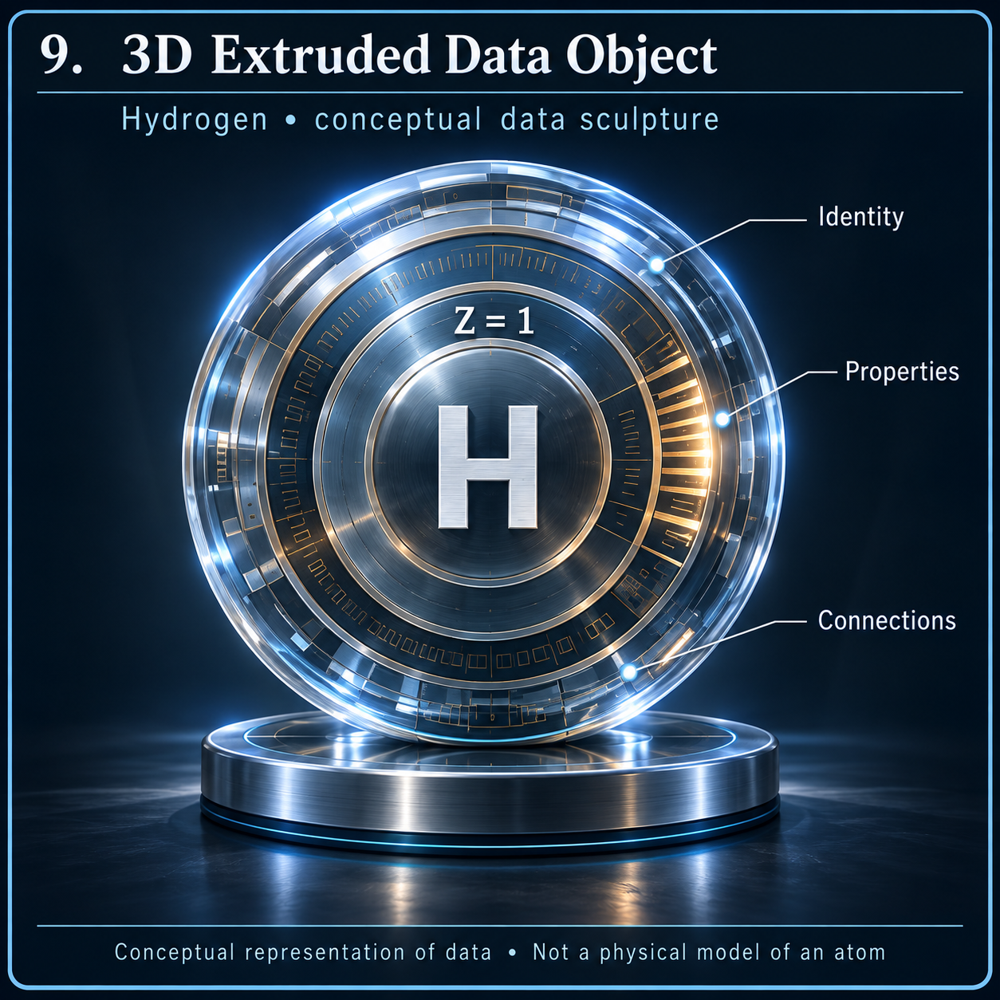

# Hydrogen — standalone reference panels

The light educational set contains nine separate panels; the dark blueprint set contains thirteen. Both are required. A panel becomes available here after individual visual review. These illustrations supplement the locked V01–V18 manifest.

## A01 — Atomic Structure

Species: isolated neutral protium (¹H). Nuclear identity follows NUBASE2020 (SRC-000008); neutral electron count follows Z − q, consistent with the NIST evaluation (SRC-000005). The circular line is a teaching convention, not a measured trajectory. Charges shown are in elementary-charge units.

## A02 — Electron Probability Cloud (1s)

This illustrates the ideal nonrelativistic Coulomb 1s model already described in the Hydrogen chapter. The density is proportional to exp(−2r/a), with a the model's Bohr length scale, and has its maximum at the nucleus. The radial shell probability also includes the 4πr² factor and has a different maximum. Neither the painted brightness nor its pixel radius supplies a measured value. NIST (SRC-000005) supports the ground-state identity; it is not the source of this painted density field.

## B09 — 3D Extruded Data Object

This standalone dark blueprint panel follows the supplied template's data-object design. H and Z = 1 identify Hydrogen (SRC-000005). The glass, metal, rings and pedestal are visual metaphors for organising information. They are not measured material properties, a physical atomic model, an energy apparatus or evidence for a speculative mechanism. The artwork does not assert that the data record is complete.

## Remaining panels

A03–A09, B01–B08 and B10–B13 remain pending. Their exact separate-image requirements and crosswalk to V01–V18 are tracked in the panel image plan. Neither the supplied composite posters nor existing supplementary artwork count as these separate deliverables.
