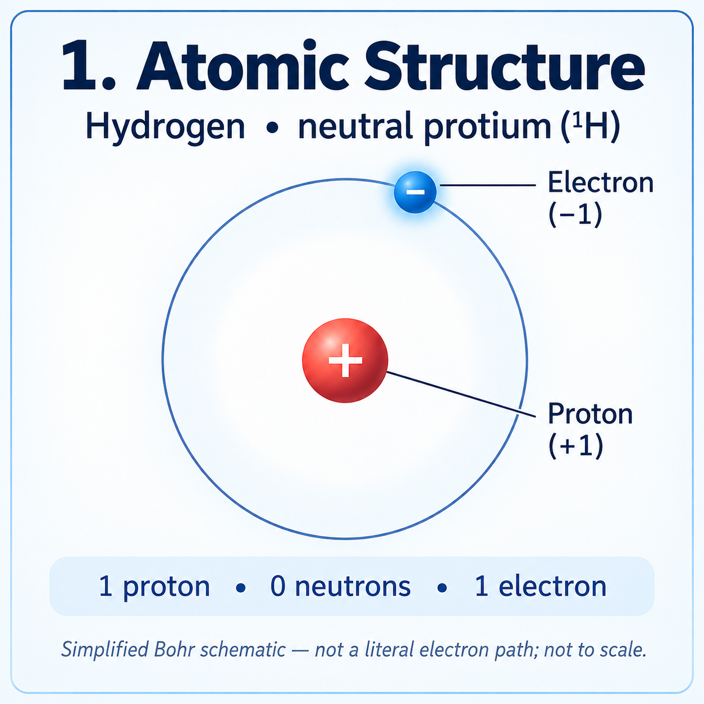
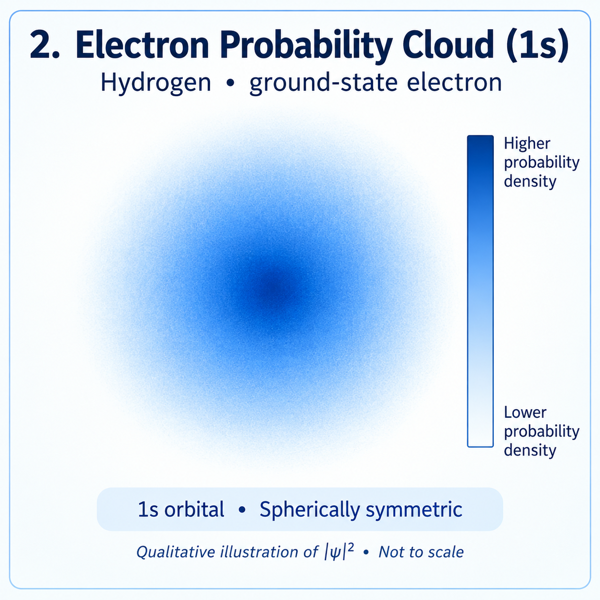
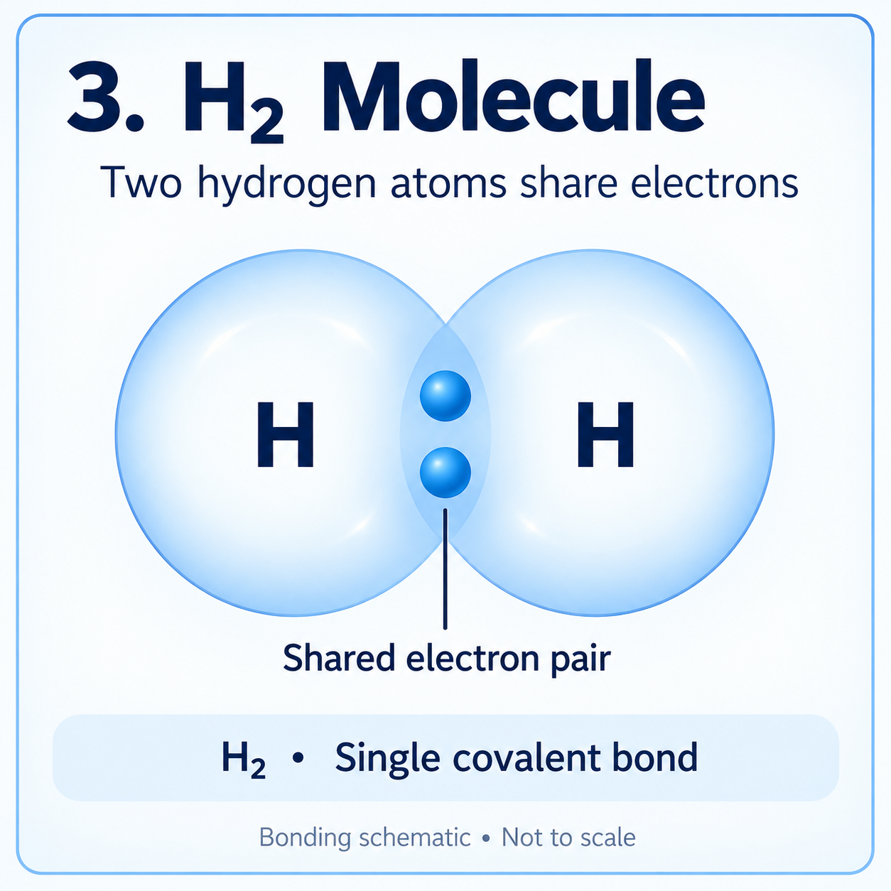
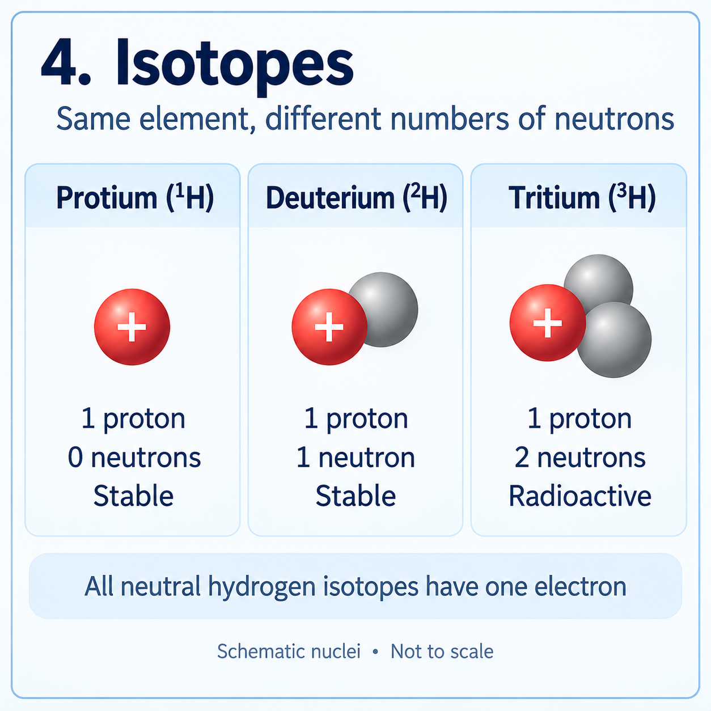
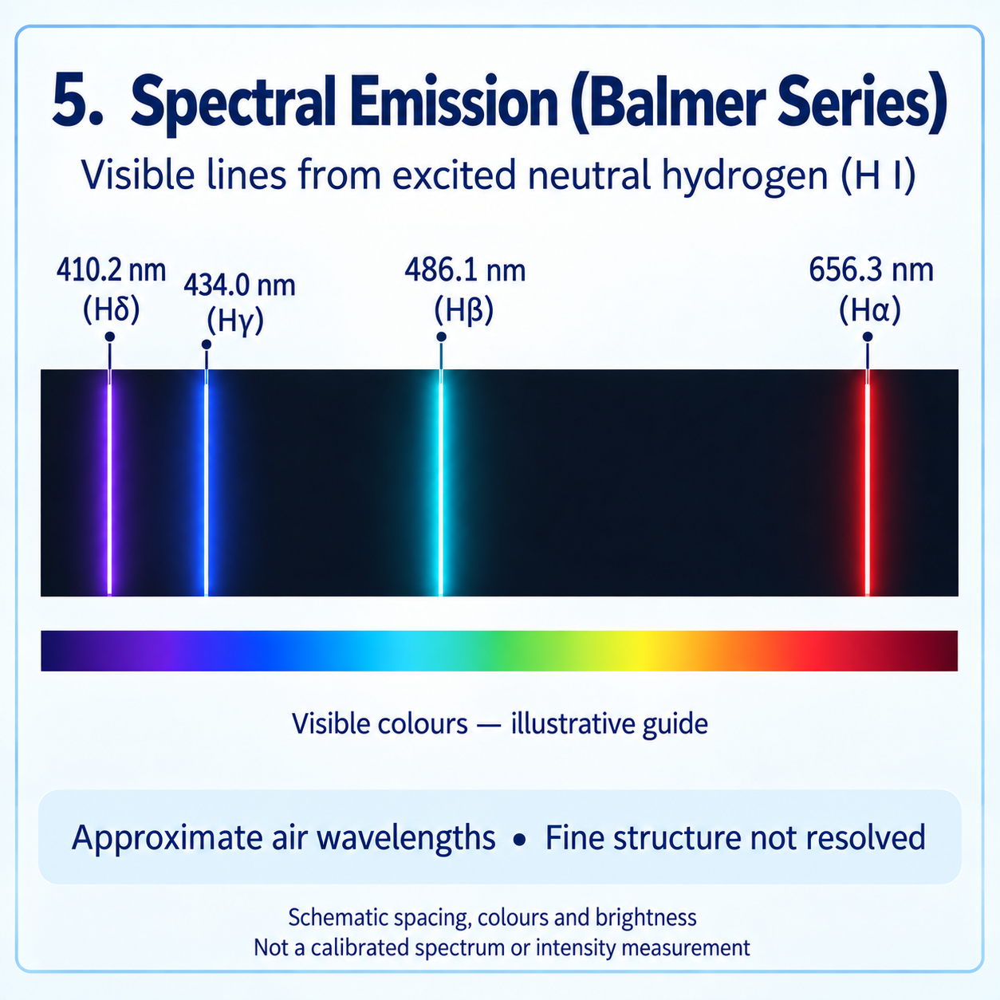
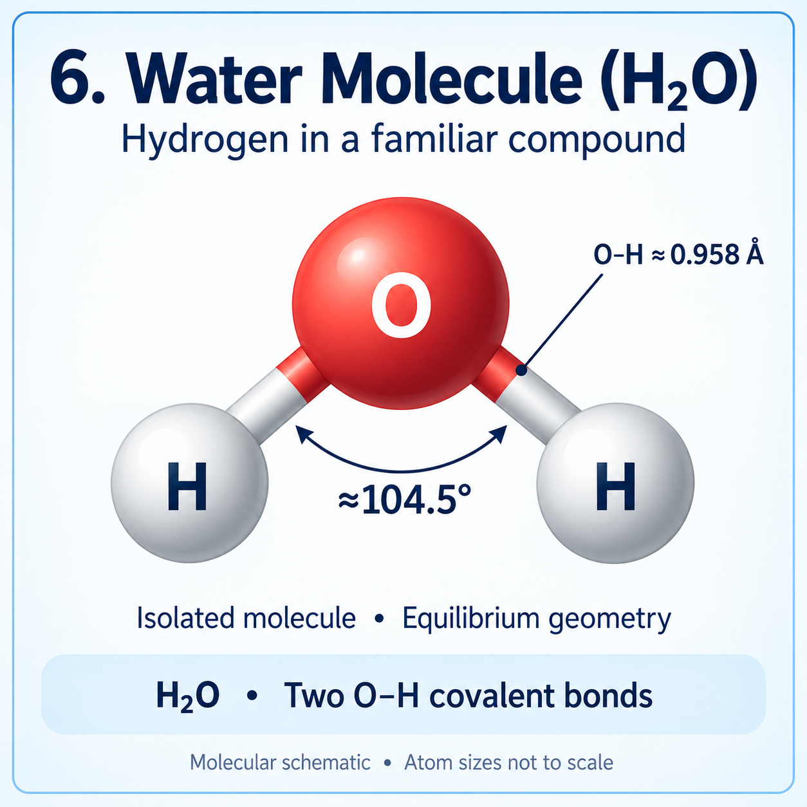
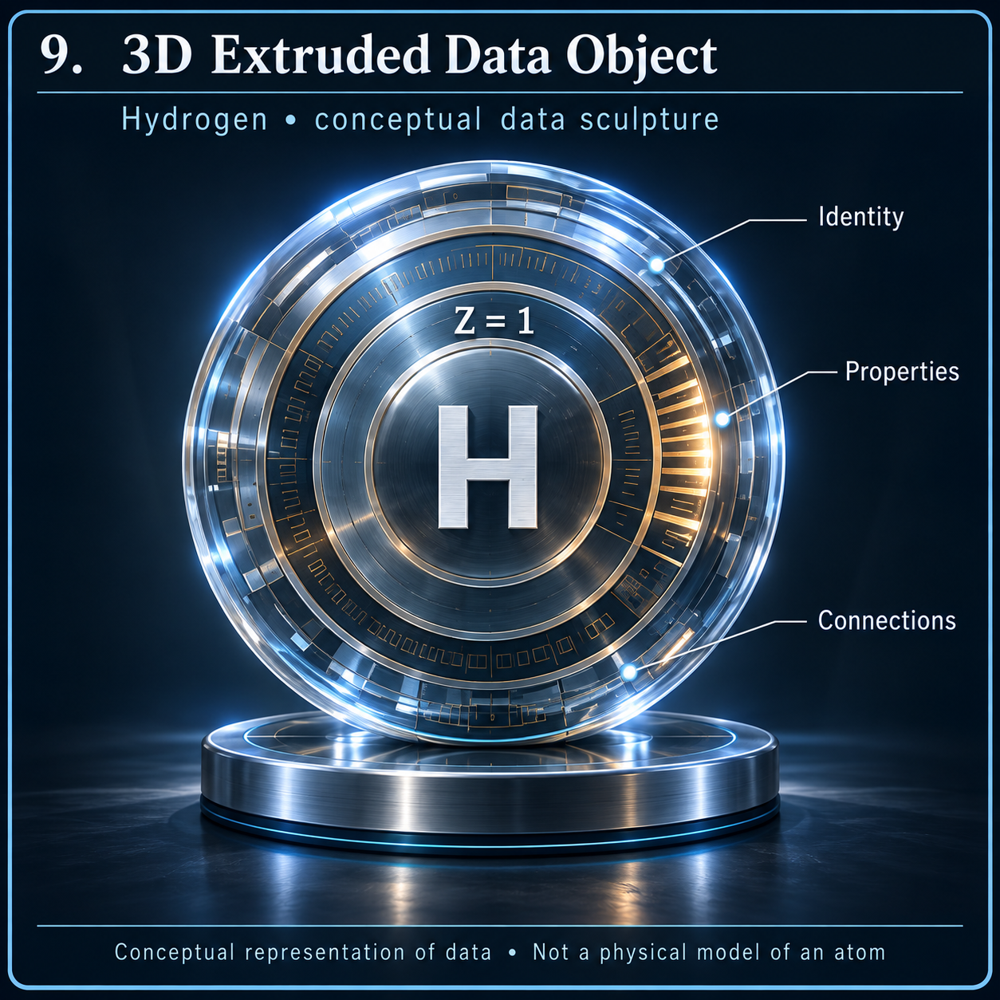
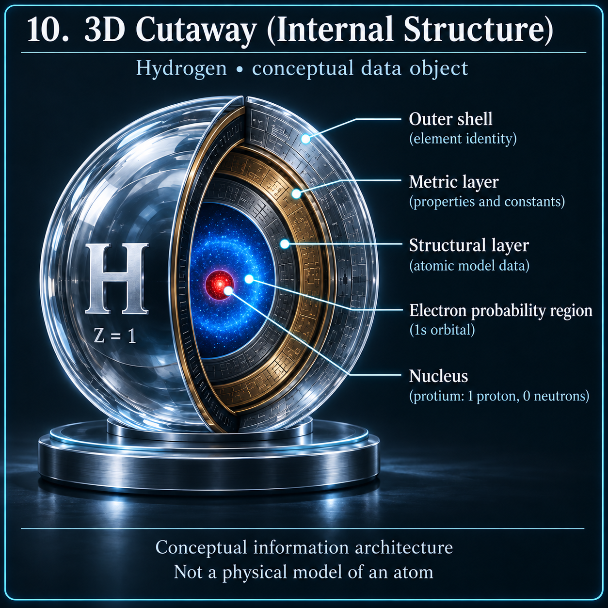
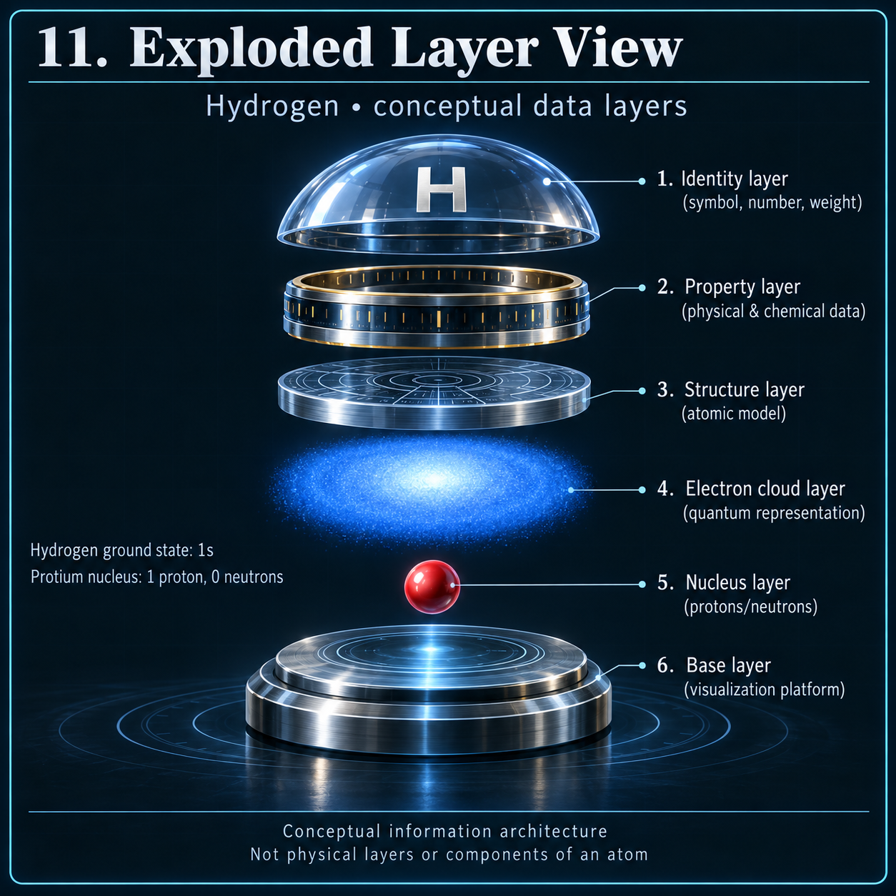

# Hydrogen — standalone reference panels

The light educational set contains nine separate panels; the dark blueprint set contains thirteen. Both are required. A panel becomes available here after individual visual review. These illustrations supplement the locked V01–V18 manifest.

## A01 — Atomic Structure

Species: isolated neutral protium (¹H). Nuclear identity follows NUBASE2020 (SRC-000008); neutral electron count follows Z − q, consistent with the NIST evaluation (SRC-000005). The circular line is a teaching convention, not a measured trajectory. Charges shown are in elementary-charge units.

## A02 — Electron Probability Cloud (1s)

This illustrates the ideal nonrelativistic Coulomb 1s model already described in the Hydrogen chapter. The density is proportional to exp(−2r/a), with a the model's Bohr length scale, and has its maximum at the nucleus. The radial shell probability also includes the 4πr² factor and has a different maximum. Neither the painted brightness nor its pixel radius supplies a measured value. NIST (SRC-000005) supports the ground-state identity; it is not the source of this painted density field.

## A03 — H₂ Molecule

Species: neutral molecular Hydrogen, H₂. The NIST Chemistry WebBook molecular entry (SRC-000010) provides the molecular identity and ground-state context. The two electron symbols are a shared-pair teaching convention; they do not indicate measured positions or trajectories. The lobes are not calibrated molecular-orbital density surfaces. No bond length or dissociation energy is inferred from the image.

## A04 — Isotopes

Nucleon counts and stable/radioactive classifications follow the ground-state entries for ¹H, ²H and ³H in NUBASE2020 (SRC-000008). A neutral Hydrogen atom has one electron because Z = 1 and q = 0 (SRC-000005). The nuclei are schematic and not to scale. Abundances vary with material and are deliberately not supplied by this diagram. The three isotope sub-diagrams are components of this single A04 asset.

## A05 — Spectral Emission (Balmer Series)

The NIST Handbook (SRC-000305) supplies the **air** wavelengths of neutral H I. The four one-decimal labels are display approximations; fine components are retained separately in the [source table and quantitative chart](0001-Hydrogen-H-Balmer-Reference.md). The illustration has schematic spacing and brightness, so it must not be used to extract wavelengths or intensities.

## A06 — Water Molecule (H₂O)

The [shared water geometry reference](0001-Hydrogen-H-Water-Geometry.md) preserves the NIST source values, source rounding and missing uncertainty (SRC-000308). The diagram describes an isolated molecule at equilibrium, not fixed geometry in liquid water. Atom sizes and bonds are schematic.

## B09 — 3D Extruded Data Object

This standalone dark blueprint panel follows the supplied template's data-object design. H and Z = 1 identify Hydrogen (SRC-000005). The glass, metal, rings and pedestal are visual metaphors for organising information. They are not measured material properties, a physical atomic model, an energy apparatus or evidence for a speculative mechanism. The artwork does not assert that the data record is complete.

## B10 — 3D Cutaway (Internal Structure)

Five labelled information layers follow the supplied cutaway template. H, Z = 1 and the atomic ground-state 1s context follow SRC-000005; protium's one proton and zero neutrons follow SRC-000008. The metal rings, glowing region and shell are conceptual data organisation. Their sizes and brightness are not measured atomic structure or probability density.

## B11 — Exploded Layer View

The six separated components represent identity, properties, structure, electronic data, nuclear data and the display base. The 1s and protium identity labels follow SRC-000005 and SRC-000008. The blue disc is a layout metaphor, not the shape of a 1s orbital; this panel does not depict disassembling an atom. It complements the assembled B09 object and B10 cutaway.

## Remaining panels

A07–A09, B01–B08 and B12–B13 remain pending. Their exact separate-image requirements and crosswalk to V01–V18 are tracked in the panel image plan. Neither the supplied composite posters nor existing supplementary artwork count as these separate deliverables.
