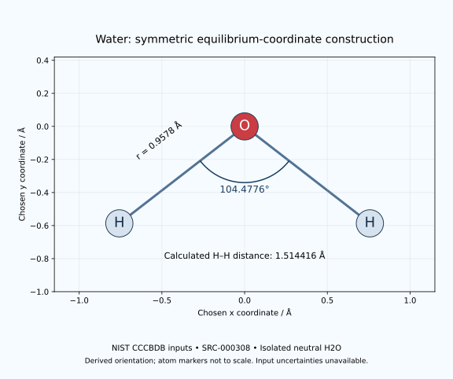

# Hydrogen and Oxygen — water molecular geometry

[Hydrogen record](0001-Hydrogen-H.md) · [Oxygen record](../0008-Oxygen-O/0008-Oxygen-O.md) · [Structured reference](data/compounds/0001-Hydrogen-H-Water-Geometry.yaml)

NIST CCCBDB lists experimentally inferred equilibrium geometry for isolated neutral H₂O (SRC-000308; Hoy and Bunker, 1979). This is a molecular reference, not a liquid-water or ice structure. The original paper is identified through NIST; its full text was not retrieved for this intake.

| Quantity | Listed value | Unit | Source representation | Uncertainty |
|---|---:|---|---|---|
| O–H equilibrium distance | 0.958 | Å | Internal coordinate rOH | UNKNOWN |
| O–H distance | 0.9578 | Å | Atom-distance matrix | UNKNOWN |
| H–O–H equilibrium angle | 104.4776 | degree | Internal coordinate aHOH | UNKNOWN |

The different bond-distance rounding is preserved. The panel uses ≈0.958 Å and ≈104.5°; additional displayed digits are not measurement uncertainties. The selected page does not explicitly resolve isotopologues. Do not transfer these values to heavy water without evidence.

## Reproducible construction

Using r = 0.9578 Å and θ = 104.4776°, put O at (0,0) and H at (±r sin(θ/2), −r cos(θ/2)). The resulting H–H separation is 1.514416 Å, **calculated**, with uncertainty unavailable because source parameter uncertainties/covariance are not supplied. The exact unit conversion gives 95.78 pm for r. These operations introduce no new measurement. Atom radii in the illustration are not to scale.

## Calculated geometry diagram

## Source and image

[Original NIST geometry page](https://cccbdb.nist.gov/expgeom2x.asp?casno=7732185), retrieved 26 September 2026. Its inert snapshot and hash are retained in the structured reference.

