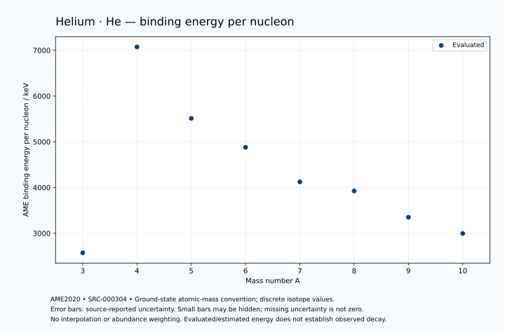

# Helium — Atomic Masses and Reaction Energies

<!-- generated-by: sync-ame2020.mjs -->

**Dated evaluated data · scientific coverage remains partial.** 8 ground-state nuclides from AME2020. Values and uncertainties are transcribed from the retained unrounded analysis files; estimated quantities remain labelled.

- [Parent Helium record](0002-Helium-He.md) · [NUBASE states and decays](0002-Helium-He-Nuclear-Evaluation.md)
- [Structured data](data/isotopes/0002-Helium-He-AME2020-Evaluation.yaml)
- [Original mass table](../../data/catalog/sources/ame2020-mass_1.mas20.txt) · [Original reaction table 1](../../data/catalog/sources/ame2020-rct1.mas20.txt) · [Original reaction table 2](../../data/catalog/sources/ame2020-rct2.mas20.txt)
- [AME2020 methods](https://doi.org/10.1088/1674-1137/abddb0) (SRC-000303) · [Tables and definitions](https://doi.org/10.1088/1674-1137/abddaf) (SRC-000304)

## Reading the data

All table energies and uncertainties are in keV; binding energy is per nucleon. A # replaces a decimal point in the original estimated value. UNKNOWN (*) retains the source's not-calculable entry; it is neither zero nor automatically NOT APPLICABLE. Source lines are one-based in the retained files. Uncertainties remain those published by the evaluation, with no replacement by independent-mass quadrature.

Atomic-mass conventions apply. Qα is total decay energy, not alpha-particle kinetic energy. Positive Q alone does not establish a decay branch, rate or observation. He-4's source Qα of zero is a bookkeeping identity. These tables describe ground-state combinations, not isomer or excited-daughter transitions. Nuclear state and daughter lookups are explicit in the structured companion. The binding quantity follows [Z M(¹H) + N mₙ − M(A,Z)]c²/A; it has not been converted to a bare-nucleus convention.

## Mass and binding table

| Nuclide | N | Atomic mass excess / keV | AME binding per nucleon / keV | Mass-file line |
|---|---:|---|---|---:|
| He-3 | 1 | 14931.21888 ± 0.00006 | 2572.68044 ± 0.00015 | 41 |
| He-4 | 2 | 2424.91587 ± 0.00015 | 7073.9156 ± 0.0002 | 44 |
| He-5 | 3 | 11231.234 ± 20.000 | 5512.1325 ± 4.0000 | 47 |
| He-6 | 4 | 17592.095 ± 0.053 | 4878.5199 ± 0.0089 | 51 |
| He-7 | 5 | 26073.128 ± 7.559 | 4123.0578 ± 1.0799 | 56 |
| He-8 | 6 | 31609.683 ± 0.089 | 3924.5210 ± 0.0111 | 60 |
| He-9 | 7 | 40935.826 ± 46.816 | 3349.0380 ± 5.2018 | 65 |
| He-10 | 8 | 49197.147 ± 92.848 | 2995.1340 ± 9.2848 | 70 |

## Q-values and separation energies

| Nuclide | Qβ− / keV | Qα / keV | S₂n / keV | S₂p / keV | Reaction-file line |
|---|---|---|---|---|---:|
| He-3 | -13736# ± 2000# | UNKNOWN (*) | UNKNOWN (*) | 7718.0413 ± 0.0004 | 40 |
| He-4 | -22898.2740 ± 212.1320 | 0.0 ± 0.0 | UNKNOWN (*) | UNKNOWN (*) | 43 |
| He-5 | -447.6529 ± 53.8516 | 735.0000 ± 20.0000 | 19842.6210 ± 20.0000 | UNKNOWN (*) | 46 |
| He-6 | 3505.2147 ± 0.0532 | UNKNOWN (*) | 975.4569 ± 0.0532 | UNKNOWN (*) | 50 |
| He-7 | 11166.0229 ± 7.5595 | UNKNOWN (*) | 1300.7426 ± 21.3810 | UNKNOWN (*) | 55 |
| He-8 | 10663.8784 ± 0.1005 | UNKNOWN (*) | 2125.0484 ± 0.1034 | UNKNOWN (*) | 59 |
| He-9 | 15980.9213 ± 46.8169 | UNKNOWN (*) | 1279.9373 ± 47.4229 | UNKNOWN (*) | 64 |
| He-10 | 16144.5191 ± 93.7152 | UNKNOWN (*) | -1444.8277 ± 92.8477 | UNKNOWN (*) | 69 |

## Additional decay-energy combinations

| Nuclide | Q₂β− / keV | Q₄β− / keV | Qεp / keV | Qβ−n / keV | Part 1 / part 2 line |
|---|---|---|---|---|---|
| He-3 | UNKNOWN (*) | UNKNOWN (*) | UNKNOWN (*) | UNKNOWN (*) | 40 / 42 |
| He-4 | UNKNOWN (*) | UNKNOWN (*) | UNKNOWN (*) | -34313# ± 2000# | 43 / 45 |
| He-5 | -25907# ± 2003# | UNKNOWN (*) | UNKNOWN (*) | -22163.2740 ± 213.0728 | 46 / 48 |
| He-6 | -782.9387 ± 5.4480 | UNKNOWN (*) | UNKNOWN (*) | -2158.1098 ± 50.0000 | 50 / 52 |
| He-7 | 10304.1299 ± 7.5598 | UNKNOWN (*) | UNKNOWN (*) | 3914.9290 ± 7.5595 | 55 / 57 |
| He-8 | 26668.0112 ± 0.0955 | -3454.5863 ± 18.2435 | UNKNOWN (*) | 8631.2602 ± 0.0887 | 59 / 61 |
| He-9 | 29587.3755 ± 46.8165 | 12024.8551 ± 46.8652 | UNKNOWN (*) | 11918.7038 ± 46.8165 | 64 / 66 |
| He-10 | 36589.6601 ± 92.8477 | 33498.4737 ± 92.8477 | UNKNOWN (*) | 16170.9236 ± 92.8479 | 69 / 71 |

## Single-nucleon separation and reaction energies

| Nuclide | Sₙ / keV | Sₚ / keV | Q(d,α) / keV | Q(p,α) / keV | Q(n,α) / keV | Part 2 line |
|---|---|---|---|---|---|---:|
| He-3 | UNKNOWN (*) | 5493.4751 ± 0.0001 | 18353.0548 ± 0.0002 | UNKNOWN (*) | 20577.6211 ± 0.0005 | 42 |
| He-4 | 20577.6211 ± 0.0005 | 19813.8661 ± 0.0002 | 0.0 ± 0.0 | 0.0000 ± 0.0000 | -0.0000 ± 0.0000 | 45 |
| He-5 | -735.0000 ± 20.0000 | 20678.8661 ± 101.9804 | 6992.2301 ± 20.0000 | 2959.5663 ± 20.0000 | UNKNOWN (*) | 48 |
| He-6 | 1710.4569 ± 20.0001 | 22589.3230 ± 89.4427 | 3681.7732 ± 100.0000 | 7506.3394 ± 0.0532 | UNKNOWN (*) | 52 |
| He-7 | -409.7143 ± 7.5593 | 23091.5681 ± 254.2392 | 3891.4875 ± 89.7616 | 6316.0537 ± 100.2853 | UNKNOWN (*) | 57 |
| He-8 | 2534.7627 ± 7.5600 | 24814# ± 1004# | 444.7654 ± 254.1268 | 3581.2910 ± 89.4428 | UNKNOWN (*) | 61 |
| He-9 | -1254.8254 ± 46.8165 | UNKNOWN (*) | 2512# ± 1005# | 3924.1570 ± 258.4032 | UNKNOWN (*) | 66 |
| He-10 | -190.0023 ± 103.9830 | UNKNOWN (*) | UNKNOWN (*) | 4926# ± 1008# | UNKNOWN (*) | 71 |

Qβ− comes from the mass-file line in the first table. Qα, S₂n, S₂p, Q₂β−, Qεp and Qβ−n come from reaction part 1; Q₄β− and the last table come from part 2. Qεp is electron-capture/proton energy balance; Qβ−n is beta-minus/neutron energy balance. These are evaluated mass combinations, not observations of decay modes, cross sections or reaction rates. Light-nuclide zero entries can be bookkeeping identities, without a physical A=0 residual. Definitions and original source strings are retained in the structured data.

## Binding-energy chart

Discrete source values and source-reported uncertainties. No interpolation, natural-abundance weighting or observed-decay claim is implied. This quantitative chart supplements the 22 separate illustrative panels.

## Remaining review

Later measurements, state-specific decay branches, isomer Q-values, reaction rates, applicability and full claim-level review remain open. Existing authored values retain their own provenance; this companion does not overwrite them.
