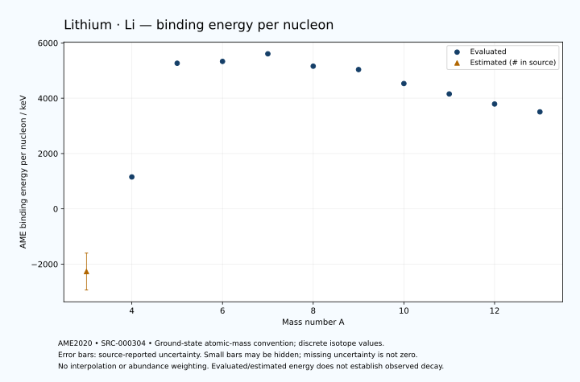

# Lithium — Atomic Masses and Reaction Energies

<!-- generated-by: sync-ame2020.mjs -->

**Dated evaluated data · scientific coverage remains partial.** 11 ground-state nuclides from AME2020. Values and uncertainties are transcribed from the retained unrounded analysis files; estimated quantities remain labelled.

- [Parent Lithium record](0003-Lithium-Li.md) · [NUBASE states and decays](0003-Lithium-Li-Nuclear-Evaluation.md)
- [Structured data](data/isotopes/0003-Lithium-Li-AME2020-Evaluation.yaml)
- [Original mass table](../../data/catalog/sources/ame2020-mass_1.mas20.txt) · [Original reaction table](../../data/catalog/sources/ame2020-rct1.mas20.txt)
- [AME2020 methods](https://doi.org/10.1088/1674-1137/abddb0) (SRC-000303) · [Tables and definitions](https://doi.org/10.1088/1674-1137/abddaf) (SRC-000304)

## Reading the data

All table energies and uncertainties are in keV; binding energy is per nucleon. A # replaces a decimal point in the original estimated value. UNKNOWN (*) retains the source's not-calculable entry; it is neither zero nor automatically NOT APPLICABLE. Source lines are one-based in the retained files. Uncertainties remain those published by the evaluation, with no replacement by independent-mass quadrature.

Atomic-mass conventions apply. Qα is total decay energy, not alpha-particle kinetic energy. Positive Q alone does not establish a decay branch, rate or observation. He-4's source Qα of zero is a bookkeeping identity. These tables describe ground-state combinations, not isomer or excited-daughter transitions. Nuclear state and daughter lookups are explicit in the structured companion. The binding quantity follows [Z M(¹H) + N mₙ − M(A,Z)]c²/A; it has not been converted to a bare-nucleus convention.

## Mass and binding table

| Nuclide | N | Atomic mass excess / keV | AME binding per nucleon / keV | Mass-file line |
|---|---:|---|---|---:|
| Li-3 | 0 | 28667# ± 2000# | -2267# ± 667# | 42 |
| Li-4 | 1 | 25323.190 ± 212.132 | 1153.7603 ± 53.0330 | 45 |
| Li-5 | 2 | 11678.887 ± 50.000 | 5266.1325 ± 10.0000 | 48 |
| Li-6 | 3 | 14086.88044 ± 0.00144 | 5332.3312 ± 0.0003 | 52 |
| Li-7 | 4 | 14907.10463 ± 0.00419 | 5606.4401 ± 0.0006 | 57 |
| Li-8 | 5 | 20945.805 ± 0.047 | 5159.7124 ± 0.0059 | 61 |
| Li-9 | 6 | 24954.905 ± 0.186 | 5037.7685 ± 0.0207 | 66 |
| Li-10 | 7 | 33052.628 ± 12.721 | 4531.3512 ± 1.2721 | 71 |
| Li-11 | 8 | 40728.259 ± 0.615 | 4155.3817 ± 0.0559 | 76 |
| Li-12 | 9 | 49009.577 ± 30.006 | 3791.5999 ± 2.5005 | 82 |
| Li-13 | 10 | 56980.895 ± 70.003 | 3507.6307 ± 5.3848 | 88 |

## Q-values and separation energies

| Nuclide | Qβ− / keV | Qα / keV | S₂n / keV | S₂p / keV | Reaction-file line |
|---|---|---|---|---|---:|
| Li-3 | UNKNOWN (*) | UNKNOWN (*) | UNKNOWN (*) | -6800# ± 2000# | 41 |
| Li-4 | UNKNOWN (*) | UNKNOWN (*) | UNKNOWN (*) | 2390.4751 ± 212.1320 | 44 |
| Li-5 | -25460# ± 2003# | 1964.9999 ± 50.0000 | 33131# ± 2001# | 17848.8662 ± 50.0000 | 47 |
| Li-6 | -4288.1534 ± 5.4478 | -1473.7583 ± 0.0015 | 27378.9456 ± 212.1320 | 25112.1907 ± 100.0000 | 51 |
| Li-7 | -861.8930 ± 0.0707 | -2467.6221 ± 0.0042 | 12914.4184 ± 50.0000 | 32563.2846 ± 89.4427 | 56 |
| Li-8 | 16004.1329 ± 0.0591 | -6100.2403 ± 100.0000 | 9283.7120 ± 0.0474 | 35507.8621 ± 254.1268 | 60 |
| Li-9 | 13606.4541 ± 0.2014 | -10362.4579 ± 89.4429 | 6094.8357 ± 0.1864 | 38758# ± 1004# | 65 |
| Li-10 | 20445.1411 ± 12.7216 | -11248.0128 ± 254.4450 | 4035.8130 ± 12.7214 | UNKNOWN (*) | 70 |
| Li-11 | 20551.0898 ± 0.6591 | -10832# ± 1004# | 369.2826 ± 0.6424 | UNKNOWN (*) | 75 |
| Li-12 | 23931.8152 ± 30.0669 | UNKNOWN (*) | 185.6871 ± 32.5916 | UNKNOWN (*) | 81 |
| Li-13 | 23321.8152 ± 70.7391 | UNKNOWN (*) | -110.0001 ± 70.0000 | UNKNOWN (*) | 87 |

Qβ− comes from the mass-file line in the first table. The other three columns come from the reaction-file line. Definitions and original source strings are retained in the structured data.

## Binding-energy chart

Discrete source values and source-reported uncertainties. No interpolation, natural-abundance weighting or observed-decay claim is implied. This quantitative chart supplements the 22 separate illustrative panels.

## Remaining review

Later measurements, state-specific decay branches, isomer Q-values, additional reaction channels and full claim-level review remain open. Existing authored values retain their own provenance; this companion does not overwrite them.
