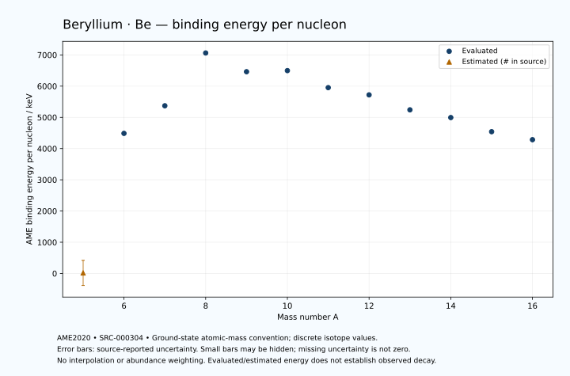

# Beryllium — Atomic Masses and Reaction Energies

<!-- generated-by: sync-ame2020.mjs -->

**Dated evaluated data · scientific coverage remains partial.** 12 ground-state nuclides from AME2020. Values and uncertainties are transcribed from the retained unrounded analysis files; estimated quantities remain labelled.

- [Parent Beryllium record](0004-Beryllium-Be.md) · [NUBASE states and decays](0004-Beryllium-Be-Nuclear-Evaluation.md)
- [Structured data](data/isotopes/0004-Beryllium-Be-AME2020-Evaluation.yaml)
- [Original mass table](../../data/catalog/sources/ame2020-mass_1.mas20.txt) · [Original reaction table 1](../../data/catalog/sources/ame2020-rct1.mas20.txt) · [Original reaction table 2](../../data/catalog/sources/ame2020-rct2.mas20.txt)
- [AME2020 methods](https://doi.org/10.1088/1674-1137/abddb0) (SRC-000303) · [Tables and definitions](https://doi.org/10.1088/1674-1137/abddaf) (SRC-000304)

## Reading the data

All table energies and uncertainties are in keV; binding energy is per nucleon. A # replaces a decimal point in the original estimated value. UNKNOWN (*) retains the source's not-calculable entry; it is neither zero nor automatically NOT APPLICABLE. Source lines are one-based in the retained files. Uncertainties remain those published by the evaluation, with no replacement by independent-mass quadrature.

Atomic-mass conventions apply. Qα is total decay energy, not alpha-particle kinetic energy. Positive Q alone does not establish a decay branch, rate or observation. He-4's source Qα of zero is a bookkeeping identity. These tables describe ground-state combinations, not isomer or excited-daughter transitions. Nuclear state and daughter lookups are explicit in the structured companion. The binding quantity follows [Z M(¹H) + N mₙ − M(A,Z)]c²/A; it has not been converted to a bare-nucleus convention.

## Mass and binding table

| Nuclide | N | Atomic mass excess / keV | AME binding per nucleon / keV | Mass-file line |
|---|---:|---|---|---:|
| Be-5 | 1 | 37139# ± 2003# | 18# ± 401# | 49 |
| Be-6 | 2 | 18375.034 ± 5.448 | 4487.2478 ± 0.9080 | 53 |
| Be-7 | 3 | 15768.998 ± 0.071 | 5371.5487 ± 0.0101 | 58 |
| Be-8 | 4 | 4941.672 ± 0.035 | 7062.4356 ± 0.0044 | 62 |
| Be-9 | 5 | 11348.451 ± 0.076 | 6462.6693 ± 0.0085 | 67 |
| Be-10 | 6 | 12607.487 ± 0.081 | 6497.6306 ± 0.0081 | 72 |
| Be-11 | 7 | 20177.169 ± 0.238 | 5952.5402 ± 0.0216 | 77 |
| Be-12 | 8 | 25077.761 ± 1.909 | 5720.7223 ± 0.1590 | 83 |
| Be-13 | 9 | 33659.080 ± 10.180 | 5241.4359 ± 0.7831 | 89 |
| Be-14 | 10 | 39954.502 ± 132.245 | 4993.8973 ± 9.4461 | 95 |
| Be-15 | 11 | 49825.821 ± 165.797 | 4540.9708 ± 11.0532 | 101 |
| Be-16 | 12 | 57447.139 ± 165.797 | 4285.2851 ± 10.3623 | 108 |

## Q-values and separation energies

| Nuclide | Qβ− / keV | Qα / keV | S₂n / keV | S₂p / keV | Reaction-file line |
|---|---|---|---|---|---:|
| Be-5 | UNKNOWN (*) | UNKNOWN (*) | UNKNOWN (*) | -7630# ± 2003# | 48 |
| Be-6 | -28945# ± 2003# | UNKNOWN (*) | UNKNOWN (*) | -1372.1758 ± 5.4478 | 52 |
| Be-7 | -11907.5551 ± 25.1504 | -1587.1371 ± 0.0708 | 37512# ± 2003# | 10040.1785 ± 20.0001 | 57 |
| Be-8 | -17979.8973 ± 1.0005 | 91.8399 ± 0.0354 | 29575.9983 ± 5.4479 | 27228.3656 ± 0.0639 | 61 |
| Be-9 | -1068.0349 ± 0.8994 | -2307.6989 ± 20.0001 | 20563.1828 ± 0.1040 | 29302.6187 ± 7.5599 | 66 |
| Be-10 | 556.8759 ± 0.0822 | -7409.5245 ± 0.0966 | 8476.8212 ± 0.0883 | 33580.1385 ± 0.1199 | 71 |
| Be-11 | 11509.4607 ± 0.2380 | -8320.8746 ± 7.5632 | 7313.9182 ± 0.2497 | 35336.5997 ± 46.8171 | 76 |
| Be-12 | 11708.3636 ± 2.3214 | -8956.8373 ± 1.9106 | 3672.3612 ± 1.9096 | 38697.3273 ± 92.8673 | 82 |
| Be-13 | 17097.1315 ± 10.2295 | -9701.6627 ± 47.9106 | 2660.7254 ± 10.1833 | UNKNOWN (*) | 88 |
| Be-14 | 16290.8166 ± 133.9357 | -11667.5601 ± 161.5842 | 1265.8951 ± 132.2589 | UNKNOWN (*) | 94 |
| Be-15 | 20868.4411 ± 167.1256 | UNKNOWN (*) | -24.1049 ± 166.1096 | UNKNOWN (*) | 100 |
| Be-16 | 20335.4399 ± 167.6075 | UNKNOWN (*) | -1350.0001 ± 100.0000 | UNKNOWN (*) | 107 |

## Additional decay-energy combinations

| Nuclide | Q₂β− / keV | Q₄β− / keV | Qεp / keV | Qβ−n / keV | Part 1 / part 2 line |
|---|---|---|---|---|---|
| Be-5 | UNKNOWN (*) | UNKNOWN (*) | 27425# ± 2003# | UNKNOWN (*) | 48 / 50 |
| Be-6 | UNKNOWN (*) | UNKNOWN (*) | -145.1712 ± 20.7287 | UNKNOWN (*) | 52 / 54 |
| Be-7 | UNKNOWN (*) | UNKNOWN (*) | -9112.0686 ± 0.0884 | -39622# ± 2003# | 57 / 59 |
| Be-8 | -30122.5975 ± 18.2430 | UNKNOWN (*) | -28420.4269 ± 7.5596 | -30806.1992 ± 25.1504 | 61 / 63 |
| Be-9 | -17562.5203 ± 2.1380 | UNKNOWN (*) | -27550.2030 ± 0.1170 | -19644.4361 ± 1.0028 | 66 / 68 |
| Be-10 | -3091.1864 ± 0.1072 | UNKNOWN (*) | -35617.3109 ± 46.8165 | -7880.3173 ± 0.9009 | 71 / 73 |
| Be-11 | 9527.7718 ± 0.2451 | -27561.7445 ± 60.0385 | -36308.9489 ± 92.8480 | 55.2401 ± 0.2382 | 76 / 78 |
| Be-12 | 25077.7615 ± 1.9086 | -6935.5735 ± 12.1510 | UNKNOWN (*) | 8338.7353 ± 1.9086 | 82 / 84 |
| Be-13 | 30534.0702 ± 10.1805 | 10543.6479 ± 13.9425 | UNKNOWN (*) | 12218.3636 ± 10.2659 | 88 / 90 |
| Be-14 | 36934.6092 ± 132.2451 | 31946.7213 ± 132.2451 | UNKNOWN (*) | 15321.2364 ± 132.2489 | 94 / 96 |
| Be-15 | 39952.6754 ± 165.7993 | 46970.1984 ± 165.7981 | UNKNOWN (*) | 18090.8166 ± 167.1489 | 100 / 102 |
| Be-16 | 43753.0055 ± 165.8360 | 62184.1409 ± 165.7974 | UNKNOWN (*) | 20418.4411 ± 167.1256 | 107 / 110 |

## Single-nucleon separation and reaction energies

| Nuclide | Sₙ / keV | Sₚ / keV | Q(d,α) / keV | Q(p,α) / keV | Q(n,α) / keV | Part 2 line |
|---|---|---|---|---|---|---:|
| Be-5 | UNKNOWN (*) | -4527# ± 2014# | 19183# ± 2830# | UNKNOWN (*) | UNKNOWN (*) | 50 |
| Be-6 | 26835# ± 2003# | 592.8241 ± 50.2959 | 3762.6510 ± 212.2020 | -5428# ± 2000# | 9090.2171 ± 5.4478 | 54 |
| Be-7 | 10677.3542 ± 5.4482 | 5606.8539 ± 0.0709 | 14800.9178 ± 50.0001 | -4690.1370 ± 212.1320 | 18990.4840 ± 0.0708 | 59 |
| Be-8 | 18898.6440 ± 0.0792 | 17254.4040 ± 0.0356 | 1565.5983 ± 0.0354 | -1873.1600 ± 50.0000 | -643.1601 ± 20.0000 | 63 |
| Be-9 | 1664.5388 ± 0.0843 | 16886.3247 ± 0.0898 | 7152.1533 ± 0.0763 | 2125.6257 ± 0.0765 | -597.2420 ± 0.0930 | 68 |
| Be-10 | 6812.2824 ± 0.0519 | 19636.3895 ± 0.2031 | 2372.4891 ± 0.0935 | 2564.4371 ± 0.0807 | -7819.2388 ± 7.5599 | 73 |
| Be-11 | 501.6358 ± 0.2511 | 20164.4299 ± 12.7236 | 5933.0708 ± 0.3020 | 4095.4195 ± 0.2424 | -5786.1119 ± 0.2537 | 78 |
| Be-12 | 3170.7254 ± 1.9233 | 22939.4682 ± 2.0051 | 2735.9409 ± 12.8637 | 4986.9116 ± 1.9176 | -10211.6627 ± 46.8554 | 84 |
| Be-13 | -510.0000 ± 10.0000 | 22639.4682 ± 31.6863 | 3641.6280 ± 10.1990 | 5470.5071 ± 16.2934 | -9891.6649 ± 93.4042 | 90 |
| Be-14 | 1775.8951 ± 132.6364 | 24315.3634 ± 149.6300 | 1655.7328 ± 135.6066 | 4090.2991 ± 132.2465 | UNKNOWN (*) | 96 |
| Be-15 | -1800.0000 ± 100.0000 | UNKNOWN (*) | 3555.7328 ± 179.9698 | 5680.2991 ± 168.4908 | UNKNOWN (*) | 102 |
| Be-16 | 450.0000 ± 141.4214 | UNKNOWN (*) | UNKNOWN (*) | 5330.2991 ± 179.9698 | UNKNOWN (*) | 110 |

Qβ− comes from the mass-file line in the first table. Qα, S₂n, S₂p, Q₂β−, Qεp and Qβ−n come from reaction part 1; Q₄β− and the last table come from part 2. Qεp is electron-capture/proton energy balance; Qβ−n is beta-minus/neutron energy balance. These are evaluated mass combinations, not observations of decay modes, cross sections or reaction rates. Light-nuclide zero entries can be bookkeeping identities, without a physical A=0 residual. Definitions and original source strings are retained in the structured data.

## Binding-energy chart

Discrete source values and source-reported uncertainties. No interpolation, natural-abundance weighting or observed-decay claim is implied. This quantitative chart supplements the 22 separate illustrative panels.

## Remaining review

Later measurements, state-specific decay branches, isomer Q-values, reaction rates, applicability and full claim-level review remain open. Existing authored values retain their own provenance; this companion does not overwrite them.
