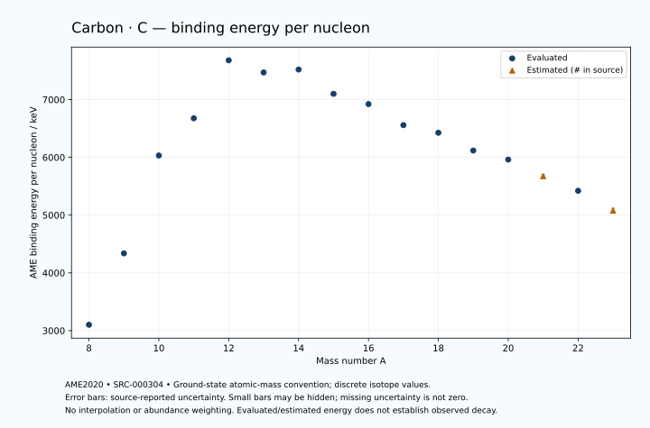

# Carbon — Atomic Masses and Reaction Energies

<!-- generated-by: sync-ame2020.mjs -->

**Dated evaluated data · scientific coverage remains partial.** 16 ground-state nuclides from AME2020. Values and uncertainties are transcribed from the retained unrounded analysis files; estimated quantities remain labelled.

- [Parent Carbon record](0006-Carbon-C.md) · [NUBASE states and decays](0006-Carbon-C-Nuclear-Evaluation.md)
- [Structured data](data/isotopes/0006-Carbon-C-AME2020-Evaluation.yaml)
- [Original mass table](../../data/catalog/sources/ame2020-mass_1.mas20.txt) · [Original reaction table](../../data/catalog/sources/ame2020-rct1.mas20.txt)
- [AME2020 methods](https://doi.org/10.1088/1674-1137/abddb0) (SRC-000303) · [Tables and definitions](https://doi.org/10.1088/1674-1137/abddaf) (SRC-000304)

## Reading the data

All table energies and uncertainties are in keV; binding energy is per nucleon. A # replaces a decimal point in the original estimated value. UNKNOWN (*) retains the source's not-calculable entry; it is neither zero nor automatically NOT APPLICABLE. Source lines are one-based in the retained files. Uncertainties remain those published by the evaluation, with no replacement by independent-mass quadrature.

Atomic-mass conventions apply. Qα is total decay energy, not alpha-particle kinetic energy. Positive Q alone does not establish a decay branch, rate or observation. He-4's source Qα of zero is a bookkeeping identity. These tables describe ground-state combinations, not isomer or excited-daughter transitions. Nuclear state and daughter lookups are explicit in the structured companion. The binding quantity follows [Z M(¹H) + N mₙ − M(A,Z)]c²/A; it has not been converted to a bare-nucleus convention.

## Mass and binding table

| Nuclide | N | Atomic mass excess / keV | AME binding per nucleon / keV | Mass-file line |
|---|---:|---|---|---:|
| C-8 | 2 | 35064.269 ± 18.243 | 3101.5242 ± 2.2804 | 64 |
| C-9 | 3 | 28910.971 ± 2.137 | 4337.4233 ± 0.2374 | 69 |
| C-10 | 4 | 15698.673 ± 0.070 | 6032.0426 ± 0.0070 | 74 |
| C-11 | 5 | 10649.397 ± 0.060 | 6676.4563 ± 0.0054 | 79 |
| C-12 | 6 | 0.0 ± 0.0 | 7680.1446 ± 0.0002 | 85 |
| C-13 | 7 | 3125.00933 ± 0.00023 | 7469.8495 ± 0.0002 | 91 |
| C-14 | 8 | 3019.89328 ± 0.00375 | 7520.3198 ± 0.0004 | 97 |
| C-15 | 9 | 9873.145 ± 0.800 | 7100.1696 ± 0.0533 | 103 |
| C-16 | 10 | 13694.133 ± 3.578 | 6922.0546 ± 0.2236 | 110 |
| C-17 | 11 | 21031.880 ± 17.365 | 6558.0262 ± 1.0215 | 116 |
| C-18 | 12 | 24919.266 ± 30.000 | 6426.1321 ± 1.6667 | 123 |
| C-19 | 13 | 32413.754 ± 98.389 | 6118.2740 ± 5.1784 | 130 |
| C-20 | 14 | 37503.567 ± 230.625 | 5961.4356 ± 11.5312 | 138 |
| C-21 | 15 | 45643# ± 596# | 5674# ± 28# | 146 |
| C-22 | 16 | 53611.203 ± 231.490 | 5421.0778 ± 10.5223 | 154 |
| C-23 | 17 | 64171# ± 997# | 5077# ± 43# | 163 |

## Q-values and separation energies

| Nuclide | Qβ− / keV | Qα / keV | S₂n / keV | S₂p / keV | Reaction-file line |
|---|---|---|---|---|---:|
| C-8 | UNKNOWN (*) | UNKNOWN (*) | UNKNOWN (*) | -2111.2932 ± 19.0390 | 63 |
| C-9 | UNKNOWN (*) | -10653# ± 2003# | UNKNOWN (*) | 1435.9685 ± 2.1355 | 68 |
| C-10 | -23101.3545 ± 400.0000 | -5101.2767 ± 5.4482 | 35508.2323 ± 18.2431 | 3820.9409 ± 0.0787 | 73 |
| C-11 | -13716.2469 ± 5.0008 | -7544.5165 ± 0.0926 | 34404.2103 ± 2.1375 | 15276.9960 ± 0.0970 | 78 |
| C-12 | -17338.0681 ± 0.9999 | -7366.5875 ± 0.0354 | 31841.3091 ± 0.0703 | 27185.4287 ± 0.0809 | 84 |
| C-13 | -2220.4718 ± 0.2695 | -10648.3575 ± 0.0765 | 23667.0238 ± 0.0596 | 31630.1016 ± 0.2377 | 90 |
| C-14 | 156.4765 ± 0.0037 | -12012.5091 ± 0.0810 | 13122.7428 ± 0.0039 | 36635.8103 ± 1.9086 | 96 |
| C-15 | 9771.7071 ± 0.8000 | -12728.9395 ± 0.8346 | 9394.5003 ± 0.8000 | 38363.8765 ± 10.2119 | 102 |
| C-16 | 8010.2260 ± 4.2540 | -13808.5442 ± 4.0549 | 5468.3962 ± 3.5777 | 40838.3114 ± 132.2935 | 109 |
| C-17 | 13161.8007 ± 22.9464 | -15052.1159 ± 20.1291 | 4983.9018 ± 17.3833 | 43371.8832 ± 166.7042 | 115 |
| C-18 | 11806.0982 ± 35.2821 | -17460.1527 ± 135.6052 | 4917.5036 ± 30.2126 | 47105.8151 ± 168.4897 | 122 |
| C-19 | 16557.4995 ± 99.7475 | -19836.9820 ± 192.7933 | 4760.7611 ± 99.9101 | UNKNOWN (*) | 129 |
| C-20 | 15737.0689 ± 243.7459 | -22368.4878 ± 284.0361 | 3558.3351 ± 232.5678 | UNKNOWN (*) | 137 |
| C-21 | 20411# ± 611# | UNKNOWN (*) | 2913# ± 604# | UNKNOWN (*) | 145 |
| C-22 | 21846.3983 ± 311.0627 | UNKNOWN (*) | 34.9999 ± 20.0000 | UNKNOWN (*) | 153 |
| C-23 | 27450# ± 1082# | UNKNOWN (*) | -2385# ± 1161# | UNKNOWN (*) | 162 |

Qβ− comes from the mass-file line in the first table. The other three columns come from the reaction-file line. Definitions and original source strings are retained in the structured data.

## Binding-energy chart

Discrete source values and source-reported uncertainties. No interpolation, natural-abundance weighting or observed-decay claim is implied. This quantitative chart supplements the 22 separate illustrative panels.

## Remaining review

Later measurements, state-specific decay branches, isomer Q-values, additional reaction channels and full claim-level review remain open. Existing authored values retain their own provenance; this companion does not overwrite them.
