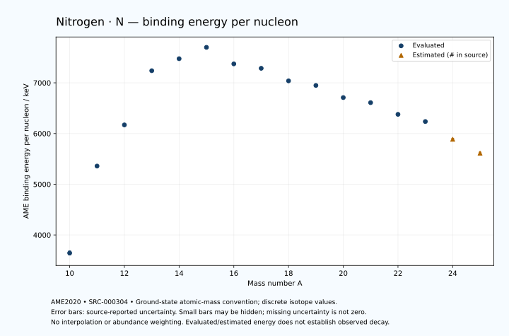

# Nitrogen — Atomic Masses and Reaction Energies

<!-- generated-by: sync-ame2020.mjs -->

**Dated evaluated data · scientific coverage remains partial.** 16 ground-state nuclides from AME2020. Values and uncertainties are transcribed from the retained unrounded analysis files; estimated quantities remain labelled.

- [Parent Nitrogen record](0007-Nitrogen-N.md) · [NUBASE states and decays](0007-Nitrogen-N-Nuclear-Evaluation.md)
- [Structured data](data/isotopes/0007-Nitrogen-N-AME2020-Evaluation.yaml)
- [Original mass table](../../data/catalog/sources/ame2020-mass_1.mas20.txt) · [Original reaction table 1](../../data/catalog/sources/ame2020-rct1.mas20.txt) · [Original reaction table 2](../../data/catalog/sources/ame2020-rct2.mas20.txt)
- [AME2020 methods](https://doi.org/10.1088/1674-1137/abddb0) (SRC-000303) · [Tables and definitions](https://doi.org/10.1088/1674-1137/abddaf) (SRC-000304)

## Reading the data

All table energies and uncertainties are in keV; binding energy is per nucleon. A # replaces a decimal point in the original estimated value. UNKNOWN (*) retains the source's not-calculable entry; it is neither zero nor automatically NOT APPLICABLE. Source lines are one-based in the retained files. Uncertainties remain those published by the evaluation, with no replacement by independent-mass quadrature.

Atomic-mass conventions apply. Qα is total decay energy, not alpha-particle kinetic energy. Positive Q alone does not establish a decay branch, rate or observation. He-4's source Qα of zero is a bookkeeping identity. These tables describe ground-state combinations, not isomer or excited-daughter transitions. Nuclear state and daughter lookups are explicit in the structured companion. The binding quantity follows [Z M(¹H) + N mₙ − M(A,Z)]c²/A; it has not been converted to a bare-nucleus convention.

## Mass and binding table

| Nuclide | N | Atomic mass excess / keV | AME binding per nucleon / keV | Mass-file line |
|---|---:|---|---|---:|
| N-10 | 3 | 38800.027 ± 400.000 | 3643.6724 ± 40.0000 | 75 |
| N-11 | 4 | 24365.644 ± 5.000 | 5358.4023 ± 0.4546 | 80 |
| N-12 | 5 | 17338.068 ± 1.000 | 6170.1100 ± 0.0833 | 86 |
| N-13 | 6 | 5345.481 ± 0.270 | 7238.8634 ± 0.0207 | 92 |
| N-14 | 7 | 2863.41683 ± 0.00022 | 7475.6148 ± 0.0002 | 98 |
| N-15 | 8 | 101.43809 ± 0.00058 | 7699.4603 ± 0.0002 | 104 |
| N-16 | 9 | 5683.907 ± 2.301 | 7373.7971 ± 0.1438 | 111 |
| N-17 | 10 | 7870.079 ± 15.000 | 7286.2294 ± 0.8824 | 117 |
| N-18 | 11 | 13113.167 ± 18.570 | 7038.5627 ± 1.0316 | 124 |
| N-19 | 12 | 15856.255 ± 16.404 | 6948.5452 ± 0.8634 | 131 |
| N-20 | 13 | 21766.498 ± 78.894 | 6709.1717 ± 3.9447 | 139 |
| N-21 | 14 | 25231.915 ± 134.048 | 6609.0159 ± 6.3832 | 147 |
| N-22 | 15 | 31764.805 ± 207.779 | 6378.5347 ± 9.4445 | 155 |
| N-23 | 16 | 36720.429 ± 420.570 | 6236.6721 ± 18.2856 | 164 |
| N-24 | 17 | 46938# ± 401# | 5887# ± 17# | 172 |
| N-25 | 18 | 55983# ± 503# | 5613# ± 20# | 181 |

## Q-values and separation energies

| Nuclide | Qβ− / keV | Qα / keV | S₂n / keV | S₂p / keV | Reaction-file line |
|---|---|---|---|---|---:|
| N-10 | UNKNOWN (*) | -10945# ± 2042# | UNKNOWN (*) | -1300.5163 ± 400.0012 | 74 |
| N-11 | -23373.2693 ± 60.2459 | -5735.8247 ± 25.6426 | UNKNOWN (*) | 2628.7840 ± 5.0813 | 79 |
| N-12 | -14675.2668 ± 12.0418 | -8008.4167 ± 1.4140 | 37604.5955 ± 400.0012 | 9290.4847 ± 1.0000 | 85 |
| N-13 | -17769.9506 ± 9.5301 | -9495.9206 ± 0.9420 | 35162.7990 ± 5.0078 | 17900.1692 ± 0.2698 | 91 |
| N-14 | -5144.3643 ± 0.0252 | -11612.1097 ± 0.0149 | 30617.2874 ± 0.9999 | 25083.9232 ± 1.3214 | 97 |
| N-15 | -2754.1841 ± 0.4902 | -10991.1859 ± 0.0121 | 21386.6791 ± 0.2695 | 31038.4521 ± 1.0001 | 103 |
| N-16 | 10420.9094 ± 2.3014 | -10110.4066 ± 2.6538 | 13322.1458 ± 2.3014 | 32557.7208 ± 21.3378 | 110 |
| N-17 | 8678.8430 ± 15.0000 | -11116.7852 ± 15.0333 | 8373.9955 ± 15.0000 | 35665.2429 ± 25.8305 | 116 |
| N-18 | 13895.9838 ± 18.5695 | -12975.4343 ± 28.1928 | 8713.3759 ± 18.7116 | 38576.4735 ± 30.7950 | 123 |
| N-19 | 12523.3972 ± 16.6143 | -15526.0403 ± 26.6702 | 8156.4598 ± 22.2280 | 42438.0088 ± 204.7618 | 130 |
| N-20 | 17970.3261 ± 78.8991 | -17770.1168 ± 82.6304 | 7489.3057 ± 81.0500 | 44604.0841 ± 218.8780 | 138 |
| N-21 | 17169.8816 ± 134.5840 | -20909.3222 ± 244.1867 | 6766.9758 ± 135.0479 | 49116.2773 ± 542.1944 | 146 |
| N-22 | 22481.7725 ± 215.4350 | -22452.7511 ± 291.2997 | 6144.3294 ± 222.2533 | 52214.7062 ± 584.5324 | 154 |
| N-23 | 22099.0584 ± 437.8271 | -25474.7374 ± 672.9671 | 4654.1225 ± 441.4155 | 56240.3999 ± 699.2744 | 163 |
| N-24 | 28438# ± 433# | -24888# ± 677# | 969# ± 451# | UNKNOWN (*) | 171 |
| N-25 | 28654# ± 529# | -24825# ± 752# | -3120# ± 656# | UNKNOWN (*) | 180 |

## Additional decay-energy combinations

| Nuclide | Q₂β− / keV | Q₄β− / keV | Qεp / keV | Qβ−n / keV | Part 1 / part 2 line |
|---|---|---|---|---|---|
| N-10 | UNKNOWN (*) | UNKNOWN (*) | 19094.5706 ± 400.0010 | UNKNOWN (*) | 74 / 76 |
| N-11 | UNKNOWN (*) | UNKNOWN (*) | 5026.0622 ± 5.0005 | UNKNOWN (*) | 79 / 81 |
| N-12 | UNKNOWN (*) | UNKNOWN (*) | 1381.3889 ± 1.0000 | -38472.1632 ± 60.0464 | 85 / 87 |
| N-13 | -36684# ± 500# | UNKNOWN (*) | -15312.8879 ± 1.3486 | -34739.1719 ± 12.0032 | 91 / 93 |
| N-14 | -29100.9859 ± 41.1187 | UNKNOWN (*) | -20987.5023 ± 1.0001 | -28323.3329 ± 9.5263 | 97 / 99 |
| N-15 | -16465.3141 ± 14.0000 | UNKNOWN (*) | -30851.2189 ± 21.2133 | -15977.6611 ± 0.0252 | 103 / 105 |
| N-16 | -4991.2746 ± 5.8370 | UNKNOWN (*) | -30562.4434 ± 21.1545 | -5243.0331 ± 2.3530 | 110 / 113 |
| N-17 | 5918.3775 ± 15.0020 | -26849.5009 ± 61.4738 | -36530.5911 ± 28.7837 | 4535.7629 ± 15.0000 | 116 / 119 |
| N-18 | 12240.0550 ± 18.5753 | -11924.8244 ± 95.7001 | -37892.1253 ± 204.9466 | 5850.6136 ± 18.5695 | 123 / 126 |
| N-19 | 17343.7002 ± 16.4037 | 2926.8705 ± 19.4954 | -43225.3559 ± 204.8228 | 8567.7533 ± 16.4037 | 130 / 133 |
| N-20 | 21783.9611 ± 78.8941 | 14916.0093 ± 78.9019 | -45292.7238 ± 531.2534 | 10362.3220 ± 78.9382 | 138 / 141 |
| N-21 | 25279.5206 ± 134.0600 | 27416.7728 ± 134.0479 | -51458.6243 ± 562.5609 | 13364.4256 ± 134.0508 | 146 / 149 |
| N-22 | 28971.4287 ± 208.1489 | 36946.1961 ± 207.7793 | -53907.0533 ± 596.0522 | 15631.4527 ± 208.1255 | 154 / 157 |
| N-23 | 33435.1656 ± 421.8875 | 46250.2825 ± 420.5696 | UNKNOWN (*) | 19366.0789 ± 424.4040 | 163 / 166 |
| N-24 | 39393# ± 412# | 55356# ± 401# | UNKNOWN (*) | 24245# ± 419# | 171 / 174 |
| N-25 | 44649# ± 512# | 65341# ± 503# | UNKNOWN (*) | 29411# ± 529# | 180 / 184 |

## Single-nucleon separation and reaction energies

| Nuclide | Sₙ / keV | Sₚ / keV | Q(d,α) / keV | Q(p,α) / keV | Q(n,α) / keV | Part 2 line |
|---|---|---|---|---|---|---:|
| N-10 | UNKNOWN (*) | -2600.0851 ± 400.0057 | 14446.5653 ± 400.4158 | UNKNOWN (*) | 16769.8769 ± 400.7899 | 76 |
| N-11 | 22505.7016 ± 400.0313 | -1377.9999 ± 5.0000 | 6165.4797 ± 5.4378 | -5834.5700 ± 18.9159 | 7090.4771 ± 5.0995 | 81 |
| N-12 | 15098.8939 ± 5.0995 | 600.3000 ± 1.0017 | 12350.2022 ± 1.0024 | -6708.8480 ± 2.3590 | 10567.9845 ± 1.3470 | 87 |
| N-13 | 20063.9051 ± 1.0356 | 1943.4900 ± 0.2695 | 5406.8911 ± 0.2760 | -5489.1366 ± 0.2785 | -1058.7274 ± 0.2699 | 93 |
| N-14 | 10553.3823 ± 0.2695 | 7550.5636 ± 0.0001 | 13574.2239 ± 0.0003 | -2921.9250 ± 0.0596 | -157.8891 ± 0.0121 | 99 |
| N-15 | 10833.2968 ± 0.0008 | 10207.4263 ± 0.0038 | 7687.2358 ± 0.0006 | 4965.4933 ± 0.0006 | -7621.5576 ± 1.3214 | 105 |
| N-16 | 2488.8490 ± 2.3014 | 11478.2090 ± 2.4365 | 13374.8209 ± 2.3014 | 7422.9531 ± 2.3014 | -5231.6387 ± 2.5093 | 113 |
| N-17 | 5885.1465 ± 15.1755 | 13113.0255 ± 15.4208 | 8707.7406 ± 15.0213 | 9714.2407 ± 15.0000 | -10147.2049 ± 25.9809 | 119 |
| N-18 | 2828.2294 ± 23.8711 | 15207.6831 ± 25.4237 | 10129.8413 ± 18.9110 | 8104.0775 ± 18.5868 | -10197.8098 ± 28.0543 | 126 |
| N-19 | 5328.2305 ± 24.7772 | 16351.9817 ± 34.1919 | 5535.1826 ± 23.8877 | 7026.1771 ± 16.7894 | -15609.0415 ± 29.5396 | 133 |
| N-20 | 2161.0753 ± 80.5814 | 17936.2277 ± 126.1141 | 7558.0392 ± 84.4055 | 5598.6735 ± 80.7825 | -16303.4217 ± 218.8209 | 141 |
| N-21 | 4605.9005 ± 155.5414 | 19560.6224 ± 266.7520 | 3528.9679 ± 166.2809 | 5176.7049 ± 137.3639 | -20914.3222 ± 244.2379 | 149 |
| N-22 | 1538.4289 ± 247.2672 | 21167# ± 631# | 4972.0449 ± 310.4191 | 4215.1053 ± 229.8972 | -22359.0438 ± 564.9586 | 157 |
| N-23 | 3115.6936 ± 469.0960 | 24179.7450 ± 480.0693 | 1788# ± 730# | 4080.9175 ± 479.6525 | -27034.7375 ± 689.4815 | 166 |
| N-24 | -2146# ± 581# | 24522# ± 1074# | 4038# ± 463# | 6159# ± 718# | -25798# ± 687# | 174 |
| N-25 | -973# ± 643# | UNKNOWN (*) | 2523# ± 1116# | 7236# ± 554# | UNKNOWN (*) | 184 |

Qβ− comes from the mass-file line in the first table. Qα, S₂n, S₂p, Q₂β−, Qεp and Qβ−n come from reaction part 1; Q₄β− and the last table come from part 2. Qεp is electron-capture/proton energy balance; Qβ−n is beta-minus/neutron energy balance. These are evaluated mass combinations, not observations of decay modes, cross sections or reaction rates. Light-nuclide zero entries can be bookkeeping identities, without a physical A=0 residual. Definitions and original source strings are retained in the structured data.

## Binding-energy chart

Discrete source values and source-reported uncertainties. No interpolation, natural-abundance weighting or observed-decay claim is implied. This quantitative chart supplements the 22 separate illustrative panels.

## Remaining review

Later measurements, state-specific decay branches, isomer Q-values, reaction rates, applicability and full claim-level review remain open. Existing authored values retain their own provenance; this companion does not overwrite them.
