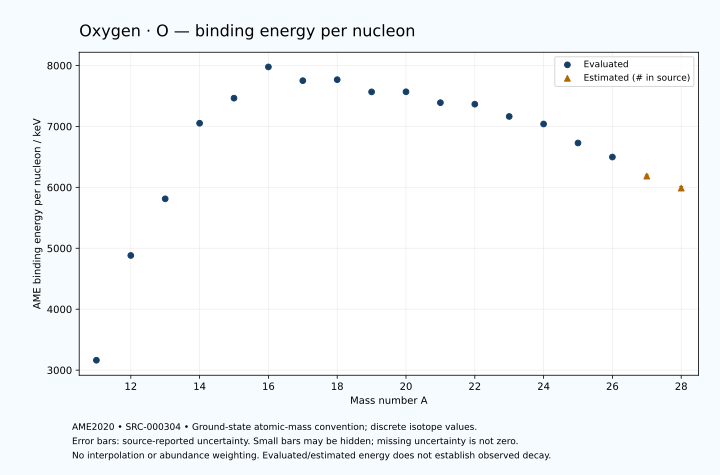

# Oxygen — Atomic Masses and Reaction Energies

<!-- generated-by: sync-ame2020.mjs -->

**Dated evaluated data · scientific coverage remains partial.** 18 ground-state nuclides from AME2020. Values and uncertainties are transcribed from the retained unrounded analysis files; estimated quantities remain labelled.

- [Parent Oxygen record](0008-Oxygen-O.md) · [NUBASE states and decays](0008-Oxygen-O-Nuclear-Evaluation.md)
- [Structured data](data/isotopes/0008-Oxygen-O-AME2020-Evaluation.yaml)
- [Original mass table](../../data/catalog/sources/ame2020-mass_1.mas20.txt) · [Original reaction table 1](../../data/catalog/sources/ame2020-rct1.mas20.txt) · [Original reaction table 2](../../data/catalog/sources/ame2020-rct2.mas20.txt)
- [AME2020 methods](https://doi.org/10.1088/1674-1137/abddb0) (SRC-000303) · [Tables and definitions](https://doi.org/10.1088/1674-1137/abddaf) (SRC-000304)

## Reading the data

All table energies and uncertainties are in keV; binding energy is per nucleon. A # replaces a decimal point in the original estimated value. UNKNOWN (*) retains the source's not-calculable entry; it is neither zero nor automatically NOT APPLICABLE. Source lines are one-based in the retained files. Uncertainties remain those published by the evaluation, with no replacement by independent-mass quadrature.

Atomic-mass conventions apply. Qα is total decay energy, not alpha-particle kinetic energy. Positive Q alone does not establish a decay branch, rate or observation. He-4's source Qα of zero is a bookkeeping identity. These tables describe ground-state combinations, not isomer or excited-daughter transitions. Nuclear state and daughter lookups are explicit in the structured companion. The binding quantity follows [Z M(¹H) + N mₙ − M(A,Z)]c²/A; it has not been converted to a bare-nucleus convention.

## Mass and binding table

| Nuclide | N | Atomic mass excess / keV | AME binding per nucleon / keV | Mass-file line |
|---|---:|---|---|---:|
| O-11 | 3 | 47738.913 ± 60.038 | 3162.4372 ± 5.4580 | 81 |
| O-12 | 4 | 32013.335 ± 12.000 | 4881.9755 ± 1.0000 | 87 |
| O-13 | 5 | 23115.432 ± 9.526 | 5811.7636 ± 0.7328 | 93 |
| O-14 | 6 | 8007.781 ± 0.025 | 7052.2783 ± 0.0018 | 99 |
| O-15 | 7 | 2855.622 ± 0.490 | 7463.6915 ± 0.0327 | 105 |
| O-16 | 8 | -4737.00217 ± 0.00030 | 7976.2072 ± 0.0002 | 112 |
| O-17 | 9 | -808.76421 ± 0.00064 | 7750.7291 ± 0.0002 | 118 |
| O-18 | 10 | -782.81634 ± 0.00064 | 7767.0981 ± 0.0002 | 125 |
| O-19 | 11 | 3332.858 ± 2.637 | 7566.4952 ± 0.1388 | 132 |
| O-20 | 12 | 3796.172 ± 0.885 | 7568.5707 ± 0.0442 | 140 |
| O-21 | 13 | 8062.034 ± 12.000 | 7389.3747 ± 0.5714 | 148 |
| O-22 | 14 | 9283.032 ± 56.921 | 7364.8722 ± 2.5873 | 156 |
| O-23 | 15 | 14621.371 ± 121.712 | 7163.4856 ± 5.2918 | 165 |
| O-24 | 16 | 18500.404 ± 164.874 | 7039.6855 ± 6.8698 | 173 |
| O-25 | 17 | 27329.030 ± 165.084 | 6727.8058 ± 6.6034 | 182 |
| O-26 | 18 | 34661.041 ± 164.950 | 6497.4790 ± 6.3442 | 190 |
| O-27 | 19 | 44670# ± 500# | 6185# ± 19# | 199 |
| O-28 | 20 | 52080# ± 699# | 5988# ± 25# | 208 |

## Q-values and separation energies

| Nuclide | Qβ− / keV | Qα / keV | S₂n / keV | S₂p / keV | Reaction-file line |
|---|---|---|---|---|---:|
| O-11 | UNKNOWN (*) | UNKNOWN (*) | UNKNOWN (*) | -4249.9999 ± 60.0000 | 80 |
| O-12 | UNKNOWN (*) | -5475.8501 ± 21.8360 | UNKNOWN (*) | -1736.7199 ± 12.0000 | 86 |
| O-13 | -18915# ± 500# | -8220.4554 ± 9.7630 | 40766.1177 ± 60.7891 | 2111.9075 ± 9.5265 | 92 |
| O-14 | -23956.6215 ± 41.1187 | -10115.8076 ± 0.0747 | 40148.1899 ± 12.0002 | 6570.1610 ± 0.0252 | 98 |
| O-15 | -13711.1300 ± 14.0086 | -10218.6907 ± 0.4938 | 36402.4456 ± 9.5389 | 14847.3293 ± 0.4902 | 104 |
| O-16 | -15412.1840 ± 5.3642 | -7161.9180 ± 0.0003 | 28887.4195 ± 0.0252 | 22334.8376 ± 0.0038 | 111 |
| O-17 | -2760.4655 ± 0.2479 | -6358.6894 ± 0.0007 | 19807.0225 ± 0.4902 | 25259.8515 ± 0.8000 | 117 |
| O-18 | -1655.9288 ± 0.4633 | -6227.6255 ± 0.0038 | 12188.4503 ± 0.0011 | 29054.8916 ± 3.5777 | 124 |
| O-19 | 4820.3029 ± 2.6370 | -8965.2032 ± 2.7556 | 12001.0141 ± 2.6370 | 32276.9638 ± 17.5639 | 131 |
| O-20 | 3813.6349 ± 0.8854 | -12322.8773 ± 3.6855 | 11563.6481 ± 0.8849 | 35701.0361 ± 30.0130 | 139 |
| O-21 | 8109.6390 ± 12.1342 | -15394.7616 ± 21.1078 | 11413.4601 ± 12.2863 | 38929.6628 ± 99.1186 | 147 |
| O-22 | 6489.6562 ± 58.2558 | -18061.1494 ± 64.3428 | 10655.7758 ± 56.9279 | 42798.4768 ± 237.5453 | 155 |
| O-23 | 11336.1072 ± 126.1904 | -20217.2997 ± 156.5064 | 9583.2993 ± 122.3020 | 45600# ± 608# | 164 |
| O-24 | 10955.8885 ± 191.6327 | -21428.0782 ± 283.4984 | 6925.2638 ± 174.4236 | 49688.7407 ± 284.2030 | 172 |
| O-25 | 15994.8633 ± 191.1909 | -20739# ± 619# | 3434.9766 ± 205.1014 | 51420# ± 1010# | 181 |
| O-26 | 15986.3855 ± 196.6301 | -21375.0782 ± 284.2470 | -18.0001 ± 5.0000 | UNKNOWN (*) | 189 |
| O-27 | 19536# ± 514# | -21926# ± 1115# | -1198# ± 527# | UNKNOWN (*) | 198 |
| O-28 | 18676# ± 709# | UNKNOWN (*) | -1276# ± 718# | UNKNOWN (*) | 207 |

## Additional decay-energy combinations

| Nuclide | Q₂β− / keV | Q₄β− / keV | Qεp / keV | Qβ−n / keV | Part 1 / part 2 line |
|---|---|---|---|---|---|
| O-11 | UNKNOWN (*) | UNKNOWN (*) | 24751.2693 ± 60.0381 | UNKNOWN (*) | 80 / 82 |
| O-12 | UNKNOWN (*) | UNKNOWN (*) | 14074.9668 ± 12.0004 | UNKNOWN (*) | 86 / 88 |
| O-13 | UNKNOWN (*) | UNKNOWN (*) | 15826.4606 ± 9.5263 | UNKNOWN (*) | 92 / 94 |
| O-14 | UNKNOWN (*) | UNKNOWN (*) | -2406.1992 ± 0.0252 | -42093# ± 500# | 98 / 100 |
| O-15 | -37359.7515 ± 66.6858 | UNKNOWN (*) | -7453.2421 ± 0.4902 | -37180.0986 ± 41.1217 | 104 / 106 |
| O-16 | -28723.7772 ± 20.4800 | UNKNOWN (*) | -21899.1184 ± 0.8000 | -29375.0724 ± 14.0000 | 111 / 114 |
| O-17 | -17309.2162 ± 0.3542 | UNKNOWN (*) | -21791.8685 ± 3.5777 | -19555.2641 ± 5.3642 | 117 / 120 |
| O-18 | -6100.4337 ± 0.3634 | UNKNOWN (*) | -29103.6669 ± 17.3649 | -10805.8357 ± 0.2479 | 124 / 127 |
| O-19 | 1580.8043 ± 2.6418 | -28505.5362 ± 60.0590 | -28875.3789 ± 30.1157 | -5611.5727 ± 2.6774 | 131 / 134 |
| O-20 | 10838.1039 ± 0.8849 | -13681.5222 ± 2.0625 | -35906.5538 ± 98.3934 | -2787.7012 ± 0.8849 | 139 / 142 |
| O-21 | 13793.8102 ± 12.0001 | -2841.8169 ± 12.0237 | -36730.5040 ± 230.9367 | 8.1790 ± 12.0000 | 147 / 150 |
| O-22 | 17307.7478 ± 56.9210 | 9683.0184 ± 56.9212 | -43649# ± 599# | 1259.3192 ± 56.9495 | 155 / 158 |
| O-23 | 19775.4156 ± 121.7119 | 20095.0452 ± 121.7119 | -46278.8034 ± 261.5369 | 3756.6767 ± 122.3418 | 164 / 167 |
| O-24 | 24452.0468 ± 164.8753 | 32433.9825 ± 164.8745 | -52959# ± 1010# | 7143.8229 ± 168.2077 | 172 / 175 |
| O-25 | 29364.5331 ± 167.6200 | 40521.8121 ± 165.0843 | UNKNOWN (*) | 11713.1962 ± 191.8132 | 181 / 185 |
| O-26 | 34179.9270 ± 165.9765 | 50875.5841 ± 164.9503 | UNKNOWN (*) | 15255.5557 ± 191.0752 | 189 / 193 |
| O-27 | 37619# ± 508# | 59256# ± 500# | UNKNOWN (*) | 17924# ± 512# | 198 / 202 |
| O-28 | 40780# ± 710# | 67100# ± 699# | UNKNOWN (*) | 18875# ± 709# | 207 / 211 |

## Single-nucleon separation and reaction energies

| Nuclide | Sₙ / keV | Sₚ / keV | Q(d,α) / keV | Q(p,α) / keV | Q(n,α) / keV | Part 2 line |
|---|---|---|---|---|---|---:|
| O-11 | UNKNOWN (*) | -1649.9147 ± 404.4806 | UNKNOWN (*) | UNKNOWN (*) | 18321.0463 ± 62.7485 | 82 |
| O-12 | 23796.8964 ± 61.2256 | -358.7199 ± 13.0000 | 3924.1145 ± 400.1800 | UNKNOWN (*) | 8748.7659 ± 12.1889 | 88 |
| O-13 | 16969.2213 ± 15.3217 | 1511.6075 ± 9.5786 | 9460.5948 ± 10.7590 | -10820.5406 ± 400.1134 | 13063.1610 ± 9.5266 | 94 |
| O-14 | 23178.9686 ± 9.5263 | 4626.6710 ± 0.2707 | 1380.5201 ± 1.0002 | -11493.8076 ± 5.0006 | 3004.7863 ± 0.0647 | 100 |
| O-15 | 13223.4770 ± 0.4908 | 7296.7657 ± 0.4902 | 8220.9481 ± 0.5594 | -9618.3907 ± 1.1136 | 8502.0244 ± 0.4902 | 106 |
| O-16 | 15663.9424 ± 0.4902 | 12127.4113 ± 0.0006 | 3110.3880 ± 0.0003 | -5218.4281 ± 0.2695 | -2215.6093 ± 0.0005 | 114 |
| O-17 | 4143.0801 ± 0.0008 | 13781.6425 ± 2.3014 | 9800.6047 ± 0.0009 | 1191.8742 ± 0.0007 | 1817.7447 ± 0.0038 | 120 |
| O-18 | 8045.3702 ± 0.0010 | 15941.8662 ± 15.0000 | 4244.0835 ± 2.3014 | 3979.8008 ± 0.0009 | -5009.5593 ± 0.8000 | 127 |
| O-19 | 3955.6439 ± 2.6370 | 17069.2807 ± 18.7558 | 6173.5861 ± 15.2300 | 2513.0058 ± 3.5000 | -4714.8732 ± 4.4445 | 134 |
| O-20 | 7608.0042 ± 2.7815 | 19349.0544 ± 16.4276 | 1393.8113 ± 18.5906 | 790.1482 ± 15.0261 | -11589.3056 ± 17.3874 | 142 |
| O-21 | 3805.4560 ± 12.0326 | 20993.4351 ± 79.8015 | 2916.5858 ± 20.3244 | -187.0785 ± 22.1094 | -11210.8297 ± 32.3110 | 150 |
| O-22 | 6850.3198 ± 58.1722 | 23237.8544 ± 145.6326 | -1772.6587 ± 97.2845 | -1709.1678 ± 59.2375 | -17484.3202 ± 113.6683 | 158 |
| O-23 | 2732.9795 ± 134.3643 | 24432.4050 ± 240.8029 | 100.2622 ± 181.0597 | -2281.0720 ± 145.0450 | -17235.7939 ± 260.7711 | 167 |
| O-24 | 4192.2843 ± 204.9326 | 25508.9957 ± 451.7326 | -2553.5932 ± 265.2467 | -1867.4558 ± 212.4910 | -21496# ± 619# | 175 |
| O-25 | -757.3077 ± 8.3205 | 26898# ± 433# | 1319.4082 ± 451.8092 | 428.2808 ± 265.3772 | -20635.7706 ± 284.3248 | 185 |
| O-26 | 739.3077 ± 9.7073 | 28611# ± 529# | -1566# ± 433# | 2804.6668 ± 451.7603 | -23863# ± 1010# | 193 |
| O-27 | -1937# ± 527# | UNKNOWN (*) | -602# ± 709# | 2596# ± 641# | UNKNOWN (*) | 202 |
| O-28 | 661# ± 859# | UNKNOWN (*) | UNKNOWN (*) | 961# ± 861# | UNKNOWN (*) | 211 |

Qβ− comes from the mass-file line in the first table. Qα, S₂n, S₂p, Q₂β−, Qεp and Qβ−n come from reaction part 1; Q₄β− and the last table come from part 2. Qεp is electron-capture/proton energy balance; Qβ−n is beta-minus/neutron energy balance. These are evaluated mass combinations, not observations of decay modes, cross sections or reaction rates. Light-nuclide zero entries can be bookkeeping identities, without a physical A=0 residual. Definitions and original source strings are retained in the structured data.

## Binding-energy chart

Discrete source values and source-reported uncertainties. No interpolation, natural-abundance weighting or observed-decay claim is implied. This quantitative chart supplements the 22 separate illustrative panels.

## Remaining review

Later measurements, state-specific decay branches, isomer Q-values, reaction rates, applicability and full claim-level review remain open. Existing authored values retain their own provenance; this companion does not overwrite them.
