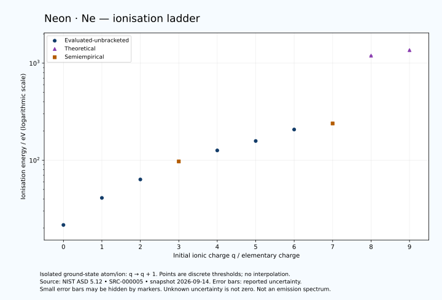

# Neon — Ground States and Ionisation Ladder

<!-- generated-by: sync-ionisation-evaluation.mjs -->

Dated NIST ASD 5.12 extraction, retrieved 14 September 2026. 10 charge-state rows and 10 numeric ionisation energies are present. This is scoped reference coverage; the element remains under scientific review.

- [Parent Neon record](0010-Neon-Ne.md)
- [Structured values and provenance](data/structured/0010-Neon-Ne-NIST-Ionisation-Evaluation.yaml)
- [Retained source export](../../data/catalog/sources/nist-asd-ionisation-2026-09-14.csv) · SRC-000005
- [NIST definitions and qualifiers](https://physics.nist.gov/PhysRefData/ASD/Html/iehelp.html)

## State and evidence semantics

Each threshold removes one electron from an isolated ground-state atom or ion of charge q, producing charge q+1. Electron count is calculated as Z−q. This is not a bulk work function or electrochemical potential. Square brackets retain semiempirical estimates; parentheses retain theoretical values. Unbracketed values retain their evaluated status. Ground configurations describe dominant calculated components and may have uncertain assignments. NIST notation is preserved. Numeric uncertainty is transcribed in eV; unavailable uncertainty remains UNKNOWN. No confidence level, isotope assignment or extra precision is inferred.

## Source table

| Spectrum | q | Ground configuration | Ground level | Energy / eV | Uncertainty / eV | Evidence | Source line |
|---|---:|---|---|---|---|---|---:|
| Ne I | 0 | 2s2.2p6 | 1S0 | 21.564541 | 0.000007 | EVALUATED-UNBRACKETED | 47 |
| Ne II | 1 | 2s2.2p5 | 2P*&lt;3/2&gt; | 40.96297 | 0.00004 | EVALUATED-UNBRACKETED | 48 |
| Ne III | 2 | 2s2.2p4 | 3P&lt;2&gt; | 63.4233 | 0.0003 | EVALUATED-UNBRACKETED | 49 |
| Ne IV | 3 | 2s2.2p3 | 4S*&lt;3/2&gt; | [97.1900] | 0.0025 | SEMIEMPIRICAL | 50 |
| Ne V | 4 | 2s2.2p2 | 3P0 | 126.247 | 0.012 | EVALUATED-UNBRACKETED | 51 |
| Ne VI | 5 | 2s2.2p | 2P*&lt;1/2&gt; | 157.934 | 0.005 | EVALUATED-UNBRACKETED | 52 |
| Ne VII | 6 | 1s2.2s2 | 1S0 | 207.271 | 0.012 | EVALUATED-UNBRACKETED | 53 |
| Ne VIII | 7 | 1s2.2s | 2S&lt;1/2&gt; | [239.0970] | 0.0019 | SEMIEMPIRICAL | 54 |
| Ne IX | 8 | 1s2 | 1S0 | (1195.8082) | 0.0004 | THEORETICAL | 55 |
| Ne X | 9 | 1s | 2S&lt;1/2&gt; | (1362.199256) | 0.000004 | THEORETICAL | 56 |

## Remaining gaps

Missing charge-state rows: none in the requested 0 to Z−1 range. Blank energies, where present, remain UNKNOWN. The raw bibliography keys allow tracing entries within NIST; the underlying papers have not all received independent claim-level review here. Isotope shifts, excited-state thresholds, material properties and later literature remain separate work.

## Ionisation ladder chart

Generated from the structured evaluation above. Missing energies occupy a separate axis strip, not zero energy. Reported uncertainties are shown where valid on the logarithmic axis; missing uncertainties remain unknown. The source table retains exact notation and source-line locators.

## Calculated energy equivalents

The structured entries include f = E/h and the energy-equivalent vacuum wavelength λ = hc/E, converting eV to joules with the exact elementary charge. The [SI defining constants](../../data/constants/si-defining-constants.yaml) are registered as SRC-000302. Frequency uncertainty propagates linearly; wavelength uncertainty uses the first-order reciprocal derivative. Missing source uncertainty remains UNKNOWN. These are mathematical energy equivalents, not observed spectral lines, universal element frequencies or recoil-corrected photoionisation thresholds. Theoretical and semiempirical input status is retained; floating-point digits do not imply additional precision.
