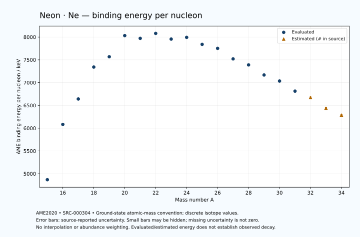

# Neon — Atomic Masses and Reaction Energies

<!-- generated-by: sync-ame2020.mjs -->

**Dated evaluated data · scientific coverage remains partial.** 20 ground-state nuclides from AME2020. Values and uncertainties are transcribed from the retained unrounded analysis files; estimated quantities remain labelled.

- [Parent Neon record](0010-Neon-Ne.md) · [NUBASE states and decays](0010-Neon-Ne-Nuclear-Evaluation.md)
- [Structured data](data/isotopes/0010-Neon-Ne-AME2020-Evaluation.yaml)
- [Original mass table](../../data/catalog/sources/ame2020-mass_1.mas20.txt) · [Original reaction table 1](../../data/catalog/sources/ame2020-rct1.mas20.txt) · [Original reaction table 2](../../data/catalog/sources/ame2020-rct2.mas20.txt)
- [AME2020 methods](https://doi.org/10.1088/1674-1137/abddb0) (SRC-000303) · [Tables and definitions](https://doi.org/10.1088/1674-1137/abddaf) (SRC-000304)

## Reading the data

All table energies and uncertainties are in keV; binding energy is per nucleon. A # replaces a decimal point in the original estimated value. UNKNOWN (*) retains the source's not-calculable entry; it is neither zero nor automatically NOT APPLICABLE. Source lines are one-based in the retained files. Uncertainties remain those published by the evaluation, with no replacement by independent-mass quadrature.

Atomic-mass conventions apply. Qα is total decay energy, not alpha-particle kinetic energy. Positive Q alone does not establish a decay branch, rate or observation. He-4's source Qα of zero is a bookkeeping identity. These tables describe ground-state combinations, not isomer or excited-daughter transitions. Nuclear state and daughter lookups are explicit in the structured companion. The binding quantity follows [Z M(¹H) + N mₙ − M(A,Z)]c²/A; it has not been converted to a bare-nucleus convention.

## Mass and binding table

| Nuclide | N | Atomic mass excess / keV | AME binding per nucleon / keV | Mass-file line |
|---|---:|---|---|---:|
| Ne-15 | 5 | 40215.374 ± 66.684 | 4868.7285 ± 4.4456 | 107 |
| Ne-16 | 6 | 23986.775 ± 20.480 | 6083.1777 ± 1.2800 | 114 |
| Ne-17 | 7 | 16500.452 ± 0.354 | 6640.4991 ± 0.0208 | 120 |
| Ne-18 | 8 | 5317.617 ± 0.363 | 7341.2577 ± 0.0202 | 127 |
| Ne-19 | 9 | 1752.054 ± 0.160 | 7567.3431 ± 0.0084 | 134 |
| Ne-20 | 10 | -7041.93217 ± 0.00154 | 8032.2412 ± 0.0002 | 142 |
| Ne-21 | 11 | -5731.776 ± 0.038 | 7971.7136 ± 0.0018 | 150 |
| Ne-22 | 12 | -8024.716 ± 0.018 | 8080.4656 ± 0.0008 | 158 |
| Ne-23 | 13 | -5154.045 ± 0.104 | 7955.2561 ± 0.0045 | 167 |
| Ne-24 | 14 | -5951.642 ± 0.513 | 7993.3252 ± 0.0214 | 175 |
| Ne-25 | 15 | -2035.503 ± 29.045 | 7839.7994 ± 1.1618 | 184 |
| Ne-26 | 16 | 481.114 ± 18.429 | 7751.9110 ± 0.7088 | 192 |
| Ne-27 | 17 | 7050.910 ± 90.770 | 7520.4151 ± 3.3619 | 201 |
| Ne-28 | 18 | 11299.738 ± 126.068 | 7388.3463 ± 4.5024 | 210 |
| Ne-29 | 19 | 18399.803 ± 149.505 | 7167.0673 ± 5.1553 | 219 |
| Ne-30 | 20 | 23280.120 ± 253.250 | 7034.5317 ± 8.4417 | 229 |
| Ne-31 | 21 | 31181.594 ± 266.195 | 6813.0902 ± 8.5869 | 239 |
| Ne-32 | 22 | 36999# ± 503# | 6671# ± 16# | 249 |
| Ne-33 | 23 | 46130# ± 600# | 6436# ± 18# | 259 |
| Ne-34 | 24 | 52842# ± 513# | 6287# ± 15# | 270 |

## Q-values and separation energies

| Nuclide | Qβ− / keV | Qα / keV | S₂n / keV | S₂p / keV | Reaction-file line |
|---|---|---|---|---|---:|
| Ne-15 | UNKNOWN (*) | -9948.4554 ± 89.7291 | UNKNOWN (*) | -2521.9999 ± 66.0000 | 106 |
| Ne-16 | UNKNOWN (*) | -10451.4758 ± 23.7368 | UNKNOWN (*) | -1401.0517 ± 20.4800 | 113 |
| Ne-17 | -18219.1277 ± 59.6167 | -9039.8956 ± 9.5329 | 39857.5578 ± 66.6849 | 933.1123 ± 0.6048 | 119 |
| Ne-18 | -19720.3745 ± 93.8819 | -5115.0797 ± 0.3643 | 34811.7938 ± 20.4832 | 4523.3226 ± 0.3634 | 126 |
| Ne-19 | -11177.3310 ± 10.5364 | -3528.4845 ± 0.5156 | 30891.0346 ± 0.3882 | 12017.1244 ± 0.1601 | 133 |
| Ne-20 | -13892.4207 ± 1.1090 | -4729.8459 ± 0.0016 | 28502.1857 ± 0.3634 | 20837.0580 ± 0.0017 | 141 |
| Ne-21 | -3546.9190 ± 0.0177 | -7347.9280 ± 0.0385 | 23626.4660 ± 0.1646 | 23642.5763 ± 2.6372 | 149 |
| Ne-22 | -2843.3243 ± 0.1325 | -9666.8153 ± 0.0177 | 17125.4197 ± 0.0178 | 26398.8296 ± 0.8851 | 157 |
| Ne-23 | 4375.8085 ± 0.1044 | -10911.8187 ± 2.6390 | 15564.9047 ± 0.1113 | 27794.0209 ± 12.0005 | 166 |
| Ne-24 | 2466.2583 ± 0.5130 | -12172.7300 ± 1.0227 | 14069.5628 ± 0.5123 | 29812.6166 ± 56.9233 | 174 |
| Ne-25 | 7322.3107 ± 29.0701 | -12522.4526 ± 31.4266 | 13024.0941 ± 29.0455 | 31234.8157 ± 125.1296 | 183 |
| Ne-26 | 7341.8940 ± 18.7585 | -11226.8344 ± 59.8299 | 9709.8802 ± 18.4359 | 32597.2329 ± 165.9012 | 191 |
| Ne-27 | 12568.7005 ± 90.8467 | -9995.3765 ± 151.8322 | 7056.2232 ± 95.3041 | 34856.0623 ± 188.3934 | 200 |
| Ne-28 | 12288.0534 ± 126.4833 | -9625.5821 ± 207.5491 | 5324.0116 ± 127.4075 | 37939.2446 ± 207.6093 | 209 |
| Ne-29 | 15719.8092 ± 149.6847 | -11354.1430 ± 222.7207 | 4793.7431 ± 174.9026 | 40848# ± 522# | 218 |
| Ne-30 | 14805.4501 ± 253.2946 | -13805.8365 ± 302.2324 | 4162.2543 ± 282.8937 | 43378# ± 743# | 228 |
| Ne-31 | 18935.5625 ± 266.5617 | -15913# ± 567# | 3360.8452 ± 305.3058 | UNKNOWN (*) | 238 |
| Ne-32 | 18359# ± 504# | -17506# ± 861# | 2424# ± 563# | UNKNOWN (*) | 248 |
| Ne-33 | 22350# ± 750# | UNKNOWN (*) | 1194# ± 656# | UNKNOWN (*) | 258 |
| Ne-34 | 21161# ± 789# | UNKNOWN (*) | 300# ± 100# | UNKNOWN (*) | 269 |

## Additional decay-energy combinations

| Nuclide | Q₂β− / keV | Q₄β− / keV | Qεp / keV | Qβ−n / keV | Part 1 / part 2 line |
|---|---|---|---|---|---|
| Ne-15 | UNKNOWN (*) | UNKNOWN (*) | 24918.6215 ± 66.6840 | UNKNOWN (*) | 106 / 108 |
| Ne-16 | UNKNOWN (*) | UNKNOWN (*) | 13842.1818 ± 20.4859 | UNKNOWN (*) | 113 / 116 |
| Ne-17 | UNKNOWN (*) | UNKNOWN (*) | 13948.4831 ± 0.3542 | UNKNOWN (*) | 119 / 122 |
| Ne-18 | UNKNOWN (*) | UNKNOWN (*) | -1162.5895 ± 0.3634 | -37473.2804 ± 59.6167 | 126 / 129 |
| Ne-19 | -30086.3405 ± 60.0013 | UNKNOWN (*) | -4754.1012 ± 0.1601 | -31357.2564 ± 93.8814 | 133 / 136 |
| Ne-20 | -24519.6261 ± 1.8630 | UNKNOWN (*) | -17663.7610 ± 2.6370 | -28042.6347 ± 10.5351 | 141 / 144 |
| Ne-21 | -16635.6270 ± 0.7555 | UNKNOWN (*) | -16816.9192 ± 0.8858 | -20653.5830 ± 1.1096 | 149 / 152 |
| Ne-22 | -7624.7294 ± 0.1600 | -41665# ± 500# | -23375.7206 ± 12.0000 | -13911.1765 ± 0.0459 | 157 / 160 |
| Ne-23 | 319.6296 ± 0.1091 | -29104# ± 500# | -21726.0482 ± 56.9211 | -8043.9716 ± 0.1677 | 166 / 169 |
| Ne-24 | 7981.9358 ± 0.5128 | -16696.8280 ± 19.4788 | -27861.9841 ± 121.7129 | -4493.1069 ± 0.5127 | 174 / 177 |
| Ne-25 | 11157.2790 ± 29.0454 | -5862.8246 ± 30.7186 | -27824.8784 ± 167.4133 | -1688.9203 ± 29.0453 | 183 / 187 |
| Ne-26 | 16695.6572 ± 18.4288 | 7622.1169 ± 18.4291 | -34136.8876 ± 166.1097 | 1767.6091 ± 18.4678 | 191 / 195 |
| Ne-27 | 21637.5042 ± 90.7703 | 19435.4152 ± 90.7703 | -34899.1017 ± 188.2759 | 5840.3723 ± 90.8378 | 200 / 204 |
| Ne-28 | 26319.6836 ± 126.0679 | 32792.5352 ± 126.0676 | -40659# ± 516# | 8746.2106 ± 126.1227 | 209 / 213 |
| Ne-29 | 29012.1630 ± 149.5052 | 40294.8845 ± 149.5048 | -40969# ± 714# | 11316.8002 ± 149.8555 | 218 / 222 |
| Ne-30 | 32161.4924 ± 253.2538 | 47713.0823 ± 253.2505 | UNKNOWN (*) | 12528.8080 ± 253.3567 | 228 / 232 |
| Ne-31 | 34303.7458 ± 266.2130 | 54130.6313 ± 266.1953 | UNKNOWN (*) | 14635.6061 ± 266.2373 | 238 / 242 |
| Ne-32 | 37828# ± 503# | 61077# ± 503# | UNKNOWN (*) | 16682# ± 503# | 248 / 252 |
| Ne-33 | 41168# ± 600# | 66645# ± 600# | UNKNOWN (*) | 19419# ± 601# | 258 / 263 |
| Ne-34 | 44518# ± 513# | 72833# ± 513# | UNKNOWN (*) | 20990# ± 682# | 269 / 274 |

## Single-nucleon separation and reaction energies

| Nuclide | Sₙ / keV | Sₚ / keV | Q(d,α) / keV | Q(p,α) / keV | Q(n,α) / keV | Part 2 line |
|---|---|---|---|---|---|---:|
| Ne-15 | UNKNOWN (*) | -961.9999 ± 77.1751 | 8896# ± 505# | UNKNOWN (*) | 13848.4410 ± 67.7551 | 108 |
| Ne-16 | 24299.9167 ± 69.7580 | -131.0518 ± 24.8079 | 2733.1794 ± 45.9367 | -13179# ± 501# | 6517.7455 ± 22.5872 | 116 |
| Ne-17 | 15557.6411 ± 20.4831 | 1463.7009 ± 5.3759 | 10644.5068 ± 14.0045 | -10599.8955 ± 41.1203 | 14139.0730 ± 0.3551 | 122 |
| Ne-18 | 19254.1527 ± 0.5071 | 3923.0550 ± 0.4399 | 5353.2426 ± 5.3765 | -6385.0796 ± 14.0047 | 8108.3974 ± 0.6102 | 129 |
| Ne-19 | 11636.8819 ± 0.3965 | 6410.0300 ± 0.4902 | 10511.1593 ± 0.2950 | -4059.0731 ± 5.3666 | 12135.4579 ± 0.1601 | 136 |
| Ne-20 | 16865.3038 ± 0.1601 | 12843.4581 ± 0.0017 | 2795.7624 ± 0.4633 | -4129.5783 ± 0.2479 | -586.7658 ± 0.0017 | 144 |
| Ne-21 | 6761.1623 ± 0.0385 | 13003.2842 ± 0.0486 | 6466.4758 ± 0.0385 | -1740.8337 ± 0.4649 | 697.4421 ± 0.0385 | 152 |
| Ne-22 | 10364.2574 ± 0.0424 | 15266.0816 ± 1.8001 | 2703.5545 ± 0.0346 | -1673.2154 ± 0.0177 | -5711.1714 ± 2.6370 | 160 |
| Ne-23 | 5200.6473 ± 0.1029 | 15236.3919 ± 12.3994 | 5604.3672 ± 1.8030 | -272.5266 ± 0.1085 | -3303.8145 ± 0.8911 | 169 |
| Ne-24 | 8868.9154 ± 0.5226 | 16525.8769 ± 33.3244 | 1965.7888 ± 12.4096 | -1039.9820 ± 1.8716 | -8367.2740 ± 12.0109 | 177 |
| Ne-25 | 4155.1786 ± 29.0499 | 16868.9899 ± 101.8976 | 5390.0407 ± 44.2027 | 35.1764 ± 31.5811 | -5672.1328 ± 63.9033 | 187 |
| Ne-26 | 5554.7015 ± 34.3984 | 18142.0243 ± 98.1873 | 3647.4047 ± 99.3937 | 2059.9054 ± 38.0772 | -8493.8549 ± 123.0991 | 195 |
| Ne-27 | 1501.5217 ± 92.6221 | 18912.7161 ± 140.3355 | 6427.5502 ± 132.4401 | 4370.4493 ± 133.3369 | -5803.0922 ± 188.2095 | 204 |
| Ne-28 | 3822.4899 ± 155.3457 | 21122.7109 ± 174.1853 | 3335.8901 ± 165.3719 | 4829.6265 ± 158.7267 | -10382.8899 ± 207.7158 | 213 |
| Ne-29 | 971.2532 ± 195.5626 | 22292.9641 ± 191.9249 | 3977.1321 ± 191.8311 | 4589.2032 ± 183.8654 | -10614.8354 ± 222.6214 | 222 |
| Ne-30 | 3191.0012 ± 294.0876 | 24159.0415 ± 583.2167 | 587.1309 ± 280.3913 | 3010.6972 ± 280.3271 | -15743# ± 561# | 232 |
| Ne-31 | 169.8440 ± 126.5406 | 25068# ± 567# | 1742.2106 ± 588.9532 | 2641.8531 ± 292.1360 | -15252# ± 748# | 242 |
| Ne-32 | 2254# ± 569# | 27133# ± 734# | -1251# ± 709# | 1713# ± 727# | UNKNOWN (*) | 252 |
| Ne-33 | -1060# ± 783# | UNKNOWN (*) | -2# ± 804# | 2034# ± 781# | UNKNOWN (*) | 263 |
| Ne-34 | 1360# ± 789# | UNKNOWN (*) | UNKNOWN (*) | 863# ± 741# | UNKNOWN (*) | 274 |

Qβ− comes from the mass-file line in the first table. Qα, S₂n, S₂p, Q₂β−, Qεp and Qβ−n come from reaction part 1; Q₄β− and the last table come from part 2. Qεp is electron-capture/proton energy balance; Qβ−n is beta-minus/neutron energy balance. These are evaluated mass combinations, not observations of decay modes, cross sections or reaction rates. Light-nuclide zero entries can be bookkeeping identities, without a physical A=0 residual. Definitions and original source strings are retained in the structured data.

## Binding-energy chart

Discrete source values and source-reported uncertainties. No interpolation, natural-abundance weighting or observed-decay claim is implied. This quantitative chart supplements the 22 separate illustrative panels.

## Remaining review

Later measurements, state-specific decay branches, isomer Q-values, reaction rates, applicability and full claim-level review remain open. Existing authored values retain their own provenance; this companion does not overwrite them.
