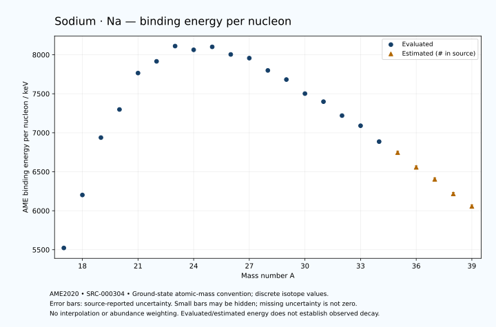

# Sodium — Atomic Masses and Reaction Energies

<!-- generated-by: sync-ame2020.mjs -->

**Dated evaluated data · scientific coverage remains partial.** 23 ground-state nuclides from AME2020. Values and uncertainties are transcribed from the retained unrounded analysis files; estimated quantities remain labelled.

- [Parent Sodium record](0011-Sodium-Na.md) · [NUBASE states and decays](0011-Sodium-Na-Nuclear-Evaluation.md)
- [Structured data](data/isotopes/0011-Sodium-Na-AME2020-Evaluation.yaml)
- [Original mass table](../../data/catalog/sources/ame2020-mass_1.mas20.txt) · [Original reaction table 1](../../data/catalog/sources/ame2020-rct1.mas20.txt) · [Original reaction table 2](../../data/catalog/sources/ame2020-rct2.mas20.txt)
- [AME2020 methods](https://doi.org/10.1088/1674-1137/abddb0) (SRC-000303) · [Tables and definitions](https://doi.org/10.1088/1674-1137/abddaf) (SRC-000304)

## Reading the data

All table energies and uncertainties are in keV; binding energy is per nucleon. A # replaces a decimal point in the original estimated value. UNKNOWN (*) retains the source's not-calculable entry; it is neither zero nor automatically NOT APPLICABLE. Source lines are one-based in the retained files. Uncertainties remain those published by the evaluation, with no replacement by independent-mass quadrature.

Atomic-mass conventions apply. Qα is total decay energy, not alpha-particle kinetic energy. Positive Q alone does not establish a decay branch, rate or observation. He-4's source Qα of zero is a bookkeeping identity. These tables describe ground-state combinations, not isomer or excited-daughter transitions. Nuclear state and daughter lookups are explicit in the structured companion. The binding quantity follows [Z M(¹H) + N mₙ − M(A,Z)]c²/A; it has not been converted to a bare-nucleus convention.

## Mass and binding table

| Nuclide | N | Atomic mass excess / keV | AME binding per nucleon / keV | Mass-file line |
|---|---:|---|---|---:|
| Na-17 | 6 | 34719.580 ± 59.616 | 5522.7653 ± 3.5068 | 121 |
| Na-18 | 7 | 25037.992 ± 93.881 | 6202.2176 ± 5.2156 | 128 |
| Na-19 | 8 | 12929.384 ± 10.535 | 6937.8864 ± 0.5545 | 135 |
| Na-20 | 9 | 6850.489 ± 1.109 | 7298.5028 ± 0.0554 | 143 |
| Na-21 | 10 | -2184.857 ± 0.042 | 7765.5581 ± 0.0020 | 151 |
| Na-22 | 11 | -5181.391 ± 0.132 | 7915.6624 ± 0.0060 | 159 |
| Na-23 | 12 | -9529.85352 ± 0.00181 | 8111.4936 ± 0.0002 | 168 |
| Na-24 | 13 | -8417.901 ± 0.017 | 8063.4882 ± 0.0007 | 176 |
| Na-25 | 14 | -9357.814 ± 1.200 | 8101.3979 ± 0.0480 | 185 |
| Na-26 | 15 | -6860.780 ± 3.502 | 8004.2013 ± 0.1347 | 193 |
| Na-27 | 16 | -5517.791 ± 3.726 | 7956.9467 ± 0.1380 | 202 |
| Na-28 | 17 | -988.315 ± 10.246 | 7799.2644 ± 0.3659 | 211 |
| Na-29 | 18 | 2679.994 ± 7.337 | 7682.1522 ± 0.2530 | 220 |
| Na-30 | 19 | 8474.670 ± 4.727 | 7501.9685 ± 0.1576 | 230 |
| Na-31 | 20 | 12246.031 ± 13.972 | 7398.6778 ± 0.4507 | 240 |
| Na-32 | 21 | 18640.152 ± 37.260 | 7219.8815 ± 1.1644 | 250 |
| Na-33 | 22 | 23780.113 ± 449.912 | 7089.9262 ± 13.6337 | 260 |
| Na-34 | 23 | 31680.114 ± 599.416 | 6886.4377 ± 17.6299 | 271 |
| Na-35 | 24 | 37831# ± 670# | 6745# ± 19# | 281 |
| Na-36 | 25 | 45903# ± 687# | 6557# ± 19# | 292 |
| Na-37 | 26 | 53134# ± 687# | 6403# ± 19# | 303 |
| Na-38 | 27 | 61905# ± 715# | 6216# ± 19# | 315 |
| Na-39 | 28 | 69977# ± 743# | 6056# ± 19# | 327 |

## Q-values and separation energies

| Nuclide | Qβ− / keV | Qα / keV | S₂n / keV | S₂p / keV | Reaction-file line |
|---|---|---|---|---|---:|
| Na-17 | UNKNOWN (*) | -9735# ± 504# | UNKNOWN (*) | -3574.8854 ± 61.2374 | 120 |
| Na-18 | UNKNOWN (*) | -9351.3267 ± 102.4911 | UNKNOWN (*) | 215.1321 ± 94.0343 | 127 |
| Na-19 | -18909.0095 ± 60.9189 | -6062.2835 ± 17.5211 | 37932.8313 ± 60.5393 | 3600.2589 ± 10.5381 | 134 |
| Na-20 | -10627.2054 ± 2.1681 | -6249.6092 ± 5.4776 | 34330.1395 ± 93.8878 | 8600.5661 ± 1.2019 | 142 |
| Na-21 | -13088.7080 ± 0.7557 | -6561.4745 ± 0.2515 | 31256.8780 ± 10.5352 | 15275.3544 ± 0.0424 | 150 |
| Na-22 | -4781.4051 ± 0.1631 | -8479.4198 ± 0.4817 | 28174.5161 ± 1.1168 | 19741.8704 ± 0.1351 | 158 |
| Na-23 | -4056.1790 ± 0.0317 | -10467.3243 ± 0.0020 | 23487.6323 ± 0.0424 | 24060.1904 ± 1.8000 | 167 |
| Na-24 | 5515.6774 ± 0.0210 | -10825.3534 ± 0.0340 | 19379.1454 ± 0.1328 | 25789.2187 ± 12.3990 | 175 |
| Na-25 | 3834.9684 ± 1.2009 | -11735.1243 ± 2.1633 | 15970.5962 ± 1.2000 | 27221.0192 ± 33.3420 | 184 |
| Na-26 | 9353.7631 ± 3.5018 | -12079.0722 ± 12.8840 | 14585.5158 ± 3.5017 | 28983.2384 ± 97.7331 | 192 |
| Na-27 | 9068.8037 ± 3.7266 | -11227.9698 ± 33.5281 | 12302.6130 ± 3.9147 | 31429.8995 ± 96.5144 | 201 |
| Na-28 | 14031.6303 ± 10.2498 | -10957.7470 ± 98.2063 | 10270.1709 ± 10.8282 | 34240.9124 ± 107.5165 | 210 |
| Na-29 | 13292.3538 ± 7.3447 | -11079.0889 ± 96.7210 | 7944.8517 ± 8.2287 | 37031.4262 ± 120.4214 | 219 |
| Na-30 | 17356.0423 ± 4.9011 | -12624.9011 ± 107.1315 | 6679.6511 ± 11.2842 | 39507.0684 ± 120.4402 | 229 |
| Na-31 | 15368.1833 ± 14.3065 | -15312.3624 ± 121.0071 | 6576.5985 ± 15.7814 | 42482.1010 ± 525.5484 | 239 |
| Na-32 | 19469.0523 ± 37.4021 | -17188.5604 ± 125.9833 | 5977.1543 ± 37.5584 | 44898# ± 502# | 249 |
| Na-33 | 18817.2400 ± 449.9195 | -18794.9932 ± 691.6838 | 4608.5546 ± 450.1286 | 47641# ± 699# | 259 |
| Na-34 | 23356.7903 ± 599.4561 | -19705# ± 781# | 3102.6733 ± 600.5734 | UNKNOWN (*) | 270 |
| Na-35 | 22192# ± 723# | -21436# ± 857# | 2091# ± 807# | UNKNOWN (*) | 280 |
| Na-36 | 25523# ± 974# | UNKNOWN (*) | 1920# ± 335# | UNKNOWN (*) | 291 |
| Na-37 | 24923# ± 980# | UNKNOWN (*) | 840# ± 150# | UNKNOWN (*) | 302 |
| Na-38 | 27831# ± 875# | UNKNOWN (*) | 140# ± 292# | UNKNOWN (*) | 314 |
| Na-39 | 27201# ± 903# | UNKNOWN (*) | -700# ± 283# | UNKNOWN (*) | 326 |

## Additional decay-energy combinations

| Nuclide | Q₂β− / keV | Q₄β− / keV | Qεp / keV | Qβ−n / keV | Part 1 / part 2 line |
|---|---|---|---|---|---|
| Na-17 | UNKNOWN (*) | UNKNOWN (*) | 16755.4268 ± 59.8565 | UNKNOWN (*) | 120 / 123 |
| Na-18 | UNKNOWN (*) | UNKNOWN (*) | 15797.3195 ± 93.8816 | UNKNOWN (*) | 127 / 130 |
| Na-19 | UNKNOWN (*) | UNKNOWN (*) | 4767.3009 ± 10.5453 | UNKNOWN (*) | 134 / 137 |
| Na-20 | UNKNOWN (*) | UNKNOWN (*) | 1048.9626 ± 1.1090 | -33059.2235 ± 60.0113 | 142 / 145 |
| Na-21 | -29275# ± 600# | UNKNOWN (*) | -9456.3652 ± 0.0517 | -27733.8694 ± 1.8635 | 150 / 153 |
| Na-22 | -23383# ± 401# | UNKNOWN (*) | -12422.7573 ± 1.8048 | -24156.5602 ± 0.7659 | 158 / 161 |
| Na-23 | -16277.9246 ± 0.3447 | UNKNOWN (*) | -19612.2004 ± 12.3990 | -17201.1852 ± 0.1593 | 167 / 170 |
| Na-24 | -8369.0886 ± 0.2285 | -42438# ± 500# | -18992.1352 ± 33.3204 | -11015.5442 ± 0.0357 | 175 / 178 |
| Na-25 | -441.8397 ± 1.2017 | -29548# ± 400# | -24191.3006 ± 97.6777 | -3495.5535 ± 1.2001 | 184 / 188 |
| Na-26 | 5349.3590 ± 3.5023 | -17834# ± 196# | -25483.9183 ± 96.5059 | -1739.3165 ± 3.5020 | 192 / 196 |
| Na-27 | 11679.0731 ± 3.7260 | -4858.7582 ± 9.7415 | -31481.4166 ± 107.0920 | 2625.4350 ± 3.7264 | 201 / 205 |
| Na-28 | 15862.4042 ± 10.2466 | 6159.5412 ± 10.3105 | -33410.7642 ± 120.6337 | 5526.9609 ± 10.2465 | 210 / 214 |
| Na-29 | 20887.7562 ± 7.3447 | 19632.8429 ± 7.3454 | -38012.7732 ± 120.5708 | 9628.6213 ± 7.3412 | 219 / 223 |
| Na-30 | 24338.7863 ± 5.1079 | 28675.5257 ± 4.7274 | -38964.4916 ± 525.3839 | 11015.7117 ± 4.7395 | 229 / 233 |
| Na-31 | 27196.7402 ± 14.1501 | 36686.5759 ± 13.9724 | -44003# ± 500# | 13056.0859 ± 14.0323 | 239 / 243 |
| Na-32 | 29739.5200 ± 37.9438 | 42945.0279 ± 37.2598 | -45492# ± 536# | 13690.9853 ± 37.3863 | 249 / 253 |
| Na-33 | 32277.4950 ± 449.9659 | 50117.4633 ± 449.9130 | UNKNOWN (*) | 16537.6956 ± 449.9235 | 259 / 264 |
| Na-34 | 34677.7331 ± 599.4201 | 56228.8160 ± 599.4170 | UNKNOWN (*) | 18645.9235 ± 599.4224 | 270 / 275 |
| Na-35 | 38055# ± 670# | 62689# ± 670# | UNKNOWN (*) | 21437# ± 670# | 280 / 285 |
| Na-36 | 39952# ± 703# | 66154# ± 687# | UNKNOWN (*) | 22192# ± 738# | 291 / 296 |
| Na-37 | 43325# ± 710# | 72130# ± 688# | UNKNOWN (*) | 24683# ± 974# | 302 / 307 |
| Na-38 | 45436# ± 731# | 76527# ± 719# | UNKNOWN (*) | 25623# ± 1000# | 314 / 319 |
| Na-39 | 48487# ± 801# | 82751# ± 751# | UNKNOWN (*) | 27831# ± 897# | 326 / 332 |

## Single-nucleon separation and reaction energies

| Nuclide | Sₙ / keV | Sₚ / keV | Q(d,α) / keV | Q(p,α) / keV | Q(n,α) / keV | Part 2 line |
|---|---|---|---|---|---|---:|
| Na-17 | UNKNOWN (*) | -3443.8336 ± 63.0353 | 5215.0130 ± 89.4470 | UNKNOWN (*) | 8401.5792 ± 72.4208 | 123 |
| Na-18 | 17752.9059 ± 111.2102 | -1248.5688 ± 93.8810 | 11762.0238 ± 96.0891 | -10313.3267 ± 115.1540 | 14117.6419 ± 94.9194 | 130 |
| Na-19 | 20179.9254 ± 94.4705 | -322.7961 ± 10.5385 | 7139.7395 ± 10.5411 | -6193.3353 ± 23.0308 | 7900.6049 ± 11.8222 | 137 |
| Na-20 | 14150.2140 ± 10.5934 | 2190.5361 ± 1.1205 | 12243.6782 ± 1.1670 | -4785.9083 ± 1.1642 | 10545.1894 ± 1.1363 | 145 |
| Na-21 | 17106.6639 ± 1.1098 | 2431.8963 ± 0.0423 | 6773.8961 ± 0.1656 | -2638.4195 ± 0.3658 | 2588.4323 ± 0.4652 | 153 |
| Na-22 | 11067.8522 ± 0.1384 | 6738.5862 ± 0.1373 | 12571.3477 ± 0.1318 | -2069.3898 ± 0.2071 | 1952.4558 ± 0.1318 | 161 |
| Na-23 | 12419.7801 ± 0.1318 | 8794.1088 ± 0.0178 | 6912.7299 ± 0.0385 | 2376.1338 ± 0.0024 | -3865.9881 ± 0.0298 | 170 |
| Na-24 | 6959.3653 ± 0.0165 | 10552.8268 ± 0.1057 | 10317.6221 ± 0.0242 | 2177.9309 ± 0.0419 | -2723.8933 ± 1.8001 | 178 |
| Na-25 | 9011.2310 ± 1.2001 | 10695.1423 ± 1.3049 | 6507.0384 ± 1.2045 | 3530.9573 ± 1.2001 | -6504.7873 ± 12.4569 | 188 |
| Na-26 | 5574.2849 ± 3.7016 | 12114.2485 ± 29.2556 | 9801.6690 ± 3.5390 | 3157.3198 ± 3.5032 | -4499.6416 ± 33.5039 | 196 |
| Na-27 | 6728.3282 ± 5.1134 | 13287.8752 ± 18.8017 | 7228.5194 ± 29.2834 | 5297.9071 ± 3.7614 | -7415.9042 ± 97.7414 | 205 |
| Na-28 | 3541.8428 ± 10.9030 | 15328.1963 ± 91.3468 | 9241.3782 ± 21.0857 | 5911.2429 ± 30.7997 | -6676.0799 ± 96.9852 | 214 |
| Na-29 | 4403.0090 ± 12.6022 | 15908.7153 ± 126.2809 | 6339.8909 ± 91.0663 | 7062.9355 ± 19.8354 | -10348.2590 ± 107.2783 | 223 |
| Na-30 | 2276.6421 ± 8.7275 | 17214.1043 ± 149.5795 | 7885.7387 ± 126.1562 | 6287.8150 ± 90.8933 | -11012.4060 ± 120.2906 | 233 |
| Na-31 | 4299.9564 ± 14.7503 | 18323.0595 ± 253.6356 | 4557.0355 ± 150.1563 | 5810.3485 ± 126.8395 | -15511.3624 ± 121.1558 | 243 |
| Na-32 | 1677.1979 ± 39.7934 | 19830.4134 ± 268.7903 | 6070.8387 ± 255.9768 | 5104.4037 ± 154.0778 | -15863.6366 ± 526.6823 | 253 |
| Na-33 | 2931.3567 ± 451.4519 | 20508# ± 675# | 3309.3261 ± 522.7623 | 5364.0482 ± 516.2909 | -19534# ± 673# | 264 |
| Na-34 | 171.3166 ± 749.4802 | 21739# ± 848# | 5392# ± 783# | 5362.5757 ± 655.8659 | -19516# ± 803# | 275 |
| Na-35 | 1920# ± 300# | 22299# ± 844# | 2412# ± 900# | 5697# ± 838# | UNKNOWN (*) | 285 |
| Na-36 | -0# ± 150# | UNKNOWN (*) | 3772# ± 857# | 4636# ± 912# | UNKNOWN (*) | 296 |
| Na-37 | 840# ± 212# | UNKNOWN (*) | UNKNOWN (*) | 5157# ± 857# | UNKNOWN (*) | 307 |
| Na-38 | -700# ± 200# | UNKNOWN (*) | UNKNOWN (*) | UNKNOWN (*) | UNKNOWN (*) | 319 |
| Na-39 | -0# ± 200# | UNKNOWN (*) | UNKNOWN (*) | UNKNOWN (*) | UNKNOWN (*) | 332 |

Qβ− comes from the mass-file line in the first table. Qα, S₂n, S₂p, Q₂β−, Qεp and Qβ−n come from reaction part 1; Q₄β− and the last table come from part 2. Qεp is electron-capture/proton energy balance; Qβ−n is beta-minus/neutron energy balance. These are evaluated mass combinations, not observations of decay modes, cross sections or reaction rates. Light-nuclide zero entries can be bookkeeping identities, without a physical A=0 residual. Definitions and original source strings are retained in the structured data.

## Binding-energy chart

Discrete source values and source-reported uncertainties. No interpolation, natural-abundance weighting or observed-decay claim is implied. This quantitative chart supplements the 22 separate illustrative panels.

## Remaining review

Later measurements, state-specific decay branches, isomer Q-values, reaction rates, applicability and full claim-level review remain open. Existing authored values retain their own provenance; this companion does not overwrite them.
