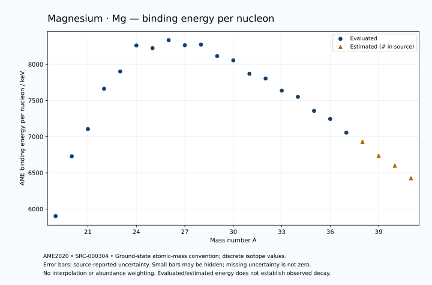

# Magnesium — Atomic Masses and Reaction Energies

<!-- generated-by: sync-ame2020.mjs -->

**Dated evaluated data · scientific coverage remains partial.** 23 ground-state nuclides from AME2020. Values and uncertainties are transcribed from the retained unrounded analysis files; estimated quantities remain labelled.

- [Parent Magnesium record](0012-Magnesium-Mg.md) · [NUBASE states and decays](0012-Magnesium-Mg-Nuclear-Evaluation.md)
- [Structured data](data/isotopes/0012-Magnesium-Mg-AME2020-Evaluation.yaml)
- [Original mass table](../../data/catalog/sources/ame2020-mass_1.mas20.txt) · [Original reaction table 1](../../data/catalog/sources/ame2020-rct1.mas20.txt) · [Original reaction table 2](../../data/catalog/sources/ame2020-rct2.mas20.txt)
- [AME2020 methods](https://doi.org/10.1088/1674-1137/abddb0) (SRC-000303) · [Tables and definitions](https://doi.org/10.1088/1674-1137/abddaf) (SRC-000304)

## Reading the data

All table energies and uncertainties are in keV; binding energy is per nucleon. A # replaces a decimal point in the original estimated value. UNKNOWN (*) retains the source's not-calculable entry; it is neither zero nor automatically NOT APPLICABLE. Source lines are one-based in the retained files. Uncertainties remain those published by the evaluation, with no replacement by independent-mass quadrature.

Atomic-mass conventions apply. Qα is total decay energy, not alpha-particle kinetic energy. Positive Q alone does not establish a decay branch, rate or observation. He-4's source Qα of zero is a bookkeeping identity. These tables describe ground-state combinations, not isomer or excited-daughter transitions. Nuclear state and daughter lookups are explicit in the structured companion. The binding quantity follows [Z M(¹H) + N mₙ − M(A,Z)]c²/A; it has not been converted to a bare-nucleus convention.

## Mass and binding table

| Nuclide | N | Atomic mass excess / keV | AME binding per nucleon / keV | Mass-file line |
|---|---:|---|---|---:|
| Mg-19 | 7 | 31838.394 ± 60.001 | 5901.4992 ± 3.1579 | 136 |
| Mg-20 | 8 | 17477.694 ± 1.863 | 6728.0252 ± 0.0931 | 144 |
| Mg-21 | 9 | 10903.851 ± 0.755 | 7105.0317 ± 0.0359 | 152 |
| Mg-22 | 10 | -399.986 ± 0.159 | 7662.7645 ± 0.0072 | 160 |
| Mg-23 | 11 | -5473.675 ± 0.032 | 7901.1229 ± 0.0014 | 169 |
| Mg-24 | 12 | -13933.578 ± 0.013 | 8260.7103 ± 0.0006 | 177 |
| Mg-25 | 13 | -13192.782 ± 0.047 | 8223.5028 ± 0.0019 | 186 |
| Mg-26 | 14 | -16214.544 ± 0.029 | 8333.8711 ± 0.0011 | 194 |
| Mg-27 | 15 | -14586.594 ± 0.047 | 8263.8525 ± 0.0018 | 203 |
| Mg-28 | 16 | -15019.946 ± 0.261 | 8272.4531 ± 0.0093 | 212 |
| Mg-29 | 17 | -10612.360 ± 0.345 | 8113.5317 ± 0.0119 | 221 |
| Mg-30 | 18 | -8881.373 ± 1.295 | 8054.4250 ± 0.0432 | 231 |
| Mg-31 | 19 | -3122.152 ± 3.074 | 7869.1886 ± 0.0992 | 241 |
| Mg-32 | 20 | -828.901 ± 3.260 | 7803.8411 ± 0.1019 | 251 |
| Mg-33 | 21 | 4962.873 ± 2.663 | 7636.4382 ± 0.0807 | 261 |
| Mg-34 | 22 | 8323.324 ± 6.893 | 7550.3919 ± 0.2027 | 272 |
| Mg-35 | 23 | 15639.786 ± 269.668 | 7356.2338 ± 7.7048 | 282 |
| Mg-36 | 24 | 20380.159 ± 690.237 | 7244.4202 ± 19.1733 | 293 |
| Mg-37 | 25 | 28211.478 ± 698.947 | 7055.1115 ± 18.8905 | 304 |
| Mg-38 | 26 | 34074# ± 503# | 6928# ± 13# | 316 |
| Mg-39 | 27 | 42775# ± 513# | 6734# ± 13# | 328 |
| Mg-40 | 28 | 49550# ± 500# | 6598# ± 13# | 340 |
| Mg-41 | 29 | 58100# ± 500# | 6425# ± 12# | 352 |

## Q-values and separation energies

| Nuclide | Qβ− / keV | Qα / keV | S₂n / keV | S₂p / keV | Reaction-file line |
|---|---|---|---|---|---:|
| Mg-19 | UNKNOWN (*) | -10801.8956 ± 89.7044 | UNKNOWN (*) | -759.9999 ± 60.0000 | 135 |
| Mg-20 | UNKNOWN (*) | -8933.9970 ± 20.5646 | UNKNOWN (*) | 2417.8656 ± 1.8981 | 143 |
| Mg-21 | -16186# ± 600# | -8021.5172 ± 0.8335 | 37077.1795 ± 60.0058 | 5426.1450 ± 0.7713 | 151 |
| Mg-22 | -18601# ± 401# | -8142.5196 ± 0.3967 | 34020.3164 ± 1.8698 | 7935.9963 ± 0.1593 | 159 |
| Mg-23 | -12221.7457 ± 0.3461 | -9650.6440 ± 0.1632 | 32520.1613 ± 0.7552 | 14319.8403 ± 0.0499 | 168 |
| Mg-24 | -13884.7660 ± 0.2282 | -9316.5618 ± 0.0130 | 29676.2279 ± 0.1597 | 20486.8045 ± 0.0219 | 176 |
| Mg-25 | -4276.8080 ± 0.0447 | -9885.9215 ± 0.0607 | 23861.7435 ± 0.0566 | 22616.6791 ± 0.1145 | 185 |
| Mg-26 | -4004.4042 ± 0.0629 | -10614.7437 ± 0.0342 | 18423.6016 ± 0.0314 | 24840.8433 ± 0.5135 | 193 |
| Mg-27 | 2610.2694 ± 0.0669 | -11857.4651 ± 0.1146 | 17536.4483 ± 0.0584 | 27129.0334 ± 29.0454 | 202 |
| Mg-28 | 1830.7740 ± 0.2653 | -11493.2190 ± 0.5752 | 14948.0381 ± 0.2625 | 30079.0012 ± 18.4306 | 211 |
| Mg-29 | 7595.4023 ± 0.4873 | -11001.7729 ± 29.0474 | 12168.4019 ± 0.3477 | 32241.2121 ± 90.7709 | 220 |
| Mg-30 | 6982.7440 ± 2.3287 | -11787.4020 ± 18.4742 | 10004.0631 ± 1.3209 | 34759.0528 ± 126.0743 | 230 |
| Mg-31 | 11828.5569 ± 3.8009 | -12597.9777 ± 90.8223 | 8652.4280 ± 3.0932 | 36099.8970 ± 149.5364 | 240 |
| Mg-32 | 10270.4677 ± 7.8787 | -14553.5547 ± 126.1098 | 8090.1643 ± 3.5080 | 38686.9628 ± 253.2715 | 250 |
| Mg-33 | 13460.2550 ± 7.4767 | -15861.8460 ± 149.5285 | 8057.6114 ± 4.0673 | 40796.6632 ± 266.2086 | 260 |
| Mg-34 | 11320.9428 ± 7.2072 | -17381.7116 ± 253.3443 | 6990.4113 ± 7.6252 | 43254# ± 503# | 271 |
| Mg-35 | 15863.5156 ± 269.7679 | -17966.7238 ± 378.9202 | 5465.7230 ± 269.6807 | 45069# ± 658# | 281 |
| Mg-36 | 14429.7751 ± 706.2429 | -19044# ± 854# | 4085.8008 ± 690.2715 | 47039# ± 860# | 292 |
| Mg-37 | 18401.9132 ± 721.8139 | -20344# ± 921# | 3570.9445 ± 749.1648 | UNKNOWN (*) | 303 |
| Mg-38 | 17604# ± 525# | -21192# ± 718# | 2449# ± 854# | UNKNOWN (*) | 315 |
| Mg-39 | 21286# ± 594# | UNKNOWN (*) | 1579# ± 867# | UNKNOWN (*) | 327 |
| Mg-40 | 20729# ± 583# | UNKNOWN (*) | 667# ± 709# | UNKNOWN (*) | 339 |
| Mg-41 | 23510# ± 640# | UNKNOWN (*) | 818# ± 716# | UNKNOWN (*) | 351 |

## Additional decay-energy combinations

| Nuclide | Q₂β− / keV | Q₄β− / keV | Qεp / keV | Qβ−n / keV | Part 1 / part 2 line |
|---|---|---|---|---|---|
| Mg-19 | UNKNOWN (*) | UNKNOWN (*) | 19231.8055 ± 60.0021 | UNKNOWN (*) | 135 / 138 |
| Mg-20 | UNKNOWN (*) | UNKNOWN (*) | 8436.6693 ± 1.8699 | UNKNOWN (*) | 143 / 146 |
| Mg-21 | UNKNOWN (*) | UNKNOWN (*) | 10656.8117 ± 0.7545 | UNKNOWN (*) | 151 / 154 |
| Mg-22 | -34040# ± 500# | UNKNOWN (*) | -1957.1810 ± 0.1638 | -35561# ± 600# | 159 / 162 |
| Mg-23 | -29423# ± 500# | UNKNOWN (*) | -4737.9299 ± 0.0363 | -31746# ± 401# | 168 / 171 |
| Mg-24 | -24678.7638 ± 19.4721 | UNKNOWN (*) | -16068.5042 ± 0.1052 | -28752.9673 ± 0.3449 | 176 / 179 |
| Mg-25 | -17020.1037 ± 10.0001 | UNKNOWN (*) | -14530.1107 ± 0.5148 | -21215.2879 ± 0.2326 | 185 / 189 |
| Mg-26 | -9073.5403 ± 0.1057 | -43895# ± 600# | -21468.0117 ± 29.0453 | -15369.8877 ± 0.0629 | 193 / 197 |
| Mg-27 | -2202.0889 ± 0.1173 | -32078# ± 400# | -22356.6788 ± 18.4288 | -10447.7728 ± 0.0737 | 202 / 206 |
| Mg-28 | 6472.8516 ± 0.2608 | -19093.1484 ± 160.0002 | -29359.8266 ± 90.7706 | -5894.4000 ± 0.2651 | 211 / 215 |
| Mg-29 | 11282.7215 ± 0.3445 | -7517.9366 ± 13.0455 | -29201.0692 ± 126.0681 | -1832.9586 ± 0.3479 | 220 / 224 |
| Mg-30 | 15551.5899 ± 1.2951 | 5177.8819 ± 1.3112 | -34570.1466 ± 149.5104 | 1255.0717 ± 1.3400 | 230 / 234 |
| Mg-31 | 19826.8855 ± 3.0742 | 15920.3796 ± 3.0825 | -33691.2428 ± 253.2691 | 4670.6466 ± 3.6325 | 240 / 244 |
| Mg-32 | 23248.7884 ± 3.2738 | 25186.6364 ± 3.2602 | -39299.4657 ± 266.2153 | 6050.4899 ± 3.9531 | 250 / 254 |
| Mg-33 | 25477.2009 ± 2.7535 | 31548.7312 ± 2.6634 | -39325# ± 503# | 7990.9232 ± 7.6510 | 260 / 265 |
| Mg-34 | 28315.0081 ± 6.9394 | 38255.0136 ± 6.8932 | -45096# ± 600# | 8749.3881 ± 9.8143 | 271 / 276 |
| Mg-35 | 30031.2661 ± 272.0411 | 44485.9958 ± 269.6675 | -44491# ± 579# | 10566.0866 ± 269.6758 | 281 / 286 |
| Mg-36 | 32816.2848 ± 693.9612 | 51044.3004 ± 690.2372 | UNKNOWN (*) | 12532.5711 ± 690.2764 | 292 / 297 |
| Mg-37 | 34782.9897 ± 708.1524 | 55107.9034 ± 698.9473 | UNKNOWN (*) | 14189.7752 ± 714.7580 | 303 / 308 |
| Mg-38 | 38244# ± 514# | 60935# ± 503# | UNKNOWN (*) | 16193# ± 534# | 315 / 320 |
| Mg-39 | 40455# ± 530# | 65938# ± 515# | UNKNOWN (*) | 18234# ± 534# | 327 / 333 |
| Mg-40 | 43883# ± 515# | 72388# ± 500# | UNKNOWN (*) | 19989# ± 583# | 339 / 345 |
| Mg-41 | 44900# ± 583# | 77109# ± 500# | UNKNOWN (*) | 21208# ± 583# | 351 / 357 |

## Single-nucleon separation and reaction energies

| Nuclide | Sₙ / keV | Sₚ / keV | Q(d,α) / keV | Q(p,α) / keV | Q(n,α) / keV | Part 2 line |
|---|---|---|---|---|---|---:|
| Mg-19 | UNKNOWN (*) | 488.5689 ± 111.4165 | 7829.6213 ± 84.5822 | UNKNOWN (*) | 13498.0211 ± 63.4000 | 138 |
| Mg-20 | 22432.0181 ± 60.0300 | 2740.6616 ± 10.6986 | 3150.5091 ± 93.8997 | -12377.8305 ± 59.6447 | 6623.6442 ± 1.8964 | 146 |
| Mg-21 | 14645.1614 ± 2.0100 | 3235.6089 ± 1.3413 | 8685.2732 ± 10.5621 | -9270.0860 ± 93.8843 | 11232.6355 ± 0.8375 | 154 |
| Mg-22 | 19375.1551 ± 0.7711 | 5504.1000 ± 0.1648 | 3460.3322 ± 1.1204 | -8465.3156 ± 10.5363 | 3494.3623 ± 0.2256 | 162 |
| Mg-23 | 13145.0063 ± 0.1624 | 7581.2541 ± 0.1355 | 7421.9898 ± 0.0529 | -7460.1079 ± 1.1094 | 7214.6598 ± 0.0318 | 171 |
| Mg-24 | 16531.2216 ± 0.0343 | 11692.6957 ± 0.0130 | 1958.6204 ± 0.1323 | -6884.6656 ± 0.0443 | -2555.3996 ± 0.0406 | 179 |
| Mg-25 | 7330.5219 ± 0.0471 | 12063.8523 ± 0.0497 | 7047.8786 ± 0.0469 | -3147.3353 ± 0.1398 | 478.3360 ± 0.0501 | 189 |
| Mg-26 | 11093.0797 ± 0.0443 | 14145.7010 ± 1.2004 | 2914.1642 ± 0.0336 | -1820.6349 ± 0.0293 | -5414.0964 ± 0.1084 | 197 |
| Mg-27 | 6443.3687 ± 0.0388 | 15014.7848 ± 3.5020 | 5482.0265 ± 1.2009 | -1304.6383 ± 0.0500 | -2988.5496 ± 0.5149 | 206 |
| Mg-28 | 8504.6694 ± 0.2651 | 16791.1261 ± 3.7354 | 2551.6419 ± 3.5113 | -798.0767 ± 1.2280 | -7338.0404 ± 29.0465 | 215 |
| Mg-29 | 3663.7325 ± 0.4321 | 16913.0158 ± 10.2522 | 5616.2376 ± 3.7422 | 1112.4756 ± 3.5186 | -5447.0714 ± 18.4320 | 224 |
| Mg-30 | 6340.3306 ± 1.3399 | 18850.3374 ± 7.4500 | 2817.7497 ± 10.3279 | 1500.4732 ± 3.9449 | -10285.8803 ± 90.7795 | 234 |
| Mg-31 | 2312.0974 ± 3.3355 | 18885.7927 ± 5.6386 | 4908.6613 ± 7.9545 | 2730.2186 ± 10.6976 | -8775.4878 ± 126.1051 | 244 |
| Mg-32 | 5778.0669 ± 4.4809 | 20363.9032 ± 14.3477 | 1407.2365 ± 5.7423 | 1355.1606 ± 8.0284 | -13582.3015 ± 149.5403 | 254 |
| Mg-33 | 2279.5444 ± 4.2098 | 20966.2497 ± 37.3548 | 3427.6485 ± 14.2240 | 1352.2583 ± 5.4257 | -12670.8448 ± 253.2645 | 265 |
| Mg-34 | 4710.8668 ± 7.3897 | 22745.7599 ± 449.9645 | 393.9796 ± 37.8920 | 941.3479 ± 15.5802 | -17211.8676 ± 266.2845 | 276 |
| Mg-35 | 754.8562 ± 269.7556 | 23329.2995 ± 657.2828 | 2570.4801 ± 524.5389 | 1863.6896 ± 272.2295 | -15713# ± 571# | 286 |
| Mg-36 | 3330.9446 ± 741.0451 | 24740# ± 962# | -589.1479 ± 914.1813 | 1464.1017 ± 823.9222 | -20104# ± 914# | 297 |
| Mg-37 | 240.0000 ± 110.0000 | 24980# ± 980# | 1091# ± 968# | 1395.4183 ± 920.7754 | -18984# ± 867# | 308 |
| Mg-38 | 2209# ± 861# | 26349# ± 851# | -1118# ± 851# | 1107# ± 838# | UNKNOWN (*) | 320 |
| Mg-39 | -630# ± 100# | 26419# ± 880# | 352# ± 857# | 1737# ± 857# | UNKNOWN (*) | 333 |
| Mg-40 | 1297# ± 716# | 27716# ± 896# | -1645# ± 873# | 1280# ± 850# | UNKNOWN (*) | 345 |
| Mg-41 | -479# ± 707# | UNKNOWN (*) | -1166# ± 896# | 1059# ± 873# | UNKNOWN (*) | 357 |

Qβ− comes from the mass-file line in the first table. Qα, S₂n, S₂p, Q₂β−, Qεp and Qβ−n come from reaction part 1; Q₄β− and the last table come from part 2. Qεp is electron-capture/proton energy balance; Qβ−n is beta-minus/neutron energy balance. These are evaluated mass combinations, not observations of decay modes, cross sections or reaction rates. Light-nuclide zero entries can be bookkeeping identities, without a physical A=0 residual. Definitions and original source strings are retained in the structured data.

## Binding-energy chart

Discrete source values and source-reported uncertainties. No interpolation, natural-abundance weighting or observed-decay claim is implied. This quantitative chart supplements the 22 separate illustrative panels.

## Remaining review

Later measurements, state-specific decay branches, isomer Q-values, reaction rates, applicability and full claim-level review remain open. Existing authored values retain their own provenance; this companion does not overwrite them.
