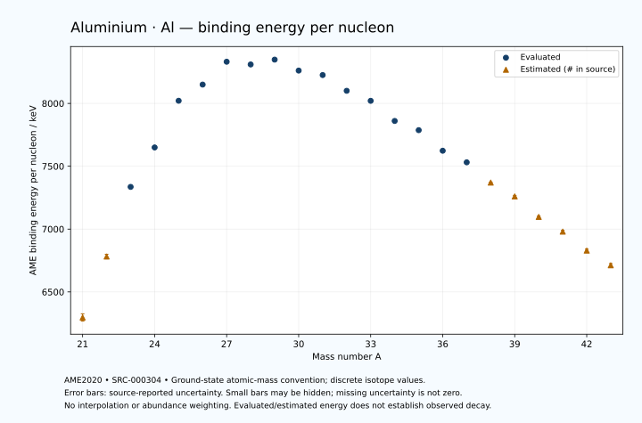

# Aluminium — Atomic Masses and Reaction Energies

<!-- generated-by: sync-ame2020.mjs -->

**Dated evaluated data · scientific coverage remains partial.** 23 ground-state nuclides from AME2020. Values and uncertainties are transcribed from the retained unrounded analysis files; estimated quantities remain labelled.

- [Parent Aluminium record](0013-Aluminium-Al.md) · [NUBASE states and decays](0013-Aluminium-Al-Nuclear-Evaluation.md)
- [Structured data](data/isotopes/0013-Aluminium-Al-AME2020-Evaluation.yaml)
- [Original mass table](../../data/catalog/sources/ame2020-mass_1.mas20.txt) · [Original reaction table](../../data/catalog/sources/ame2020-rct1.mas20.txt)
- [AME2020 methods](https://doi.org/10.1088/1674-1137/abddb0) (SRC-000303) · [Tables and definitions](https://doi.org/10.1088/1674-1137/abddaf) (SRC-000304)

## Reading the data

All table energies and uncertainties are in keV; binding energy is per nucleon. A # replaces a decimal point in the original estimated value. UNKNOWN (*) retains the source's not-calculable entry; it is neither zero nor automatically NOT APPLICABLE. Source lines are one-based in the retained files. Uncertainties remain those published by the evaluation, with no replacement by independent-mass quadrature.

Atomic-mass conventions apply. Qα is total decay energy, not alpha-particle kinetic energy. Positive Q alone does not establish a decay branch, rate or observation. He-4's source Qα of zero is a bookkeeping identity. These tables describe ground-state combinations, not isomer or excited-daughter transitions. Nuclear state and daughter lookups are explicit in the structured companion. The binding quantity follows [Z M(¹H) + N mₙ − M(A,Z)]c²/A; it has not been converted to a bare-nucleus convention.

## Mass and binding table

| Nuclide | N | Atomic mass excess / keV | AME binding per nucleon / keV | Mass-file line |
|---|---:|---|---|---:|
| Al-21 | 8 | 27090# ± 600# | 6297# ± 29# | 153 |
| Al-22 | 9 | 18201# ± 401# | 6782# ± 18# | 161 |
| Al-23 | 10 | 6748.071 ± 0.345 | 7335.7275 ± 0.0150 | 170 |
| Al-24 | 11 | -48.812 ± 0.228 | 7649.5806 ± 0.0095 | 178 |
| Al-25 | 12 | -8915.974 ± 0.065 | 8021.1366 ± 0.0026 | 187 |
| Al-26 | 13 | -12210.139 ± 0.066 | 8149.7653 ± 0.0026 | 195 |
| Al-27 | 14 | -17196.864 ± 0.047 | 8331.5533 ± 0.0018 | 204 |
| Al-28 | 15 | -16850.719 ± 0.049 | 8309.8969 ± 0.0018 | 213 |
| Al-29 | 16 | -18207.762 ± 0.345 | 8348.4647 ± 0.0119 | 222 |
| Al-30 | 17 | -15864.116 ± 1.936 | 8261.1049 ± 0.0645 | 232 |
| Al-31 | 18 | -14950.709 ± 2.236 | 8225.5180 ± 0.0721 | 242 |
| Al-32 | 19 | -11099.368 ± 7.173 | 8100.3449 ± 0.2241 | 252 |
| Al-33 | 20 | -8497.382 ± 6.986 | 8020.6172 ± 0.2117 | 262 |
| Al-34 | 21 | -2997.619 ± 2.105 | 7860.3506 ± 0.0619 | 273 |
| Al-35 | 22 | -223.730 ± 7.359 | 7787.1243 ± 0.2103 | 283 |
| Al-36 | 23 | 5950.384 ± 149.505 | 7623.5154 ± 4.1529 | 294 |
| Al-37 | 24 | 9809.564 ± 180.244 | 7531.3160 ± 4.8715 | 305 |
| Al-38 | 25 | 16470# ± 150# | 7370# ± 4# | 317 |
| Al-39 | 26 | 21490# ± 300# | 7260# ± 8# | 329 |
| Al-40 | 27 | 28820# ± 300# | 7097# ± 7# | 341 |
| Al-41 | 28 | 34590# ± 400# | 6980# ± 10# | 353 |
| Al-42 | 29 | 41990# ± 500# | 6829# ± 12# | 365 |
| Al-43 | 30 | 48270# ± 600# | 6712# ± 14# | 377 |

## Q-values and separation energies

| Nuclide | Qβ− / keV | Qα / keV | S₂n / keV | S₂p / keV | Reaction-file line |
|---|---|---|---|---|---:|
| Al-21 | UNKNOWN (*) | -10055# ± 603# | UNKNOWN (*) | 418# ± 600# | 152 |
| Al-22 | -15439# ± 641# | -9262# ± 411# | UNKNOWN (*) | 3227# ± 401# | 160 |
| Al-23 | -17202# ± 500# | -8606.2292 ± 10.5408 | 36484# ± 600# | 5645.0136 ± 0.3473 | 169 |
| Al-24 | -10793.9978 ± 19.4734 | -9324.2165 ± 1.1277 | 34393# ± 401# | 9445.3628 ± 0.2632 | 177 |
| Al-25 | -12743.2956 ± 10.0002 | -9156.0324 ± 0.0774 | 31806.6812 ± 0.3507 | 13964.0625 ± 0.0648 | 186 |
| Al-26 | -5069.1361 ± 0.0849 | -9453.6638 ± 0.1474 | 28303.9634 ± 0.2373 | 18370.1808 ± 0.0682 | 194 |
| Al-27 | -4812.3583 ± 0.0964 | -10091.9259 ± 0.0473 | 24423.5258 ± 0.0803 | 22416.9921 ± 1.2009 | 203 |
| Al-28 | 4642.0776 ± 0.0486 | -10857.7346 ± 0.0513 | 20783.2162 ± 0.0821 | 24567.8812 ± 3.5020 | 212 |
| Al-29 | 3687.3192 ± 0.3447 | -11274.8645 ± 1.2485 | 17153.5348 ± 0.3479 | 27267.9139 ± 3.7422 | 221 |
| Al-30 | 8568.8459 ± 1.9357 | -11428.2519 ± 4.0010 | 15156.0331 ± 1.9362 | 29453.7434 ± 10.4276 | 231 |
| Al-31 | 7998.3286 ± 2.2360 | -11857.8341 ± 4.3455 | 12885.5825 ± 2.2620 | 32208.6447 ± 7.6697 | 241 |
| Al-32 | 12978.3208 ± 7.1787 | -12535.9690 ± 12.5074 | 11377.8880 ± 7.4291 | 34151.9803 ± 8.5901 | 251 |
| Al-33 | 12016.9460 ± 7.0211 | -13602.2918 ± 10.1308 | 9689.3095 ± 7.3352 | 35321.3556 ± 15.6216 | 261 |
| Al-34 | 16994.0653 ± 2.2519 | -13897.2044 ± 5.1744 | 8040.8864 ± 7.4749 | 36215.7124 ± 37.3192 | 272 |
| Al-35 | 14167.7504 ± 36.6047 | -14894.6770 ± 15.7918 | 7868.9837 ± 10.1469 | 38581.7847 ± 449.9718 | 282 |
| Al-36 | 18386.5096 ± 165.8510 | -15114.6831 ± 154.0778 | 7194.6331 ± 149.5196 | 40307.6722 ± 617.7797 | 293 |
| Al-37 | 16381.0765 ± 213.1678 | -16395.4644 ± 484.6735 | 6109.3421 ± 180.3943 | 42600# ± 694# | 304 |
| Al-38 | 20640# ± 183# | -17635# ± 618# | 5623# ± 212# | 44011# ± 703# | 316 |
| Al-39 | 19169# ± 329# | -18767# ± 734# | 4463# ± 350# | 46222# ± 750# | 328 |
| Al-40 | 23154# ± 324# | -19507# ± 750# | 3792# ± 335# | 47663# ± 776# | 340 |
| Al-41 | 21390# ± 500# | -20969# ± 795# | 3042# ± 500# | 49965# ± 843# | 352 |
| Al-42 | 25150# ± 583# | -22340# ± 873# | 2973# ± 583# | UNKNOWN (*) | 364 |
| Al-43 | 23940# ± 721# | -24132# ± 955# | 2463# ± 721# | UNKNOWN (*) | 376 |

Qβ− comes from the mass-file line in the first table. The other three columns come from the reaction-file line. Definitions and original source strings are retained in the structured data.

## Binding-energy chart

Discrete source values and source-reported uncertainties. No interpolation, natural-abundance weighting or observed-decay claim is implied. This quantitative chart supplements the 22 separate illustrative panels.

## Remaining review

Later measurements, state-specific decay branches, isomer Q-values, additional reaction channels and full claim-level review remain open. Existing authored values retain their own provenance; this companion does not overwrite them.
