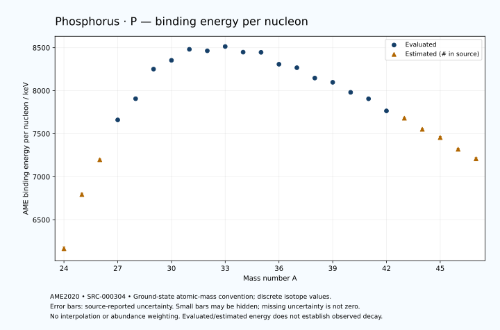

# Phosphorus — Atomic Masses and Reaction Energies

<!-- generated-by: sync-ame2020.mjs -->

**Dated evaluated data · scientific coverage remains partial.** 24 ground-state nuclides from AME2020. Values and uncertainties are transcribed from the retained unrounded analysis files; estimated quantities remain labelled.

- [Parent Phosphorus record](0015-Phosphorus-P.md) · [NUBASE states and decays](0015-Phosphorus-P-Nuclear-Evaluation.md)
- [Structured data](data/isotopes/0015-Phosphorus-P-AME2020-Evaluation.yaml)
- [Original mass table](../../data/catalog/sources/ame2020-mass_1.mas20.txt) · [Original reaction table 1](../../data/catalog/sources/ame2020-rct1.mas20.txt) · [Original reaction table 2](../../data/catalog/sources/ame2020-rct2.mas20.txt)
- [AME2020 methods](https://doi.org/10.1088/1674-1137/abddb0) (SRC-000303) · [Tables and definitions](https://doi.org/10.1088/1674-1137/abddaf) (SRC-000304)

## Reading the data

All table energies and uncertainties are in keV; binding energy is per nucleon. A # replaces a decimal point in the original estimated value. UNKNOWN (*) retains the source's not-calculable entry; it is neither zero nor automatically NOT APPLICABLE. Source lines are one-based in the retained files. Uncertainties remain those published by the evaluation, with no replacement by independent-mass quadrature.

Atomic-mass conventions apply. Qα is total decay energy, not alpha-particle kinetic energy. Positive Q alone does not establish a decay branch, rate or observation. He-4's source Qα of zero is a bookkeeping identity. These tables describe ground-state combinations, not isomer or excited-daughter transitions. Nuclear state and daughter lookups are explicit in the structured companion. The binding quantity follows [Z M(¹H) + N mₙ − M(A,Z)]c²/A; it has not been converted to a bare-nucleus convention.

## Mass and binding table

| Nuclide | N | Atomic mass excess / keV | AME binding per nucleon / keV | Mass-file line |
|---|---:|---|---|---:|
| P-24 | 9 | 34020# ± 500# | 6165# ± 21# | 180 |
| P-25 | 10 | 20190# ± 400# | 6794# ± 16# | 189 |
| P-26 | 11 | 10973# ± 196# | 7198# ± 8# | 197 |
| P-27 | 12 | -659.032 ± 9.001 | 7661.0894 ± 0.3334 | 206 |
| P-28 | 13 | -7147.856 ± 1.147 | 7907.4842 ± 0.0410 | 215 |
| P-29 | 14 | -16952.849 ± 0.359 | 8251.2368 ± 0.0124 | 224 |
| P-30 | 15 | -20200.856 ± 0.065 | 8353.5064 ± 0.0022 | 234 |
| P-31 | 16 | -24440.54442 ± 0.00075 | 8481.1677 ± 0.0002 | 244 |
| P-32 | 17 | -24304.876 ± 0.040 | 8464.1203 ± 0.0013 | 254 |
| P-33 | 18 | -26337.350 ± 1.090 | 8513.8073 ± 0.0330 | 264 |
| P-34 | 19 | -24548.702 ± 0.810 | 8448.1856 ± 0.0238 | 275 |
| P-35 | 20 | -24857.809 ± 1.866 | 8446.2496 ± 0.0533 | 285 |
| P-36 | 21 | -20251.045 ± 13.114 | 8307.8692 ± 0.3643 | 296 |
| P-37 | 22 | -18996.012 ± 37.948 | 8267.5561 ± 1.0256 | 307 |
| P-38 | 23 | -14621.565 ± 72.581 | 8147.2749 ± 1.9100 | 319 |
| P-39 | 24 | -12774.636 ± 112.645 | 8097.9701 ± 2.8883 | 331 |
| P-40 | 25 | -8139.189 ± 83.607 | 7981.4177 ± 2.0902 | 343 |
| P-41 | 26 | -4979.767 ± 120.163 | 7906.5513 ± 2.9308 | 355 |
| P-42 | 27 | 1091.842 ± 95.009 | 7765.9122 ± 2.2621 | 367 |
| P-43 | 28 | 5040# ± 300# | 7681# ± 7# | 379 |
| P-44 | 29 | 11110# ± 400# | 7552# ± 9# | 391 |
| P-45 | 30 | 15960# ± 500# | 7456# ± 11# | 403 |
| P-46 | 31 | 22840# ± 500# | 7320# ± 11# | 415 |
| P-47 | 32 | 28810# ± 600# | 7209# ± 13# | 427 |

## Q-values and separation energies

| Nuclide | Qβ− / keV | Qα / keV | S₂n / keV | S₂p / keV | Reaction-file line |
|---|---|---|---|---|---:|
| P-24 | UNKNOWN (*) | UNKNOWN (*) | UNKNOWN (*) | -1241# ± 641# | 179 |
| P-25 | UNKNOWN (*) | -9324# ± 721# | UNKNOWN (*) | 1136# ± 400# | 188 |
| P-26 | -16707# ± 631# | -9653# ± 446# | 39190# ± 537# | 3556# ± 196# | 196 |
| P-27 | -18150# ± 400# | -9832.0193 ± 9.0072 | 36992# ± 400# | 6321.0005 ± 9.0007 | 205 |
| P-28 | -11221.0593 ± 160.0041 | -9523.9602 ± 1.1654 | 34263# ± 196# | 9515.6592 ± 1.1492 | 214 |
| P-29 | -13858.4257 ± 13.0459 | -10461.7910 ± 0.3647 | 32436.4529 ± 9.0078 | 14333.9276 ± 0.3620 | 223 |
| P-30 | -6141.6014 ± 0.1956 | -10415.6324 ± 0.0929 | 29195.6356 ± 1.1491 | 17928.0785 ± 0.0813 | 233 |
| P-31 | -5398.0130 ± 0.2292 | -9668.5967 ± 0.0474 | 23630.3315 ± 0.3589 | 20810.7242 ± 0.3447 | 243 |
| P-32 | 1710.6608 ± 0.0400 | -9879.0727 ± 0.0630 | 20246.6566 ± 0.0765 | 23018.7020 ± 1.9360 | 253 |
| P-33 | 248.5079 ± 1.0900 | -10554.5040 ± 1.1432 | 18039.4421 ± 1.0900 | 25964.5838 ± 2.4871 | 263 |
| P-34 | 5382.9879 ± 0.8116 | -11109.5009 ± 2.0983 | 16386.4614 ± 0.8114 | 28027.2753 ± 7.2181 | 274 |
| P-35 | 3988.4006 ± 1.8667 | -12332.0163 ± 2.9123 | 14663.0949 ± 2.1614 | 30938.3692 ± 7.2312 | 284 |
| P-36 | 10413.0962 ± 13.1124 | -11576.5922 ± 14.9470 | 11844.9793 ± 13.1387 | 31831.3681 ± 13.2815 | 295 |
| P-37 | 7900.4135 ± 37.9474 | -12923.5461 ± 38.5855 | 10280.8393 ± 37.9927 | 33350.2248 ± 38.6547 | 306 |
| P-38 | 12239.6512 ± 72.9340 | -14048.8619 ± 72.6110 | 10513.1562 ± 73.7557 | 35149.8912 ± 166.1915 | 318 |
| P-39 | 10388.0361 ± 123.2430 | -14975.8218 ± 112.8848 | 9921.2594 ± 118.8649 | 37162.1421 ± 212.5483 | 330 |
| P-40 | 14698.6603 ± 83.7017 | -16514.4895 ± 171.2945 | 9660.2607 ± 110.7161 | 39187# ± 172# | 342 |
| P-41 | 14028.8125 ± 120.2326 | -17214.2477 ± 216.6265 | 8347.7680 ± 164.7055 | 41047# ± 323# | 354 |
| P-42 | 18729.5899 ± 95.0504 | -17803# ± 178# | 6911.6046 ± 126.5579 | 42307# ± 315# | 366 |
| P-43 | 17236# ± 300# | -18874# ± 424# | 6123# ± 323# | 44128# ± 500# | 378 |
| P-44 | 20314# ± 400# | -20135# ± 500# | 6125# ± 411# | 45458# ± 640# | 390 |
| P-45 | 19301# ± 583# | -21055# ± 640# | 5223# ± 583# | 46888# ± 781# | 402 |
| P-46 | 22200# ± 640# | -21575# ± 707# | 4412# ± 640# | UNKNOWN (*) | 414 |
| P-47 | 21610# ± 721# | -21885# ± 848# | 3293# ± 781# | UNKNOWN (*) | 426 |

## Additional decay-energy combinations

| Nuclide | Q₂β− / keV | Q₄β− / keV | Qεp / keV | Qβ−n / keV | Part 1 / part 2 line |
|---|---|---|---|---|---|
| P-24 | UNKNOWN (*) | UNKNOWN (*) | 19983# ± 500# | UNKNOWN (*) | 179 / 182 |
| P-25 | UNKNOWN (*) | UNKNOWN (*) | 12950# ± 400# | UNKNOWN (*) | 188 / 192 |
| P-26 | UNKNOWN (*) | UNKNOWN (*) | 12600# ± 196# | UNKNOWN (*) | 196 / 200 |
| P-27 | UNKNOWN (*) | UNKNOWN (*) | 4262.1360 ± 9.0004 | -36411# ± 600# | 205 / 209 |
| P-28 | -35418# ± 500# | UNKNOWN (*) | 2760.0361 ± 1.1482 | -32710# ± 400# | 214 / 218 |
| P-29 | -30975# ± 189# | UNKNOWN (*) | -7391.1007 ± 0.3622 | -29097.3700 ± 160.0004 | 223 / 227 |
| P-30 | -24875.4035 ± 23.8761 | UNKNOWN (*) | -9282.0647 ± 0.3508 | -25177.7505 ± 13.0411 | 233 / 237 |
| P-31 | -17405.9919 ± 3.4465 | -58701# ± 300# | -15865.3990 ± 1.9355 | -18452.6080 ± 0.2062 | 243 / 247 |
| P-32 | -10970.1705 ± 0.5631 | -46295# ± 400# | -16643.1387 ± 2.2359 | -13333.6629 ± 0.2327 | 253 / 257 |
| P-33 | -5334.0103 ± 1.1579 | -33878# ± 200# | -22526.9531 ± 7.2549 | -8393.1313 ± 1.0900 | 263 / 268 |
| P-34 | -108.6158 ± 0.8119 | -23328# ± 196# | -23340.2905 ± 7.0331 | -6034.1613 ± 0.8104 | 274 / 279 |
| P-35 | 4155.7224 ± 1.8666 | -13684.9159 ± 1.9355 | -29149.1615 ± 2.8130 | -2997.4378 ± 1.8669 | 284 / 289 |
| P-36 | 9270.9633 ± 13.1137 | -2833.8631 ± 13.1177 | -27316.2861 ± 15.0373 | 523.8471 ± 13.1137 | 295 / 300 |
| P-37 | 12765.5393 ± 37.9478 | 5804.1889 ± 37.9479 | -32235.3677 ± 154.2457 | 3596.8105 ± 37.9473 | 306 / 311 |
| P-38 | 15176.5512 ± 72.5806 | 14179.1949 ± 72.5808 | -31720.1002 ± 194.3087 | 4203.5431 ± 72.5808 | 318 / 323 |
| P-39 | 17025.5823 ± 112.6580 | 21032.5597 ± 112.6447 | -36533# ± 188# | 6015.2622 ± 112.8728 | 330 / 336 |
| P-40 | 19418.6291 ± 89.5450 | 25396.3075 ± 83.6069 | -36918# ± 311# | 6952.1643 ± 97.4172 | 342 / 348 |
| P-41 | 22327.4241 ± 138.4269 | 30579.7813 ± 120.1627 | -41089# ± 323# | 9786.7641 ± 120.2287 | 354 / 360 |
| P-42 | 25923.6120 ± 112.1642 | 36113.8729 ± 95.0094 | -40787# ± 411# | 12029.1041 ± 95.0977 | 366 / 372 |
| P-43 | 29200# ± 306# | 41616# ± 300# | -44239# ± 583# | 14607# ± 300# | 378 / 384 |
| P-44 | 31589# ± 409# | 46891# ± 400# | -44449# ± 721# | 15234# ± 400# | 390 / 396 |
| P-45 | 34223# ± 518# | 52576# ± 500# | UNKNOWN (*) | 17093# ± 500# | 402 / 409 |
| P-46 | 36575# ± 510# | 58254# ± 500# | UNKNOWN (*) | 18109# ± 583# | 414 / 421 |
| P-47 | 38391# ± 632# | 64522# ± 600# | UNKNOWN (*) | 20099# ± 721# | 426 / 433 |

## Single-nucleon separation and reaction energies

| Nuclide | Sₙ / keV | Sₚ / keV | Q(d,α) / keV | Q(p,α) / keV | Q(n,α) / keV | Part 2 line |
|---|---|---|---|---|---|---:|
| P-24 | UNKNOWN (*) | -2781# ± 707# | 11091# ± 707# | UNKNOWN (*) | 12577# ± 781# | 182 |
| P-25 | 21901# ± 640# | -2156# ± 400# | 6951# ± 640# | -8586# ± 640# | 7635# ± 566# | 192 |
| P-26 | 17288# ± 445# | 143# ± 196# | 10939# ± 197# | -8113# ± 537# | 9871# ± 196# | 200 |
| P-27 | 19703# ± 196# | 807.0001 ± 9.0000 | 6224.4530 ± 13.4541 | -6540.1627 ± 21.4517 | 5036.1820 ± 9.0035 | 209 |
| P-28 | 14560.1422 ± 9.0735 | 2052.3222 ± 1.1523 | 10703.9539 ± 1.1523 | -6111.1229 ± 10.0656 | 7414.5197 ± 1.1491 | 218 |
| P-29 | 17876.3107 ± 1.2021 | 2749.0230 ± 0.3589 | 6142.4632 ± 0.3746 | -4947.7906 ± 0.3747 | 903.6925 ± 0.3649 | 227 |
| P-30 | 11319.3249 ± 0.3648 | 5594.7454 ± 0.0652 | 12002.7482 ± 0.0652 | -2952.2954 ± 0.1256 | 2642.4099 ± 0.0806 | 237 |
| P-31 | 12311.0066 ± 0.0652 | 7296.5531 ± 0.0216 | 8165.3441 ± 0.0007 | 1916.3079 ± 0.0007 | -1943.4227 ± 0.0486 | 247 |
| P-32 | 7935.6500 ± 0.0400 | 8644.8100 ± 0.0590 | 10838.8931 ± 0.0455 | 2454.2604 ± 0.0400 | -450.7118 ± 0.3470 | 257 |
| P-33 | 10103.7921 ± 1.0907 | 9548.6323 ± 1.1300 | 7322.4940 ± 1.0908 | 2959.6672 ± 1.0902 | -4826.8317 ± 2.2213 | 268 |
| P-34 | 6282.6692 ± 1.3582 | 11323.3446 ± 1.0700 | 10239.7946 ± 0.8635 | 3264.3910 ± 0.8116 | -3951.5906 ± 2.3779 | 279 |
| P-35 | 8380.4257 ± 2.0348 | 12155.0962 ± 2.0311 | 6367.3259 ± 1.9929 | 4083.9352 ± 1.8901 | -8112.0386 ± 7.4114 | 289 |
| P-36 | 3464.5535 ± 13.2432 | 13148.5357 ± 38.1792 | 10451.4464 ± 13.1382 | 5127.3386 ± 13.1323 | -6107.2604 ± 14.8585 | 300 |
| P-37 | 6816.2857 ± 40.1489 | 13848.8581 ± 81.2090 | 6106.2748 ± 52.2084 | 5859.7269 ± 37.9563 | -10351.9914 ± 38.0061 | 311 |
| P-38 | 3696.8704 ± 81.9022 | 15339.0237 ± 134.9833 | 8525.3676 ± 102.0921 | 4633.9706 ± 80.9548 | -8751.4329 ± 72.9526 | 323 |
| P-39 | 6224.3889 ± 134.0028 | 15893.3076 ± 153.8519 | 4507.6835 ± 160.1293 | 4525.5449 ± 133.5803 | -13078.6177 ± 187.1911 | 336 |
| P-40 | 3435.8718 ± 140.2816 | 17748.5122 ± 159.2455 | 6741.9168 ± 134.0586 | 3296.3780 ± 141.2185 | -12302.3515 ± 198.6908 | 348 |
| P-41 | 4911.8962 ± 146.3872 | 17935.6145 ± 171.2331 | 3410.6877 ± 181.1301 | 4054.5868 ± 159.4386 | -15803# ± 192# | 360 |
| P-42 | 1999.7084 ± 153.1857 | 19397# ± 315# | 6135.7732 ± 154.6236 | 3635.5456 ± 165.5168 | -14751# ± 315# | 372 |
| P-43 | 4123# ± 315# | 19088# ± 424# | 2551# ± 424# | 4237# ± 324# | -18134# ± 424# | 384 |
| P-44 | 2002# ± 500# | 20509# ± 565# | 4981# ± 500# | 2774# ± 500# | -17834# ± 565# | 396 |
| P-45 | 3221# ± 640# | 20639# ± 707# | 2341# ± 640# | 3985# ± 583# | -20383# ± 707# | 409 |
| P-46 | 1191# ± 707# | 21539# ± 781# | 4241# ± 707# | 3375# ± 640# | -19783# ± 781# | 421 |
| P-47 | 2101# ± 781# | UNKNOWN (*) | 2431# ± 848# | 4364# ± 781# | UNKNOWN (*) | 433 |

Qβ− comes from the mass-file line in the first table. Qα, S₂n, S₂p, Q₂β−, Qεp and Qβ−n come from reaction part 1; Q₄β− and the last table come from part 2. Qεp is electron-capture/proton energy balance; Qβ−n is beta-minus/neutron energy balance. These are evaluated mass combinations, not observations of decay modes, cross sections or reaction rates. Light-nuclide zero entries can be bookkeeping identities, without a physical A=0 residual. Definitions and original source strings are retained in the structured data.

## Binding-energy chart

Discrete source values and source-reported uncertainties. No interpolation, natural-abundance weighting or observed-decay claim is implied. This quantitative chart supplements the 22 separate illustrative panels.

## Remaining review

Later measurements, state-specific decay branches, isomer Q-values, reaction rates, applicability and full claim-level review remain open. Existing authored values retain their own provenance; this companion does not overwrite them.
