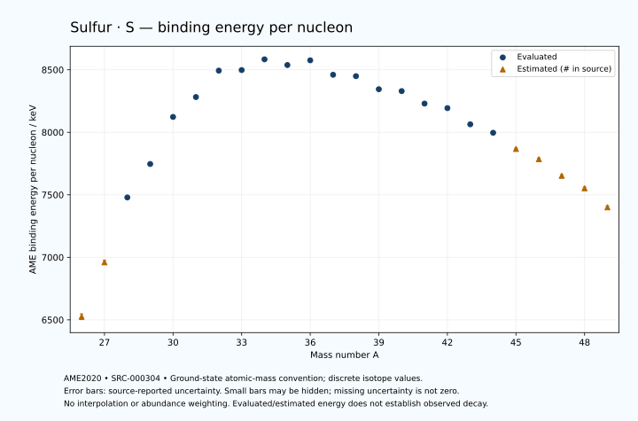

# Sulfur — Atomic Masses and Reaction Energies

<!-- generated-by: sync-ame2020.mjs -->

**Dated evaluated data · scientific coverage remains partial.** 24 ground-state nuclides from AME2020. Values and uncertainties are transcribed from the retained unrounded analysis files; estimated quantities remain labelled.

- [Parent Sulfur record](0016-Sulfur-S.md) · [NUBASE states and decays](0016-Sulfur-S-Nuclear-Evaluation.md)
- [Structured data](data/isotopes/0016-Sulfur-S-AME2020-Evaluation.yaml)
- [Original mass table](../../data/catalog/sources/ame2020-mass_1.mas20.txt) · [Original reaction table](../../data/catalog/sources/ame2020-rct1.mas20.txt)
- [AME2020 methods](https://doi.org/10.1088/1674-1137/abddb0) (SRC-000303) · [Tables and definitions](https://doi.org/10.1088/1674-1137/abddaf) (SRC-000304)

## Reading the data

All table energies and uncertainties are in keV; binding energy is per nucleon. A # replaces a decimal point in the original estimated value. UNKNOWN (*) retains the source's not-calculable entry; it is neither zero nor automatically NOT APPLICABLE. Source lines are one-based in the retained files. Uncertainties remain those published by the evaluation, with no replacement by independent-mass quadrature.

Atomic-mass conventions apply. Qα is total decay energy, not alpha-particle kinetic energy. Positive Q alone does not establish a decay branch, rate or observation. He-4's source Qα of zero is a bookkeeping identity. These tables describe ground-state combinations, not isomer or excited-daughter transitions. Nuclear state and daughter lookups are explicit in the structured companion. The binding quantity follows [Z M(¹H) + N mₙ − M(A,Z)]c²/A; it has not been converted to a bare-nucleus convention.

## Mass and binding table

| Nuclide | N | Atomic mass excess / keV | AME binding per nucleon / keV | Mass-file line |
|---|---:|---|---|---:|
| S-26 | 10 | 27680# ± 600# | 6525# ± 23# | 198 |
| S-27 | 11 | 17491# ± 400# | 6960# ± 15# | 207 |
| S-28 | 12 | 4073.203 ± 160.000 | 7478.7911 ± 5.7143 | 216 |
| S-29 | 13 | -3094.423 ± 13.041 | 7746.3826 ± 0.4497 | 225 |
| S-30 | 14 | -14059.254 ± 0.206 | 8122.7081 ± 0.0069 | 235 |
| S-31 | 15 | -19042.531 ± 0.229 | 8281.8013 ± 0.0074 | 245 |
| S-32 | 16 | -26015.53714 ± 0.00131 | 8493.1301 ± 0.0002 | 255 |
| S-33 | 17 | -26585.85830 ± 0.00134 | 8497.6304 ± 0.0002 | 265 |
| S-34 | 18 | -29931.689 ± 0.045 | 8583.4986 ± 0.0013 | 276 |
| S-35 | 19 | -28846.210 ± 0.040 | 8537.8511 ± 0.0012 | 286 |
| S-36 | 20 | -30664.141 ± 0.188 | 8575.3900 ± 0.0052 | 297 |
| S-37 | 21 | -26896.426 ± 0.198 | 8459.9363 ± 0.0054 | 308 |
| S-38 | 22 | -26861.216 ± 7.172 | 8448.7829 ± 0.1887 | 320 |
| S-39 | 23 | -23162.672 ± 50.000 | 8344.2698 ± 1.2821 | 332 |
| S-40 | 24 | -22837.850 ± 3.982 | 8329.3255 ± 0.0996 | 344 |
| S-41 | 25 | -19008.580 ± 4.099 | 8229.6358 ± 0.1000 | 356 |
| S-42 | 26 | -17637.748 ± 2.794 | 8193.2275 ± 0.0665 | 368 |
| S-43 | 27 | -12195.461 ± 4.970 | 8063.8276 ± 0.1156 | 380 |
| S-44 | 28 | -9204.236 ± 5.216 | 7996.0154 ± 0.1186 | 392 |
| S-45 | 29 | -3340# ± 300# | 7867# ± 7# | 404 |
| S-46 | 30 | 640# ± 400# | 7785# ± 9# | 416 |
| S-47 | 31 | 7200# ± 400# | 7652# ± 9# | 428 |
| S-48 | 32 | 12390# ± 500# | 7552# ± 10# | 440 |
| S-49 | 33 | 20391# ± 583# | 7400# ± 12# | 453 |

## Q-values and separation energies

| Nuclide | Qβ− / keV | Qα / keV | S₂n / keV | S₂p / keV | Reaction-file line |
|---|---|---|---|---|---:|
| S-26 | UNKNOWN (*) | -8385# ± 781# | UNKNOWN (*) | -2357# ± 600# | 197 |
| S-27 | UNKNOWN (*) | -8884# ± 641# | UNKNOWN (*) | 914# ± 400# | 206 |
| S-28 | -24197# ± 525# | -9096.8986 ± 161.1805 | 39750# ± 621# | 3363.7359 ± 160.0000 | 215 |
| S-29 | -17117# ± 189# | -9346.6610 ± 16.4337 | 36728# ± 400# | 5287.8603 ± 13.0414 | 224 |
| S-30 | -18733.8020 ± 23.8769 | -9343.1670 ± 0.2326 | 34275.0935 ± 160.0001 | 7144.3995 ± 0.2062 | 234 |
| S-31 | -12007.9790 ± 3.4541 | -9082.9421 ± 0.2531 | 32090.7442 ± 13.0429 | 11725.3920 ± 0.2292 | 244 |
| S-32 | -12680.8313 ± 0.5617 | -6947.6559 ± 0.0014 | 28098.9188 ± 0.2062 | 16160.5168 ± 0.0217 | 254 |
| S-33 | -5582.5182 ± 0.3908 | -7115.6926 ± 0.0014 | 23685.9630 ± 0.2292 | 18214.7631 ± 0.0434 | 264 |
| S-34 | -5491.6037 ± 0.0378 | -7923.6429 ± 0.0496 | 20058.7884 ± 0.0446 | 20431.9424 ± 0.3014 | 275 |
| S-35 | 167.3218 ± 0.0257 | -8322.0883 ± 0.0593 | 18402.9877 ± 0.0405 | 22909.8239 ± 0.6998 | 285 |
| S-36 | -1142.1329 ± 0.1893 | -9011.3676 ± 0.3524 | 16875.0876 ± 0.1921 | 25250.3990 ± 0.8229 | 296 |
| S-37 | 4865.1258 ± 0.1965 | -8807.0137 ± 0.7262 | 14192.8522 ± 0.2006 | 27082.8879 ± 35.8569 | 307 |
| S-38 | 2936.9000 ± 7.1714 | -9294.4477 ± 7.2166 | 12339.7111 ± 7.1743 | 29003.0327 ± 72.1548 | 319 |
| S-39 | 6637.5463 ± 50.0300 | -11196.1074 ± 61.5284 | 12408.8819 ± 50.0004 | 31169.1017 ± 124.3083 | 331 |
| S-40 | 4719.9687 ± 32.3118 | -12826.6402 ± 71.9078 | 12119.2699 ± 8.2033 | 33245.4927 ± 104.8687 | 343 |
| S-41 | 8298.6116 ± 68.8456 | -14861.9837 ± 113.8831 | 11988.5444 ± 50.1677 | 35906.8739 ± 135.5943 | 355 |
| S-42 | 7194.0221 ± 59.6811 | -15892.3645 ± 104.8303 | 10942.5341 ± 4.8648 | 37882.5658 ± 122.0225 | 367 |
| S-43 | 11964.0500 ± 62.0579 | -16940.7282 ± 135.6235 | 9329.5167 ± 6.4422 | 39974# ± 300# | 379 |
| S-44 | 11274.7373 ± 85.7253 | -17296.0280 ± 122.1020 | 7709.1246 ± 5.9177 | 40622# ± 300# | 391 |
| S-45 | 14922# ± 329# | -18965# ± 424# | 7288# ± 300# | 42248# ± 500# | 403 |
| S-46 | 14375# ± 411# | -18625# ± 500# | 6298# ± 400# | 43248# ± 640# | 415 |
| S-47 | 16781# ± 447# | -19554# ± 565# | 5602# ± 500# | 44468# ± 721# | 427 |
| S-48 | 16670# ± 707# | -19346# ± 707# | 4393# ± 640# | UNKNOWN (*) | 439 |
| S-49 | 19652# ± 707# | -19124# ± 837# | 2952# ± 707# | UNKNOWN (*) | 452 |

Qβ− comes from the mass-file line in the first table. The other three columns come from the reaction-file line. Definitions and original source strings are retained in the structured data.

## Binding-energy chart

Discrete source values and source-reported uncertainties. No interpolation, natural-abundance weighting or observed-decay claim is implied. This quantitative chart supplements the 22 separate illustrative panels.

## Remaining review

Later measurements, state-specific decay branches, isomer Q-values, additional reaction channels and full claim-level review remain open. Existing authored values retain their own provenance; this companion does not overwrite them.
