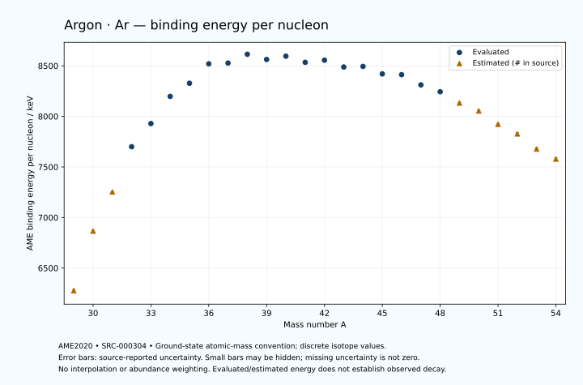

# Argon — Atomic Masses and Reaction Energies

<!-- generated-by: sync-ame2020.mjs -->

**Dated evaluated data · scientific coverage remains partial.** 26 ground-state nuclides from AME2020. Values and uncertainties are transcribed from the retained unrounded analysis files; estimated quantities remain labelled.

- [Parent Argon record](0018-Argon-Ar.md) · [NUBASE states and decays](0018-Argon-Ar-Nuclear-Evaluation.md)
- [Structured data](data/isotopes/0018-Argon-Ar-AME2020-Evaluation.yaml)
- [Original mass table](../../data/catalog/sources/ame2020-mass_1.mas20.txt) · [Original reaction table](../../data/catalog/sources/ame2020-rct1.mas20.txt)
- [AME2020 methods](https://doi.org/10.1088/1674-1137/abddb0) (SRC-000303) · [Tables and definitions](https://doi.org/10.1088/1674-1137/abddaf) (SRC-000304)

## Reading the data

All table energies and uncertainties are in keV; binding energy is per nucleon. A # replaces a decimal point in the original estimated value. UNKNOWN (*) retains the source's not-calculable entry; it is neither zero nor automatically NOT APPLICABLE. Source lines are one-based in the retained files. Uncertainties remain those published by the evaluation, with no replacement by independent-mass quadrature.

Atomic-mass conventions apply. Qα is total decay energy, not alpha-particle kinetic energy. Positive Q alone does not establish a decay branch, rate or observation. He-4's source Qα of zero is a bookkeeping identity. These tables describe ground-state combinations, not isomer or excited-daughter transitions. Nuclear state and daughter lookups are explicit in the structured companion. The binding quantity follows [Z M(¹H) + N mₙ − M(A,Z)]c²/A; it has not been converted to a bare-nucleus convention.

## Mass and binding table

| Nuclide | N | Atomic mass excess / keV | AME binding per nucleon / keV | Mass-file line |
|---|---:|---|---|---:|
| Ar-29 | 11 | 37969# ± 439# | 6276# ± 15# | 227 |
| Ar-30 | 12 | 22071# ± 179# | 6866# ± 6# | 237 |
| Ar-31 | 13 | 11325# ± 200# | 7252# ± 6# | 247 |
| Ar-32 | 14 | -2200.352 ± 1.770 | 7700.0089 ± 0.0553 | 257 |
| Ar-33 | 15 | -9384.295 ± 0.401 | 7928.9559 ± 0.0121 | 267 |
| Ar-34 | 16 | -18378.293 ± 0.078 | 8197.6724 ± 0.0023 | 278 |
| Ar-35 | 17 | -23047.289 ± 0.680 | 8327.4621 ± 0.0194 | 288 |
| Ar-36 | 18 | -30231.542 ± 0.027 | 8519.9096 ± 0.0008 | 299 |
| Ar-37 | 19 | -30947.679 ± 0.207 | 8527.1406 ± 0.0056 | 310 |
| Ar-38 | 20 | -34714.827 ± 0.195 | 8614.2807 ± 0.0051 | 322 |
| Ar-39 | 21 | -33242.195 ± 5.000 | 8562.5988 ± 0.1282 | 334 |
| Ar-40 | 22 | -35039.89997 ± 0.00218 | 8595.2594 ± 0.0002 | 346 |
| Ar-41 | 23 | -33067.510 ± 0.347 | 8534.3733 ± 0.0085 | 358 |
| Ar-42 | 24 | -34422.678 ± 5.775 | 8555.6141 ± 0.1375 | 370 |
| Ar-43 | 25 | -32009.811 ± 5.310 | 8488.2382 ± 0.1235 | 382 |
| Ar-44 | 26 | -32673.260 ± 1.584 | 8493.8411 ± 0.0360 | 394 |
| Ar-45 | 27 | -29770.801 ± 0.512 | 8419.9526 ± 0.0114 | 406 |
| Ar-46 | 28 | -29771.255 ± 2.329 | 8412.3835 ± 0.0506 | 418 |
| Ar-47 | 29 | -25367.274 ± 1.211 | 8311.4250 ± 0.0258 | 430 |
| Ar-48 | 30 | -22354.927 ± 16.767 | 8243.6656 ± 0.3493 | 442 |
| Ar-49 | 31 | -17060# ± 400# | 8132# ± 8# | 455 |
| Ar-50 | 32 | -13230# ± 500# | 8054# ± 10# | 467 |
| Ar-51 | 33 | -6490# ± 400# | 7922# ± 8# | 479 |
| Ar-52 | 34 | -1380# ± 600# | 7827# ± 12# | 491 |
| Ar-53 | 35 | 6791# ± 699# | 7677# ± 13# | 503 |
| Ar-54 | 36 | 12560# ± 800# | 7578# ± 15# | 515 |

## Q-values and separation energies

| Nuclide | Qβ− / keV | Qα / keV | S₂n / keV | S₂p / keV | Reaction-file line |
|---|---|---|---|---|---:|
| Ar-29 | UNKNOWN (*) | UNKNOWN (*) | UNKNOWN (*) | -5900# ± 180# | 226 |
| Ar-30 | UNKNOWN (*) | -8034# ± 626# | UNKNOWN (*) | -3420# ± 80# | 236 |
| Ar-31 | -22935# ± 361# | -8590# ± 447# | 42786# ± 482# | 158# ± 200# | 246 |
| Ar-32 | -24190# ± 400# | -8698.4711 ± 160.0098 | 40414# ± 179# | 2719.0400 ± 1.7818 | 256 |
| Ar-33 | -16925# ± 200# | -8714.7873 ± 13.0471 | 36852# ± 200# | 4919.7055 ± 0.4615 | 266 |
| Ar-34 | -17158# ± 196# | -6743.9542 ± 0.2203 | 32320.5766 ± 1.7715 | 6940.6977 ± 0.0777 | 277 |
| Ar-35 | -11874.3955 ± 0.8516 | -6429.6731 ± 0.7179 | 29805.6300 ± 0.7895 | 11039.3725 ± 0.6803 | 287 |
| Ar-36 | -12814.3607 ± 0.3259 | -6640.9210 ± 0.0270 | 27995.8856 ± 0.0822 | 14877.7949 ± 0.0522 | 298 |
| Ar-37 | -6147.4775 ± 0.2270 | -6786.7364 ± 0.2066 | 24043.0262 ± 0.7111 | 16679.4111 ± 0.2108 | 309 |
| Ar-38 | -5914.0671 ± 0.0448 | -7208.0532 ± 0.2000 | 20625.9206 ± 0.1968 | 18628.6280 ± 0.2709 | 321 |
| Ar-39 | 565.0000 ± 5.0000 | -6820.9014 ± 5.0002 | 18437.1527 ± 5.0043 | 20923.7116 ± 5.0039 | 333 |
| Ar-40 | -1504.4031 ± 0.0559 | -6800.6750 ± 0.1881 | 16467.7093 ± 0.1950 | 22756.6262 ± 7.1720 | 345 |
| Ar-41 | 2492.0392 ± 0.3473 | -8595.9996 ± 0.3999 | 15967.9503 ± 5.0120 | 24482.7800 ± 50.0012 | 357 |
| Ar-42 | 599.3527 ± 5.7763 | -9986.3780 ± 9.2083 | 15525.4142 ± 5.7753 | 26162.7705 ± 7.0151 | 369 |
| Ar-43 | 4565.5836 ± 5.3254 | -11272.0549 ± 50.2811 | 15084.9373 ± 5.3210 | 27579.1729 ± 6.7075 | 381 |
| Ar-44 | 3108.2375 ± 1.6381 | -12260.3265 ± 4.2854 | 14393.2184 ± 5.9885 | 29613.4547 ± 3.2120 | 393 |
| Ar-45 | 6844.8422 ± 0.7311 | -13187.1372 ± 4.1305 | 13903.6267 ± 5.3343 | 32153.2829 ± 4.9966 | 405 |
| Ar-46 | 5642.6746 ± 2.4394 | -14558.4231 ± 3.6376 | 13240.6307 ± 2.8161 | 35144.9609 ± 5.7126 | 417 |
| Ar-47 | 10344.7078 ± 1.8490 | -15596.7293 ± 5.1156 | 11739.1088 ± 1.3149 | 36605# ± 300# | 429 |
| Ar-48 | 9929.5550 ± 16.7847 | -15575.6067 ± 17.5596 | 8726.3082 ± 16.9278 | 37573# ± 400# | 441 |
| Ar-49 | 12551# ± 400# | -16145# ± 500# | 7836# ± 400# | 38839# ± 565# | 454 |
| Ar-50 | 12498# ± 500# | -16295# ± 640# | 7018# ± 500# | 40198# ± 707# | 466 |
| Ar-51 | 16026# ± 400# | -16115# ± 565# | 5572# ± 565# | 41459# ± 707# | 478 |
| Ar-52 | 15758# ± 601# | -16194# ± 781# | 4292# ± 781# | UNKNOWN (*) | 490 |
| Ar-53 | 19086# ± 708# | -16025# ± 910# | 2862# ± 805# | UNKNOWN (*) | 502 |
| Ar-54 | 17710# ± 894# | UNKNOWN (*) | 2203# ± 1000# | UNKNOWN (*) | 514 |

Qβ− comes from the mass-file line in the first table. The other three columns come from the reaction-file line. Definitions and original source strings are retained in the structured data.

## Binding-energy chart

Discrete source values and source-reported uncertainties. No interpolation, natural-abundance weighting or observed-decay claim is implied. This quantitative chart supplements the 22 separate illustrative panels.

## Remaining review

Later measurements, state-specific decay branches, isomer Q-values, additional reaction channels and full claim-level review remain open. Existing authored values retain their own provenance; this companion does not overwrite them.
