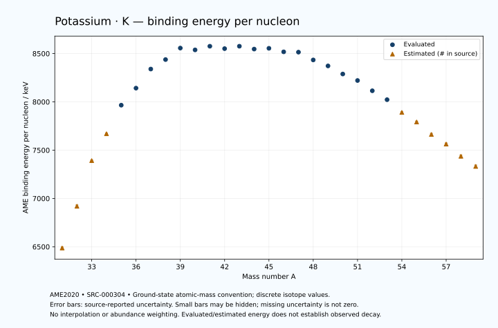

# Potassium — Atomic Masses and Reaction Energies

<!-- generated-by: sync-ame2020.mjs -->

**Dated evaluated data · scientific coverage remains partial.** 29 ground-state nuclides from AME2020. Values and uncertainties are transcribed from the retained unrounded analysis files; estimated quantities remain labelled.

- [Parent Potassium record](0019-Potassium-K.md) · [NUBASE states and decays](0019-Potassium-K-Nuclear-Evaluation.md)
- [Structured data](data/isotopes/0019-Potassium-K-AME2020-Evaluation.yaml)
- [Original mass table](../../data/catalog/sources/ame2020-mass_1.mas20.txt) · [Original reaction table 1](../../data/catalog/sources/ame2020-rct1.mas20.txt) · [Original reaction table 2](../../data/catalog/sources/ame2020-rct2.mas20.txt)
- [AME2020 methods](https://doi.org/10.1088/1674-1137/abddb0) (SRC-000303) · [Tables and definitions](https://doi.org/10.1088/1674-1137/abddaf) (SRC-000304)

## Reading the data

All table energies and uncertainties are in keV; binding energy is per nucleon. A # replaces a decimal point in the original estimated value. UNKNOWN (*) retains the source's not-calculable entry; it is neither zero nor automatically NOT APPLICABLE. Source lines are one-based in the retained files. Uncertainties remain those published by the evaluation, with no replacement by independent-mass quadrature.

Atomic-mass conventions apply. Qα is total decay energy, not alpha-particle kinetic energy. Positive Q alone does not establish a decay branch, rate or observation. He-4's source Qα of zero is a bookkeeping identity. These tables describe ground-state combinations, not isomer or excited-daughter transitions. Nuclear state and daughter lookups are explicit in the structured companion. The binding quantity follows [Z M(¹H) + N mₙ − M(A,Z)]c²/A; it has not been converted to a bare-nucleus convention.

## Mass and binding table

| Nuclide | N | Atomic mass excess / keV | AME binding per nucleon / keV | Mass-file line |
|---|---:|---|---|---:|
| K-31 | 12 | 34260# ± 300# | 6487# ± 10# | 248 |
| K-32 | 13 | 21990# ± 400# | 6920# ± 12# | 258 |
| K-33 | 14 | 7540# ± 200# | 7392# ± 6# | 268 |
| K-34 | 15 | -1220# ± 196# | 7670# ± 6# | 279 |
| K-35 | 16 | -11172.893 ± 0.512 | 7965.8409 ± 0.0146 | 289 |
| K-36 | 17 | -17417.182 ± 0.325 | 8142.2233 ± 0.0090 | 300 |
| K-37 | 18 | -24800.201 ± 0.094 | 8339.8480 ± 0.0025 | 311 |
| K-38 | 19 | -28800.760 ± 0.195 | 8438.0593 ± 0.0051 | 323 |
| K-39 | 20 | -33807.19535 ± 0.00456 | 8557.0258 ± 0.0003 | 335 |
| K-40 | 21 | -33535.497 ± 0.056 | 8538.0907 ± 0.0014 | 347 |
| K-41 | 22 | -35559.54880 ± 0.00376 | 8576.0731 ± 0.0003 | 359 |
| K-42 | 23 | -35022.031 ± 0.106 | 8551.2571 ± 0.0025 | 371 |
| K-43 | 24 | -36575.394 ± 0.410 | 8576.2204 ± 0.0095 | 383 |
| K-44 | 25 | -35781.498 ± 0.419 | 8546.7023 ± 0.0095 | 395 |
| K-45 | 26 | -36615.643 ± 0.522 | 8554.6747 ± 0.0116 | 407 |
| K-46 | 27 | -35413.929 ± 0.727 | 8518.0428 ± 0.0158 | 419 |
| K-47 | 28 | -35711.982 ± 1.397 | 8514.8795 ± 0.0297 | 431 |
| K-48 | 29 | -32284.482 ± 0.773 | 8434.2324 ± 0.0161 | 443 |
| K-49 | 30 | -29611.496 ± 0.801 | 8372.2753 ± 0.0164 | 456 |
| K-50 | 31 | -25727.853 ± 7.731 | 8288.5833 ± 0.1546 | 468 |
| K-51 | 32 | -22515.457 ± 13.041 | 8221.3350 ± 0.2557 | 480 |
| K-52 | 33 | -17137.628 ± 33.534 | 8115.0303 ± 0.6449 | 492 |
| K-53 | 34 | -12295.722 ± 111.779 | 8022.8488 ± 2.1090 | 504 |
| K-54 | 35 | -5150# ± 400# | 7891# ± 7# | 516 |
| K-55 | 36 | 470# ± 500# | 7792# ± 9# | 528 |
| K-56 | 37 | 7980# ± 600# | 7663# ± 11# | 540 |
| K-57 | 38 | 14130# ± 600# | 7563# ± 11# | 553 |
| K-58 | 39 | 21930# ± 700# | 7437# ± 12# | 566 |
| K-59 | 40 | 28750# ± 800# | 7332# ± 14# | 580 |

## Q-values and separation energies

| Nuclide | Qβ− / keV | Qα / keV | S₂n / keV | S₂p / keV | Reaction-file line |
|---|---|---|---|---|---:|
| K-31 | UNKNOWN (*) | UNKNOWN (*) | UNKNOWN (*) | -5660# ± 354# | 247 |
| K-32 | UNKNOWN (*) | -8705# ± 640# | UNKNOWN (*) | -2737# ± 400# | 257 |
| K-33 | -23489# ± 447# | -8907# ± 275# | 42863# ± 361# | 3# ± 200# | 267 |
| K-34 | -16110# ± 358# | -8320# ± 197# | 39353# ± 445# | 2463# ± 196# | 278 |
| K-35 | -16363# ± 200# | -6563.2566 ± 3.4844 | 34856# ± 200# | 4747.4953 ± 0.6444 | 288 |
| K-36 | -10966.0155 ± 40.0013 | -6507.3916 ± 0.6061 | 32340# ± 196# | 7555.0379 ± 0.3288 | 299 |
| K-37 | -11664.1314 ± 0.6412 | -6221.7770 ± 0.4019 | 29769.9441 ± 0.5209 | 10364.6118 ± 0.1004 | 310 |
| K-38 | -6742.2563 ± 0.0626 | -6785.5898 ± 0.2013 | 27526.2142 ± 0.3793 | 13856.6938 ± 0.1985 | 322 |
| K-39 | -6524.4888 ± 0.5962 | -7218.5796 ± 0.0358 | 25149.6302 ± 0.0941 | 16623.5858 ± 0.0520 | 334 |
| K-40 | 1310.9051 ± 0.0596 | -6438.4047 ± 0.0665 | 20877.3733 ± 0.2031 | 18315.3231 ± 0.1129 | 346 |
| K-41 | -421.6406 ± 0.1377 | -6222.9130 ± 0.0519 | 17894.9896 ± 0.0051 | 20337.2730 ± 1.7321 | 358 |
| K-42 | 3525.2626 ± 0.1825 | -7648.8307 ± 0.1445 | 17629.1700 ± 0.1199 | 22042.1544 ± 32.0657 | 370 |
| K-43 | 1833.4783 ± 0.4687 | -9200.0923 ± 1.7799 | 17158.4817 ± 0.4099 | 23846.1449 ± 68.7247 | 382 |
| K-44 | 5687.2319 ± 0.5303 | -10648.5952 ± 32.0682 | 16902.1032 ± 0.4324 | 25527.6701 ± 59.6171 | 394 |
| K-45 | 4196.5868 ± 0.6369 | -11733.3678 ± 68.7255 | 16182.8853 ± 0.6634 | 27034.0751 ± 61.8607 | 406 |
| K-46 | 7725.6802 ± 2.3490 | -13007.0756 ± 59.6201 | 15775.0678 ± 0.8388 | 29512.8982 ± 85.5695 | 418 |
| K-47 | 6632.6837 ± 2.6237 | -13977.3871 ± 61.8743 | 15238.9744 ± 1.4914 | 32027.3794 ± 136.1705 | 430 |
| K-48 | 11940.3857 ± 0.7734 | -14230.4245 ± 85.5699 | 13013.1887 ± 1.0610 | 33127.4754 ± 97.2518 | 442 |
| K-49 | 11688.5069 ± 0.8205 | -13773.8671 ± 136.1657 | 10042.1501 ± 1.6106 | 34609# ± 200# | 455 |
| K-50 | 13861.3774 ± 7.8919 | -14417.8198 ± 97.5556 | 9586.0068 ± 7.7700 | 36026# ± 500# | 467 |
| K-51 | 13816.8529 ± 13.0517 | -15360# ± 201# | 9046.5971 ± 13.0659 | 37833# ± 400# | 479 |
| K-52 | 17128.6431 ± 33.5405 | -15282# ± 501# | 7552.4120 ± 34.4135 | 39415# ± 401# | 491 |
| K-53 | 17091.9853 ± 120.0471 | -15460# ± 415# | 5922.9015 ± 112.5375 | 41164# ± 708# | 503 |
| K-54 | 20010# ± 403# | -15275# ± 565# | 4155# ± 401# | 42088# ± 806# | 515 |
| K-55 | 19121# ± 525# | -16245# ± 860# | 3377# ± 513# | UNKNOWN (*) | 527 |
| K-56 | 21491# ± 650# | -16804# ± 922# | 3012# ± 721# | UNKNOWN (*) | 539 |
| K-57 | 20689# ± 721# | UNKNOWN (*) | 2483# ± 781# | UNKNOWN (*) | 552 |
| K-58 | 23461# ± 860# | UNKNOWN (*) | 2193# ± 922# | UNKNOWN (*) | 565 |
| K-59 | 22940# ± 1000# | UNKNOWN (*) | 1523# ± 1000# | UNKNOWN (*) | 579 |

## Additional decay-energy combinations

| Nuclide | Q₂β− / keV | Q₄β− / keV | Qεp / keV | Qβ−n / keV | Part 1 / part 2 line |
|---|---|---|---|---|---|
| K-31 | UNKNOWN (*) | UNKNOWN (*) | 22297# ± 301# | UNKNOWN (*) | 247 / 251 |
| K-32 | UNKNOWN (*) | UNKNOWN (*) | 21735# ± 400# | UNKNOWN (*) | 257 / 261 |
| K-33 | UNKNOWN (*) | UNKNOWN (*) | 13586# ± 200# | UNKNOWN (*) | 267 / 272 |
| K-34 | UNKNOWN (*) | UNKNOWN (*) | 12494# ± 196# | -40322# ± 445# | 278 / 283 |
| K-35 | -38273# ± 400# | UNKNOWN (*) | 5978.2215 ± 0.5146 | -34134# ± 300# | 288 / 293 |
| K-36 | -33567# ± 300# | UNKNOWN (*) | 4307.3790 ± 0.3271 | -30679# ± 200# | 299 / 304 |
| K-37 | -28580# ± 300# | UNKNOWN (*) | -2567.1643 ± 0.1006 | -26420.3532 ± 40.0001 | 310 / 315 |
| K-38 | -24551# ± 200# | UNKNOWN (*) | -4328.1790 ± 0.2020 | -23736.0078 ± 0.6637 | 322 / 327 |
| K-39 | -19634.4692 ± 24.0000 | -56377# ± 400# | -11298.0505 ± 0.0981 | -19820.0101 ± 0.1944 | 334 / 340 |
| K-40 | -13012.1442 ± 2.8288 | -46005# ± 300# | -11024.2499 ± 1.7330 | -14324.1083 ± 0.5988 | 346 / 352 |
| K-41 | -6917.1888 ± 0.0774 | -35870# ± 200# | -15290.7015 ± 32.0655 | -8784.4649 ± 0.0208 | 358 / 364 |
| K-42 | -2901.0278 ± 0.1869 | -27402# ± 196# | -15003.8102 ± 68.7236 | -7955.4406 ± 0.1738 | 370 / 376 |
| K-43 | -387.2445 ± 1.9074 | -18659.0368 ± 42.8507 | -19032.5956 ± 59.6170 | -6099.4191 ± 0.4359 | 382 / 388 |
| K-44 | 2034.5372 ± 1.8049 | -11973.4187 ± 7.2770 | -18910.9583 ± 61.8599 | -5443.9432 ± 0.4769 | 394 / 400 |
| K-45 | 4456.6778 ± 0.8439 | -4729.2020 ± 1.0083 | -23425.6411 ± 85.5680 | -3218.2318 ± 0.6145 | 406 / 413 |
| K-46 | 6347.7137 ± 0.9893 | 1661.9674 ± 0.7388 | -24440.3561 ± 136.1653 | -2673.0173 ± 0.8133 | 418 / 425 |
| K-47 | 8624.8607 ± 2.3834 | 6295.0879 ± 1.4016 | -29266.0040 ± 97.2588 | -643.6901 ± 2.6348 | 430 / 437 |
| K-48 | 12219.6012 ± 5.0099 | 12193.5230 ± 1.2419 | -29993# ± 200# | 1988.8654 ± 2.3515 | 442 / 449 |
| K-49 | 16950.9514 ± 2.4050 | 18350.6610 ± 1.1493 | -32620# ± 500# | 6542.0539 ± 0.8013 | 455 / 462 |
| K-50 | 18809.2677 ± 8.1303 | 23495.3873 ± 7.7320 | -33756# ± 400# | 7500.8319 ± 7.7334 | 467 / 474 |
| K-51 | 20734.8961 ± 13.2816 | 29687.6485 ± 13.0409 | -37504# ± 400# | 9002.4553 ± 13.1371 | 479 / 487 |
| K-52 | 23385.9319 ± 33.6744 | 34305.4032 ± 33.5342 | -38717# ± 700# | 11123.3631 ± 33.5378 | 491 / 499 |
| K-53 | 26473.8324 ± 113.1718 | 39555.9528 ± 111.8223 | -41944# ± 708# | 13899.2313 ± 111.7813 | 503 / 511 |
| K-54 | 29288# ± 400# | 44748# ± 400# | UNKNOWN (*) | 16166# ± 402# | 515 / 523 |
| K-55 | 31313# ± 504# | 49596# ± 501# | UNKNOWN (*) | 17560# ± 503# | 527 / 535 |
| K-56 | 33496# ± 654# | 54164# ± 625# | UNKNOWN (*) | 18559# ± 621# | 539 / 547 |
| K-57 | 35509# ± 626# | 58565# ± 606# | UNKNOWN (*) | 19569# ± 650# | 552 / 561 |
| K-58 | 37410# ± 725# | 62361# ± 706# | UNKNOWN (*) | 20418# ± 806# | 565 / 574 |
| K-59 | 39579# ± 838# | 66360# ± 812# | UNKNOWN (*) | 22209# ± 944# | 579 / 588 |

## Single-nucleon separation and reaction energies

| Nuclide | Sₙ / keV | Sₚ / keV | Q(d,α) / keV | Q(p,α) / keV | Q(n,α) / keV | Part 2 line |
|---|---|---|---|---|---|---:|
| K-31 | UNKNOWN (*) | -4900# ± 349# | 7002# ± 531# | UNKNOWN (*) | 11637# ± 583# | 251 |
| K-32 | 20342# ± 500# | -3375# ± 447# | 10629# ± 438# | -11115# ± 593# | 13614# ± 442# | 261 |
| K-33 | 22521# ± 447# | -2452# ± 200# | 6926# ± 283# | -9667# ± 269# | 8512# ± 202# | 272 |
| K-34 | 16832# ± 280# | -875# ± 196# | 11691# ± 196# | -7682# ± 280# | 11461# ± 196# | 283 |
| K-35 | 18024# ± 196# | 83.5716 ± 0.5182 | 8922.2086 ± 0.6503 | -4108.4858 ± 1.8425 | 7808.2148 ± 0.7603 | 293 |
| K-36 | 14315.6064 ± 0.6068 | 1658.8639 ± 0.7540 | 11671.9182 ± 0.3343 | -3168.8315 ± 0.5159 | 9232.5607 ± 0.5084 | 304 |
| K-37 | 15454.3377 ± 0.3381 | 1857.6301 ± 0.0900 | 8957.8945 ± 0.6868 | -1557.8533 ± 0.1219 | 5286.2867 ± 0.1058 | 315 |
| K-38 | 12071.8765 ± 0.2167 | 5142.0519 ± 0.2843 | 12141.5896 ± 0.1971 | -889.4158 ± 0.7078 | 5859.1741 ± 0.1985 | 327 |
| K-39 | 13077.7537 ± 0.1953 | 6381.3397 ± 0.1950 | 7851.2905 ± 0.2066 | 1288.4021 ± 0.0274 | 1361.2148 ± 0.0361 | 340 |
| K-40 | 7799.6195 ± 0.0559 | 7582.2725 ± 5.0003 | 11890.1369 ± 0.2028 | 2276.2372 ± 0.2140 | 3872.4571 ± 0.0763 | 352 |
| K-41 | 10095.3700 ± 0.0560 | 7808.6199 ± 0.0031 | 8393.4536 ± 5.0000 | 4019.3331 ± 0.1950 | -115.0307 ± 0.0981 | 364 |
| K-42 | 7533.8000 ± 0.1061 | 9243.4922 ± 0.3631 | 10728.6763 ± 0.1061 | 3084.2198 ± 5.0011 | 424.5894 ± 1.7354 | 376 |
| K-43 | 9624.6817 ± 0.4234 | 9441.6874 ± 5.7899 | 7202.9223 ± 0.5372 | 3328.5608 ± 0.4099 | -3371.1737 ± 32.0681 | 388 |
| K-44 | 7277.4215 ± 0.5862 | 11060.6581 ± 5.3261 | 9351.9873 ± 5.7905 | 2150.0670 ± 0.5444 | -2827.9040 ± 68.7247 | 400 |
| K-45 | 8905.4638 ± 0.6692 | 11231.3543 ± 1.6672 | 6104.9743 ± 5.3352 | 2671.0897 ± 5.7989 | -6137.4715 ± 59.6179 | 413 |
| K-46 | 6869.6041 ± 0.8944 | 12932.0993 ± 0.8890 | 7970.1378 ± 1.7423 | 1459.9364 ± 5.3591 | -5608.0168 ± 61.8628 | 425 |
| K-47 | 8369.3703 ± 1.5749 | 13229.6979 ± 2.7157 | 4769.6266 ± 1.4882 | 1825.3338 ± 2.1118 | -9586.6061 ± 85.5778 | 437 |
| K-48 | 4643.8184 ± 1.5969 | 14206.1791 ± 1.4367 | 8197.5799 ± 2.4537 | 2350.3745 ± 0.9275 | -8375.5353 ± 136.1656 | 449 |
| K-49 | 5398.3318 ± 1.1133 | 14545.5398 ± 16.7860 | 6466.5853 ± 1.4519 | 5023.8144 ± 2.4627 | -10230.1448 ± 97.2520 | 462 |
| K-50 | 4187.6750 ± 7.7728 | 15957# ± 400# | 7337.8813 ± 18.4636 | 4503.4765 ± 7.8257 | -10501# ± 200# | 474 |
| K-51 | 4858.9221 ± 15.1608 | 16574# ± 500# | 5256# ± 400# | 4703.5254 ± 21.2416 | -12589# ± 500# | 487 |
| K-52 | 2693.4898 ± 35.9804 | 17937# ± 401# | 6803# ± 501# | 4787# ± 401# | -12231# ± 401# | 499 |
| K-53 | 3229.4117 ± 116.7010 | 18205# ± 610# | 4905# ± 415# | 5798# ± 513# | -14349# ± 415# | 511 |
| K-54 | 926# ± 415# | 19230# ± 805# | 6940# ± 721# | 6204# ± 565# | -13794# ± 806# | 523 |
| K-55 | 2451# ± 640# | 19379# ± 944# | 4391# ± 859# | 6714# ± 781# | -16243# ± 860# | 535 |
| K-56 | 562# ± 781# | UNKNOWN (*) | 6131# ± 1000# | 6054# ± 921# | UNKNOWN (*) | 547 |
| K-57 | 1922# ± 848# | UNKNOWN (*) | UNKNOWN (*) | 6434# ± 1000# | UNKNOWN (*) | 561 |
| K-58 | 271# ± 922# | UNKNOWN (*) | UNKNOWN (*) | UNKNOWN (*) | UNKNOWN (*) | 574 |
| K-59 | 1252# ± 1063# | UNKNOWN (*) | UNKNOWN (*) | UNKNOWN (*) | UNKNOWN (*) | 588 |

Qβ− comes from the mass-file line in the first table. Qα, S₂n, S₂p, Q₂β−, Qεp and Qβ−n come from reaction part 1; Q₄β− and the last table come from part 2. Qεp is electron-capture/proton energy balance; Qβ−n is beta-minus/neutron energy balance. These are evaluated mass combinations, not observations of decay modes, cross sections or reaction rates. Light-nuclide zero entries can be bookkeeping identities, without a physical A=0 residual. Definitions and original source strings are retained in the structured data.

## Binding-energy chart

Discrete source values and source-reported uncertainties. No interpolation, natural-abundance weighting or observed-decay claim is implied. This quantitative chart supplements the 22 separate illustrative panels.

## Remaining review

Later measurements, state-specific decay branches, isomer Q-values, reaction rates, applicability and full claim-level review remain open. Existing authored values retain their own provenance; this companion does not overwrite them.
