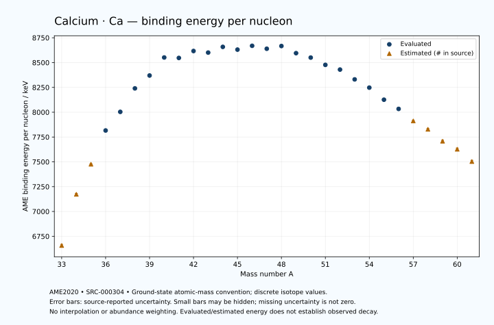

# Calcium — Atomic Masses and Reaction Energies

<!-- generated-by: sync-ame2020.mjs -->

**Dated evaluated data · scientific coverage remains partial.** 29 ground-state nuclides from AME2020. Values and uncertainties are transcribed from the retained unrounded analysis files; estimated quantities remain labelled.

- [Parent Calcium record](0020-Calcium-Ca.md) · [NUBASE states and decays](0020-Calcium-Ca-Nuclear-Evaluation.md)
- [Structured data](data/isotopes/0020-Calcium-Ca-AME2020-Evaluation.yaml)
- [Original mass table](../../data/catalog/sources/ame2020-mass_1.mas20.txt) · [Original reaction table](../../data/catalog/sources/ame2020-rct1.mas20.txt)
- [AME2020 methods](https://doi.org/10.1088/1674-1137/abddb0) (SRC-000303) · [Tables and definitions](https://doi.org/10.1088/1674-1137/abddaf) (SRC-000304)

## Reading the data

All table energies and uncertainties are in keV; binding energy is per nucleon. A # replaces a decimal point in the original estimated value. UNKNOWN (*) retains the source's not-calculable entry; it is neither zero nor automatically NOT APPLICABLE. Source lines are one-based in the retained files. Uncertainties remain those published by the evaluation, with no replacement by independent-mass quadrature.

Atomic-mass conventions apply. Qα is total decay energy, not alpha-particle kinetic energy. Positive Q alone does not establish a decay branch, rate or observation. He-4's source Qα of zero is a bookkeeping identity. These tables describe ground-state combinations, not isomer or excited-daughter transitions. Nuclear state and daughter lookups are explicit in the structured companion. The binding quantity follows [Z M(¹H) + N mₙ − M(A,Z)]c²/A; it has not been converted to a bare-nucleus convention.

## Mass and binding table

| Nuclide | N | Atomic mass excess / keV | AME binding per nucleon / keV | Mass-file line |
|---|---:|---|---|---:|
| Ca-33 | 13 | 31030# ± 400# | 6657# ± 12# | 269 |
| Ca-34 | 14 | 14890# ± 300# | 7173# ± 9# | 280 |
| Ca-35 | 15 | 5190# ± 200# | 7476# ± 6# | 290 |
| Ca-36 | 16 | -6451.166 ± 40.000 | 7815.8799 ± 1.1111 | 301 |
| Ca-37 | 17 | -13136.070 ± 0.634 | 8003.4567 ± 0.0171 | 312 |
| Ca-38 | 18 | -22058.503 ± 0.194 | 8240.0434 ± 0.0051 | 324 |
| Ca-39 | 19 | -27282.707 ± 0.596 | 8369.6711 ± 0.0153 | 336 |
| Ca-40 | 20 | -34846.402 ± 0.020 | 8551.3046 ± 0.0006 | 348 |
| Ca-41 | 21 | -35137.908 ± 0.138 | 8546.7075 ± 0.0034 | 360 |
| Ca-42 | 22 | -38547.293 ± 0.148 | 8616.5646 ± 0.0035 | 372 |
| Ca-43 | 23 | -38408.873 ± 0.227 | 8600.6653 ± 0.0053 | 384 |
| Ca-44 | 24 | -41468.730 ± 0.325 | 8658.1769 ± 0.0074 | 396 |
| Ca-45 | 25 | -40812.230 ± 0.365 | 8630.5467 ± 0.0081 | 408 |
| Ca-46 | 26 | -43139.610 ± 2.234 | 8668.9848 ± 0.0486 | 420 |
| Ca-47 | 27 | -42344.665 ± 2.221 | 8639.3548 ± 0.0473 | 432 |
| Ca-48 | 28 | -44224.868 ± 0.018 | 8666.6916 ± 0.0004 | 444 |
| Ca-49 | 29 | -41300.003 ± 0.178 | 8594.8500 ± 0.0036 | 457 |
| Ca-50 | 30 | -39589.230 ± 1.584 | 8550.1639 ± 0.0317 | 469 |
| Ca-51 | 31 | -36332.310 ± 0.522 | 8476.9135 ± 0.0102 | 481 |
| Ca-52 | 32 | -34266.272 ± 0.671 | 8429.3821 ± 0.0129 | 493 |
| Ca-53 | 33 | -29387.707 ± 43.780 | 8330.5778 ± 0.8260 | 505 |
| Ca-54 | 34 | -25160.587 ± 48.438 | 8247.4967 ± 0.8970 | 517 |
| Ca-55 | 35 | -18650.375 ± 160.217 | 8125.9260 ± 2.9130 | 529 |
| Ca-56 | 36 | -13510.390 ± 249.640 | 8033.1654 ± 4.4579 | 541 |
| Ca-57 | 37 | -6560# ± 400# | 7912# ± 7# | 554 |
| Ca-58 | 38 | -1530# ± 500# | 7828# ± 9# | 567 |
| Ca-59 | 39 | 5810# ± 600# | 7708# ± 10# | 581 |
| Ca-60 | 40 | 11000# ± 700# | 7627# ± 12# | 594 |
| Ca-61 | 41 | 19010# ± 800# | 7503# ± 13# | 608 |

## Q-values and separation energies

| Nuclide | Qβ− / keV | Qα / keV | S₂n / keV | S₂p / keV | Reaction-file line |
|---|---|---|---|---|---:|
| Ca-33 | UNKNOWN (*) | -9364# ± 593# | UNKNOWN (*) | -5127# ± 447# | 268 |
| Ca-34 | UNKNOWN (*) | -9606# ± 349# | UNKNOWN (*) | -2512# ± 300# | 279 |
| Ca-35 | -21910# ± 447# | -8560# ± 283# | 41982# ± 447# | 3# ± 200# | 289 |
| Ca-36 | -22601# ± 303# | -6675.7297 ± 40.0391 | 37484# ± 303# | 2650.8155 ± 40.0001 | 300 |
| Ca-37 | -16916# ± 300# | -6176.6909 ± 0.7502 | 34469# ± 200# | 4666.7233 ± 0.9301 | 311 |
| Ca-38 | -17809# ± 200# | -6105.1265 ± 0.2093 | 31749.9733 ± 40.0005 | 6404.9032 ± 0.1962 | 323 |
| Ca-39 | -13109.9804 ± 24.0074 | -6660.3337 ± 0.9046 | 30289.2728 ± 0.8705 | 10912.9699 ± 0.6310 | 335 |
| Ca-40 | -14323.0493 ± 2.8281 | -7039.7755 ± 0.0339 | 28930.5347 ± 0.1955 | 14709.5173 ± 0.1961 | 347 |
| Ca-41 | -6495.5482 ± 0.1553 | -6615.1452 ± 0.2483 | 23997.8377 ± 0.6119 | 16473.6549 ± 5.0019 | 359 |
| Ca-42 | -6426.2904 ± 0.0485 | -6257.3824 ± 0.2450 | 19843.5275 ± 0.1470 | 18085.3354 ± 0.1484 | 371 |
| Ca-43 | -2220.7227 ± 1.8650 | -7591.5931 ± 5.0052 | 19413.6006 ± 0.1817 | 19919.3052 ± 0.4151 | 383 |
| Ca-44 | -3652.6948 ± 1.7565 | -8853.7456 ± 0.3247 | 19064.0725 ± 0.2902 | 21623.9938 ± 5.7845 | 395 |
| Ca-45 | 260.0910 ± 0.7377 | -10169.6366 ± 0.5041 | 18545.9938 ± 0.2893 | 23380.3617 ± 5.3222 | 407 |
| Ca-46 | -1377.9665 ± 2.3305 | -11141.8475 ± 6.1923 | 17813.5161 ± 2.2572 | 25044.2915 ± 2.7382 | 419 |
| Ca-47 | 1992.1770 ± 1.1849 | -12759.7706 ± 5.7553 | 17675.0713 ± 2.2505 | 27151.8063 ± 2.2791 | 431 |
| Ca-48 | 279.2155 ± 4.9499 | -13976.5233 ± 1.5836 | 17227.8942 ± 2.2338 | 29031.5549 ± 2.3288 | 443 |
| Ca-49 | 5262.4445 ± 2.2745 | -13954.1172 ± 0.5422 | 15097.9733 ± 2.2277 | 30510.6708 ± 1.2239 | 456 |
| Ca-50 | 4947.8903 ± 2.9723 | -12242.8911 ± 2.8161 | 11506.9985 ± 1.5836 | 31812.2453 ± 16.8415 | 468 |
| Ca-51 | 6918.0432 ± 2.5686 | -13389.9515 ± 1.3185 | 11174.9431 ± 0.5510 | 33850# ± 400# | 480 |
| Ca-52 | 6257.2889 ± 3.1463 | -14336.2605 ± 16.7803 | 10819.6776 ± 1.7197 | 35614# ± 500# | 492 |
| Ca-53 | 9381.8471 ± 47.2223 | -14752# ± 402# | 9198.0339 ± 43.7833 | 37476# ± 402# | 504 |
| Ca-54 | 9277.3463 ± 50.4129 | -14355# ± 503# | 7036.9518 ± 48.4423 | 38359# ± 602# | 516 |
| Ca-55 | 12191.7329 ± 171.9435 | -14586# ± 431# | 5405.3036 ± 166.0909 | 40019# ± 717# | 528 |
| Ca-56 | 12005.4580 ± 360.2029 | -14556# ± 650# | 4492.4394 ± 254.2962 | 40649# ± 838# | 540 |
| Ca-57 | 14820# ± 438# | -15775# ± 805# | 4052# ± 431# | UNKNOWN (*) | 553 |
| Ca-58 | 13949# ± 535# | -16516# ± 944# | 4163# ± 559# | UNKNOWN (*) | 566 |
| Ca-59 | 16639# ± 650# | UNKNOWN (*) | 3773# ± 721# | UNKNOWN (*) | 580 |
| Ca-60 | 15550# ± 860# | UNKNOWN (*) | 3612# ± 860# | UNKNOWN (*) | 593 |
| Ca-61 | 18510# ± 1000# | UNKNOWN (*) | 2942# ± 1000# | UNKNOWN (*) | 607 |

Qβ− comes from the mass-file line in the first table. The other three columns come from the reaction-file line. Definitions and original source strings are retained in the structured data.

## Binding-energy chart

Discrete source values and source-reported uncertainties. No interpolation, natural-abundance weighting or observed-decay claim is implied. This quantitative chart supplements the 22 separate illustrative panels.

## Remaining review

Later measurements, state-specific decay branches, isomer Q-values, additional reaction channels and full claim-level review remain open. Existing authored values retain their own provenance; this companion does not overwrite them.
