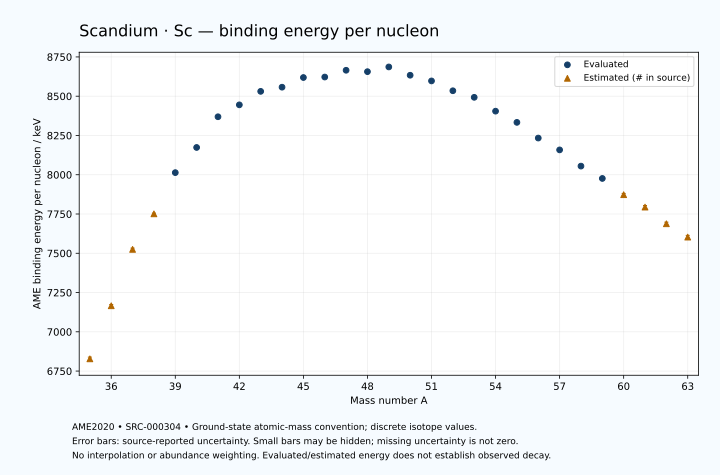

# Scandium — Atomic Masses and Reaction Energies

<!-- generated-by: sync-ame2020.mjs -->

**Dated evaluated data · scientific coverage remains partial.** 29 ground-state nuclides from AME2020. Values and uncertainties are transcribed from the retained unrounded analysis files; estimated quantities remain labelled.

- [Parent Scandium record](0021-Scandium-Sc.md) · [NUBASE states and decays](0021-Scandium-Sc-Nuclear-Evaluation.md)
- [Structured data](data/isotopes/0021-Scandium-Sc-AME2020-Evaluation.yaml)
- [Original mass table](../../data/catalog/sources/ame2020-mass_1.mas20.txt) · [Original reaction table 1](../../data/catalog/sources/ame2020-rct1.mas20.txt) · [Original reaction table 2](../../data/catalog/sources/ame2020-rct2.mas20.txt)
- [AME2020 methods](https://doi.org/10.1088/1674-1137/abddb0) (SRC-000303) · [Tables and definitions](https://doi.org/10.1088/1674-1137/abddaf) (SRC-000304)

## Reading the data

All table energies and uncertainties are in keV; binding energy is per nucleon. A # replaces a decimal point in the original estimated value. UNKNOWN (*) retains the source's not-calculable entry; it is neither zero nor automatically NOT APPLICABLE. Source lines are one-based in the retained files. Uncertainties remain those published by the evaluation, with no replacement by independent-mass quadrature.

Atomic-mass conventions apply. Qα is total decay energy, not alpha-particle kinetic energy. Positive Q alone does not establish a decay branch, rate or observation. He-4's source Qα of zero is a bookkeeping identity. These tables describe ground-state combinations, not isomer or excited-daughter transitions. Nuclear state and daughter lookups are explicit in the structured companion. The binding quantity follows [Z M(¹H) + N mₙ − M(A,Z)]c²/A; it has not been converted to a bare-nucleus convention.

## Mass and binding table

| Nuclide | N | Atomic mass excess / keV | AME binding per nucleon / keV | Mass-file line |
|---|---:|---|---|---:|
| Sc-35 | 14 | 27100# ± 400# | 6828# ± 11# | 291 |
| Sc-36 | 15 | 16150# ± 300# | 7166# ± 8# | 302 |
| Sc-37 | 16 | 3780# ± 300# | 7525# ± 8# | 313 |
| Sc-38 | 17 | -4249# ± 200# | 7751# ± 5# | 325 |
| Sc-39 | 18 | -14172.726 ± 24.000 | 8013.4575 ± 0.6154 | 337 |
| Sc-40 | 19 | -20523.353 ± 2.828 | 8173.6697 ± 0.0707 | 349 |
| Sc-41 | 20 | -28642.360 ± 0.077 | 8369.1979 ± 0.0019 | 361 |
| Sc-42 | 21 | -32121.003 ± 0.154 | 8444.9303 ± 0.0037 | 373 |
| Sc-43 | 22 | -36188.150 ± 1.863 | 8530.8265 ± 0.0433 | 385 |
| Sc-44 | 23 | -37816.035 ± 1.756 | 8557.3805 ± 0.0399 | 397 |
| Sc-45 | 24 | -41072.321 ± 0.663 | 8618.9410 ± 0.0147 | 409 |
| Sc-46 | 25 | -41761.643 ± 0.671 | 8622.0215 ± 0.0146 | 421 |
| Sc-47 | 26 | -44336.842 ± 1.931 | 8665.0958 ± 0.0411 | 433 |
| Sc-48 | 27 | -44504.083 ± 4.950 | 8656.2097 ± 0.1031 | 445 |
| Sc-49 | 28 | -46562.447 ± 2.268 | 8686.2805 ± 0.0463 | 458 |
| Sc-50 | 29 | -44537.120 ± 2.515 | 8633.4747 ± 0.0503 | 470 |
| Sc-51 | 30 | -43250.353 ± 2.515 | 8597.2213 ± 0.0493 | 482 |
| Sc-52 | 31 | -40523.560 ± 3.074 | 8534.6695 ± 0.0591 | 494 |
| Sc-53 | 32 | -38769.555 ± 17.698 | 8492.8325 ± 0.3339 | 506 |
| Sc-54 | 33 | -34437.934 ± 13.973 | 8404.8115 ± 0.2588 | 518 |
| Sc-55 | 34 | -30842.108 ± 62.411 | 8333.3694 ± 1.1347 | 530 |
| Sc-56 | 35 | -25515.848 ± 259.665 | 8233.5781 ± 4.6369 | 542 |
| Sc-57 | 36 | -21379.653 ± 179.778 | 8158.1666 ± 3.1540 | 555 |
| Sc-58 | 37 | -15479.569 ± 190.025 | 8054.9436 ± 3.2763 | 568 |
| Sc-59 | 38 | -10829.550 ± 249.640 | 7976.4073 ± 4.2312 | 582 |
| Sc-60 | 39 | -4550# ± 500# | 7873# ± 8# | 595 |
| Sc-61 | 40 | 500# ± 600# | 7794# ± 10# | 609 |
| Sc-62 | 41 | 7310# ± 600# | 7688# ± 10# | 622 |
| Sc-63 | 42 | 13070# ± 700# | 7603# ± 11# | 635 |

## Q-values and separation energies

| Nuclide | Qβ− / keV | Qα / keV | S₂n / keV | S₂p / keV | Reaction-file line |
|---|---|---|---|---|---:|
| Sc-35 | UNKNOWN (*) | -9585# ± 500# | UNKNOWN (*) | -4982# ± 447# | 290 |
| Sc-36 | UNKNOWN (*) | -8264# ± 500# | UNKNOWN (*) | -2793# ± 358# | 301 |
| Sc-37 | -21390# ± 500# | -6185# ± 361# | 39463# ± 500# | -375# ± 300# | 312 |
| Sc-38 | -15619# ± 361# | -5454# ± 280# | 36542# ± 361# | 1410# ± 200# | 324 |
| Sc-39 | -16673# ± 202# | -5424.7488 ± 24.0055 | 34095# ± 301# | 3950.4670 ± 24.0002 | 336 |
| Sc-40 | -11529.9139 ± 68.3023 | -5531.0869 ± 2.8468 | 32417# ± 200# | 6300.5351 ± 2.8350 | 348 |
| Sc-41 | -12944.8214 ± 27.9449 | -6267.0746 ± 0.1217 | 30612.2699 ± 24.0001 | 9413.1067 ± 0.0775 | 360 |
| Sc-42 | -7016.6496 ± 0.2239 | -5745.1591 ± 0.2486 | 27740.2864 ± 2.8322 | 13163.4482 ± 0.1637 | 372 |
| Sc-43 | -6872.5591 ± 6.0147 | -4805.8704 ± 1.8629 | 23688.4260 ± 1.8637 | 15206.5432 ± 1.8629 | 384 |
| Sc-44 | -267.4488 ± 1.8899 | -6705.4540 ± 1.7565 | 21837.6681 ± 1.7500 | 17371.9464 ± 1.7588 | 396 |
| Sc-45 | -2062.0551 ± 0.5086 | -7937.6884 ± 0.6634 | 21026.8075 ± 1.9763 | 19074.8691 ± 0.7798 | 408 |
| Sc-46 | 2366.6260 ± 0.6666 | -9164.5284 ± 0.6797 | 20088.2444 ± 1.8766 | 20558.0876 ± 0.7915 | 420 |
| Sc-47 | 600.7694 ± 1.9292 | -10186.3640 ± 1.9738 | 19407.1573 ± 2.0393 | 22299.1411 ± 2.0000 | 432 |
| Sc-48 | 3988.8685 ± 4.9499 | -11147.5013 ± 4.9676 | 18885.0761 ± 4.9947 | 23668.0959 ± 5.0029 | 444 |
| Sc-49 | 2001.5652 ± 2.2684 | -12371.7195 ± 2.3269 | 18368.2408 ± 2.9779 | 25428.4075 ± 2.6636 | 457 |
| Sc-50 | 6894.7470 ± 2.5166 | -11548.1068 ± 2.6181 | 16175.6733 ± 5.5523 | 26830.5805 ± 2.6314 | 469 |
| Sc-51 | 6482.6122 ± 2.5612 | -9963.2870 ± 2.8771 | 12830.5419 ± 3.3864 | 28216.7992 ± 2.6395 | 481 |
| Sc-52 | 8954.1372 ± 4.1223 | -10663.9943 ± 3.1697 | 12129.0762 ± 3.9719 | 29373.6499 ± 8.3201 | 493 |
| Sc-53 | 8111.8785 ± 17.9325 | -11582.9747 ± 17.7166 | 11661.8378 ± 17.8763 | 30832.0399 ± 21.9843 | 505 |
| Sc-54 | 11305.8789 ± 21.1188 | -11134.9967 ± 15.9694 | 10057.0092 ± 14.3072 | 31878.2471 ± 36.3285 | 517 |
| Sc-55 | 10990.3608 ± 68.7671 | -10751.5670 ± 63.7584 | 8215.1894 ± 64.8715 | 33124.3278 ± 128.0222 | 529 |
| Sc-56 | 13907.1470 ± 278.3271 | -10803.1358 ± 261.8212 | 7220.5510 ± 260.0405 | 34944# ± 477# | 541 |
| Sc-57 | 13022.1957 ± 273.3249 | -11508.8464 ± 211.6952 | 6680.1809 ± 190.3033 | 36428# ± 532# | 554 |
| Sc-58 | 15438.0995 ± 264.0509 | -12754# ± 442# | 6106.3567 ± 321.7689 | 38038# ± 629# | 567 |
| Sc-59 | 15050# ± 390# | -13725# ± 559# | 5592.5339 ± 307.6371 | 39537# ± 650# | 581 |
| Sc-60 | 17549# ± 555# | -14955# ± 781# | 5213# ± 535# | 41058# ± 860# | 594 |
| Sc-61 | 16870# ± 671# | -16055# ± 848# | 4813# ± 650# | 42827# ± 1000# | 608 |
| Sc-62 | 19510# ± 721# | -17045# ± 922# | 4282# ± 781# | UNKNOWN (*) | 621 |
| Sc-63 | 18930# ± 860# | -18105# ± 1063# | 3573# ± 922# | UNKNOWN (*) | 634 |

## Additional decay-energy combinations

| Nuclide | Q₂β− / keV | Q₄β− / keV | Qεp / keV | Qβ−n / keV | Part 1 / part 2 line |
|---|---|---|---|---|---|
| Sc-35 | UNKNOWN (*) | UNKNOWN (*) | 21031# ± 445# | UNKNOWN (*) | 290 / 295 |
| Sc-36 | UNKNOWN (*) | UNKNOWN (*) | 20034# ± 300# | UNKNOWN (*) | 301 / 306 |
| Sc-37 | UNKNOWN (*) | UNKNOWN (*) | 13908# ± 300# | UNKNOWN (*) | 312 / 317 |
| Sc-38 | UNKNOWN (*) | UNKNOWN (*) | 13262# ± 200# | -37491# ± 447# | 324 / 329 |
| Sc-39 | -36743# ± 400# | UNKNOWN (*) | 7339.0624 ± 24.0008 | -33614# ± 301# | 336 / 342 |
| Sc-40 | -32993# ± 300# | UNKNOWN (*) | 5994.8717 ± 2.8282 | -31095# ± 200# | 348 / 354 |
| Sc-41 | -28953# ± 200# | UNKNOWN (*) | -2395.8342 ± 0.0955 | -27720.2393 ± 68.2437 | 360 / 366 |
| Sc-42 | -24501# ± 196# | UNKNOWN (*) | -3850.4252 ± 0.1539 | -24494.7824 ± 27.9452 | 372 / 378 |
| Sc-43 | -18271.7923 ± 42.8892 | -53558# ± 400# | -8455.0902 ± 1.8659 | -19155.1147 ± 1.8706 | 384 / 390 |
| Sc-44 | -14007.9559 ± 7.4740 | -45276# ± 300# | -8529.6117 ± 1.8028 | -16571.7622 ± 5.9823 | 396 / 402 |
| Sc-45 | -9185.8798 ± 0.5519 | -36093# ± 300# | -12579.7946 ± 0.7847 | -11595.0532 ± 0.9646 | 408 / 415 |
| Sc-46 | -4685.7463 ± 0.6730 | -29343.8953 ± 86.6316 | -12434.9708 ± 0.8502 | -10822.6951 ± 0.5191 | 420 / 427 |
| Sc-47 | -2329.7728 ± 1.9312 | -21770.4663 ± 31.7296 | -16211.8840 ± 2.0630 | -8279.8913 ± 1.9302 | 432 / 439 |
| Sc-48 | -26.0782 ± 5.0438 | -15207.4392 ± 8.3290 | -16081.0726 ± 5.1433 | -7637.7894 ± 4.9500 | 444 / 451 |
| Sc-49 | 1399.7096 ± 2.4122 | -8942.5216 ± 3.1690 | -21566.9361 ± 2.3958 | -6140.8135 ± 2.2683 | 457 / 464 |
| Sc-50 | 4686.1196 ± 2.5170 | -1910.2340 ± 2.5179 | -22214.5957 ± 2.6398 | -4044.4262 ± 2.5165 | 469 / 476 |
| Sc-51 | 8952.7524 ± 2.5169 | 4992.8724 ± 2.5333 | -24811.4712 ± 8.1302 | 110.1965 ± 2.5164 | 481 / 489 |
| Sc-52 | 10919.4712 ± 3.0780 | 10187.8261 ± 3.0766 | -25297.0748 ± 13.3987 | 1138.0865 ± 3.1118 | 493 / 501 |
| Sc-53 | 13082.1204 ± 17.9684 | 15920.7952 ± 17.7018 | -28920.8971 ± 37.9177 | 2636.8250 ± 17.9103 | 505 / 513 |
| Sc-54 | 15460.3337 ± 17.8944 | 21120.3131 ± 14.0085 | -29431.1824 ± 112.6493 | 4372.1815 ± 14.2683 | 517 / 525 |
| Sc-55 | 18283.0281 ± 68.0058 | 26870.4342 ± 62.4109 | -32981# ± 404# | 6830.3865 ± 64.3881 | 529 / 537 |
| Sc-56 | 20667.5521 ± 313.6258 | 31395.8175 ± 259.6650 | -33275# ± 564# | 8245.3022 ± 261.2655 | 541 / 549 |
| Sc-57 | 23055.4105 ± 198.7600 | 36106.6266 ± 179.7847 | -36649# ± 626# | 9972.0247 ± 205.8164 | 554 / 563 |
| Sc-58 | 24951.0146 ± 212.8148 | 40347.9993 ± 190.0440 | -36898# ± 629# | 10850.9613 ± 280.1708 | 567 / 576 |
| Sc-59 | 26781.0666 ± 284.9548 | 44695.7780 ± 249.6513 | -40049# ± 743# | 12016.7999 ± 309.7318 | 581 / 590 |
| Sc-60 | 28537# ± 532# | 48418# ± 500# | -40589# ± 944# | 13258# ± 583# | 594 / 603 |
| Sc-61 | 30677# ± 644# | 52242# ± 600# | UNKNOWN (*) | 14529# ± 646# | 608 / 617 |
| Sc-62 | 32524# ± 656# | 55834# ± 600# | UNKNOWN (*) | 15609# ± 671# | 621 / 631 |
| Sc-63 | 34810# ± 778# | 59957# ± 700# | UNKNOWN (*) | 17198# ± 806# | 634 / 644 |

## Single-nucleon separation and reaction energies

| Nuclide | Sₙ / keV | Sₚ / keV | Q(d,α) / keV | Q(p,α) / keV | Q(n,α) / keV | Part 2 line |
|---|---|---|---|---|---|---:|
| Sc-35 | UNKNOWN (*) | -4921# ± 500# | 6781# ± 565# | UNKNOWN (*) | 10757# ± 565# | 295 |
| Sc-36 | 19021# ± 500# | -3671# ± 361# | 11971# ± 424# | -10016# ± 500# | 14256# ± 361# | 306 |
| Sc-37 | 20442# ± 424# | -2942# ± 303# | 9301# ± 361# | -6246# ± 424# | 10647# ± 358# | 317 |
| Sc-38 | 16101# ± 361# | -1598# ± 200# | 12912# ± 204# | -4576# ± 283# | 12570# ± 200# | 329 |
| Sc-39 | 17995# ± 202# | -596.8061 ± 24.0008 | 9674.1507 ± 24.0084 | -2857.5049 ± 46.6476 | 8890.8576 ± 24.0022 | 342 |
| Sc-40 | 14421.9445 ± 24.1661 | 529.6171 ± 2.8904 | 12245.9577 ± 2.8349 | -2523.2275 ± 2.8985 | 9923.2508 ± 2.8298 | 354 |
| Sc-41 | 16190.3254 ± 2.8291 | 1084.9291 ± 0.0746 | 9351.1536 ± 0.6012 | -1719.8014 ± 0.2092 | 5804.8019 ± 0.2101 | 366 |
| Sc-42 | 11549.9610 ± 0.1579 | 4272.0659 ± 0.0687 | 13436.2060 ± 0.1525 | 25.7588 ± 0.6157 | 7332.5946 ± 0.1539 | 378 |
| Sc-43 | 12138.4650 ± 1.8576 | 4929.8277 ± 1.8570 | 9660.5653 ± 1.8578 | 3522.3072 ± 1.8628 | 2993.7491 ± 1.8637 | 390 |
| Sc-44 | 9699.2031 ± 2.5512 | 6696.1334 ± 1.7408 | 11442.0654 ± 1.7494 | 2185.9284 ± 1.7502 | 3389.9160 ± 1.7556 | 402 |
| Sc-45 | 11327.6044 ± 1.8737 | 6892.5626 ± 0.7228 | 8047.3584 ± 0.6933 | 2339.0272 ± 0.6763 | -403.8884 ± 0.6718 | 415 |
| Sc-46 | 8760.6400 ± 0.1037 | 8238.3840 ± 0.7450 | 10417.8935 ± 0.7302 | 1511.2846 ± 0.7010 | 460.1533 ± 0.7866 | 427 |
| Sc-47 | 10646.5173 ± 2.0419 | 8486.2038 ± 1.2134 | 7186.1948 ± 1.9650 | 1995.9424 ± 1.9579 | -2908.9425 ± 1.9758 | 439 |
| Sc-48 | 8238.5588 ± 5.3126 | 9448.3888 ± 5.4247 | 9346.3335 ± 5.4301 | 1172.2023 ± 4.9634 | -2242.0375 ± 4.9773 | 451 |
| Sc-49 | 10129.6819 ± 5.4445 | 9626.5504 ± 2.2676 | 6493.0254 ± 3.1735 | 1441.2178 ± 3.1827 | -5502.1154 ± 2.3812 | 464 |
| Sc-50 | 6045.9914 ± 3.3866 | 10526.0889 ± 2.5215 | 10398.5544 ± 2.5153 | 2671.6003 ± 3.3553 | -3178.7365 ± 2.8773 | 476 |
| Sc-51 | 6784.5505 ± 3.5570 | 10950.0938 ± 2.9720 | 8760.4568 ± 2.5213 | 5838.5701 ± 2.5151 | -5319.4686 ± 2.6312 | 489 |
| Sc-52 | 5344.5257 ± 3.9717 | 11480.2219 ± 3.1179 | 9776.4767 ± 3.4578 | 5640.4974 ± 3.0791 | -5265.6625 ± 3.1766 | 501 |
| Sc-53 | 6317.3122 ± 17.9634 | 11792.2541 ± 17.7111 | 8273.5621 ± 17.7061 | 5683.7308 ± 17.7691 | -7395.2997 ± 19.3135 | 513 |
| Sc-54 | 3739.6970 ± 22.5495 | 12339.1971 ± 45.9560 | 10539.1451 ± 13.9891 | 6758.4313 ± 13.9828 | -6276.0746 ± 19.1130 | 525 |
| Sc-55 | 4475.4924 ± 63.9553 | 12970.4917 ± 79.0018 | 9256.4066 ± 76.2350 | 8288.2189 ± 62.4141 | -8058.0771 ± 70.8491 | 537 |
| Sc-56 | 2745.0587 ± 267.0597 | 14154.4446 ± 305.1152 | 10355.5458 ± 264.1439 | 8735.9142 ± 263.3297 | -7573.7241 ± 282.7020 | 549 |
| Sc-57 | 3935.1223 ± 315.8260 | 15158.2332 ± 307.6371 | 7981.5293 ± 240.8106 | 8644.9898 ± 186.1893 | -10583# ± 438# | 563 |
| Sc-58 | 2171.2344 ± 261.5907 | 16209# ± 442# | 8741.6285 ± 313.7352 | 8034.8611 ± 248.5536 | -10304# ± 535# | 576 |
| Sc-59 | 3421.2995 ± 313.7352 | 16588# ± 559# | 6441# ± 471# | 7544.8952 ± 353.0449 | -13163# ± 650# | 590 |
| Sc-60 | 1792# ± 559# | 17649# ± 781# | 7691# ± 707# | 6873# ± 640# | -13034# ± 781# | 603 |
| Sc-61 | 3021# ± 781# | 17789# ± 922# | 5401# ± 848# | 6895# ± 781# | -15784# ± 922# | 617 |
| Sc-62 | 1261# ± 848# | 18989# ± 1000# | 7021# ± 922# | 6365# ± 848# | -15793# ± 1000# | 631 |
| Sc-63 | 2312# ± 922# | UNKNOWN (*) | 4771# ± 1063# | 6934# ± 989# | UNKNOWN (*) | 644 |

Qβ− comes from the mass-file line in the first table. Qα, S₂n, S₂p, Q₂β−, Qεp and Qβ−n come from reaction part 1; Q₄β− and the last table come from part 2. Qεp is electron-capture/proton energy balance; Qβ−n is beta-minus/neutron energy balance. These are evaluated mass combinations, not observations of decay modes, cross sections or reaction rates. Light-nuclide zero entries can be bookkeeping identities, without a physical A=0 residual. Definitions and original source strings are retained in the structured data.

## Binding-energy chart

Discrete source values and source-reported uncertainties. No interpolation, natural-abundance weighting or observed-decay claim is implied. This quantitative chart supplements the 22 separate illustrative panels.

## Remaining review

Later measurements, state-specific decay branches, isomer Q-values, reaction rates, applicability and full claim-level review remain open. Existing authored values retain their own provenance; this companion does not overwrite them.
