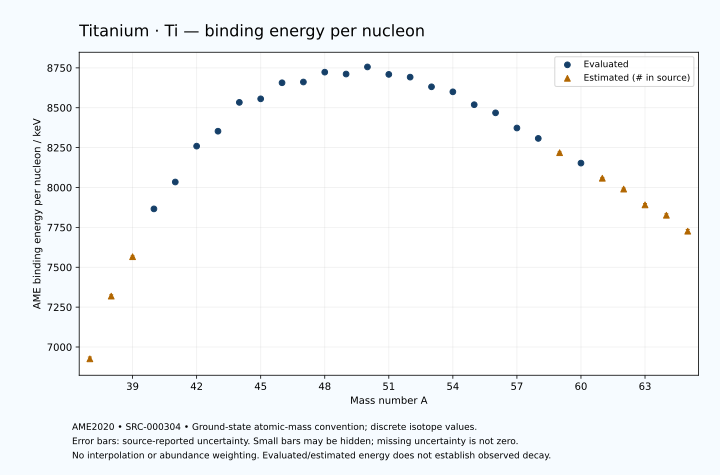

# Titanium — Atomic Masses and Reaction Energies

<!-- generated-by: sync-ame2020.mjs -->

**Dated evaluated data · scientific coverage remains partial.** 29 ground-state nuclides from AME2020. Values and uncertainties are transcribed from the retained unrounded analysis files; estimated quantities remain labelled.

- [Parent Titanium record](0022-Titanium-Ti.md) · [NUBASE states and decays](0022-Titanium-Ti-Nuclear-Evaluation.md)
- [Structured data](data/isotopes/0022-Titanium-Ti-AME2020-Evaluation.yaml)
- [Original mass table](../../data/catalog/sources/ame2020-mass_1.mas20.txt) · [Original reaction table](../../data/catalog/sources/ame2020-rct1.mas20.txt)
- [AME2020 methods](https://doi.org/10.1088/1674-1137/abddb0) (SRC-000303) · [Tables and definitions](https://doi.org/10.1088/1674-1137/abddaf) (SRC-000304)

## Reading the data

All table energies and uncertainties are in keV; binding energy is per nucleon. A # replaces a decimal point in the original estimated value. UNKNOWN (*) retains the source's not-calculable entry; it is neither zero nor automatically NOT APPLICABLE. Source lines are one-based in the retained files. Uncertainties remain those published by the evaluation, with no replacement by independent-mass quadrature.

Atomic-mass conventions apply. Qα is total decay energy, not alpha-particle kinetic energy. Positive Q alone does not establish a decay branch, rate or observation. He-4's source Qα of zero is a bookkeeping identity. These tables describe ground-state combinations, not isomer or excited-daughter transitions. Nuclear state and daughter lookups are explicit in the structured companion. The binding quantity follows [Z M(¹H) + N mₙ − M(A,Z)]c²/A; it has not been converted to a bare-nucleus convention.

## Mass and binding table

| Nuclide | N | Atomic mass excess / keV | AME binding per nucleon / keV | Mass-file line |
|---|---:|---|---|---:|
| Ti-37 | 15 | 25170# ± 400# | 6926# ± 11# | 314 |
| Ti-38 | 16 | 11370# ± 300# | 7319# ± 8# | 326 |
| Ti-39 | 17 | 2500# ± 200# | 7566# ± 5# | 338 |
| Ti-40 | 18 | -8993.439 ± 68.244 | 7865.8632 ± 1.7061 | 350 |
| Ti-41 | 19 | -15697.539 ± 27.945 | 8034.3889 ± 0.6816 | 362 |
| Ti-42 | 20 | -25104.353 ± 0.269 | 8259.2400 ± 0.0064 | 374 |
| Ti-43 | 21 | -29315.591 ± 5.719 | 8352.8054 ± 0.1330 | 386 |
| Ti-44 | 22 | -37548.586 ± 0.700 | 8533.5215 ± 0.0159 | 398 |
| Ti-45 | 23 | -39010.266 ± 0.836 | 8555.7321 ± 0.0186 | 410 |
| Ti-46 | 24 | -44128.269 ± 0.090 | 8656.4623 ± 0.0020 | 422 |
| Ti-47 | 25 | -44937.612 ± 0.080 | 8661.2325 ± 0.0017 | 434 |
| Ti-48 | 26 | -48492.952 ± 0.074 | 8723.0122 ± 0.0016 | 446 |
| Ti-49 | 27 | -48564.012 ± 0.078 | 8711.1625 ± 0.0016 | 459 |
| Ti-50 | 28 | -51431.867 ± 0.082 | 8755.7227 ± 0.0017 | 471 |
| Ti-51 | 29 | -49732.965 ± 0.484 | 8708.9912 ± 0.0095 | 483 |
| Ti-52 | 30 | -49477.698 ± 2.747 | 8691.8193 ± 0.0528 | 495 |
| Ti-53 | 31 | -46881.433 ± 2.888 | 8631.1256 ± 0.0545 | 507 |
| Ti-54 | 32 | -45743.812 ± 15.835 | 8599.6917 ± 0.2932 | 519 |
| Ti-55 | 33 | -41832.469 ± 28.876 | 8518.9696 ± 0.5250 | 531 |
| Ti-56 | 34 | -39422.995 ± 100.201 | 8467.9495 ± 1.7893 | 543 |
| Ti-57 | 35 | -34401.848 ± 205.879 | 8372.9008 ± 3.6119 | 556 |
| Ti-58 | 36 | -30917.668 ± 183.340 | 8307.6290 ± 3.1610 | 569 |
| Ti-59 | 37 | -25880# ± 300# | 8218# ± 5# | 583 |
| Ti-60 | 38 | -22099.698 ± 240.325 | 8152.7858 ± 4.0054 | 596 |
| Ti-61 | 39 | -16370# ± 300# | 8058# ± 5# | 610 |
| Ti-62 | 40 | -12200# ± 400# | 7990# ± 6# | 623 |
| Ti-63 | 41 | -5860# ± 500# | 7891# ± 8# | 636 |
| Ti-64 | 42 | -1480# ± 600# | 7826# ± 9# | 649 |
| Ti-65 | 43 | 5210# ± 700# | 7726# ± 11# | 662 |

## Q-values and separation energies

| Nuclide | Qβ− / keV | Qα / keV | S₂n / keV | S₂p / keV | Reaction-file line |
|---|---|---|---|---|---:|
| Ti-37 | UNKNOWN (*) | -8285# ± 565# | UNKNOWN (*) | -5402# ± 447# | 313 |
| Ti-38 | UNKNOWN (*) | -5945# ± 424# | UNKNOWN (*) | -3243# ± 303# | 325 |
| Ti-39 | -20070# ± 447# | -5115# ± 283# | 38812# ± 447# | -1058# ± 200# | 337 |
| Ti-40 | -21463# ± 308# | -4967.1884 ± 79.1025 | 36506# ± 308# | 1512.8775 ± 68.2440 | 349 |
| Ti-41 | -16008# ± 202# | -4986.3846 ± 27.9520 | 34340# ± 202# | 2992.7742 ± 27.9512 | 361 |
| Ti-42 | -17485# ± 196# | -5470.7658 ± 0.3321 | 32253.5507 ± 68.2442 | 4835.8935 ± 0.2685 | 373 |
| Ti-43 | -11399.2333 ± 43.2287 | -4457.8001 ± 5.7499 | 29760.6883 ± 28.5240 | 8755.6248 ± 5.7206 | 385 |
| Ti-44 | -13740.5071 ± 7.2986 | -5127.1001 ± 0.7000 | 28586.8690 ± 0.7497 | 13579.2350 ± 0.7153 | 397 |
| Ti-45 | -7123.8247 ± 0.2142 | -6297.2739 ± 0.8448 | 25837.3115 ± 5.7794 | 15179.3357 ± 0.8598 | 409 |
| Ti-46 | -7052.3723 ± 0.0923 | -8005.8918 ± 0.1736 | 22722.3192 ± 0.7061 | 17237.4816 ± 0.3365 | 421 |
| Ti-47 | -2930.5422 ± 0.0879 | -8953.6551 ± 0.2408 | 22069.9818 ± 0.8341 | 18703.3237 ± 0.3736 | 433 |
| Ti-48 | -4014.9467 ± 0.9691 | -9449.1378 ± 0.3327 | 20507.3186 ± 0.0561 | 19931.2841 ± 2.2326 | 445 |
| Ti-49 | -601.8555 ± 0.8203 | -10176.6978 ± 0.3732 | 19769.0365 ± 0.0396 | 20797.2889 ± 2.2196 | 458 |
| Ti-50 | -2208.6274 ± 0.0579 | -10717.1735 ± 2.2328 | 19081.5518 ± 0.0316 | 21784.9418 ± 0.0809 | 470 |
| Ti-51 | 2470.1402 ± 0.4820 | -9813.2154 ± 2.2705 | 17311.5889 ± 0.4785 | 23010.9045 ± 0.5150 | 482 |
| Ti-52 | 1965.3340 ± 2.7510 | -7677.7458 ± 2.7468 | 14188.4664 ± 2.7476 | 24466.4097 ± 3.1705 | 494 |
| Ti-53 | 4970.2419 ± 4.2386 | -8006.3463 ± 2.8931 | 13291.1042 ± 2.9279 | 25127.0656 ± 2.9344 | 506 |
| Ti-54 | 4154.4548 ± 19.3840 | -8579.4981 ± 15.9144 | 12408.7509 ± 16.0719 | 26055.4830 ± 15.8496 | 518 |
| Ti-55 | 7292.6673 ± 39.5419 | -7925.0749 ± 28.8810 | 11093.6717 ± 29.0203 | 27022.7033 ± 52.4457 | 530 |
| Ti-56 | 6760.4051 ± 188.1842 | -7581.6397 ± 100.2028 | 9821.8191 ± 101.4441 | 28840.3503 ± 111.2940 | 542 |
| Ti-57 | 10033.2148 ± 222.6466 | -7439.0568 ± 210.4826 | 8712.0158 ± 207.8944 | 30329.4155 ± 260.8749 | 555 |
| Ti-58 | 9512.9152 ± 206.8675 | -8181.9971 ± 189.6303 | 7637.3092 ± 208.9344 | 31985.2201 ± 309.7318 | 568 |
| Ti-59 | 11731# ± 330# | -9654# ± 340# | 7620# ± 364# | 33898# ± 500# | 582 |
| Ti-60 | 10987.7040 ± 301.4311 | -11014.2230 ± 346.5208 | 7324.6653 ± 302.2743 | 35147# ± 555# | 595 |
| Ti-61 | 13807# ± 381# | -12235# ± 500# | 6633# ± 424# | 36758# ± 671# | 609 |
| Ti-62 | 13013# ± 479# | -13094# ± 640# | 6243# ± 466# | 37778# ± 806# | 622 |
| Ti-63 | 15880# ± 605# | -14095# ± 781# | 5633# ± 583# | 39448# ± 944# | 635 |
| Ti-64 | 14840# ± 721# | -14905# ± 922# | 5423# ± 721# | UNKNOWN (*) | 648 |
| Ti-65 | 17320# ± 860# | -16225# ± 1063# | 5073# ± 860# | UNKNOWN (*) | 661 |

Qβ− comes from the mass-file line in the first table. The other three columns come from the reaction-file line. Definitions and original source strings are retained in the structured data.

## Binding-energy chart

Discrete source values and source-reported uncertainties. No interpolation, natural-abundance weighting or observed-decay claim is implied. This quantitative chart supplements the 22 separate illustrative panels.

## Remaining review

Later measurements, state-specific decay branches, isomer Q-values, additional reaction channels and full claim-level review remain open. Existing authored values retain their own provenance; this companion does not overwrite them.
