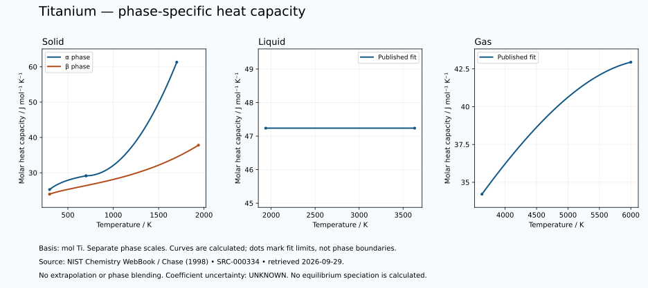

# Titanium — thermal functions and phase-specific heat capacity

<!-- generated-by: sync-thermochemistry.mjs -->

5 published Shomate fits are available in this dated NIST Chemistry WebBook extraction. The source formula is Ti. Condensed data are expressed per mole of this elemental formula; the gas entry describes atomic Ti, not all species in an equilibrium vapour. The element's wider thermal domain remains PARTIAL.

[Parent record](0022-Titanium-Ti.md) · [Structured coefficients](data/structured/0022-Titanium-Ti-NIST-Thermochemistry.yaml) · [Calculated table](tables/0022-Titanium-Ti-TABLE-010-Thermodynamic-Functions.md) · [CSV](tables/0022-Titanium-Ti-TABLE-010-Thermodynamic-Functions.csv)

Source: **SRC-000334**, [NIST Chemistry WebBook](https://webbook.nist.gov/cgi/cbook.cgi?ID=C7440326&Mask=FFFF), retrieved 2026-09-29. [Retained coefficient source](../../data/catalog/sources/nist-thermochemistry-0022-2026-09-29.html.txt) and [publisher's rounded comparison table](../../data/catalog/sources/nist-thermochemistry-0022-2026-09-29-table.html.txt) preserve the exact downloaded bytes and their SHA-256 hashes. The original evaluation is Chase (1998), with each earlier review date retained below.

## Applicable states and intervals

| Fit | Source phase variant | Valid T / K | Source comment |
|---|---|---:|---|
| GAS:1 | UNSPECIFIED-IN-FIT-TABLE | 3630.956–6000 | Data last reviewed in June, 1979 |
| LIQUID:1 | UNSPECIFIED-IN-FIT-TABLE | 1939–3630.956 | Data last reviewed in June, 1979 |
| SOLID:1 | α phase | 298–700 | α phase; Data last reviewed in June, 1979 |
| SOLID:2 | α phase | 700–1700 | α phase; Data last reviewed in June, 1979 |
| SOLID:3 | β phase | 298–1939 | β phase; Data last reviewed in June, 1979 |

A fit interval describes where the publisher supplies coefficients. Its endpoints are not automatically melting points, boiling points or equilibrium phase boundaries. Alternative solid phases may have overlapping ranges. The source's unspecified crystal structure is UNKNOWN. Each gas fit concerns its listed species; dissociation and ionisation equilibria are not calculated. Standard thermochemical functions do not supply arbitrary-pressure behaviour.

## Equations and reference states

With t = T/1000 and T in kelvin, use the exact source A–H coefficients in their published mixed-unit convention:

- Cp° = A + B·t + C·t² + D·t³ + E/t², in J mol⁻¹ K⁻¹.
- H°(T)−H°(298.15 K) = A·t + B·t²/2 + C·t³/3 + D·t⁴/4 − E/t + F − H, in kJ mol⁻¹.
- S° = A·ln(t) + B·t + C·t²/2 + D·t³/3 − E/(2·t²) + G, in J mol⁻¹ K⁻¹.

The last H is a coefficient, not the temperature-dependent enthalpy. Phase-specific reference offsets matter: do not splice enthalpy increments from different phases or interpret coefficient H as latent heat. The 298.15 K reference does not permit extrapolating a high-temperature fit down to 298.15 K. Outside-range evaluation is rejected. Unpublished coefficient uncertainty and covariance remain UNKNOWN; no error bars or extra physical precision are invented.

## Heat-capacity chart

Each panel uses its own temperature scale. Lines sample the published equation; they are not observations or phase-stability predictions. Unknown uncertainties are not zero. These calculated charts supplement the chapter and do not replace any of the 22 requested illustrations.

## Validation and outstanding thermal data

The calculation is checked against the publisher's separately tabulated rounded values and the thermodynamic identities dH/dT = Cp and dS/dT = Cp/T. These checks verify transcription and arithmetic, not independent experimental validity. The source tables retain older evaluations; later measurements and application-specific state conditions need separate review. Thermal conductivity, diffusivity, expansion, pressure dependence, transition enthalpies and a phase diagram remain INSUFFICIENT DATA in this supplement. Existing phase-reference values are preserved for later source reconciliation.
