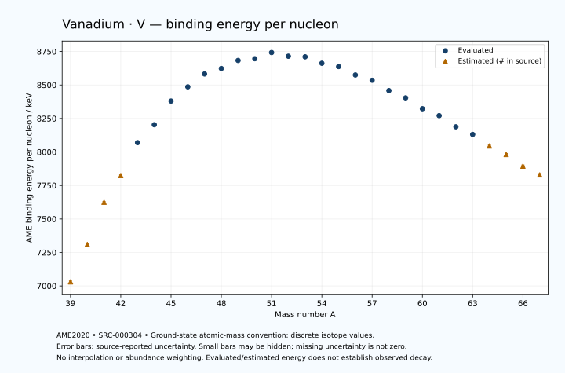

# Vanadium — Atomic Masses and Reaction Energies

<!-- generated-by: sync-ame2020.mjs -->

**Dated evaluated data · scientific coverage remains partial.** 29 ground-state nuclides from AME2020. Values and uncertainties are transcribed from the retained unrounded analysis files; estimated quantities remain labelled.

- [Parent Vanadium record](0023-Vanadium-V.md) · [NUBASE states and decays](0023-Vanadium-V-Nuclear-Evaluation.md)
- [Structured data](data/isotopes/0023-Vanadium-V-AME2020-Evaluation.yaml)
- [Original mass table](../../data/catalog/sources/ame2020-mass_1.mas20.txt) · [Original reaction table 1](../../data/catalog/sources/ame2020-rct1.mas20.txt) · [Original reaction table 2](../../data/catalog/sources/ame2020-rct2.mas20.txt)
- [AME2020 methods](https://doi.org/10.1088/1674-1137/abddb0) (SRC-000303) · [Tables and definitions](https://doi.org/10.1088/1674-1137/abddaf) (SRC-000304)

## Reading the data

All table energies and uncertainties are in keV; binding energy is per nucleon. A # replaces a decimal point in the original estimated value. UNKNOWN (*) retains the source's not-calculable entry; it is neither zero nor automatically NOT APPLICABLE. Source lines are one-based in the retained files. Uncertainties remain those published by the evaluation, with no replacement by independent-mass quadrature.

Atomic-mass conventions apply. Qα is total decay energy, not alpha-particle kinetic energy. Positive Q alone does not establish a decay branch, rate or observation. He-4's source Qα of zero is a bookkeeping identity. These tables describe ground-state combinations, not isomer or excited-daughter transitions. Nuclear state and daughter lookups are explicit in the structured companion. The binding quantity follows [Z M(¹H) + N mₙ − M(A,Z)]c²/A; it has not been converted to a bare-nucleus convention.

## Mass and binding table

| Nuclide | N | Atomic mass excess / keV | AME binding per nucleon / keV | Mass-file line |
|---|---:|---|---|---:|
| V-39 | 16 | 22570# ± 400# | 7031# ± 10# | 339 |
| V-40 | 17 | 12470# ± 300# | 7310# ± 7# | 351 |
| V-41 | 18 | 310# ± 200# | 7625# ± 5# | 363 |
| V-42 | 19 | -7620# ± 196# | 7824# ± 5# | 375 |
| V-43 | 20 | -17916.358 ± 42.849 | 8069.5129 ± 0.9965 | 387 |
| V-44 | 21 | -23808.079 ± 7.265 | 8203.4567 ± 0.1651 | 399 |
| V-45 | 22 | -31886.441 ± 0.863 | 8380.0394 ± 0.0192 | 411 |
| V-46 | 23 | -37075.897 ± 0.134 | 8486.1423 ± 0.0029 | 423 |
| V-47 | 24 | -42007.070 ± 0.110 | 8582.2348 ± 0.0024 | 435 |
| V-48 | 25 | -44478.005 ± 0.972 | 8623.0686 ± 0.0202 | 447 |
| V-49 | 26 | -47962.157 ± 0.824 | 8682.9135 ± 0.0168 | 460 |
| V-50 | 27 | -49223.240 ± 0.093 | 8695.9032 ± 0.0019 | 472 |
| V-51 | 28 | -52203.105 ± 0.097 | 8742.0852 ± 0.0019 | 484 |
| V-52 | 29 | -51443.032 ± 0.159 | 8714.5690 ± 0.0031 | 496 |
| V-53 | 30 | -51851.675 ± 3.103 | 8710.1425 ± 0.0585 | 508 |
| V-54 | 31 | -49898.267 ± 11.180 | 8662.1382 ± 0.2070 | 520 |
| V-55 | 32 | -49125.136 ± 27.013 | 8637.3391 ± 0.4912 | 532 |
| V-56 | 33 | -46183.401 ± 175.884 | 8574.7006 ± 3.1408 | 544 |
| V-57 | 34 | -44435.063 ± 84.766 | 8535.1967 ± 1.4871 | 557 |
| V-58 | 35 | -40430.584 ± 95.816 | 8458.1560 ± 1.6520 | 570 |
| V-59 | 36 | -37610.617 ± 137.400 | 8403.8034 ± 2.3288 | 584 |
| V-60 | 37 | -33087.402 ± 181.946 | 8322.8751 ± 3.0324 | 597 |
| V-61 | 38 | -30177.121 ± 234.920 | 8271.0417 ± 3.8511 | 611 |
| V-62 | 39 | -25213.164 ± 264.287 | 8187.7565 ± 4.2627 | 624 |
| V-63 | 40 | -21740.141 ± 339.995 | 8130.7809 ± 5.3968 | 637 |
| V-64 | 41 | -16320# ± 400# | 8045# ± 6# | 650 |
| V-65 | 42 | -12110# ± 500# | 7981# ± 8# | 663 |
| V-66 | 43 | -6300# ± 500# | 7894# ± 8# | 676 |
| V-67 | 44 | -1744# ± 600# | 7829# ± 9# | 689 |

## Q-values and separation energies

| Nuclide | Qβ− / keV | Qα / keV | S₂n / keV | S₂p / keV | Reaction-file line |
|---|---|---|---|---|---:|
| V-39 | UNKNOWN (*) | -6955# ± 565# | UNKNOWN (*) | -4212# ± 500# | 338 |
| V-40 | UNKNOWN (*) | -6105# ± 424# | UNKNOWN (*) | -2141# ± 361# | 350 |
| V-41 | -20100# ± 447# | -5895# ± 361# | 38403# ± 447# | 95# ± 202# | 362 |
| V-42 | -14679# ± 358# | -5795# ± 280# | 36232# ± 358# | 1674# ± 196# | 374 |
| V-43 | -15946# ± 205# | -6168.5473 ± 49.1123 | 34369# ± 205# | 3851.9397 ± 42.8488 | 386 |
| V-44 | -10386.1805 ± 51.7447 | -5709.6423 ± 7.7960 | 32331# ± 196# | 6265.0182 ± 7.2665 | 398 |
| V-45 | -12371.6400 ± 35.4073 | -5668.9974 ± 0.8662 | 30112.7200 ± 42.8574 | 10276.2337 ± 2.0519 | 410 |
| V-46 | -7604.3264 ± 11.4538 | -7379.8098 ± 0.2036 | 29410.4540 ± 7.2661 | 13837.8041 ± 1.7606 | 422 |
| V-47 | -7443.9769 ± 5.1976 | -8243.8356 ± 1.8661 | 26263.2643 ± 0.8617 | 15512.6905 ± 0.6618 | 434 |
| V-48 | -1656.6918 ± 7.3746 | -9086.8859 ± 2.0066 | 23544.7442 ± 0.9673 | 17294.3039 ± 1.1768 | 446 |
| V-49 | -2629.8047 ± 2.3487 | -9314.7513 ± 1.0534 | 22097.7232 ± 0.8249 | 18203.2564 ± 2.0967 | 459 |
| V-50 | 1038.1240 ± 0.0551 | -9886.5127 ± 0.6706 | 20887.8711 ± 0.9705 | 19297.0989 ± 4.9502 | 471 |
| V-51 | -752.3907 ± 0.1494 | -10291.1787 ± 1.9303 | 20383.5847 ± 0.8228 | 20218.6003 ± 2.2691 | 483 |
| V-52 | 3976.4763 ± 0.1601 | -9363.8644 ± 4.9519 | 18362.4278 ± 0.1397 | 21483.8534 ± 2.5203 | 495 |
| V-53 | 3435.9426 ± 3.1017 | -7714.1438 ± 3.8428 | 15791.2058 ± 3.1024 | 23179.2643 ± 3.9941 | 507 |
| V-54 | 7037.1118 ± 11.1794 | -7786.0627 ± 11.4590 | 14597.8717 ± 11.1803 | 23952.6489 ± 11.5944 | 519 |
| V-55 | 5985.1877 ± 27.0143 | -8299.6990 ± 27.1302 | 13416.0971 ± 27.1909 | 24933.5236 ± 32.2948 | 531 |
| V-56 | 9101.7270 ± 175.8854 | -8084.7560 ± 175.9113 | 12427.7694 ± 176.2393 | 26323.4091 ± 176.4386 | 543 |
| V-57 | 8089.9214 ± 84.7864 | -8090.4245 ± 86.5939 | 11452.5633 ± 88.9662 | 28170.8975 ± 105.2632 | 556 |
| V-58 | 11561.2240 ± 95.8625 | -8417.5660 ± 96.8296 | 10389.8192 ± 200.2899 | 29492.6773 ± 276.7788 | 569 |
| V-59 | 10505.3137 ± 137.4021 | -9193.4251 ± 150.9105 | 9318.1900 ± 161.4440 | 30808.9065 ± 226.2723 | 583 |
| V-60 | 13821.0986 ± 181.9496 | -9996.4690 ± 317.0650 | 8799.4541 ± 205.6335 | 32185.7747 ± 263.0852 | 596 |
| V-61 | 12319.3807 ± 234.9272 | -11222.3845 ± 295.8168 | 8709.1404 ± 272.1511 | 33925.5130 ± 342.7939 | 610 |
| V-62 | 15639.4478 ± 264.3094 | -12158.5104 ± 325.5104 | 8268.3981 ± 320.8613 | 35241# ± 566# | 623 |
| V-63 | 14438.1586 ± 347.6720 | -13335.5063 ± 421.8023 | 7705.6557 ± 413.2604 | 36818# ± 690# | 636 |
| V-64 | 17320# ± 500# | -14194# ± 640# | 7249# ± 479# | 38208# ± 721# | 649 |
| V-65 | 16200# ± 539# | -15035# ± 781# | 6513# ± 605# | 39758# ± 860# | 662 |
| V-66 | 18840# ± 583# | -16035# ± 781# | 6123# ± 640# | UNKNOWN (*) | 675 |
| V-67 | 17526# ± 721# | -17238# ± 922# | 5776# ± 781# | UNKNOWN (*) | 688 |

## Additional decay-energy combinations

| Nuclide | Q₂β− / keV | Q₄β− / keV | Qεp / keV | Qβ−n / keV | Part 1 / part 2 line |
|---|---|---|---|---|---|
| V-39 | UNKNOWN (*) | UNKNOWN (*) | 19531# ± 447# | UNKNOWN (*) | 338 / 344 |
| V-40 | UNKNOWN (*) | UNKNOWN (*) | 19354# ± 301# | UNKNOWN (*) | 350 / 356 |
| V-41 | UNKNOWN (*) | UNKNOWN (*) | 13545# ± 200# | UNKNOWN (*) | 362 / 368 |
| V-42 | UNKNOWN (*) | UNKNOWN (*) | 13734# ± 196# | -36101# ± 445# | 374 / 380 |
| V-43 | -35286# ± 402# | UNKNOWN (*) | 6915.6743 ± 42.8490 | -33047# ± 303# | 386 / 392 |
| V-44 | -31268# ± 300# | UNKNOWN (*) | 5091.0998 ± 7.5000 | -29909# ± 200# | 398 / 404 |
| V-45 | -26907# ± 300# | UNKNOWN (*) | -1359.3776 ± 1.9533 | -26535.8610 ± 51.2394 | 410 / 417 |
| V-46 | -24658.1490 ± 86.6291 | UNKNOWN (*) | -3292.5467 ± 0.6650 | -25632.4135 ± 35.3970 | 422 / 429 |
| V-47 | -19440.6935 ± 31.6710 | -52627# ± 600# | -7534.3975 ± 0.6699 | -20606.8172 ± 11.4535 | 434 / 441 |
| V-48 | -15181.3610 ± 6.7687 | -46208# ± 500# | -7430.1336 ± 2.1592 | -17986.2303 ± 5.2865 | 446 / 453 |
| V-49 | -10342.2312 ± 2.3602 | -38182# ± 500# | -10747.0446 ± 5.0175 | -13212.1616 ± 7.3566 | 459 / 466 |
| V-50 | -6596.3536 ± 0.0869 | -31633.8368 ± 125.7517 | -9949.7640 ± 2.2690 | -11962.2061 ± 2.2007 | 471 / 478 |
| V-51 | -3959.8800 ± 0.2985 | -24860.9589 ± 48.4378 | -14954.9559 ± 2.5172 | -10013.0593 ± 0.0711 | 483 / 491 |
| V-52 | -731.6452 ± 0.1721 | -17099.0531 ± 5.2832 | -15481.6499 ± 2.5200 | -8063.6352 ± 0.1953 | 495 / 503 |
| V-53 | 2838.6747 ± 3.1197 | -9192.2990 ± 3.5490 | -18617.0856 ± 4.3677 | -4503.4851 ± 3.1024 | 507 / 515 |
| V-54 | 5659.9793 ± 11.2242 | -1888.1996 ± 11.1848 | -18417.6838 ± 20.9336 | -2681.9677 ± 11.1796 | 519 / 527 |
| V-55 | 8587.4060 ± 27.0146 | 4904.8602 ± 27.0164 | -21976.1735 ± 30.4132 | -261.0750 ± 27.0137 | 531 / 539 |
| V-56 | 10728.2654 ± 175.8847 | 9857.1172 ± 175.8850 | -22630.2638 ± 186.6290 | 855.6051 ± 175.8846 | 543 / 551 |
| V-57 | 13051.2160 ± 84.7793 | 14910.5947 ± 84.7675 | -26208.1858 ± 273.1503 | 2778.7463 ± 84.7679 | 556 / 565 |
| V-58 | 15396.9847 ± 95.8542 | 19416.7088 ± 95.8230 | -26339.9020 ± 203.7179 | 4023.0830 ± 95.8342 | 569 / 578 |
| V-59 | 17914.7114 ± 137.4202 | 24619.2209 ± 137.4011 | -29420.0191 ± 234.4959 | 6309.8725 ± 137.4328 | 583 / 592 |
| V-60 | 19880.5443 ± 181.9610 | 28563.0359 ± 181.9466 | -29546.8222 ± 308.9089 | 6957.2111 ± 181.9474 | 596 / 605 |
| V-61 | 21565.0084 ± 234.9314 | 32721.0573 ± 234.9213 | -32916# ± 553# | 8660.0609 ± 234.9225 | 610 / 619 |
| V-62 | 23310.8010 ± 264.3679 | 36211.2357 ± 264.9388 | -33002# ± 656# | 9212.0204 ± 264.2935 | 623 / 633 |
| V-63 | 25146.9197 ± 340.0158 | 40111.4120 ± 340.5024 | -36339# ± 690# | 11041.1524 ± 340.0128 | 636 / 646 |
| V-64 | 26669# ± 400# | 43473# ± 400# | -36679# ± 806# | 11787# ± 406# | 649 / 659 |
| V-65 | 28857# ± 500# | 47075# ± 500# | UNKNOWN (*) | 13458# ± 583# | 662 / 672 |
| V-66 | 30451# ± 500# | 50109# ± 500# | UNKNOWN (*) | 13939# ± 539# | 675 / 685 |
| V-67 | 31837# ± 632# | 53578# ± 600# | UNKNOWN (*) | 15325# ± 671# | 688 / 699 |

## Single-nucleon separation and reaction energies

| Nuclide | Sₙ / keV | Sₚ / keV | Q(d,α) / keV | Q(p,α) / keV | Q(n,α) / keV | Part 2 line |
|---|---|---|---|---|---|---:|
| V-39 | UNKNOWN (*) | -3911# ± 500# | 8111# ± 565# | UNKNOWN (*) | 12066# ± 500# | 344 |
| V-40 | 18172# ± 500# | -2681# ± 361# | 11811# ± 424# | -7836# ± 500# | 14336# ± 424# | 356 |
| V-41 | 20231# ± 361# | -2015# ± 212# | 8521# ± 283# | -6196# ± 361# | 10206# ± 283# | 368 |
| V-42 | 16001# ± 280# | -789# ± 198# | 12085# ± 207# | -5256# ± 280# | 12200# ± 197# | 380 |
| V-43 | 18368# ± 200# | 100.9753 ± 42.8496 | 8491.9881 ± 51.1559 | -4058.8637 ± 80.5805 | 8253.3972 ± 42.9420 | 392 |
| V-44 | 13963.0395 ± 43.4602 | 1781.4593 ± 9.2458 | 12007.0813 ± 7.2699 | -3246.4852 ± 28.8737 | 10480.6831 ± 7.2653 | 404 |
| V-45 | 16149.6805 ± 7.3160 | 1626.8264 ± 1.1113 | 8139.9564 ± 5.7834 | -1918.0330 ± 0.9014 | 5880.9636 ± 0.8739 | 417 |
| V-46 | 13260.7735 ± 0.8642 | 5354.6018 ± 0.8372 | 11183.4962 ± 0.7129 | -2896.2509 ± 5.7202 | 4758.6552 ± 1.8676 | 429 |
| V-47 | 13002.4908 ± 0.1056 | 5167.7715 ± 0.0669 | 7714.0036 ± 0.8347 | 405.5717 ± 0.7089 | 1455.3675 ± 1.7590 | 441 |
| V-48 | 10542.2534 ± 0.9713 | 6829.3642 ± 0.9698 | 10361.0713 ± 0.9701 | -603.6836 ± 1.2778 | 2240.7185 ± 1.1723 | 453 |
| V-49 | 11555.4698 ± 1.2699 | 6758.1761 ± 0.8207 | 7686.2622 ± 0.8213 | 1030.1677 ± 0.8226 | -554.1113 ± 1.0585 | 466 |
| V-50 | 9332.4013 ± 0.8223 | 7948.1988 ± 0.0567 | 9980.5187 ± 0.0529 | 578.4271 ± 0.0618 | 760.0047 ± 1.9301 | 478 |
| V-51 | 11051.1834 ± 0.0609 | 8060.2090 ± 0.0658 | 7071.7140 ± 0.0635 | 1153.9016 ± 0.0596 | -2052.6199 ± 4.9503 | 491 |
| V-52 | 7311.2445 ± 0.1258 | 8999.0377 ± 0.4982 | 10699.6427 ± 0.1419 | 1985.0358 ± 0.1409 | 765.8176 ± 2.2726 | 503 |
| V-53 | 8479.9613 ± 3.1049 | 9662.9484 ± 4.1437 | 8592.0971 ± 3.1385 | 4444.2476 ± 3.1020 | -1668.1524 ± 3.9943 | 515 |
| V-54 | 6117.9103 ± 11.6013 | 10305.8052 ± 11.5464 | 10290.2374 ± 11.5120 | 4698.7530 ± 11.1897 | -1001.5122 ± 11.4589 | 527 |
| V-55 | 7298.1868 ± 29.2353 | 10670.2947 ± 31.3126 | 8467.1041 ± 27.1672 | 5216.6169 ± 27.1526 | -2955.1733 ± 27.1877 | 539 |
| V-56 | 5129.5826 ± 177.9467 | 11639.9029 ± 178.2391 | 10271.2189 ± 176.5958 | 5562.0877 ± 175.9081 | -1767.4438 ± 176.7726 | 551 |
| V-57 | 6322.9807 ± 195.2450 | 12301.0388 ± 131.2456 | 8108.2125 ± 89.5495 | 6172.8044 ± 86.2324 | -4350.7275 ± 85.9099 | 565 |
| V-58 | 4066.8385 ± 127.9296 | 13317.7063 ± 227.0836 | 9703.2188 ± 138.6394 | 6265.9402 ± 100.0728 | -3942.0736 ± 114.3495 | 578 |
| V-59 | 5251.3515 ± 167.5100 | 13981.9196 ± 229.1120 | 7502.0383 ± 247.5179 | 6676.4336 ± 170.0560 | -6448.3664 ± 293.7766 | 592 |
| V-60 | 3548.1026 ± 227.9984 | 14497# ± 351# | 8541.0739 ± 258.2979 | 6178.5019 ± 274.7556 | -6061.3468 ± 255.7824 | 605 |
| V-61 | 5161.0378 ± 297.1392 | 15366.3948 ± 336.0709 | 6413# ± 381# | 5604.6023 ± 297.9945 | -9051.1501 ± 302.1535 | 619 |
| V-62 | 3107.3603 ± 353.6027 | 16132# ± 400# | 7597.3411 ± 357.2169 | 5531# ± 400# | -8737.2109 ± 363.5491 | 633 |
| V-63 | 4598.2954 ± 430.6326 | 16829# ± 525# | 5341# ± 453# | 5223.6119 ± 416.3570 | -11543# ± 605# | 646 |
| V-64 | 2651# ± 525# | 17749# ± 640# | 6591# ± 565# | 4914# ± 500# | -11174# ± 721# | 659 |
| V-65 | 3862# ± 640# | 17919# ± 781# | 4460# ± 707# | 4953# ± 640# | -13774# ± 781# | 672 |
| V-66 | 2261# ± 707# | 18799# ± 860# | 5891# ± 781# | 4424# ± 707# | -13723# ± 860# | 685 |
| V-67 | 3515# ± 781# | UNKNOWN (*) | 3757# ± 922# | 4600# ± 848# | UNKNOWN (*) | 699 |

Qβ− comes from the mass-file line in the first table. Qα, S₂n, S₂p, Q₂β−, Qεp and Qβ−n come from reaction part 1; Q₄β− and the last table come from part 2. Qεp is electron-capture/proton energy balance; Qβ−n is beta-minus/neutron energy balance. These are evaluated mass combinations, not observations of decay modes, cross sections or reaction rates. Light-nuclide zero entries can be bookkeeping identities, without a physical A=0 residual. Definitions and original source strings are retained in the structured data.

## Binding-energy chart

Discrete source values and source-reported uncertainties. No interpolation, natural-abundance weighting or observed-decay claim is implied. This quantitative chart supplements the 22 separate illustrative panels.

## Remaining review

Later measurements, state-specific decay branches, isomer Q-values, reaction rates, applicability and full claim-level review remain open. Existing authored values retain their own provenance; this companion does not overwrite them.
