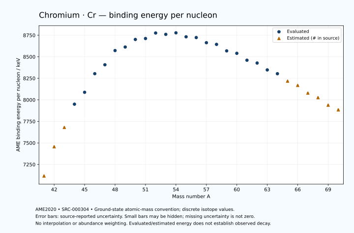

# Chromium — Atomic Masses and Reaction Energies

<!-- generated-by: sync-ame2020.mjs -->

**Dated evaluated data · scientific coverage remains partial.** 30 ground-state nuclides from AME2020. Values and uncertainties are transcribed from the retained unrounded analysis files; estimated quantities remain labelled.

- [Parent Chromium record](0024-Chromium-Cr.md) · [NUBASE states and decays](0024-Chromium-Cr-Nuclear-Evaluation.md)
- [Structured data](data/isotopes/0024-Chromium-Cr-AME2020-Evaluation.yaml)
- [Original mass table](../../data/catalog/sources/ame2020-mass_1.mas20.txt) · [Original reaction table 1](../../data/catalog/sources/ame2020-rct1.mas20.txt) · [Original reaction table 2](../../data/catalog/sources/ame2020-rct2.mas20.txt)
- [AME2020 methods](https://doi.org/10.1088/1674-1137/abddb0) (SRC-000303) · [Tables and definitions](https://doi.org/10.1088/1674-1137/abddaf) (SRC-000304)

## Reading the data

All table energies and uncertainties are in keV; binding energy is per nucleon. A # replaces a decimal point in the original estimated value. UNKNOWN (*) retains the source's not-calculable entry; it is neither zero nor automatically NOT APPLICABLE. Source lines are one-based in the retained files. Uncertainties remain those published by the evaluation, with no replacement by independent-mass quadrature.

Atomic-mass conventions apply. Qα is total decay energy, not alpha-particle kinetic energy. Positive Q alone does not establish a decay branch, rate or observation. He-4's source Qα of zero is a bookkeeping identity. These tables describe ground-state combinations, not isomer or excited-daughter transitions. Nuclear state and daughter lookups are explicit in the structured companion. The binding quantity follows [Z M(¹H) + N mₙ − M(A,Z)]c²/A; it has not been converted to a bare-nucleus convention.

## Mass and binding table

| Nuclide | N | Atomic mass excess / keV | AME binding per nucleon / keV | Mass-file line |
|---|---:|---|---|---:|
| Cr-41 | 17 | 20410# ± 400# | 7116# ± 10# | 364 |
| Cr-42 | 18 | 7060# ± 300# | 7456# ± 7# | 376 |
| Cr-43 | 19 | -1970# ± 200# | 7680# ± 5# | 388 |
| Cr-44 | 20 | -13421.899 ± 51.232 | 7949.6265 ± 1.1644 | 400 |
| Cr-45 | 21 | -19514.801 ± 35.397 | 8087.7286 ± 0.7866 | 412 |
| Cr-46 | 22 | -29471.570 ± 11.453 | 8303.8233 ± 0.2490 | 424 |
| Cr-47 | 23 | -34563.093 ± 5.197 | 8407.2067 ± 0.1106 | 436 |
| Cr-48 | 24 | -42821.313 ± 7.311 | 8572.2553 ± 0.1523 | 448 |
| Cr-49 | 25 | -45332.352 ± 2.202 | 8613.2777 ± 0.0449 | 461 |
| Cr-50 | 26 | -50261.364 ± 0.094 | 8701.0188 ± 0.0019 | 473 |
| Cr-51 | 27 | -51450.715 ± 0.167 | 8711.9923 ± 0.0033 | 485 |
| Cr-52 | 28 | -55419.508 ± 0.112 | 8775.9946 ± 0.0022 | 497 |
| Cr-53 | 29 | -55287.618 ± 0.116 | 8760.2103 ± 0.0022 | 509 |
| Cr-54 | 30 | -56935.379 ± 0.132 | 8777.9672 ± 0.0025 | 521 |
| Cr-55 | 31 | -55110.324 ± 0.228 | 8731.9362 ± 0.0042 | 533 |
| Cr-56 | 32 | -55285.128 ± 0.578 | 8723.2609 ± 0.0103 | 545 |
| Cr-57 | 33 | -52524.985 ± 1.863 | 8663.3998 ± 0.0327 | 558 |
| Cr-58 | 34 | -51991.808 ± 2.981 | 8643.9987 ± 0.0514 | 571 |
| Cr-59 | 35 | -48115.931 ± 0.671 | 8568.5995 ± 0.0114 | 585 |
| Cr-60 | 36 | -46908.500 ± 1.118 | 8540.1876 ± 0.0186 | 598 |
| Cr-61 | 37 | -42496.502 ± 1.863 | 8460.1734 ± 0.0305 | 612 |
| Cr-62 | 38 | -40852.611 ± 3.447 | 8427.3871 ± 0.0556 | 625 |
| Cr-63 | 39 | -36178.299 ± 72.657 | 8347.5398 ± 1.1533 | 638 |
| Cr-64 | 40 | -33639.978 ± 299.941 | 8303.5626 ± 4.6866 | 651 |
| Cr-65 | 41 | -28310# ± 200# | 8218# ± 3# | 664 |
| Cr-66 | 42 | -25140# ± 300# | 8168# ± 5# | 677 |
| Cr-67 | 43 | -19270# ± 400# | 8079# ± 6# | 690 |
| Cr-68 | 44 | -15690# ± 500# | 8026# ± 7# | 703 |
| Cr-69 | 45 | -9630# ± 500# | 7939# ± 7# | 716 |
| Cr-70 | 46 | -5640# ± 600# | 7884# ± 9# | 729 |

## Q-values and separation energies

| Nuclide | Qβ− / keV | Qα / keV | S₂n / keV | S₂p / keV | Reaction-file line |
|---|---|---|---|---|---:|
| Cr-41 | UNKNOWN (*) | -7185# ± 565# | UNKNOWN (*) | -3332# ± 447# | 363 |
| Cr-42 | UNKNOWN (*) | -6735# ± 424# | UNKNOWN (*) | -1475# ± 308# | 375 |
| Cr-43 | -19340# ± 447# | -6895# ± 283# | 38523# ± 447# | 851# ± 202# | 387 |
| Cr-44 | -20882# ± 304# | -6853.3757 ± 85.3343 | 36624# ± 304# | 2895.4874 ± 51.2329 | 399 |
| Cr-45 | -14535# ± 302# | -6242.1787 ± 45.0982 | 33687# ± 203# | 4777.1528 ± 35.8558 | 411 |
| Cr-46 | -17053.8226 ± 87.3828 | -6792.1331 ± 11.4561 | 32192.3081 ± 52.4967 | 6500.9265 ± 11.4744 | 423 |
| Cr-47 | -11996.7167 ± 32.0943 | -7672.4178 ± 7.7273 | 31190.9275 ± 35.7762 | 10130.7687 ± 5.2633 | 435 |
| Cr-48 | -13524.6692 ± 9.9157 | -7697.6429 ± 7.3446 | 29492.3788 ± 13.5876 | 13270.9861 ± 7.3109 | 447 |
| Cr-49 | -7712.4265 ± 0.2329 | -8747.0017 ± 2.3532 | 26911.8953 ± 5.6437 | 14972.6823 ± 2.2009 | 460 |
| Cr-50 | -7634.4776 ± 0.0672 | -8558.0106 ± 0.0779 | 23582.6869 ± 7.3105 | 16346.3544 ± 0.0540 | 472 |
| Cr-51 | -3207.4893 ± 0.3256 | -8938.0185 ± 0.1534 | 22260.9987 ± 2.2050 | 17464.6444 ± 0.1517 | 484 |
| Cr-52 | -4708.1214 ± 0.0633 | -9351.4721 ± 0.0793 | 21300.7801 ± 0.0958 | 18565.5827 ± 0.0852 | 496 |
| Cr-53 | -597.2679 ± 0.3430 | -9148.5212 ± 0.0871 | 19979.5392 ± 0.1720 | 20132.5947 ± 0.4859 | 508 |
| Cr-54 | -1377.1325 ± 1.0051 | -7928.4276 ± 0.1104 | 17658.5072 ± 0.1231 | 22035.6236 ± 2.7496 | 520 |
| Cr-55 | 2602.2183 ± 0.3219 | -7802.2745 ± 0.5242 | 15965.3422 ± 0.2118 | 22806.8328 ± 2.8966 | 532 |
| Cr-56 | 1626.5384 ± 0.5524 | -8232.3457 ± 2.8067 | 14492.3846 ± 0.5809 | 24119.2573 ± 15.8459 | 544 |
| Cr-57 | 4961.2946 ± 2.3948 | -8068.4674 ± 3.4365 | 13557.2971 ± 1.8769 | 25270.4581 ± 28.9364 | 557 |
| Cr-58 | 3835.7607 ± 4.0227 | -8672.9111 ± 16.1135 | 12849.3162 ± 3.0363 | 27146.7543 ± 100.2449 | 570 |
| Cr-59 | 7409.3977 ± 2.4234 | -8708.3780 ± 28.8841 | 11733.5823 ± 1.9800 | 28292.0246 ± 205.8803 | 584 |
| Cr-60 | 6059.4457 ± 2.5831 | -9910.4207 ± 100.2068 | 11059.3288 ± 3.1835 | 30568.7739 ± 183.3431 | 597 |
| Cr-61 | 9245.6277 ± 2.9822 | -10519.5695 ± 205.8876 | 10523.2073 ± 1.9800 | 31195# ± 300# | 611 |
| Cr-62 | 7671.3532 ± 7.3947 | -12359.8588 ± 183.3721 | 10086.7473 ± 3.6233 | 33330.8559 ± 240.3502 | 624 |
| Cr-63 | 10708.7611 ± 72.7520 | -12724# ± 309# | 9824.4336 ± 72.6804 | 34386# ± 309# | 637 |
| Cr-64 | 9349.0622 ± 299.9620 | -13965.1963 ± 384.3449 | 8930.0028 ± 299.9609 | 36018# ± 500# | 650 |
| Cr-65 | 12657# ± 200# | -14365# ± 361# | 8274# ± 213# | 37028# ± 539# | 663 |
| Cr-66 | 11610# ± 300# | -15365# ± 500# | 7643# ± 424# | 38238# ± 671# | 676 |
| Cr-67 | 14311# ± 447# | -15835# ± 640# | 7102# ± 447# | 39058# ± 806# | 689 |
| Cr-68 | 13230# ± 583# | -16635# ± 781# | 6693# ± 583# | UNKNOWN (*) | 702 |
| Cr-69 | 15730# ± 640# | -17265# ± 860# | 6503# ± 640# | UNKNOWN (*) | 715 |
| Cr-70 | 14810# ± 781# | UNKNOWN (*) | 6093# ± 781# | UNKNOWN (*) | 728 |

## Additional decay-energy combinations

| Nuclide | Q₂β− / keV | Q₄β− / keV | Qεp / keV | Qβ−n / keV | Part 1 / part 2 line |
|---|---|---|---|---|---|
| Cr-41 | UNKNOWN (*) | UNKNOWN (*) | 22114# ± 405# | UNKNOWN (*) | 363 / 369 |
| Cr-42 | UNKNOWN (*) | UNKNOWN (*) | 15468# ± 301# | UNKNOWN (*) | 375 / 381 |
| Cr-43 | UNKNOWN (*) | UNKNOWN (*) | 15845# ± 200# | UNKNOWN (*) | 387 / 393 |
| Cr-44 | UNKNOWN (*) | UNKNOWN (*) | 8604.7212 ± 51.5504 | -38863# ± 403# | 399 / 405 |
| Cr-45 | -33923# ± 285# | UNKNOWN (*) | 10744.8136 ± 35.4037 | -35046# ± 302# | 411 / 418 |
| Cr-46 | -30682# ± 300# | UNKNOWN (*) | 2249.7246 ± 11.4834 | -32563# ± 300# | 423 / 430 |
| Cr-47 | -27433# ± 500# | UNKNOWN (*) | 2276.2054 ± 5.1972 | -30216.6630 ± 86.7847 | 435 / 442 |
| Cr-48 | -24812.7377 ± 92.5073 | -60999# ± 424# | -5172.6724 ± 7.3108 | -28326.2551 ± 32.5037 | 447 / 454 |
| Cr-49 | -20581.6222 ± 24.3187 | -53862# ± 600# | -4128.3714 ± 2.2007 | -24107.0261 ± 7.0512 | 460 / 467 |
| Cr-50 | -15784.9043 ± 8.3840 | -46802# ± 500# | -8986.3228 ± 0.0583 | -20712.7566 ± 2.2123 | 472 / 479 |
| Cr-51 | -11261.5292 ± 1.4081 | -39801# ± 500# | -7307.8182 ± 0.1527 | -16895.1462 ± 0.1623 | 484 / 492 |
| Cr-52 | -7087.4126 ± 0.1397 | -32859.6523 ± 82.9031 | -12975.5140 ± 0.4851 | -15247.6007 ± 0.3050 | 496 / 504 |
| Cr-53 | -4340.1343 ± 1.6703 | -25656.7902 ± 25.1506 | -13098.8910 ± 2.7489 | -12647.5491 ± 0.1155 | 508 / 516 |
| Cr-54 | -680.7637 ± 0.3461 | -17657.0673 ± 4.6594 | -17342.9171 ± 2.8907 | -10316.3474 ± 0.3498 | 520 / 528 |
| Cr-55 | 2371.0979 ± 0.3619 | -9774.3625 ± 0.7311 | -16655.4824 ± 15.8370 | -7623.3952 ± 1.0222 | 532 / 540 |
| Cr-56 | 5322.0357 ± 0.5123 | -1377.4787 ± 0.6016 | -20741.6299 ± 28.8821 | -5643.9036 ± 0.5358 | 544 / 552 |
| Cr-57 | 7657.0321 ± 1.8822 | 3558.9762 ± 1.9472 | -20390.9603 ± 100.2179 | -3684.6368 ± 1.8859 | 557 / 566 |
| Cr-58 | 10163.4634 ± 2.9975 | 8237.0637 ± 3.0012 | -24878.9303 ± 205.9008 | -2576.8464 ± 3.3391 | 570 / 579 |
| Cr-59 | 12549.0267 ± 0.7476 | 13040.9022 ± 0.7570 | -24487.2334 ± 183.3409 | -359.6806 ± 2.7834 | 584 / 593 |
| Cr-60 | 14504.6739 ± 3.5848 | 17564.7430 ± 1.1722 | -28318# ± 300# | 545.5102 ± 2.5831 | 597 / 606 |
| Cr-61 | 16424.0007 ± 3.2052 | 21725.5269 ± 1.8965 | -27685.7755 ± 240.3327 | 2400.1258 ± 2.9822 | 611 / 620 |
| Cr-62 | 18025.4452 ± 4.4371 | 25893.8283 ± 3.4726 | -31772# ± 300# | 2818.2002 ± 4.1595 | 624 / 634 |
| Cr-63 | 19457.3296 ± 72.7838 | 29334.5920 ± 72.6578 | -31267# ± 406# | 4274.3471 ± 72.9505 | 637 / 647 |
| Cr-64 | 21329.5739 ± 299.9831 | 33459.0557 ± 299.9415 | -35069# ± 583# | 5175.7645 ± 299.9642 | 650 / 660 |
| Cr-65 | 22908# ± 200# | 36816# ± 200# | -34119# ± 632# | 6608# ± 200# | 663 / 673 |
| Cr-66 | 24928# ± 300# | 40866# ± 300# | -37639# ± 761# | 7756# ± 300# | 676 / 686 |
| Cr-67 | 26439# ± 400# | 44473# ± 400# | UNKNOWN (*) | 9409# ± 400# | 689 / 700 |
| Cr-68 | 28207# ± 536# | 47774# ± 500# | UNKNOWN (*) | 9819# ± 539# | 702 / 713 |
| Cr-69 | 29569# ± 539# | 50349# ± 500# | UNKNOWN (*) | 11219# ± 583# | 715 / 726 |
| Cr-70 | 31250# ± 671# | 53574# ± 600# | UNKNOWN (*) | 11648# ± 721# | 728 / 739 |

## Single-nucleon separation and reaction energies

| Nuclide | Sₙ / keV | Sₚ / keV | Q(d,α) / keV | Q(p,α) / keV | Q(n,α) / keV | Part 2 line |
|---|---|---|---|---|---|---:|
| Cr-41 | UNKNOWN (*) | -651# ± 500# | 8551# ± 565# | UNKNOWN (*) | 14687# ± 500# | 369 |
| Cr-42 | 21421# ± 500# | 539# ± 361# | 5301# ± 424# | -10646# ± 500# | 10206# ± 361# | 381 |
| Cr-43 | 17101# ± 361# | 1639# ± 280# | 8431# ± 283# | -9576# ± 361# | 12670# ± 212# | 393 |
| Cr-44 | 19523# ± 207# | 2794.5120 ± 66.7888 | 4909# ± 202# | -8868# ± 207# | 7922.0423 ± 58.3579 | 405 |
| Cr-45 | 14164.2210 ± 62.2709 | 2995.6935 ± 36.1346 | 9112.3631 ± 55.5783 | -7031# ± 199# | 11235.9540 ± 35.3978 | 418 |
| Cr-46 | 18028.0871 ± 37.2035 | 4874.1001 ± 11.4854 | 5047.3156 ± 13.5628 | -6691.1577 ± 44.3530 | 5490.4225 ± 12.8015 | 430 |
| Cr-47 | 13162.8404 ± 12.5768 | 4776.1669 ± 5.1982 | 8034.1557 ± 5.2676 | -5890.9586 ± 8.9322 | 8631.8955 ± 5.2436 | 442 |
| Cr-48 | 16329.5384 ± 8.9696 | 8103.2146 ± 7.3112 | 4965.3908 ± 7.3116 | -6070.8165 ± 7.3612 | 1835.3552 ± 7.3581 | 454 |
| Cr-49 | 10582.3569 ± 7.6343 | 8143.3181 ± 2.4046 | 7385.5247 ± 2.2023 | -3392.3999 ± 2.2036 | 4442.3194 ± 2.2014 | 467 |
| Cr-50 | 13000.3301 ± 2.2000 | 9588.1783 ± 0.8224 | 4927.4480 ± 0.9706 | -3390.2391 ± 0.0998 | 322.6501 ± 0.0627 | 479 |
| Cr-51 | 9260.6686 ± 0.1477 | 9516.4456 ± 0.1510 | 7222.2492 ± 0.8342 | -2108.6543 ± 0.9806 | 2688.6394 ± 0.1500 | 492 |
| Cr-52 | 12040.1115 ± 0.1697 | 10505.3737 ± 0.0990 | 4514.5391 ± 0.0951 | -2593.2960 ± 0.8245 | -1209.0935 ± 0.0826 | 504 |
| Cr-53 | 7939.4277 ± 0.0966 | 11133.5569 ± 0.1624 | 7626.2947 ± 0.1028 | -1200.3224 ± 0.0991 | 1790.6520 ± 0.0896 | 516 |
| Cr-54 | 9719.0796 ± 0.1013 | 12372.6752 ± 3.1000 | 5218.4596 ± 0.1748 | 131.7814 ± 0.1213 | -1556.0119 ± 0.4901 | 528 |
| Cr-55 | 6246.2627 ± 0.1859 | 12501.0275 ± 11.1810 | 7452.1583 ± 3.1056 | 1196.7632 ± 0.2552 | 13.7762 ± 2.7559 | 540 |
| Cr-56 | 8246.1219 ± 0.6099 | 13448.9626 ± 27.0195 | 5323.9467 ± 11.1941 | 1430.6026 ± 3.1539 | -2757.2923 ± 2.9449 | 552 |
| Cr-57 | 5311.1752 ± 1.9506 | 13630.5551 ± 175.8943 | 7310.9584 ± 27.0775 | 2237.3378 ± 11.3337 | -1134.7700 ± 15.9446 | 566 |
| Cr-58 | 7538.1410 ± 3.5151 | 14845.7155 ± 84.8184 | 4902.4000 ± 175.9097 | 1997.3836 ± 27.1773 | -4512.9367 ± 29.0298 | 579 |
| Cr-59 | 4195.4413 ± 3.0553 | 14974.3182 ± 95.8184 | 7029.9394 ± 84.7686 | 2931.5250 ± 175.8857 | -3046.5332 ± 100.2028 | 593 |
| Cr-60 | 6863.8875 ± 1.3036 | 16586.8543 ± 137.4050 | 4232.8904 ± 95.8226 | 2390.6182 ± 84.7733 | -6860.2497 ± 205.8822 | 606 |
| Cr-61 | 3659.3198 ± 2.1726 | 16698.0714 ± 181.9557 | 5824.9221 ± 137.4131 | 2798.1368 ± 95.8342 | -5932.4313 ± 183.3491 | 620 |
| Cr-62 | 6427.4274 ± 3.9178 | 17964.4611 ± 234.9451 | 2945.5973 ± 181.9788 | 1622.0609 ± 137.4437 | -9327# ± 300# | 634 |
| Cr-63 | 3397.0061 ± 72.7382 | 18254.1070 ± 274.0922 | 4709.6289 ± 245.8989 | 1773.1573 ± 195.9167 | -8432.1997 ± 251.0683 | 647 |
| Cr-64 | 5532.9966 ± 308.6157 | 19188.8082 ± 453.3889 | 2283.9926 ± 399.7652 | 1401.1985 ± 380.9882 | -11623# ± 424# | 660 |
| Cr-65 | 2741# ± 361# | 19279# ± 447# | 4141# ± 395# | 1767# ± 332# | -10464# ± 447# | 673 |
| Cr-66 | 4901# ± 361# | 20319# ± 583# | 1890# ± 500# | 1464# ± 453# | -13634# ± 583# | 686 |
| Cr-67 | 2201# ± 500# | 20259# ± 640# | 3551# ± 640# | 1914# ± 565# | -12143# ± 721# | 700 |
| Cr-68 | 4492# ± 640# | 21235# ± 781# | 1320# ± 707# | 1284# ± 707# | -15254# ± 860# | 713 |
| Cr-69 | 2011# ± 707# | UNKNOWN (*) | 2825# ± 781# | 1534# ± 707# | UNKNOWN (*) | 726 |
| Cr-70 | 4082# ± 781# | UNKNOWN (*) | UNKNOWN (*) | 968# ± 848# | UNKNOWN (*) | 739 |

Qβ− comes from the mass-file line in the first table. Qα, S₂n, S₂p, Q₂β−, Qεp and Qβ−n come from reaction part 1; Q₄β− and the last table come from part 2. Qεp is electron-capture/proton energy balance; Qβ−n is beta-minus/neutron energy balance. These are evaluated mass combinations, not observations of decay modes, cross sections or reaction rates. Light-nuclide zero entries can be bookkeeping identities, without a physical A=0 residual. Definitions and original source strings are retained in the structured data.

## Binding-energy chart

Discrete source values and source-reported uncertainties. No interpolation, natural-abundance weighting or observed-decay claim is implied. This quantitative chart supplements the 22 separate illustrative panels.

## Remaining review

Later measurements, state-specific decay branches, isomer Q-values, reaction rates, applicability and full claim-level review remain open. Existing authored values retain their own provenance; this companion does not overwrite them.
