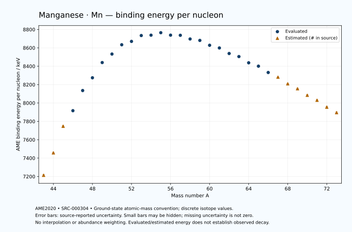

# Manganese — Atomic Masses and Reaction Energies

<!-- generated-by: sync-ame2020.mjs -->

**Dated evaluated data · scientific coverage remains partial.** 31 ground-state nuclides from AME2020. Values and uncertainties are transcribed from the retained unrounded analysis files; estimated quantities remain labelled.

- [Parent Manganese record](0025-Manganese-Mn.md) · [NUBASE states and decays](0025-Manganese-Mn-Nuclear-Evaluation.md)
- [Structured data](data/isotopes/0025-Manganese-Mn-AME2020-Evaluation.yaml)
- [Original mass table](../../data/catalog/sources/ame2020-mass_1.mas20.txt) · [Original reaction table](../../data/catalog/sources/ame2020-rct1.mas20.txt)
- [AME2020 methods](https://doi.org/10.1088/1674-1137/abddb0) (SRC-000303) · [Tables and definitions](https://doi.org/10.1088/1674-1137/abddaf) (SRC-000304)

## Reading the data

All table energies and uncertainties are in keV; binding energy is per nucleon. A # replaces a decimal point in the original estimated value. UNKNOWN (*) retains the source's not-calculable entry; it is neither zero nor automatically NOT APPLICABLE. Source lines are one-based in the retained files. Uncertainties remain those published by the evaluation, with no replacement by independent-mass quadrature.

Atomic-mass conventions apply. Qα is total decay energy, not alpha-particle kinetic energy. Positive Q alone does not establish a decay branch, rate or observation. He-4's source Qα of zero is a bookkeeping identity. These tables describe ground-state combinations, not isomer or excited-daughter transitions. Nuclear state and daughter lookups are explicit in the structured companion. The binding quantity follows [Z M(¹H) + N mₙ − M(A,Z)]c²/A; it has not been converted to a bare-nucleus convention.

## Mass and binding table

| Nuclide | N | Atomic mass excess / keV | AME binding per nucleon / keV | Mass-file line |
|---|---:|---|---|---:|
| Mn-43 | 18 | 17370# ± 400# | 7213# ± 9# | 389 |
| Mn-44 | 19 | 7460# ± 300# | 7457# ± 7# | 401 |
| Mn-45 | 20 | -4980# ± 300# | 7747# ± 7# | 413 |
| Mn-46 | 21 | -12417.748 ± 86.629 | 7916.0805 ± 1.8832 | 425 |
| Mn-47 | 22 | -22566.376 ± 31.671 | 8135.3117 ± 0.6738 | 437 |
| Mn-48 | 23 | -29296.644 ± 6.699 | 8274.1924 ± 0.1396 | 449 |
| Mn-49 | 24 | -37619.925 ± 2.214 | 8439.9150 ± 0.0452 | 462 |
| Mn-50 | 25 | -42626.886 ± 0.115 | 8532.6823 ± 0.0023 | 474 |
| Mn-51 | 26 | -48243.225 ± 0.304 | 8633.7602 ± 0.0060 | 486 |
| Mn-52 | 27 | -50711.387 ± 0.129 | 8670.4087 ± 0.0025 | 498 |
| Mn-53 | 28 | -54690.350 ± 0.346 | 8734.1798 ± 0.0065 | 510 |
| Mn-54 | 29 | -55558.247 ± 1.007 | 8737.9768 ± 0.0186 | 522 |
| Mn-55 | 30 | -57712.542 ± 0.260 | 8765.0247 ± 0.0047 | 534 |
| Mn-56 | 31 | -56911.666 ± 0.293 | 8738.3358 ± 0.0052 | 546 |
| Mn-57 | 32 | -57486.279 ± 1.505 | 8736.7146 ± 0.0264 | 559 |
| Mn-58 | 33 | -55827.568 ± 2.701 | 8696.6438 ± 0.0466 | 572 |
| Mn-59 | 34 | -55525.328 ± 2.329 | 8680.9224 ± 0.0395 | 586 |
| Mn-60 | 35 | -52967.946 ± 2.329 | 8628.1392 ± 0.0388 | 599 |
| Mn-61 | 36 | -51742.130 ± 2.329 | 8598.9157 ± 0.0382 | 613 |
| Mn-62 | 37 | -48523.965 ± 6.542 | 8538.5002 ± 0.1055 | 626 |
| Mn-63 | 38 | -46887.061 ± 3.726 | 8505.1020 ± 0.0591 | 639 |
| Mn-64 | 39 | -42989.040 ± 3.540 | 8437.4175 ± 0.0553 | 652 |
| Mn-65 | 40 | -40967.344 ± 3.726 | 8400.6822 ± 0.0573 | 665 |
| Mn-66 | 41 | -36750.392 ± 11.178 | 8331.7986 ± 0.1694 | 678 |
| Mn-67 | 42 | -33580# ± 200# | 8281# ± 3# | 691 |
| Mn-68 | 43 | -28920# ± 300# | 8209# ± 4# | 704 |
| Mn-69 | 44 | -25360# ± 400# | 8155# ± 6# | 717 |
| Mn-70 | 45 | -20450# ± 500# | 8084# ± 7# | 730 |
| Mn-71 | 46 | -16620# ± 500# | 8030# ± 7# | 742 |
| Mn-72 | 47 | -11170# ± 600# | 7955# ± 8# | 755 |
| Mn-73 | 48 | -6700# ± 600# | 7895# ± 8# | 768 |

## Q-values and separation energies

| Nuclide | Qβ− / keV | Qα / keV | S₂n / keV | S₂p / keV | Reaction-file line |
|---|---|---|---|---|---:|
| Mn-43 | UNKNOWN (*) | -7625# ± 565# | UNKNOWN (*) | -2481# ± 447# | 388 |
| Mn-44 | UNKNOWN (*) | -7434# ± 424# | UNKNOWN (*) | -502# ± 358# | 400 |
| Mn-45 | -19388# ± 412# | -7715# ± 361# | 38492# ± 500# | 1641# ± 303# | 412 |
| Mn-46 | -13628# ± 312# | -7223# ± 214# | 36021# ± 312# | 3187.6110 ± 86.9330 | 424 |
| Mn-47 | -15437# ± 501# | -7074.9344 ± 53.2828 | 33729# ± 302# | 5257.8768 ± 31.6826 | 436 |
| Mn-48 | -11288.0685 ± 92.4609 | -7913.4808 ± 9.8818 | 33021.5322 ± 86.8876 | 6798.6892 ± 6.6999 | 448 |
| Mn-49 | -12869.1957 ± 24.3199 | -8158.3999 ± 2.3744 | 31196.1855 ± 31.7481 | 10190.7980 ± 2.2145 | 461 |
| Mn-50 | -8150.4267 ± 8.3842 | -7975.9054 ± 0.1427 | 29472.8786 ± 6.6995 | 12726.8236 ± 0.9729 | 473 |
| Mn-51 | -8054.0400 ± 1.4309 | -8661.0715 ± 0.3064 | 26765.9359 ± 2.2313 | 14859.0107 ± 0.8719 | 485 |
| Mn-52 | -2379.2912 ± 0.1534 | -8658.2974 ± 0.9744 | 24227.1362 ± 0.1330 | 16066.0887 ± 0.1143 | 497 |
| Mn-53 | -3742.8664 ± 1.6971 | -9153.1088 ± 0.8876 | 22589.7606 ± 0.4470 | 17065.1866 ± 0.3434 | 509 |
| Mn-54 | 696.3688 ± 1.0587 | -8759.9225 ± 1.0049 | 20989.4962 ± 1.0067 | 18693.1570 ± 1.0131 | 521 |
| Mn-55 | -231.1204 ± 0.1786 | -7934.3526 ± 0.2650 | 19164.8284 ± 0.4009 | 20438.8092 ± 3.1111 | 533 |
| Mn-56 | 3695.4973 ± 0.2065 | -7893.5501 ± 0.3226 | 17496.0555 ± 1.0434 | 21591.3408 ± 11.1829 | 545 |
| Mn-57 | 2695.7375 ± 1.5219 | -8059.5201 ± 3.4481 | 15916.3733 ± 1.5194 | 22939.0854 ± 27.0552 | 558 |
| Mn-58 | 6327.7027 ± 2.7198 | -8354.2169 ± 11.5012 | 15058.5385 ± 2.7172 | 24222.1099 ± 175.9052 | 571 |
| Mn-59 | 5139.6290 ± 2.3520 | -8825.1083 ± 27.1135 | 14181.6854 ± 2.7726 | 25668.2074 ± 84.7979 | 585 |
| Mn-60 | 8445.2283 ± 4.1261 | -9209.4612 ± 175.8998 | 13283.0137 ± 3.5665 | 27115.3044 ± 95.8444 | 598 |
| Mn-61 | 7178.3730 ± 3.4965 | -9731.9824 ± 84.7979 | 12359.4373 ± 3.2933 | 28709.4548 ± 137.4202 | 612 |
| Mn-62 | 10354.0920 ± 7.1142 | -10518.2968 ± 96.0392 | 11698.6548 ± 6.9445 | 30014.5051 ± 182.0637 | 625 |
| Mn-63 | 8748.5685 ± 5.6915 | -11701.3594 ± 137.4510 | 11287.5671 ± 4.3938 | 31287.8814 ± 234.9494 | 638 |
| Mn-64 | 11980.5117 ± 6.1402 | -12326.5545 ± 181.9806 | 10607.7118 ± 7.4385 | 32353.8188 ± 264.3106 | 651 |
| Mn-65 | 10250.5576 ± 6.3257 | -13215.1387 ± 234.9494 | 10222.9197 ± 5.2693 | 33805.1454 ± 340.0158 | 664 |
| Mn-66 | 13317.4543 ± 11.9056 | -13962.1446 ± 264.5232 | 9903.9881 ± 11.7250 | 35009# ± 400# | 677 |
| Mn-67 | 12128# ± 200# | -14265# ± 395# | 8756# ± 200# | 36048# ± 539# | 690 |
| Mn-68 | 14977# ± 356# | -15025# ± 500# | 8312# ± 300# | 37198# ± 583# | 703 |
| Mn-69 | 13839# ± 447# | -15674# ± 640# | 7922# ± 447# | 38194# ± 721# | 716 |
| Mn-70 | 16440# ± 583# | -16575# ± 707# | 7673# ± 583# | UNKNOWN (*) | 729 |
| Mn-71 | 15310# ± 640# | -17301# ± 781# | 7402# ± 640# | UNKNOWN (*) | 741 |
| Mn-72 | 18080# ± 781# | UNKNOWN (*) | 6862# ± 781# | UNKNOWN (*) | 754 |
| Mn-73 | 17289# ± 781# | UNKNOWN (*) | 6223# ± 781# | UNKNOWN (*) | 767 |

Qβ− comes from the mass-file line in the first table. The other three columns come from the reaction-file line. Definitions and original source strings are retained in the structured data.

## Binding-energy chart

Discrete source values and source-reported uncertainties. No interpolation, natural-abundance weighting or observed-decay claim is implied. This quantitative chart supplements the 22 separate illustrative panels.

## Remaining review

Later measurements, state-specific decay branches, isomer Q-values, additional reaction channels and full claim-level review remain open. Existing authored values retain their own provenance; this companion does not overwrite them.
