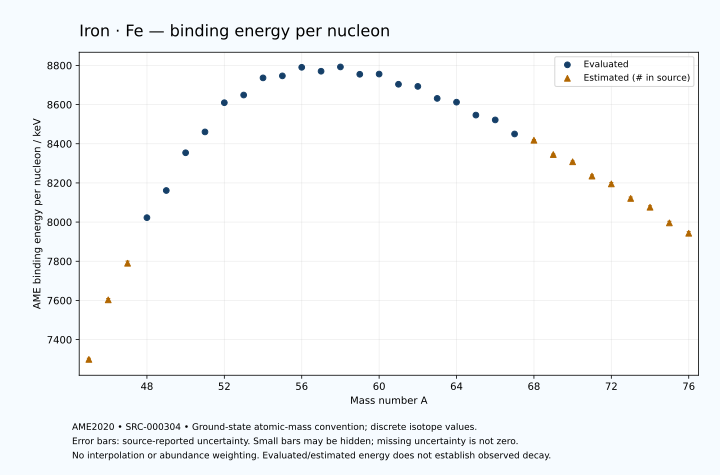

# Iron — Atomic Masses and Reaction Energies

<!-- generated-by: sync-ame2020.mjs -->

**Dated evaluated data · scientific coverage remains partial.** 32 ground-state nuclides from AME2020. Values and uncertainties are transcribed from the retained unrounded analysis files; estimated quantities remain labelled.

- [Parent Iron record](0026-Iron-Fe.md) · [NUBASE states and decays](0026-Iron-Fe-Nuclear-Evaluation.md)
- [Structured data](data/isotopes/0026-Iron-Fe-AME2020-Evaluation.yaml)
- [Original mass table](../../data/catalog/sources/ame2020-mass_1.mas20.txt) · [Original reaction table](../../data/catalog/sources/ame2020-rct1.mas20.txt)
- [AME2020 methods](https://doi.org/10.1088/1674-1137/abddb0) (SRC-000303) · [Tables and definitions](https://doi.org/10.1088/1674-1137/abddaf) (SRC-000304)

## Reading the data

All table energies and uncertainties are in keV; binding energy is per nucleon. A # replaces a decimal point in the original estimated value. UNKNOWN (*) retains the source's not-calculable entry; it is neither zero nor automatically NOT APPLICABLE. Source lines are one-based in the retained files. Uncertainties remain those published by the evaluation, with no replacement by independent-mass quadrature.

Atomic-mass conventions apply. Qα is total decay energy, not alpha-particle kinetic energy. Positive Q alone does not establish a decay branch, rate or observation. He-4's source Qα of zero is a bookkeeping identity. These tables describe ground-state combinations, not isomer or excited-daughter transitions. Nuclear state and daughter lookups are explicit in the structured companion. The binding quantity follows [Z M(¹H) + N mₙ − M(A,Z)]c²/A; it has not been converted to a bare-nucleus convention.

## Mass and binding table

| Nuclide | N | Atomic mass excess / keV | AME binding per nucleon / keV | Mass-file line |
|---|---:|---|---|---:|
| Fe-45 | 19 | 14408# ± 283# | 7299# ± 6# | 414 |
| Fe-46 | 20 | 1210# ± 300# | 7603# ± 7# | 426 |
| Fe-47 | 21 | -7130# ± 500# | 7790# ± 11# | 438 |
| Fe-48 | 22 | -18008.575 ± 92.218 | 8022.7254 ± 1.9212 | 450 |
| Fe-49 | 23 | -24750.730 ± 24.219 | 8161.3121 ± 0.4943 | 463 |
| Fe-50 | 24 | -34476.460 ± 8.383 | 8354.0268 ± 0.1677 | 475 |
| Fe-51 | 25 | -40189.185 ± 1.398 | 8460.4977 ± 0.0274 | 487 |
| Fe-52 | 26 | -48332.095 ± 0.179 | 8609.6079 ± 0.0035 | 499 |
| Fe-53 | 27 | -50947.483 ± 1.669 | 8648.7985 ± 0.0315 | 511 |
| Fe-54 | 28 | -56254.615 ± 0.343 | 8736.3846 ± 0.0064 | 523 |
| Fe-55 | 29 | -57481.422 ± 0.308 | 8746.5981 ± 0.0056 | 535 |
| Fe-56 | 30 | -60607.163 ± 0.268 | 8790.3563 ± 0.0048 | 547 |
| Fe-57 | 31 | -60182.017 ± 0.268 | 8770.2829 ± 0.0047 | 560 |
| Fe-58 | 32 | -62155.271 ± 0.316 | 8792.2534 ± 0.0055 | 573 |
| Fe-59 | 33 | -60664.957 ± 0.330 | 8754.7746 ± 0.0056 | 587 |
| Fe-60 | 34 | -61413.174 ± 3.406 | 8755.8539 ± 0.0568 | 600 |
| Fe-61 | 35 | -58920.503 ± 2.608 | 8703.7686 ± 0.0428 | 614 |
| Fe-62 | 36 | -58878.057 ± 2.794 | 8692.8831 ± 0.0451 | 627 |
| Fe-63 | 37 | -55635.629 ± 4.302 | 8631.5499 ± 0.0683 | 640 |
| Fe-64 | 38 | -54969.552 ± 5.017 | 8612.3888 ± 0.0784 | 653 |
| Fe-65 | 39 | -51217.902 ± 5.112 | 8546.3470 ± 0.0786 | 666 |
| Fe-66 | 40 | -50067.847 ± 4.099 | 8521.7245 ± 0.0621 | 679 |
| Fe-67 | 41 | -45708.416 ± 3.819 | 8449.9359 ± 0.0570 | 692 |
| Fe-68 | 42 | -43897# ± 193# | 8418# ± 3# | 705 |
| Fe-69 | 43 | -39199# ± 200# | 8345# ± 3# | 718 |
| Fe-70 | 44 | -36890# ± 300# | 8308# ± 4# | 731 |
| Fe-71 | 45 | -31930# ± 400# | 8235# ± 6# | 743 |
| Fe-72 | 46 | -29250# ± 500# | 8195# ± 7# | 756 |
| Fe-73 | 47 | -23990# ± 500# | 8121# ± 7# | 769 |
| Fe-74 | 48 | -20660# ± 500# | 8076# ± 7# | 782 |
| Fe-75 | 49 | -14700# ± 600# | 7996# ± 8# | 795 |
| Fe-76 | 50 | -10590# ± 600# | 7943# ± 8# | 809 |

## Q-values and separation energies

| Nuclide | Qβ− / keV | Qα / keV | S₂n / keV | S₂p / keV | Reaction-file line |
|---|---|---|---|---|---:|
| Fe-45 | UNKNOWN (*) | -8427# ± 490# | UNKNOWN (*) | -1800# ± 200# | 413 |
| Fe-46 | UNKNOWN (*) | -8275# ± 424# | UNKNOWN (*) | -54# ± 304# | 425 |
| Fe-47 | -17750# ± 781# | -7584# ± 539# | 37680# ± 575# | 2193# ± 501# | 437 |
| Fe-48 | -19738# ± 509# | -7011.5928 ± 105.4935 | 35361# ± 314# | 3114.9471 ± 92.9264 | 449 |
| Fe-49 | -14971# ± 501# | -7660.8442 ± 42.8892 | 33764# ± 501# | 4765.5791 ± 24.7701 | 462 |
| Fe-50 | -16887.0566 ± 126.0308 | -7429.8051 ± 14.1934 | 32610.5204 ± 92.5982 | 6233.0887 ± 11.1236 | 474 |
| Fe-51 | -12847.0389 ± 48.4579 | -8051.0084 ± 5.3814 | 31581.0916 ± 24.2592 | 9434.7754 ± 2.6084 | 486 |
| Fe-52 | -13988.1167 ± 5.2831 | -7935.6981 ± 7.3125 | 29998.2718 ± 8.3854 | 12648.6735 ± 0.1694 | 498 |
| Fe-53 | -8288.1073 ± 0.4431 | -8040.0472 ± 2.7619 | 26900.9341 ± 2.1776 | 14074.7109 ± 1.6756 | 510 |
| Fe-54 | -8244.5478 ± 0.0893 | -8418.1672 ± 0.3452 | 24065.1561 ± 0.3756 | 15413.0495 ± 0.3487 | 522 |
| Fe-55 | -3451.4254 ± 0.3241 | -8455.6230 ± 0.3403 | 22676.5745 ± 1.6447 | 16771.7462 ± 0.3126 | 534 |
| Fe-56 | -4566.6455 ± 0.4104 | -7612.5711 ± 0.2754 | 20495.1840 ± 0.2766 | 18249.7262 ± 0.2737 | 546 |
| Fe-57 | -836.3589 ± 0.4493 | -7319.3150 ± 0.2752 | 18843.2312 ± 0.2297 | 19649.6351 ± 0.3312 | 559 |
| Fe-58 | -2307.9785 ± 1.1389 | -7644.8077 ± 0.3219 | 17690.7439 ± 0.1815 | 21448.0855 ± 0.5435 | 572 |
| Fe-59 | 1564.8804 ± 0.3690 | -7979.5497 ± 0.3841 | 16625.5769 ± 0.2083 | 22717.9150 ± 1.8920 | 586 |
| Fe-60 | 237.2633 ± 3.4106 | -8552.9625 ± 3.4347 | 15400.5394 ± 3.3914 | 23999.3087 ± 4.5262 | 599 |
| Fe-61 | 3977.6759 ± 2.7399 | -8820.4339 ± 3.2052 | 14398.1813 ± 2.6290 | 25382.5140 ± 2.6930 | 613 |
| Fe-62 | 2546.3427 ± 18.7834 | -9311.1648 ± 4.0859 | 13607.5185 ± 4.4057 | 26547.4985 ± 3.0098 | 626 |
| Fe-63 | 6215.9238 ± 19.0668 | -9944.6142 ± 4.3544 | 12857.7625 ± 5.0312 | 27717.0692 ± 4.6884 | 639 |
| Fe-64 | 4822.8898 ± 20.6249 | -10485.9676 ± 5.1402 | 12234.1315 ± 5.7429 | 28694.8827 ± 6.0869 | 652 |
| Fe-65 | 7967.3036 ± 5.5198 | -11146.3156 ± 5.4408 | 11724.9088 ± 6.6815 | 29617.5444 ± 72.8361 | 665 |
| Fe-66 | 6340.6944 ± 14.5611 | -11640.1511 ± 5.3551 | 11240.9308 ± 6.4785 | 31005.8107 ± 299.9691 | 678 |
| Fe-67 | 9613.3678 ± 7.4900 | -11955.0320 ± 72.7568 | 10633.1500 ± 6.3810 | 31976# ± 200# | 691 |
| Fe-68 | 7746# ± 193# | -12682# ± 356# | 9972# ± 193# | 33335# ± 356# | 704 |
| Fe-69 | 11186# ± 218# | -13314# ± 283# | 9633# ± 200# | 34507# ± 447# | 717 |
| Fe-70 | 9635# ± 300# | -14175# ± 424# | 9136# ± 356# | 35778# ± 583# | 730 |
| Fe-71 | 12440# ± 613# | -15085# ± 565# | 8873# ± 447# | 36878# ± 640# | 742 |
| Fe-72 | 11050# ± 583# | -15985# ± 707# | 8503# ± 583# | 38188# ± 781# | 755 |
| Fe-73 | 13980# ± 583# | -16785# ± 707# | 8203# ± 640# | UNKNOWN (*) | 768 |
| Fe-74 | 12881# ± 640# | -17444# ± 781# | 7552# ± 707# | UNKNOWN (*) | 781 |
| Fe-75 | 15861# ± 721# | UNKNOWN (*) | 6853# ± 781# | UNKNOWN (*) | 794 |
| Fe-76 | 15070# ± 781# | UNKNOWN (*) | 6073# ± 781# | UNKNOWN (*) | 808 |

Qβ− comes from the mass-file line in the first table. The other three columns come from the reaction-file line. Definitions and original source strings are retained in the structured data.

## Binding-energy chart

Discrete source values and source-reported uncertainties. No interpolation, natural-abundance weighting or observed-decay claim is implied. This quantitative chart supplements the 22 separate illustrative panels.

## Remaining review

Later measurements, state-specific decay branches, isomer Q-values, additional reaction channels and full claim-level review remain open. Existing authored values retain their own provenance; this companion does not overwrite them.
