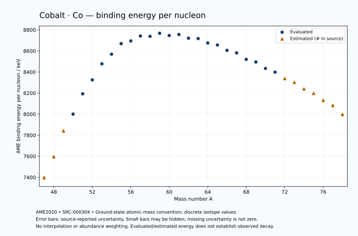

# Cobalt — Atomic Masses and Reaction Energies

<!-- generated-by: sync-ame2020.mjs -->

**Dated evaluated data · scientific coverage remains partial.** 32 ground-state nuclides from AME2020. Values and uncertainties are transcribed from the retained unrounded analysis files; estimated quantities remain labelled.

- [Parent Cobalt record](0027-Cobalt-Co.md) · [NUBASE states and decays](0027-Cobalt-Co-Nuclear-Evaluation.md)
- [Structured data](data/isotopes/0027-Cobalt-Co-AME2020-Evaluation.yaml)
- [Original mass table](../../data/catalog/sources/ame2020-mass_1.mas20.txt) · [Original reaction table](../../data/catalog/sources/ame2020-rct1.mas20.txt)
- [AME2020 methods](https://doi.org/10.1088/1674-1137/abddb0) (SRC-000303) · [Tables and definitions](https://doi.org/10.1088/1674-1137/abddaf) (SRC-000304)

## Reading the data

All table energies and uncertainties are in keV; binding energy is per nucleon. A # replaces a decimal point in the original estimated value. UNKNOWN (*) retains the source's not-calculable entry; it is neither zero nor automatically NOT APPLICABLE. Source lines are one-based in the retained files. Uncertainties remain those published by the evaluation, with no replacement by independent-mass quadrature.

Atomic-mass conventions apply. Qα is total decay energy, not alpha-particle kinetic energy. Positive Q alone does not establish a decay branch, rate or observation. He-4's source Qα of zero is a bookkeeping identity. These tables describe ground-state combinations, not isomer or excited-daughter transitions. Nuclear state and daughter lookups are explicit in the structured companion. The binding quantity follows [Z M(¹H) + N mₙ − M(A,Z)]c²/A; it has not been converted to a bare-nucleus convention.

## Mass and binding table

| Nuclide | N | Atomic mass excess / keV | AME binding per nucleon / keV | Mass-file line |
|---|---:|---|---|---:|
| Co-47 | 20 | 10620# ± 600# | 7396# ± 13# | 439 |
| Co-48 | 21 | 1730# ± 500# | 7595# ± 10# | 451 |
| Co-49 | 22 | -9780# ± 500# | 7840# ± 10# | 464 |
| Co-50 | 23 | -17589.403 ± 125.752 | 8000.6387 ± 2.5150 | 476 |
| Co-51 | 24 | -27342.146 ± 48.438 | 8193.2549 ± 0.9498 | 488 |
| Co-52 | 25 | -34343.979 ± 5.282 | 8325.5606 ± 0.1016 | 500 |
| Co-53 | 26 | -42659.376 ± 1.727 | 8477.6578 ± 0.0326 | 512 |
| Co-54 | 27 | -48010.068 ± 0.355 | 8569.2199 ± 0.0066 | 524 |
| Co-55 | 28 | -54029.996 ± 0.405 | 8669.6204 ± 0.0074 | 536 |
| Co-56 | 29 | -56040.518 ± 0.475 | 8694.8386 ± 0.0085 | 548 |
| Co-57 | 30 | -59345.658 ± 0.516 | 8741.8845 ± 0.0090 | 561 |
| Co-58 | 31 | -59847.292 ± 1.153 | 8738.9719 ± 0.0199 | 574 |
| Co-59 | 32 | -62229.838 ± 0.397 | 8768.0379 ± 0.0067 | 588 |
| Co-60 | 33 | -61650.437 ± 0.403 | 8746.7692 ± 0.0067 | 601 |
| Co-61 | 34 | -62898.179 ± 0.839 | 8756.1510 ± 0.0138 | 615 |
| Co-62 | 35 | -61424.399 ± 18.574 | 8721.3347 ± 0.2996 | 628 |
| Co-63 | 36 | -61851.553 ± 18.575 | 8717.7972 ± 0.2948 | 641 |
| Co-64 | 37 | -59792.442 ± 20.005 | 8675.5223 ± 0.3126 | 654 |
| Co-65 | 38 | -59185.205 ± 2.083 | 8656.8848 ± 0.0320 | 667 |
| Co-66 | 39 | -56408.541 ± 13.972 | 8605.9419 ± 0.2117 | 680 |
| Co-67 | 40 | -55321.783 ± 6.443 | 8581.7422 ± 0.0962 | 693 |
| Co-68 | 41 | -51642.591 ± 3.859 | 8520.1301 ± 0.0567 | 706 |
| Co-69 | 42 | -50385.447 ± 85.697 | 8495.4062 ± 1.2420 | 719 |
| Co-70 | 43 | -46524.963 ± 10.992 | 8434.1980 ± 0.1570 | 732 |
| Co-71 | 44 | -44369.930 ± 465.030 | 8398.7344 ± 6.5497 | 744 |
| Co-72 | 45 | -40300# ± 300# | 8338# ± 4# | 757 |
| Co-73 | 46 | -37970# ± 300# | 8302# ± 4# | 770 |
| Co-74 | 47 | -33540# ± 400# | 8239# ± 5# | 783 |
| Co-75 | 48 | -30560# ± 400# | 8197# ± 5# | 796 |
| Co-76 | 49 | -25660# ± 500# | 8131# ± 7# | 810 |
| Co-77 | 50 | -21910# ± 600# | 8082# ± 8# | 823 |
| Co-78 | 51 | -15320# ± 700# | 7997# ± 9# | 837 |

## Q-values and separation energies

| Nuclide | Qβ− / keV | Qα / keV | S₂n / keV | S₂p / keV | Reaction-file line |
|---|---|---|---|---|---:|
| Co-47 | UNKNOWN (*) | -9175# ± 721# | UNKNOWN (*) | -1022# ± 671# | 438 |
| Co-48 | -16448# ± 656# | -8155# ± 583# | UNKNOWN (*) | 430# ± 508# | 450 |
| Co-49 | -18309# ± 781# | -7225# ± 583# | 36542# ± 781# | 1791# ± 501# | 463 |
| Co-50 | -14130# ± 516# | -7596.5711 ± 152.7025 | 35462# ± 516# | 2870.7013 ± 125.9300 | 475 |
| Co-51 | -15692# ± 503# | -7200.6861 ± 57.8727 | 33705# ± 503# | 4300.1630 ± 48.4883 | 487 |
| Co-52 | -11784.1230 ± 83.0710 | -7472.2505 ± 8.5303 | 32897.2116 ± 125.8626 | 6295.0343 ± 5.2821 | 499 |
| Co-53 | -13028.5485 ± 25.2096 | -7464.3663 ± 2.8069 | 31459.8657 ± 48.4685 | 8994.0928 ± 1.7471 | 511 |
| Co-54 | -8731.7558 ± 4.6710 | -7808.0970 ± 0.3596 | 29808.7251 ± 5.2929 | 11876.6232 ± 0.3654 | 523 |
| Co-55 | -8694.0350 ± 0.5775 | -8211.6868 ± 0.4861 | 27513.2564 ± 1.7188 | 13917.5886 ± 0.5060 | 535 |
| Co-56 | -2132.8689 ± 0.3735 | -7754.0471 ± 0.4841 | 24173.0863 ± 0.4702 | 15060.2133 ± 1.1091 | 547 |
| Co-57 | -3261.6970 ± 0.6417 | -7080.2240 ± 0.5966 | 21458.2977 ± 0.5430 | 16211.0579 ± 0.4719 | 560 |
| Co-58 | 381.5789 ± 1.1071 | -6713.9617 ± 1.5276 | 19949.4108 ± 1.1716 | 17513.5686 ± 1.1431 | 573 |
| Co-59 | -1073.0050 ± 0.1944 | -6942.2118 ± 0.3435 | 19026.8162 ± 0.4399 | 19321.5008 ± 1.5503 | 587 |
| Co-60 | 2822.8058 ± 0.2124 | -7163.6874 ± 0.3755 | 17945.7812 ± 1.1043 | 20400.8113 ± 2.7313 | 600 |
| Co-61 | 1323.8504 ± 0.7899 | -7836.8152 ± 1.7186 | 16810.9768 ± 0.8151 | 21950.7922 ± 2.4754 | 614 |
| Co-62 | 5322.0404 ± 18.5695 | -8021.7469 ± 18.7698 | 15916.5979 ± 18.5733 | 23034.3955 ± 18.7198 | 627 |
| Co-63 | 3661.3385 ± 18.5704 | -8751.1403 ± 18.7205 | 15096.0105 ± 18.5827 | 24687.3654 ± 18.7205 | 640 |
| Co-64 | 7306.5921 ± 20.0000 | -9249.4117 ± 20.1404 | 14510.6785 ± 27.2923 | 25846.4192 ± 21.0480 | 653 |
| Co-65 | 5940.5911 ± 2.1379 | -9867.9915 ± 3.1242 | 13476.2885 ± 18.6914 | 26876.0868 ± 4.2685 | 666 |
| Co-66 | 9597.7522 ± 14.0421 | -10309.4923 ± 15.4283 | 12758.7355 ± 24.4017 | 27997.4429 ± 14.4138 | 679 |
| Co-67 | 8420.9047 ± 7.0607 | -10859.6387 ± 7.4429 | 12279.2142 ± 6.7714 | 28932.3814 ± 7.4429 | 692 |
| Co-68 | 11821.2318 ± 4.8760 | -11078.4662 ± 5.2363 | 11376.6856 ± 14.4955 | 29470.1404 ± 11.8252 | 705 |
| Co-69 | 9593.2084 ± 85.7784 | -11843.0192 ± 85.7784 | 11206.3002 ± 85.9393 | 31383# ± 218# | 718 |
| Co-70 | 12688.9049 ± 11.1987 | -12199.4870 ± 15.6768 | 11025.0089 ± 11.6493 | 32183# ± 300# | 731 |
| Co-71 | 11036.3053 ± 465.0353 | -13214# ± 506# | 10127.1189 ± 472.8604 | 33588# ± 613# | 743 |
| Co-72 | 13926# ± 300# | -13805# ± 424# | 9918# ± 300# | 34428# ± 583# | 756 |
| Co-73 | 12139# ± 300# | -15035# ± 500# | 9742# ± 553# | 35928# ± 583# | 769 |
| Co-74 | 15160# ± 447# | -15515# ± 640# | 9383# ± 500# | 36949# ± 721# | 782 |
| Co-75 | 13680# ± 447# | -16366# ± 640# | 8734# ± 500# | 38438# ± 721# | 795 |
| Co-76 | 16530# ± 583# | -16915# ± 781# | 8262# ± 640# | UNKNOWN (*) | 809 |
| Co-77 | 15440# ± 721# | -17634# ± 848# | 7492# ± 721# | UNKNOWN (*) | 822 |
| Co-78 | 19560# ± 806# | UNKNOWN (*) | 5803# ± 860# | UNKNOWN (*) | 836 |

Qβ− comes from the mass-file line in the first table. The other three columns come from the reaction-file line. Definitions and original source strings are retained in the structured data.

## Binding-energy chart

Discrete source values and source-reported uncertainties. No interpolation, natural-abundance weighting or observed-decay claim is implied. This quantitative chart supplements the 22 separate illustrative panels.

## Remaining review

Later measurements, state-specific decay branches, isomer Q-values, additional reaction channels and full claim-level review remain open. Existing authored values retain their own provenance; this companion does not overwrite them.
