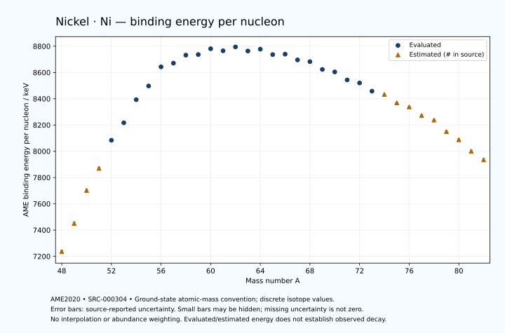

# Nickel — Atomic Masses and Reaction Energies

<!-- generated-by: sync-ame2020.mjs -->

**Dated evaluated data · scientific coverage remains partial.** 35 ground-state nuclides from AME2020. Values and uncertainties are transcribed from the retained unrounded analysis files; estimated quantities remain labelled.

- [Parent Nickel record](0028-Nickel-Ni.md) · [NUBASE states and decays](0028-Nickel-Ni-Nuclear-Evaluation.md)
- [Structured data](data/isotopes/0028-Nickel-Ni-AME2020-Evaluation.yaml)
- [Original mass table](../../data/catalog/sources/ame2020-mass_1.mas20.txt) · [Original reaction table](../../data/catalog/sources/ame2020-rct1.mas20.txt)
- [AME2020 methods](https://doi.org/10.1088/1674-1137/abddb0) (SRC-000303) · [Tables and definitions](https://doi.org/10.1088/1674-1137/abddaf) (SRC-000304)

## Reading the data

All table energies and uncertainties are in keV; binding energy is per nucleon. A # replaces a decimal point in the original estimated value. UNKNOWN (*) retains the source's not-calculable entry; it is neither zero nor automatically NOT APPLICABLE. Source lines are one-based in the retained files. Uncertainties remain those published by the evaluation, with no replacement by independent-mass quadrature.

Atomic-mass conventions apply. Qα is total decay energy, not alpha-particle kinetic energy. Positive Q alone does not establish a decay branch, rate or observation. He-4's source Qα of zero is a bookkeeping identity. These tables describe ground-state combinations, not isomer or excited-daughter transitions. Nuclear state and daughter lookups are explicit in the structured companion. The binding quantity follows [Z M(¹H) + N mₙ − M(A,Z)]c²/A; it has not been converted to a bare-nucleus convention.

## Mass and binding table

| Nuclide | N | Atomic mass excess / keV | AME binding per nucleon / keV | Mass-file line |
|---|---:|---|---|---:|
| Ni-48 | 20 | 18178# ± 424# | 7236# ± 9# | 452 |
| Ni-49 | 21 | 8530# ± 600# | 7450# ± 12# | 465 |
| Ni-50 | 22 | -3460# ± 500# | 7702# ± 10# | 477 |
| Ni-51 | 23 | -11650# ± 500# | 7870# ± 10# | 489 |
| Ni-52 | 24 | -22559.856 ± 82.903 | 8083.8977 ± 1.5943 | 501 |
| Ni-53 | 25 | -29630.827 ± 25.150 | 8217.0749 ± 0.4745 | 513 |
| Ni-54 | 26 | -39278.312 ± 4.657 | 8393.0328 ± 0.0862 | 525 |
| Ni-55 | 27 | -45335.961 ± 0.705 | 8497.3225 ± 0.0128 | 537 |
| Ni-56 | 28 | -53907.649 ± 0.399 | 8642.7811 ± 0.0071 | 549 |
| Ni-57 | 29 | -56083.961 ± 0.566 | 8670.9364 ± 0.0099 | 562 |
| Ni-58 | 30 | -60228.871 ± 0.349 | 8732.0621 ± 0.0060 | 575 |
| Ni-59 | 31 | -61156.833 ± 0.351 | 8736.5912 ± 0.0060 | 589 |
| Ni-60 | 32 | -64473.243 ± 0.353 | 8780.7769 ± 0.0059 | 602 |
| Ni-61 | 33 | -64222.029 ± 0.355 | 8765.0281 ± 0.0058 | 616 |
| Ni-62 | 34 | -66746.440 ± 0.425 | 8794.5555 ± 0.0069 | 629 |
| Ni-63 | 35 | -65512.891 ± 0.426 | 8763.4955 ± 0.0068 | 642 |
| Ni-64 | 36 | -67099.034 ± 0.463 | 8777.4637 ± 0.0072 | 655 |
| Ni-65 | 37 | -65125.796 ± 0.483 | 8736.2424 ± 0.0074 | 668 |
| Ni-66 | 38 | -66006.293 ± 1.397 | 8739.5086 ± 0.0212 | 681 |
| Ni-67 | 39 | -63742.688 ± 2.888 | 8695.7505 ± 0.0431 | 694 |
| Ni-68 | 40 | -63463.822 ± 2.981 | 8682.4667 ± 0.0438 | 707 |
| Ni-69 | 41 | -59978.656 ± 3.726 | 8623.0998 ± 0.0540 | 720 |
| Ni-70 | 42 | -59213.868 ± 2.144 | 8604.2917 ± 0.0306 | 733 |
| Ni-71 | 43 | -55406.236 ± 2.237 | 8543.1564 ± 0.0315 | 745 |
| Ni-72 | 44 | -54226.068 ± 2.237 | 8520.2118 ± 0.0311 | 758 |
| Ni-73 | 45 | -50108.159 ± 2.423 | 8457.6529 ± 0.0332 | 771 |
| Ni-74 | 46 | -48700# ± 200# | 8433# ± 3# | 784 |
| Ni-75 | 47 | -44240# ± 200# | 8369# ± 3# | 797 |
| Ni-76 | 48 | -42190# ± 300# | 8338# ± 4# | 811 |
| Ni-77 | 49 | -37350# ± 400# | 8272# ± 5# | 824 |
| Ni-78 | 50 | -34880# ± 400# | 8238# ± 5# | 838 |
| Ni-79 | 51 | -28160# ± 500# | 8150# ± 6# | 851 |
| Ni-80 | 52 | -23240# ± 600# | 8088# ± 7# | 865 |
| Ni-81 | 53 | -16090# ± 700# | 8000# ± 9# | 879 |
| Ni-82 | 54 | -10720# ± 800# | 7935# ± 10# | 894 |

## Q-values and separation energies

| Nuclide | Qβ− / keV | Qα / keV | S₂n / keV | S₂p / keV | Reaction-file line |
|---|---|---|---|---|---:|
| Ni-48 | UNKNOWN (*) | UNKNOWN (*) | UNKNOWN (*) | -2390# ± 300# | 451 |
| Ni-49 | UNKNOWN (*) | -8303# ± 663# | UNKNOWN (*) | -1081# ± 781# | 464 |
| Ni-50 | UNKNOWN (*) | -7094# ± 583# | 37780# ± 656# | 29# ± 509# | 476 |
| Ni-51 | UNKNOWN (*) | -6945# ± 707# | 36323# ± 781# | 1477# ± 501# | 488 |
| Ni-52 | -20680# ± 606# | -6976.1961 ± 124.0042 | 35243# ± 507# | 2661.3381 ± 83.3258 | 500 |
| Ni-53 | -16491# ± 501# | -7305.0135 ± 34.9155 | 34123# ± 501# | 4019.5842 ± 25.1892 | 512 |
| Ni-54 | -18038# ± 400# | -7226.7680 ± 9.5903 | 32861.0923 ± 83.0337 | 5524.1586 ± 4.6609 | 524 |
| Ni-55 | -13700.5585 ± 155.5611 | -7571.6918 ± 1.5660 | 31847.7699 ± 25.1602 | 8966.4201 ± 1.7582 | 536 |
| Ni-56 | -15277.9163 ± 6.4070 | -8000.4694 ± 0.4276 | 30771.9731 ± 4.6745 | 12230.9756 ± 0.3639 | 548 |
| Ni-57 | -8774.9466 ± 0.4393 | -7561.3934 ± 1.7267 | 26890.6357 ± 0.8106 | 13180.4813 ± 0.5455 | 561 |
| Ni-58 | -8561.0204 ± 0.4425 | -6399.1718 ± 0.3508 | 22463.8585 ± 0.3492 | 14199.6502 ± 0.2511 | 574 |
| Ni-59 | -4798.3786 ± 0.3973 | -6100.3272 ± 0.3262 | 21215.5083 ± 0.4987 | 15552.7584 ± 0.2544 | 588 |
| Ni-60 | -6127.9810 ± 1.5735 | -6290.9959 ± 0.2580 | 20387.0081 ± 0.0704 | 16895.9144 ± 0.3103 | 601 |
| Ni-61 | -2237.9663 ± 0.9617 | -6464.9281 ± 0.2616 | 19207.8321 ± 0.0689 | 18135.0136 ± 0.3298 | 615 |
| Ni-62 | -3958.8965 ± 0.4751 | -7016.0846 ± 0.4151 | 18415.8325 ± 0.3086 | 19911.2076 ± 3.4167 | 628 |
| Ni-63 | 66.9768 ± 0.0149 | -7272.8498 ± 0.4299 | 17433.4986 ± 0.3102 | 21170.3309 ± 2.6428 | 641 |
| Ni-64 | -1674.6156 ± 0.2055 | -8110.7755 ± 3.4222 | 16495.2302 ± 0.2116 | 22798.9194 ± 2.8326 | 654 |
| Ni-65 | 2137.8808 ± 0.6997 | -8630.2096 ± 2.6526 | 15755.5411 ± 0.2458 | 24068.1095 ± 4.3294 | 667 |
| Ni-66 | 251.9958 ± 1.5405 | -9553.1526 ± 3.1243 | 15049.8956 ± 1.4720 | 25614.6835 ± 5.2081 | 680 |
| Ni-67 | 3576.8654 ± 3.0223 | -10531.9749 ± 5.1816 | 14759.5278 ± 2.9278 | 27102.7286 ± 5.8711 | 693 |
| Ni-68 | 2103.2205 ± 3.3753 | -10919.1863 ± 5.8359 | 13600.1652 ± 3.2920 | 27973.9179 ± 5.0679 | 706 |
| Ni-69 | 5757.5650 ± 3.9793 | -11185.6700 ± 6.3257 | 12378.6039 ± 4.7139 | 28848.1824 ± 5.3356 | 719 |
| Ni-70 | 3762.5123 ± 2.4011 | -11570.9376 ± 4.6253 | 11892.6820 ± 3.6716 | 29895# ± 193# | 732 |
| Ni-71 | 7304.8989 ± 2.6879 | -12122.7358 ± 4.4260 | 11570.2158 ± 4.3458 | 30785# ± 200# | 744 |
| Ni-72 | 5556.9381 ± 2.6374 | -12754# ± 193# | 11154.8361 ± 3.0964 | 31914# ± 300# | 757 |
| Ni-73 | 8879.2856 ± 3.1038 | -13334# ± 200# | 10844.5597 ± 3.2960 | 32756# ± 400# | 770 |
| Ni-74 | 7306# ± 200# | -14235# ± 361# | 10617# ± 200# | 34028# ± 539# | 783 |
| Ni-75 | 10230# ± 200# | -14736# ± 447# | 10275# ± 200# | 34829# ± 539# | 796 |
| Ni-76 | 8791# ± 300# | -15365# ± 583# | 9632# ± 361# | 36108# ± 583# | 810 |
| Ni-77 | 11513# ± 400# | -15785# ± 640# | 9252# ± 447# | 37228# ± 721# | 823 |
| Ni-78 | 9910# ± 400# | -16645# ± 640# | 8832# ± 500# | 38868# ± 721# | 837 |
| Ni-79 | 14248# ± 511# | -15885# ± 781# | 6953# ± 640# | UNKNOWN (*) | 850 |
| Ni-80 | 13440# ± 671# | -15075# ± 848# | 4503# ± 721# | UNKNOWN (*) | 864 |
| Ni-81 | 15820# ± 761# | UNKNOWN (*) | 4072# ± 860# | UNKNOWN (*) | 878 |
| Ni-82 | 15010# ± 894# | UNKNOWN (*) | 3622# ± 1000# | UNKNOWN (*) | 893 |

Qβ− comes from the mass-file line in the first table. The other three columns come from the reaction-file line. Definitions and original source strings are retained in the structured data.

## Binding-energy chart

Discrete source values and source-reported uncertainties. No interpolation, natural-abundance weighting or observed-decay claim is implied. This quantitative chart supplements the 22 separate illustrative panels.

## Remaining review

Later measurements, state-specific decay branches, isomer Q-values, additional reaction channels and full claim-level review remain open. Existing authored values retain their own provenance; this companion does not overwrite them.
