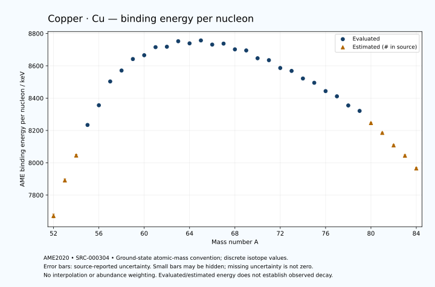

# Copper — Atomic Masses and Reaction Energies

<!-- generated-by: sync-ame2020.mjs -->

**Dated evaluated data · scientific coverage remains partial.** 33 ground-state nuclides from AME2020. Values and uncertainties are transcribed from the retained unrounded analysis files; estimated quantities remain labelled.

- [Parent Copper record](0029-Copper-Cu.md) · [NUBASE states and decays](0029-Copper-Cu-Nuclear-Evaluation.md)
- [Structured data](data/isotopes/0029-Copper-Cu-AME2020-Evaluation.yaml)
- [Original mass table](../../data/catalog/sources/ame2020-mass_1.mas20.txt) · [Original reaction table](../../data/catalog/sources/ame2020-rct1.mas20.txt)
- [AME2020 methods](https://doi.org/10.1088/1674-1137/abddb0) (SRC-000303) · [Tables and definitions](https://doi.org/10.1088/1674-1137/abddaf) (SRC-000304)

## Reading the data

All table energies and uncertainties are in keV; binding energy is per nucleon. A # replaces a decimal point in the original estimated value. UNKNOWN (*) retains the source's not-calculable entry; it is neither zero nor automatically NOT APPLICABLE. Source lines are one-based in the retained files. Uncertainties remain those published by the evaluation, with no replacement by independent-mass quadrature.

Atomic-mass conventions apply. Qα is total decay energy, not alpha-particle kinetic energy. Positive Q alone does not establish a decay branch, rate or observation. He-4's source Qα of zero is a bookkeeping identity. These tables describe ground-state combinations, not isomer or excited-daughter transitions. Nuclear state and daughter lookups are explicit in the structured companion. The binding quantity follows [Z M(¹H) + N mₙ − M(A,Z)]c²/A; it has not been converted to a bare-nucleus convention.

## Mass and binding table

| Nuclide | N | Atomic mass excess / keV | AME binding per nucleon / keV | Mass-file line |
|---|---:|---|---|---:|
| Cu-52 | 23 | -1880# ± 600# | 7671# ± 12# | 502 |
| Cu-53 | 24 | -13140# ± 500# | 7891# ± 9# | 514 |
| Cu-54 | 25 | -21240# ± 400# | 8045# ± 7# | 526 |
| Cu-55 | 26 | -31635.403 ± 155.560 | 8233.9970 ± 2.8284 | 538 |
| Cu-56 | 27 | -38629.733 ± 6.395 | 8355.9907 ± 0.1142 | 550 |
| Cu-57 | 28 | -47309.014 ± 0.501 | 8503.2646 ± 0.0088 | 563 |
| Cu-58 | 29 | -51667.851 ± 0.564 | 8570.9696 ± 0.0097 | 576 |
| Cu-59 | 30 | -56358.454 ± 0.528 | 8642.0027 ± 0.0090 | 590 |
| Cu-60 | 31 | -58345.262 ± 1.613 | 8665.6047 ± 0.0269 | 603 |
| Cu-61 | 32 | -61984.063 ± 0.951 | 8715.5148 ± 0.0156 | 617 |
| Cu-62 | 33 | -62787.543 ± 0.637 | 8718.0839 ± 0.0103 | 630 |
| Cu-63 | 34 | -65579.868 ± 0.426 | 8752.1404 ± 0.0068 | 643 |
| Cu-64 | 35 | -65424.418 ± 0.427 | 8739.0736 ± 0.0067 | 656 |
| Cu-65 | 36 | -67263.677 ± 0.643 | 8757.0967 ± 0.0099 | 669 |
| Cu-66 | 37 | -66258.289 ± 0.649 | 8731.4730 ± 0.0098 | 682 |
| Cu-67 | 38 | -67319.553 ± 0.892 | 8737.4597 ± 0.0133 | 695 |
| Cu-68 | 39 | -65567.043 ± 1.584 | 8701.8913 ± 0.0233 | 708 |
| Cu-69 | 40 | -65736.221 ± 1.397 | 8695.2044 ± 0.0203 | 721 |
| Cu-70 | 41 | -62976.381 ± 1.082 | 8646.8655 ± 0.0155 | 734 |
| Cu-71 | 42 | -62711.134 ± 1.490 | 8635.0233 ± 0.0210 | 746 |
| Cu-72 | 43 | -59783.006 ± 1.397 | 8586.5256 ± 0.0194 | 759 |
| Cu-73 | 44 | -58987.445 ± 1.942 | 8568.5699 ± 0.0266 | 772 |
| Cu-74 | 45 | -56006.213 ± 6.148 | 8521.5633 ± 0.0831 | 785 |
| Cu-75 | 46 | -54470.219 ± 0.718 | 8495.0801 ± 0.0096 | 798 |
| Cu-76 | 47 | -50981.627 ± 0.913 | 8443.6018 ± 0.0120 | 812 |
| Cu-77 | 48 | -48862.828 ± 1.211 | 8411.2501 ± 0.0157 | 825 |
| Cu-78 | 49 | -44789.474 ± 13.332 | 8354.6695 ± 0.1709 | 839 |
| Cu-79 | 50 | -42408.039 ± 104.979 | 8320.9380 ± 1.3289 | 852 |
| Cu-80 | 51 | -36679# ± 300# | 8246# ± 4# | 866 |
| Cu-81 | 52 | -31910# ± 300# | 8185# ± 4# | 880 |
| Cu-82 | 53 | -25730# ± 400# | 8108# ± 5# | 895 |
| Cu-83 | 54 | -20390# ± 500# | 8044# ± 6# | 909 |
| Cu-84 | 55 | -13720# ± 500# | 7965# ± 6# | 924 |

## Q-values and separation energies

| Nuclide | Qβ− / keV | Qα / keV | S₂n / keV | S₂p / keV | Reaction-file line |
|---|---|---|---|---|---:|
| Cu-52 | UNKNOWN (*) | -6034# ± 781# | UNKNOWN (*) | -1132# ± 613# | 501 |
| Cu-53 | UNKNOWN (*) | -5785# ± 707# | UNKNOWN (*) | 375# ± 503# | 513 |
| Cu-54 | -15538# ± 454# | -6075# ± 419# | 35503# ± 721# | 1474# ± 400# | 525 |
| Cu-55 | -17366# ± 429# | -6718.1722 ± 162.9263 | 34638# ± 524# | 3553.9689 ± 155.5691 | 537 |
| Cu-56 | -13240# ± 400# | -6710.6698 ± 8.2937 | 33532# ± 400# | 5197.6071 ± 6.4045 | 549 |
| Cu-57 | -14759# ± 200# | -7074.5541 ± 1.7610 | 31816.2476 ± 155.5603 | 7856.9601 ± 0.4905 | 562 |
| Cu-58 | -9368.9796 ± 50.0020 | -6082.6991 ± 0.5716 | 29180.7544 ± 6.4194 | 10205.2753 ± 0.5921 | 575 |
| Cu-59 | -9142.7760 ± 0.6018 | -4753.3740 ± 0.5480 | 25192.0762 ± 0.5980 | 11590.7386 ± 0.5813 | 589 |
| Cu-60 | -4170.7922 ± 1.6286 | -4729.6603 ± 1.6232 | 22820.0474 ± 1.6360 | 13075.9119 ± 1.9237 | 602 |
| Cu-61 | -5635.1565 ± 15.9028 | -5063.3206 ± 1.0408 | 21768.2444 ± 1.0401 | 14332.1668 ± 0.9803 | 616 |
| Cu-62 | -1619.4548 ± 0.6507 | -5365.1666 ± 1.2420 | 20584.9171 ± 1.6723 | 15715.0478 ± 0.6041 | 629 |
| Cu-63 | -3366.4392 ± 1.5450 | -5774.9461 ± 0.3699 | 19738.4417 ± 0.9516 | 17259.6317 ± 0.7291 | 642 |
| Cu-64 | 579.5996 ± 0.6447 | -6198.8966 ± 0.3773 | 18779.5111 ± 0.4793 | 18577.9610 ± 18.5696 | 655 |
| Cu-65 | -1351.6527 ± 0.3557 | -6790.4145 ± 0.9801 | 17826.4452 ± 0.6588 | 19990.0665 ± 18.5819 | 668 |
| Cu-66 | 2640.9396 ± 0.9255 | -7258.8057 ± 18.5814 | 16976.5070 ± 0.6645 | 21043.7895 ± 20.0119 | 681 |
| Cu-67 | 560.8226 ± 0.8296 | -7892.9165 ± 18.5925 | 16198.5124 ± 1.0687 | 22712.2903 ± 2.2657 | 694 |
| Cu-68 | 4440.1115 ± 1.7645 | -8199.5171 ± 20.0679 | 15451.3900 ± 1.7113 | 23736.4440 ± 14.0619 | 707 |
| Cu-69 | 2681.6854 ± 1.6075 | -8975.9315 ± 2.5079 | 14559.3036 ± 1.6578 | 24992.3797 ± 6.5929 | 720 |
| Cu-70 | 6588.3675 ± 2.2018 | -8992.7554 ± 14.0142 | 13551.9738 ± 1.9177 | 25911.7322 ± 4.0075 | 733 |
| Cu-71 | 4617.6517 ± 3.0437 | -9814.2669 ± 6.6133 | 13117.5496 ± 2.0429 | 26903.6291 ± 85.7104 | 745 |
| Cu-72 | 8362.4883 ± 2.5578 | -10565.3316 ± 4.1039 | 12949.2619 ± 1.7670 | 27835.9851 ± 11.0801 | 758 |
| Cu-73 | 6605.9659 ± 2.6910 | -11026.9132 ± 85.7195 | 12418.9465 ± 2.4479 | 29195.4567 ± 465.0340 | 771 |
| Cu-74 | 9750.5077 ± 6.6424 | -11906.1651 ± 12.5941 | 12365.8424 ± 6.3046 | 30284# ± 300# | 784 |
| Cu-75 | 8088.6967 ± 2.0837 | -12525.2049 ± 465.0305 | 11625.4106 ± 2.0701 | 31079# ± 300# | 797 |
| Cu-76 | 11321.3964 ± 1.7183 | -13106# ± 300# | 11118.0510 ± 6.2153 | 32019# ± 400# | 811 |
| Cu-77 | 9926.3750 ± 2.3148 | -13318# ± 300# | 10535.2447 ± 1.4077 | 32880# ± 400# | 824 |
| Cu-78 | 12693.7680 ± 13.4727 | -13674# ± 400# | 9950.4828 ± 13.3629 | 33708# ± 500# | 838 |
| Cu-79 | 11024.2629 ± 105.0030 | -14272# ± 413# | 9687.8470 ± 104.9864 | 35076# ± 609# | 851 |
| Cu-80 | 14969# ± 300# | -13444# ± 583# | 8033# ± 300# | 35937# ± 761# | 865 |
| Cu-81 | 14289# ± 300# | -12425# ± 671# | 5645# ± 318# | UNKNOWN (*) | 879 |
| Cu-82 | 16584# ± 400# | -12834# ± 806# | 5193# ± 500# | UNKNOWN (*) | 894 |
| Cu-83 | 15900# ± 583# | UNKNOWN (*) | 4623# ± 583# | UNKNOWN (*) | 908 |
| Cu-84 | 18110# ± 640# | UNKNOWN (*) | 4133# ± 640# | UNKNOWN (*) | 923 |

Qβ− comes from the mass-file line in the first table. The other three columns come from the reaction-file line. Definitions and original source strings are retained in the structured data.

## Binding-energy chart

Discrete source values and source-reported uncertainties. No interpolation, natural-abundance weighting or observed-decay claim is implied. This quantitative chart supplements the 22 separate illustrative panels.

## Remaining review

Later measurements, state-specific decay branches, isomer Q-values, additional reaction channels and full claim-level review remain open. Existing authored values retain their own provenance; this companion does not overwrite them.
