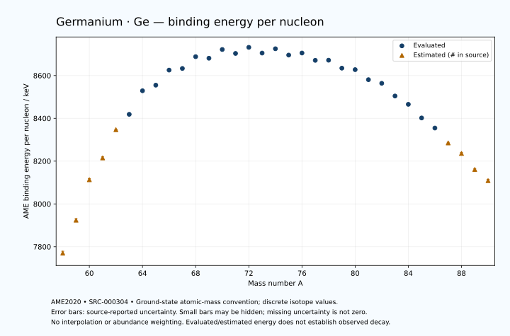

# Germanium — Atomic Masses and Reaction Energies

<!-- generated-by: sync-ame2020.mjs -->

**Dated evaluated data · scientific coverage remains partial.** 33 ground-state nuclides from AME2020. Values and uncertainties are transcribed from the retained unrounded analysis files; estimated quantities remain labelled.

- [Parent Germanium record](0032-Germanium-Ge.md) · [NUBASE states and decays](0032-Germanium-Ge-Nuclear-Evaluation.md)
- [Structured data](data/isotopes/0032-Germanium-Ge-AME2020-Evaluation.yaml)
- [Original mass table](../../data/catalog/sources/ame2020-mass_1.mas20.txt) · [Original reaction table 1](../../data/catalog/sources/ame2020-rct1.mas20.txt) · [Original reaction table 2](../../data/catalog/sources/ame2020-rct2.mas20.txt)
- [AME2020 methods](https://doi.org/10.1088/1674-1137/abddb0) (SRC-000303) · [Tables and definitions](https://doi.org/10.1088/1674-1137/abddaf) (SRC-000304)

## Reading the data

All table energies and uncertainties are in keV; binding energy is per nucleon. A # replaces a decimal point in the original estimated value. UNKNOWN (*) retains the source's not-calculable entry; it is neither zero nor automatically NOT APPLICABLE. Source lines are one-based in the retained files. Uncertainties remain those published by the evaluation, with no replacement by independent-mass quadrature.

Atomic-mass conventions apply. Qα is total decay energy, not alpha-particle kinetic energy. Positive Q alone does not establish a decay branch, rate or observation. He-4's source Qα of zero is a bookkeeping identity. These tables describe ground-state combinations, not isomer or excited-daughter transitions. Nuclear state and daughter lookups are explicit in the structured companion. The binding quantity follows [Z M(¹H) + N mₙ − M(A,Z)]c²/A; it has not been converted to a bare-nucleus convention.

## Mass and binding table

| Nuclide | N | Atomic mass excess / keV | AME binding per nucleon / keV | Mass-file line |
|---|---:|---|---|---:|
| Ge-58 | 26 | -7580# ± 500# | 7770# ± 9# | 579 |
| Ge-59 | 27 | -16370# ± 400# | 7924# ± 7# | 593 |
| Ge-60 | 28 | -27530# ± 300# | 8113# ± 5# | 606 |
| Ge-61 | 29 | -33790# ± 300# | 8215# ± 5# | 620 |
| Ge-62 | 30 | -42140# ± 140# | 8347# ± 2# | 633 |
| Ge-63 | 31 | -46921.221 ± 37.260 | 8418.7167 ± 0.5914 | 646 |
| Ge-64 | 32 | -54315.503 ± 3.726 | 8528.8243 ± 0.0582 | 659 |
| Ge-65 | 33 | -56478.223 ± 2.165 | 8555.0584 ± 0.0333 | 672 |
| Ge-66 | 34 | -61607.041 ± 2.401 | 8625.4383 ± 0.0364 | 685 |
| Ge-67 | 35 | -62673.718 ± 4.319 | 8633.0884 ± 0.0645 | 698 |
| Ge-68 | 36 | -66978.799 ± 1.876 | 8688.1371 ± 0.0276 | 711 |
| Ge-69 | 37 | -67100.674 ± 1.318 | 8680.9640 ± 0.0191 | 724 |
| Ge-70 | 38 | -70562.036 ± 0.820 | 8721.7028 ± 0.0117 | 737 |
| Ge-71 | 39 | -69906.657 ± 0.815 | 8703.3118 ± 0.0115 | 749 |
| Ge-72 | 40 | -72585.910 ± 0.076 | 8731.7459 ± 0.0011 | 762 |
| Ge-73 | 41 | -71297.532 ± 0.057 | 8705.0500 ± 0.0008 | 775 |
| Ge-74 | 42 | -73422.451 ± 0.013 | 8725.2011 ± 0.0003 | 788 |
| Ge-75 | 43 | -71856.973 ± 0.052 | 8695.6096 ± 0.0007 | 801 |
| Ge-76 | 44 | -73212.898 ± 0.018 | 8705.2364 ± 0.0003 | 815 |
| Ge-77 | 45 | -71212.870 ± 0.053 | 8671.0293 ± 0.0007 | 828 |
| Ge-78 | 46 | -71862.058 ± 3.536 | 8671.6636 ± 0.0453 | 842 |
| Ge-79 | 47 | -69527.180 ± 37.161 | 8634.5089 ± 0.4704 | 855 |
| Ge-80 | 48 | -69535.314 ± 2.054 | 8627.5707 ± 0.0257 | 869 |
| Ge-81 | 49 | -66291.695 ± 2.055 | 8580.6587 ± 0.0254 | 883 |
| Ge-82 | 50 | -65415.075 ± 2.240 | 8563.7567 ± 0.0273 | 898 |
| Ge-83 | 51 | -60976.442 ± 2.427 | 8504.3462 ± 0.0292 | 912 |
| Ge-84 | 52 | -58148.435 ± 3.171 | 8465.5244 ± 0.0377 | 927 |
| Ge-85 | 53 | -53123.427 ± 3.729 | 8401.7689 ± 0.0439 | 941 |
| Ge-86 | 54 | -49399.927 ± 437.802 | 8354.6300 ± 5.0907 | 956 |
| Ge-87 | 55 | -43590# ± 300# | 8285# ± 3# | 970 |
| Ge-88 | 56 | -39520# ± 400# | 8236# ± 5# | 984 |
| Ge-89 | 57 | -33040# ± 400# | 8161# ± 4# | 998 |
| Ge-90 | 58 | -28470# ± 500# | 8109# ± 6# | 1012 |

## Q-values and separation energies

| Nuclide | Qβ− / keV | Qα / keV | S₂n / keV | S₂p / keV | Reaction-file line |
|---|---|---|---|---|---:|
| Ge-58 | UNKNOWN (*) | -4303# ± 545# | UNKNOWN (*) | -3232# ± 640# | 578 |
| Ge-59 | UNKNOWN (*) | -4525# ± 565# | UNKNOWN (*) | -1602# ± 447# | 592 |
| Ge-60 | -21890# ± 500# | -4565# ± 500# | 36093# ± 583# | -191# ± 304# | 605 |
| Ge-61 | -16590# ± 424# | -3665# ± 361# | 33563# ± 500# | 1152# ± 300# | 619 |
| Ge-62 | -17720# ± 331# | -2266# ± 148# | 30752# ± 331# | 2543# ± 140# | 632 |
| Ge-63 | -13421# ± 204# | -2130.4585 ± 37.2675 | 29274# ± 302# | 5150.2570 ± 40.5102 | 645 |
| Ge-64 | -14783# ± 203# | -2565.9487 ± 3.7661 | 28318# ± 140# | 7725.3567 ± 3.7764 | 658 |
| Ge-65 | -9541.1670 ± 84.7936 | -2554.2332 ± 16.0459 | 25699.6385 ± 37.3226 | 8842.7365 ± 2.6679 | 671 |
| Ge-66 | -9581.9570 ± 6.1685 | -2863.8682 ± 2.4782 | 23434.1739 ± 4.4324 | 10180.9651 ± 2.4855 | 684 |
| Ge-67 | -6086.4858 ± 4.3418 | -2885.2049 ± 4.5678 | 22338.1308 ± 4.8312 | 11339.6356 ± 4.3430 | 697 |
| Ge-68 | -8084.2715 ± 2.6320 | -3399.6969 ± 1.9837 | 21514.3943 ± 3.0470 | 12657.5123 ± 2.0184 | 710 |
| Ge-69 | -3988.4927 ± 31.9822 | -3613.5655 ± 1.4661 | 20569.5923 ± 4.5121 | 13798.2402 ± 1.5063 | 723 |
| Ge-70 | -6228.0630 ± 1.6200 | -4087.7235 ± 1.0276 | 19725.8735 ± 2.0476 | 15132.8240 ± 1.0477 | 736 |
| Ge-71 | -2013.4000 ± 4.0825 | -4451.1966 ± 1.0276 | 18948.6188 ± 1.5474 | 16066.6927 ± 1.0573 | 748 |
| Ge-72 | -4356.1019 ± 4.0825 | -5003.6716 ± 0.7821 | 18166.5100 ± 0.8233 | 17599.1043 ± 1.9193 | 761 |
| Ge-73 | -344.7759 ± 3.8528 | -5304.5420 ± 0.7968 | 17533.5117 ± 0.8168 | 18546.6884 ± 2.6545 | 774 |
| Ge-74 | -2562.3871 ± 1.6931 | -6282.6188 ± 1.9178 | 16979.1769 ± 0.0747 | 19854.8984 ± 2.1425 | 787 |
| Ge-75 | 1177.2301 ± 0.8851 | -6953.1026 ± 2.6543 | 16702.0765 ± 0.0747 | 20841.5043 ± 1.8637 | 800 |
| Ge-76 | -921.5145 ± 0.8864 | -7492.3194 ± 2.1425 | 15933.0833 ± 0.0211 | 22034.1200 ± 2.5151 | 814 |
| Ge-77 | 2703.4642 ± 1.6926 | -8044.3752 ± 1.8637 | 15498.5333 ± 0.0738 | 23231.8961 ± 1.9569 | 827 |
| Ge-78 | 954.9114 ± 10.3987 | -8530.2538 ± 4.3389 | 14791.7962 ± 3.5355 | 24136.9765 ± 3.8235 | 841 |
| Ge-79 | 4108.9014 ± 37.4361 | -9393.1793 ± 37.2124 | 14456.9456 ± 37.1610 | 25315.9187 ± 37.2132 | 854 |
| Ge-80 | 2679.2869 ± 3.9156 | -9657.2063 ± 2.5148 | 13815.8921 ± 4.0891 | 26630.0143 ± 2.8244 | 868 |
| Ge-81 | 6241.6189 ± 3.3436 | -9927.4080 ± 2.8467 | 12907.1517 ± 37.2175 | 27437.3355 ± 3.0238 | 882 |
| Ge-82 | 4690.3523 ± 4.3452 | -10356.7489 ± 2.9624 | 12022.3970 ± 3.0327 | 28344.3981 ± 3.4198 | 897 |
| Ge-83 | 8692.8893 ± 3.6979 | -9969.0563 ± 3.2878 | 10827.3832 ± 3.1726 | 29354.7151 ± 5.5848 | 911 |
| Ge-84 | 7705.1329 ± 4.4789 | -8924.7319 ± 4.0900 | 8875.9962 ± 3.8766 | 30412.4171 ± 4.4162 | 926 |
| Ge-85 | 10065.7253 ± 4.8303 | -9348.6734 ± 6.2616 | 8289.6207 ± 4.4439 | 31411# ± 300# | 940 |
| Ge-86 | 9562.2229 ± 437.8158 | -9510.8824 ± 437.8130 | 7394.1277 ± 437.8137 | 32148# ± 593# | 955 |
| Ge-87 | 12028# ± 300# | -9725# ± 424# | 6609# ± 300# | 33068# ± 583# | 969 |
| Ge-88 | 10930# ± 447# | -10114# ± 565# | 6262# ± 593# | 34036# ± 640# | 983 |
| Ge-89 | 13490# ± 500# | -10365# ± 640# | 5593# ± 500# | UNKNOWN (*) | 997 |
| Ge-90 | 12520# ± 640# | -10834# ± 707# | 5093# ± 640# | UNKNOWN (*) | 1011 |

## Additional decay-energy combinations

| Nuclide | Q₂β− / keV | Q₄β− / keV | Qεp / keV | Qβ−n / keV | Part 1 / part 2 line |
|---|---|---|---|---|---|
| Ge-58 | UNKNOWN (*) | UNKNOWN (*) | 17682# ± 539# | UNKNOWN (*) | 578 / 587 |
| Ge-59 | UNKNOWN (*) | UNKNOWN (*) | 18640# ± 403# | UNKNOWN (*) | 592 / 601 |
| Ge-60 | UNKNOWN (*) | UNKNOWN (*) | 12396# ± 300# | UNKNOWN (*) | 605 / 614 |
| Ge-61 | UNKNOWN (*) | UNKNOWN (*) | 13096# ± 300# | -36221# ± 500# | 619 / 628 |
| Ge-62 | UNKNOWN (*) | UNKNOWN (*) | 6920# ± 141# | -33011# ± 331# | 632 / 642 |
| Ge-63 | -30071# ± 502# | UNKNOWN (*) | 6957.8964 ± 37.2648 | -30572# ± 302# | 645 / 655 |
| Ge-64 | -27456# ± 500# | UNKNOWN (*) | 608.9550 ± 4.0392 | -28887# ± 200# | 658 / 668 |
| Ge-65 | -23459# ± 300# | UNKNOWN (*) | 2236.8234 ± 2.2582 | -25017# ± 203# | 671 / 681 |
| Ge-66 | -19947# ± 200# | UNKNOWN (*) | -2983.9873 ± 2.4862 | -22741.3024 ± 84.8000 | 684 / 694 |
| Ge-67 | -16093.4239 ± 67.2065 | -47122# ± 424# | -1063.4604 ± 4.2730 | -18719.9524 ± 7.1374 | 697 / 708 |
| Ge-68 | -12789.3500 ± 1.9407 | -41352# ± 500# | -6387.3938 ± 2.0225 | -18462.8847 ± 1.9278 | 710 / 721 |
| Ge-69 | -10665.9599 ± 1.9889 | -34960# ± 300# | -4382.4908 ± 1.5175 | -16277.4648 ± 2.2679 | 723 / 734 |
| Ge-70 | -8632.1366 ± 1.7832 | -29462# ± 200# | -9433.1010 ± 1.0599 | -15521.1729 ± 32.0098 | 736 / 747 |
| Ge-71 | -6760.1420 ± 2.9109 | -23579.4458 ± 128.7711 | -7630.8799 ± 2.0798 | -13644.0016 ± 1.6175 | 748 / 759 |
| Ge-72 | -4717.7213 ± 1.9576 | -18645.3280 ± 8.0112 | -12546.0951 ± 2.6549 | -12763.9714 ± 4.1637 | 761 / 772 |
| Ge-73 | -3070.1363 ± 7.4237 | -14745.7745 ± 6.5780 | -10441.0089 ± 2.1432 | -11139.0422 ± 4.0828 | 774 / 786 |
| Ge-74 | -1209.2404 ± 0.0075 | -11090.6069 ± 2.0135 | -15118.0113 ± 1.8630 | -10541.0125 ± 3.8531 | 787 / 799 |
| Ge-75 | 312.5162 ± 0.0876 | -7533.3412 ± 8.1042 | -13389.2236 ± 2.5156 | -9068.2271 ± 1.6939 | 800 / 812 |
| Ge-76 | 2039.0612 ± 0.0075 | -4199.1922 ± 4.0133 | -17942.9531 ± 1.9562 | -8250.0132 ± 0.8839 | 814 / 826 |
| Ge-77 | 3386.6269 ± 0.0787 | -1043.4186 ± 1.9569 | -16198.8172 ± 1.4567 | -6992.8044 ± 0.8878 | 827 / 839 |
| Ge-78 | 5163.8933 ± 3.5400 | 2316.2251 ± 3.5488 | -20361.8263 ± 4.0487 | -6017.0421 ± 3.9195 | 841 / 854 |
| Ge-79 | 6390.2862 ± 37.1616 | 4915.1101 ± 37.3203 | -19332.9086 ± 37.2116 | -4781.5280 ± 38.4229 | 854 / 867 |
| Ge-80 | 8224.1730 ± 2.2620 | 8358.1407 ± 2.1686 | -23391.9835 ± 3.0238 | -3970.5514 ± 5.7076 | 868 / 881 |
| Ge-81 | 10097.3239 ± 2.2751 | 11404.5040 ± 2.3181 | -21932.0470 ± 3.3009 | -2148.4120 ± 3.9157 | 882 / 895 |
| Ge-82 | 12178.8199 ± 2.2884 | 15176.7200 ± 2.2405 | -26504.3770 ± 5.5065 | -953.0792 ± 3.4609 | 897 / 910 |
| Ge-83 | 14364.1009 ± 3.8865 | 19014.2011 ± 2.4265 | -25951.4530 ± 3.9163 | 1057.6671 ± 4.4439 | 911 / 925 |
| Ge-84 | 17799.2953 ± 3.7219 | 24290.9101 ± 3.1707 | -29147# ± 300# | 3449.5782 ± 4.2237 | 926 / 940 |
| Ge-85 | 19290.2182 ± 4.5481 | 28356.9139 ± 4.2316 | -28582# ± 400# | 4658.8233 ± 4.8901 | 940 / 954 |
| Ge-86 | 21103.2485 ± 437.8095 | 33865.7492 ± 437.8022 | -31589# ± 665# | 5717.9072 ± 437.8130 | 955 / 969 |
| Ge-87 | 22836# ± 300# | 37119# ± 300# | -30818# ± 583# | 7301# ± 300# | 969 / 983 |
| Ge-88 | 24365# ± 400# | 40172# ± 400# | UNKNOWN (*) | 8027# ± 400# | 983 / 998 |
| Ge-89 | 25952# ± 400# | 43496# ± 400# | UNKNOWN (*) | 9338# ± 447# | 997 / 1012 |
| Ge-90 | 27330# ± 599# | 46489# ± 500# | UNKNOWN (*) | 9988# ± 583# | 1011 / 1026 |

## Single-nucleon separation and reaction energies

| Nuclide | Sₙ / keV | Sₚ / keV | Q(d,α) / keV | Q(p,α) / keV | Q(n,α) / keV | Part 2 line |
|---|---|---|---|---|---|---:|
| Ge-58 | UNKNOWN (*) | -541# ± 640# | 6971# ± 707# | UNKNOWN (*) | 12336# ± 640# | 587 |
| Ge-59 | 16862# ± 640# | 119# ± 500# | 9750# ± 565# | -7666# ± 640# | 14666# ± 565# | 601 |
| Ge-60 | 19232# ± 500# | 1059# ± 345# | 6720# ± 424# | -7257# ± 500# | 10666# ± 361# | 614 |
| Ge-61 | 14331# ± 424# | 1489# ± 361# | 10681# ± 345# | -5386# ± 424# | 14155# ± 304# | 628 |
| Ge-62 | 16421# ± 331# | 2294# ± 145# | 8161# ± 244# | -3516# ± 220# | 10722# ± 140# | 642 |
| Ge-63 | 12853# ± 145# | 2223.1702 ± 37.2652 | 10924.2484 ± 53.2146 | -2467# ± 204# | 12899.6513 ± 37.2638 | 655 |
| Ge-64 | 15465.6000 ± 37.4456 | 5057.3743 ± 3.9476 | 8382.3259 ± 3.7801 | -2316.7854 ± 38.1758 | 7679.8053 ± 16.3300 | 668 |
| Ge-65 | 10234.0385 ± 4.3091 | 4934.3678 ± 2.5935 | 10779.6833 ± 2.5271 | 372.8536 ± 2.2565 | 10336.2672 ± 2.2502 | 681 |
| Ge-66 | 13200.1354 ± 3.2325 | 6238.5253 ± 2.5277 | 7936.5929 ± 2.7937 | -195.8859 ± 2.7321 | 6252.7905 ± 2.8628 | 694 |
| Ge-67 | 9137.9954 ± 4.9416 | 6238.9604 ± 4.3473 | 10694.5755 ± 4.3713 | 1023.1638 ± 4.5420 | 8976.7020 ± 4.3421 | 708 |
| Ge-68 | 12376.3989 ± 4.7092 | 7388.6139 ± 2.2146 | 7455.7368 ± 2.1711 | 542.7428 ± 2.0363 | 4579.6278 ± 1.9845 | 721 |
| Ge-69 | 8193.1934 ± 2.2928 | 7303.5908 ± 1.9346 | 10489.2889 ± 1.7600 | 1487.1097 ± 1.7014 | 7444.9567 ± 1.5016 | 734 |
| Ge-70 | 11532.6802 ± 1.5500 | 8523.1877 ± 1.4492 | 7234.8251 ± 1.5930 | 1181.1749 ± 1.1586 | 2964.7420 ± 1.0302 | 747 |
| Ge-71 | 7415.9386 ± 0.1060 | 8285.4778 ± 1.4492 | 10131.9698 ± 1.4464 | 2043.4528 ± 1.5913 | 5746.8997 ± 1.0451 | 759 |
| Ge-72 | 10750.5714 ± 0.8184 | 9735.7546 ± 0.8145 | 7035.0470 ± 1.2033 | 1605.9647 ± 1.1998 | 1478.3983 ± 0.7983 | 772 |
| Ge-73 | 6782.9403 ± 0.0500 | 9998.2196 ± 0.8202 | 9552.4013 ± 0.8130 | 2476.6729 ± 1.2022 | 3913.6178 ± 1.9186 | 786 |
| Ge-74 | 10196.2366 ± 0.0555 | 11012.0785 ± 1.6767 | 5876.6400 ± 0.8183 | 1580.7309 ± 0.8111 | -447.2626 ± 2.6539 | 799 |
| Ge-75 | 6505.8400 ± 0.0500 | 11096.3179 ± 2.9945 | 8553.1777 ± 1.6775 | 1595.3662 ± 0.8198 | 1934.9240 ± 2.1431 | 812 |
| Ge-76 | 9427.2434 ± 0.0543 | 12041.2300 ± 0.6709 | 5547.5349 ± 2.9941 | 1350.5006 ± 1.6768 | -1973.0853 ± 1.8631 | 826 |
| Ge-77 | 6071.2900 ± 0.0500 | 12205.1931 ± 1.9569 | 7958.5762 ± 0.6728 | 1700.8112 ± 2.9945 | 190.2524 ± 2.5156 | 839 |
| Ge-78 | 8720.5063 ± 3.5359 | 13158.6768 ± 4.2855 | 5145.3968 ± 4.0406 | 1462.6361 ± 3.5986 | -3656.7399 ± 4.0406 | 854 |
| Ge-79 | 5736.4394 ± 37.3287 | 13112.0653 ± 37.1758 | 7175.9799 ± 37.2398 | 1633.5236 ± 37.2124 | -1577.7535 ± 37.1894 | 867 |
| Ge-80 | 8079.4528 ± 37.2175 | 14275.9300 ± 2.3796 | 4879.5781 ± 2.3064 | 1321.0934 ± 3.1758 | -5099.7091 ± 2.8467 | 881 |
| Ge-81 | 4827.6989 ± 2.8981 | 14356.9916 ± 3.5409 | 6967.4673 ± 2.3796 | 2276.4454 ± 2.3065 | -3162.0509 ± 2.8244 | 895 |
| Ge-82 | 7194.6981 ± 3.0327 | 15076.0846 ± 3.9531 | 4519.4064 ± 3.6519 | 1997.3354 ± 2.5419 | -6336.3712 ± 3.1531 | 910 |
| Ge-83 | 3632.6851 ± 3.2960 | 15334.6878 ± 3.4251 | 7362.3264 ± 4.0614 | 3111.2875 ± 3.7688 | -3681.4208 ± 3.5444 | 925 |
| Ge-84 | 5243.3111 ± 3.9870 | 16180.2777 ± 4.1028 | 5493.0972 ± 3.9870 | 4343.5816 ± 4.5453 | -6302.3638 ± 5.9460 | 940 |
| Ge-85 | 3046.3096 ± 4.8901 | 16318.2615 ± 30.0402 | 6844.5089 ± 4.5481 | 4671.3538 ± 4.4439 | -5163.0643 ± 4.8328 | 954 |
| Ge-86 | 4347.8181 ± 437.8181 | 16944.8389 ± 439.3849 | 5405.0166 ± 438.8158 | 4721.2570 ± 437.8100 | -7463# ± 531# | 969 |
| Ge-87 | 2262# ± 531# | 17119# ± 500# | 6865# ± 302# | 5368# ± 301# | -6114# ± 500# | 983 |
| Ge-88 | 4001# ± 500# | 17939# ± 640# | 4951# ± 565# | 5089# ± 401# | -8773# ± 640# | 998 |
| Ge-89 | 1592# ± 565# | 17939# ± 640# | 6541# ± 640# | 5584# ± 565# | -7332# ± 640# | 1012 |
| Ge-90 | 3501# ± 640# | UNKNOWN (*) | 4631# ± 707# | 5264# ± 707# | UNKNOWN (*) | 1026 |

Qβ− comes from the mass-file line in the first table. Qα, S₂n, S₂p, Q₂β−, Qεp and Qβ−n come from reaction part 1; Q₄β− and the last table come from part 2. Qεp is electron-capture/proton energy balance; Qβ−n is beta-minus/neutron energy balance. These are evaluated mass combinations, not observations of decay modes, cross sections or reaction rates. Light-nuclide zero entries can be bookkeeping identities, without a physical A=0 residual. Definitions and original source strings are retained in the structured data.

## Binding-energy chart

Discrete source values and source-reported uncertainties. No interpolation, natural-abundance weighting or observed-decay claim is implied. This quantitative chart supplements the 22 separate illustrative panels.

## Remaining review

Later measurements, state-specific decay branches, isomer Q-values, reaction rates, applicability and full claim-level review remain open. Existing authored values retain their own provenance; this companion does not overwrite them.
