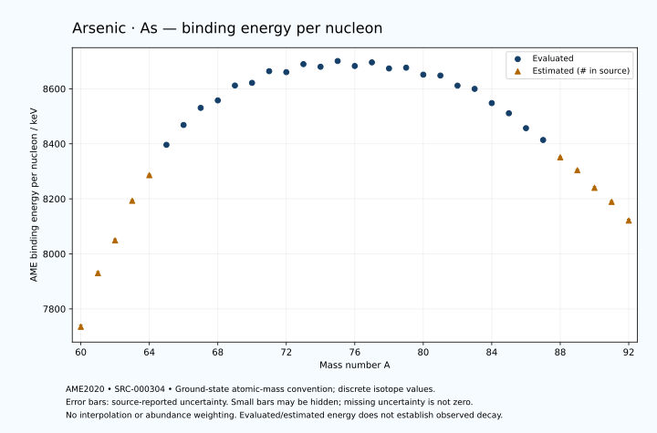

# Arsenic — Atomic Masses and Reaction Energies

<!-- generated-by: sync-ame2020.mjs -->

**Dated evaluated data · scientific coverage remains partial.** 33 ground-state nuclides from AME2020. Values and uncertainties are transcribed from the retained unrounded analysis files; estimated quantities remain labelled.

- [Parent Arsenic record](0033-Arsenic-As.md) · [NUBASE states and decays](0033-Arsenic-As-Nuclear-Evaluation.md)
- [Structured data](data/isotopes/0033-Arsenic-As-AME2020-Evaluation.yaml)
- [Original mass table](../../data/catalog/sources/ame2020-mass_1.mas20.txt) · [Original reaction table](../../data/catalog/sources/ame2020-rct1.mas20.txt)
- [AME2020 methods](https://doi.org/10.1088/1674-1137/abddb0) (SRC-000303) · [Tables and definitions](https://doi.org/10.1088/1674-1137/abddaf) (SRC-000304)

## Reading the data

All table energies and uncertainties are in keV; binding energy is per nucleon. A # replaces a decimal point in the original estimated value. UNKNOWN (*) retains the source's not-calculable entry; it is neither zero nor automatically NOT APPLICABLE. Source lines are one-based in the retained files. Uncertainties remain those published by the evaluation, with no replacement by independent-mass quadrature.

Atomic-mass conventions apply. Qα is total decay energy, not alpha-particle kinetic energy. Positive Q alone does not establish a decay branch, rate or observation. He-4's source Qα of zero is a bookkeeping identity. These tables describe ground-state combinations, not isomer or excited-daughter transitions. Nuclear state and daughter lookups are explicit in the structured companion. The binding quantity follows [Z M(¹H) + N mₙ − M(A,Z)]c²/A; it has not been converted to a bare-nucleus convention.

## Mass and binding table

| Nuclide | N | Atomic mass excess / keV | AME binding per nucleon / keV | Mass-file line |
|---|---:|---|---|---:|
| As-60 | 27 | -5640# ± 400# | 7735# ± 7# | 607 |
| As-61 | 28 | -17200# ± 300# | 7930# ± 5# | 621 |
| As-62 | 29 | -24420# ± 300# | 8049# ± 5# | 634 |
| As-63 | 30 | -33500# ± 200# | 8193# ± 3# | 647 |
| As-64 | 31 | -39532# ± 203# | 8286# ± 3# | 660 |
| As-65 | 32 | -46937.056 ± 84.766 | 8396.2351 ± 1.3041 | 673 |
| As-66 | 33 | -52025.084 ± 5.682 | 8468.4034 ± 0.0861 | 686 |
| As-67 | 34 | -56587.232 ± 0.443 | 8530.5685 ± 0.0066 | 699 |
| As-68 | 35 | -58894.527 ± 1.846 | 8557.7457 ± 0.0271 | 712 |
| As-69 | 36 | -63112.181 ± 31.999 | 8611.8214 ± 0.4638 | 725 |
| As-70 | 37 | -64333.973 ± 1.397 | 8621.5541 ± 0.0200 | 738 |
| As-71 | 38 | -67893.257 ± 4.163 | 8663.9350 ± 0.0586 | 750 |
| As-72 | 39 | -68229.808 ± 4.083 | 8660.3786 ± 0.0567 | 763 |
| As-73 | 40 | -70952.757 ± 3.853 | 8689.6099 ± 0.0528 | 776 |
| As-74 | 41 | -70860.064 ± 1.693 | 8680.0020 ± 0.0229 | 789 |
| As-75 | 42 | -73034.203 ± 0.884 | 8700.8748 ± 0.0118 | 802 |
| As-76 | 43 | -72291.384 ± 0.886 | 8682.8172 ± 0.0117 | 816 |
| As-77 | 44 | -73916.334 ± 1.692 | 8695.9789 ± 0.0220 | 829 |
| As-78 | 45 | -72816.970 ± 9.779 | 8673.8760 ± 0.1254 | 843 |
| As-79 | 46 | -73636.081 ± 5.325 | 8676.6172 ± 0.0674 | 856 |
| As-80 | 47 | -72214.601 ± 3.333 | 8651.2824 ± 0.0417 | 870 |
| As-81 | 48 | -72533.314 ± 2.644 | 8648.0571 ± 0.0326 | 884 |
| As-82 | 49 | -70105.427 ± 3.729 | 8611.4153 ± 0.0455 | 899 |
| As-83 | 50 | -69669.331 ± 2.799 | 8599.6540 ± 0.0337 | 913 |
| As-84 | 51 | -65853.568 ± 3.171 | 8547.9385 ± 0.0377 | 928 |
| As-85 | 52 | -63189.152 ± 3.078 | 8510.9851 ± 0.0362 | 942 |
| As-86 | 53 | -58962.150 ± 3.450 | 8456.7215 ± 0.0401 | 957 |
| As-87 | 54 | -55617.914 ± 2.985 | 8413.8521 ± 0.0343 | 971 |
| As-88 | 55 | -50450# ± 200# | 8351# ± 2# | 985 |
| As-89 | 56 | -46530# ± 300# | 8304# ± 3# | 999 |
| As-90 | 57 | -40990# ± 400# | 8240# ± 4# | 1013 |
| As-91 | 58 | -36500# ± 400# | 8189# ± 4# | 1027 |
| As-92 | 59 | -30380# ± 500# | 8121# ± 5# | 1041 |

## Q-values and separation energies

| Nuclide | Qβ− / keV | Qα / keV | S₂n / keV | S₂p / keV | Reaction-file line |
|---|---|---|---|---|---:|
| As-60 | UNKNOWN (*) | -4225# ± 640# | UNKNOWN (*) | -3322# ± 500# | 606 |
| As-61 | UNKNOWN (*) | -4215# ± 500# | UNKNOWN (*) | -1982# ± 345# | 620 |
| As-62 | UNKNOWN (*) | -3305# ± 424# | 34922# ± 500# | -592# ± 361# | 633 |
| As-63 | -16650# ± 539# | -2165# ± 263# | 32443# ± 361# | 944# ± 204# | 646 |
| As-64 | -12673# ± 540# | -2367# ± 285# | 31255# ± 362# | 2123# ± 203# | 659 |
| As-65 | -13917# ± 312# | -2227.3099 ± 92.8912 | 29579# ± 217# | 4967.8988 ± 84.7760 | 672 |
| As-66 | -10365# ± 200# | -2462.9778 ± 5.7177 | 28635# ± 204# | 7770.1992 ± 5.8590 | 685 |
| As-67 | -10006.9381 ± 67.0690 | -2465.0484 ± 1.3772 | 25792.8120 ± 84.7671 | 8507.6878 ± 0.9065 | 698 |
| As-68 | -4705.0786 ± 1.9112 | -2486.6167 ± 2.3341 | 23012.0798 ± 5.9744 | 9748.7409 ± 2.1448 | 711 |
| As-69 | -6677.4672 ± 32.0215 | -2879.6108 ± 32.0092 | 22667.5854 ± 32.0025 | 10810.9676 ± 32.0208 | 724 |
| As-70 | -2404.0737 ± 2.1118 | -3035.1605 ± 1.7736 | 21582.0820 ± 2.3150 | 11825.8610 ± 1.9996 | 737 |
| As-71 | -4746.7420 ± 5.0140 | -3439.0167 ± 4.2440 | 20923.7115 ± 32.2690 | 13143.3793 ± 4.3311 | 749 |
| As-72 | -361.6194 ± 4.5276 | -3568.6697 ± 4.3265 | 20038.4711 ± 4.3156 | 13897.6002 ± 4.2561 | 762 |
| As-73 | -2725.3604 ± 7.3993 | -4049.8527 ± 4.0349 | 19202.1358 ± 5.6725 | 15391.5720 ± 3.9375 | 775 |
| As-74 | 1353.1467 ± 1.6931 | -4374.8295 ± 2.0758 | 18772.8917 ± 4.4203 | 16849.7221 ± 1.8805 | 788 |
| As-75 | -864.7139 ± 0.8816 | -5319.9921 ± 1.1995 | 18224.0825 ± 3.9531 | 17912.8016 ± 1.8953 | 801 |
| As-76 | 2960.5756 ± 0.8864 | -6128.0157 ± 1.2062 | 17573.9560 ± 1.9110 | 18819.6998 ± 3.1225 | 815 |
| As-77 | 683.1627 ± 1.6920 | -6641.9066 ± 2.3820 | 17024.7674 ± 1.9081 | 20033.6372 ± 1.8200 | 828 |
| As-78 | 4208.9819 ± 9.7801 | -7192.2595 ± 10.2273 | 16668.2221 ± 9.8192 | 21098.2637 ± 9.9730 | 842 |
| As-79 | 2281.3849 ± 5.3284 | -7600.3576 ± 5.3671 | 15862.3828 ± 5.5307 | 22221.6706 ± 5.8499 | 855 |
| As-80 | 5544.8861 ± 3.4412 | -8342.8690 ± 3.8650 | 15540.2676 ± 10.3237 | 23088.4579 ± 3.4951 | 869 |
| As-81 | 3855.7050 ± 2.8072 | -8965.8774 ± 3.5855 | 15039.8692 ± 5.9397 | 24562.9008 ± 2.9045 | 883 |
| As-82 | 7488.4677 ± 3.7579 | -8826.2579 ± 3.8735 | 14033.4624 ± 5.0016 | 25459.6950 ± 4.7140 | 898 |
| As-83 | 5671.2117 ± 4.1290 | -9545.8920 ± 3.0451 | 13278.6536 ± 3.8457 | 26619.3120 ± 4.2940 | 912 |
| As-84 | 10094.1624 ± 3.7219 | -9054.8095 ± 4.2859 | 11890.7769 ± 4.8901 | 27500.7848 ± 3.9870 | 927 |
| As-85 | 9224.4929 ± 4.0313 | -7986.1063 ± 4.4809 | 9662.4567 ± 4.1543 | 28509.9656 ± 4.0313 | 941 |
| As-86 | 11541.0256 ± 4.2666 | -8456.3401 ± 4.2124 | 9251.2176 ± 4.6807 | 29445.9554 ± 30.0068 | 956 |
| As-87 | 10808.2192 ± 3.7260 | -8785.7008 ± 3.9608 | 8571.3977 ± 4.2818 | 30451.7968 ± 37.3791 | 970 |
| As-88 | 13434# ± 200# | -8781# ± 202# | 7630# ± 200# | 31268# ± 447# | 984 |
| As-89 | 12462# ± 300# | -9211# ± 302# | 7055# ± 300# | 32238# ± 583# | 998 |
| As-90 | 14810# ± 518# | -9655# ± 565# | 6683# ± 447# | 33178# ± 640# | 1012 |
| As-91 | 14080# ± 589# | -10055# ± 640# | 6112# ± 500# | UNKNOWN (*) | 1026 |
| As-92 | 16344# ± 640# | -10414# ± 707# | 5532# ± 640# | UNKNOWN (*) | 1040 |

Qβ− comes from the mass-file line in the first table. The other three columns come from the reaction-file line. Definitions and original source strings are retained in the structured data.

## Binding-energy chart

Discrete source values and source-reported uncertainties. No interpolation, natural-abundance weighting or observed-decay claim is implied. This quantitative chart supplements the 22 separate illustrative panels.

## Remaining review

Later measurements, state-specific decay branches, isomer Q-values, additional reaction channels and full claim-level review remain open. Existing authored values retain their own provenance; this companion does not overwrite them.
