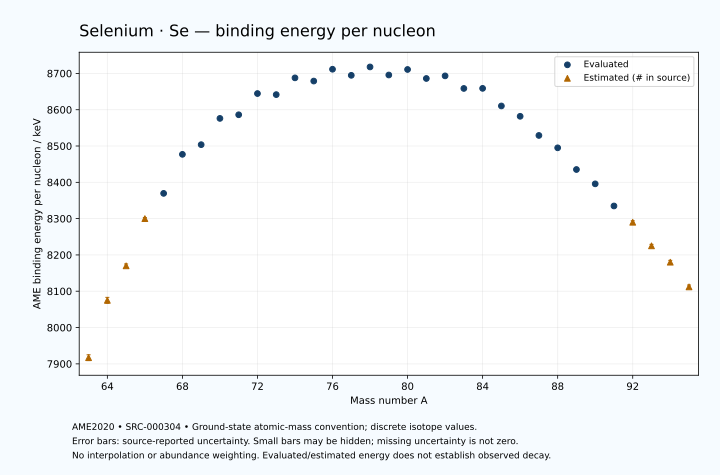

# Selenium — Atomic Masses and Reaction Energies

<!-- generated-by: sync-ame2020.mjs -->

**Dated evaluated data · scientific coverage remains partial.** 33 ground-state nuclides from AME2020. Values and uncertainties are transcribed from the retained unrounded analysis files; estimated quantities remain labelled.

- [Parent Selenium record](0034-Selenium-Se.md) · [NUBASE states and decays](0034-Selenium-Se-Nuclear-Evaluation.md)
- [Structured data](data/isotopes/0034-Selenium-Se-AME2020-Evaluation.yaml)
- [Original mass table](../../data/catalog/sources/ame2020-mass_1.mas20.txt) · [Original reaction table](../../data/catalog/sources/ame2020-rct1.mas20.txt)
- [AME2020 methods](https://doi.org/10.1088/1674-1137/abddb0) (SRC-000303) · [Tables and definitions](https://doi.org/10.1088/1674-1137/abddaf) (SRC-000304)

## Reading the data

All table energies and uncertainties are in keV; binding energy is per nucleon. A # replaces a decimal point in the original estimated value. UNKNOWN (*) retains the source's not-calculable entry; it is neither zero nor automatically NOT APPLICABLE. Source lines are one-based in the retained files. Uncertainties remain those published by the evaluation, with no replacement by independent-mass quadrature.

Atomic-mass conventions apply. Qα is total decay energy, not alpha-particle kinetic energy. Positive Q alone does not establish a decay branch, rate or observation. He-4's source Qα of zero is a bookkeeping identity. These tables describe ground-state combinations, not isomer or excited-daughter transitions. Nuclear state and daughter lookups are explicit in the structured companion. The binding quantity follows [Z M(¹H) + N mₙ − M(A,Z)]c²/A; it has not been converted to a bare-nucleus convention.

## Mass and binding table

| Nuclide | N | Atomic mass excess / keV | AME binding per nucleon / keV | Mass-file line |
|---|---:|---|---|---:|
| Se-63 | 29 | -16850# ± 500# | 7917# ± 8# | 648 |
| Se-64 | 30 | -26860# ± 500# | 8075# ± 8# | 661 |
| Se-65 | 31 | -33020# ± 300# | 8170# ± 5# | 674 |
| Se-66 | 32 | -41660# ± 200# | 8300# ± 3# | 687 |
| Se-67 | 33 | -46580.294 ± 67.068 | 8369.5344 ± 1.0010 | 700 |
| Se-68 | 34 | -54189.449 ± 0.496 | 8477.0482 ± 0.0073 | 713 |
| Se-69 | 35 | -56434.714 ± 1.490 | 8503.7082 ± 0.0216 | 726 |
| Se-70 | 36 | -61929.900 ± 1.584 | 8576.0338 ± 0.0226 | 739 |
| Se-71 | 37 | -63146.515 ± 2.794 | 8586.0606 ± 0.0394 | 751 |
| Se-72 | 38 | -67868.189 ± 1.956 | 8644.4902 ± 0.0272 | 764 |
| Se-73 | 39 | -68227.396 ± 7.424 | 8641.5591 ± 0.1017 | 777 |
| Se-74 | 40 | -72213.210 ± 0.015 | 8687.7155 ± 0.0003 | 790 |
| Se-75 | 41 | -72169.489 ± 0.073 | 8678.9139 ± 0.0010 | 803 |
| Se-76 | 42 | -75251.959 ± 0.016 | 8711.4781 ± 0.0003 | 817 |
| Se-77 | 43 | -74599.497 ± 0.062 | 8694.6908 ± 0.0008 | 830 |
| Se-78 | 44 | -77025.952 ± 0.179 | 8717.8072 ± 0.0023 | 844 |
| Se-79 | 45 | -75917.466 ± 0.223 | 8695.5923 ± 0.0028 | 857 |
| Se-80 | 46 | -77759.487 ± 0.947 | 8710.8142 ± 0.0118 | 871 |
| Se-81 | 47 | -76389.019 ± 0.977 | 8685.9998 ± 0.0121 | 885 |
| Se-82 | 48 | -77593.895 ± 0.466 | 8693.1973 ± 0.0057 | 900 |
| Se-83 | 49 | -75340.543 ± 3.036 | 8658.5560 ± 0.0366 | 914 |
| Se-84 | 50 | -75947.731 ± 1.961 | 8658.7935 ± 0.0233 | 929 |
| Se-85 | 51 | -72413.645 ± 2.613 | 8610.3045 ± 0.0307 | 943 |
| Se-86 | 52 | -70503.175 ± 2.520 | 8581.8224 ± 0.0293 | 958 |
| Se-87 | 53 | -66426.133 ± 2.241 | 8529.0920 ± 0.0258 | 972 |
| Se-88 | 54 | -63884.203 ± 3.357 | 8495.0045 ± 0.0382 | 986 |
| Se-89 | 55 | -58992.398 ± 3.729 | 8435.2799 ± 0.0419 | 1000 |
| Se-90 | 56 | -55800.223 ± 329.749 | 8395.7672 ± 3.6639 | 1014 |
| Se-91 | 57 | -50580.130 ± 433.145 | 8334.8382 ± 4.7598 | 1028 |
| Se-92 | 58 | -46724# ± 400# | 8290# ± 4# | 1042 |
| Se-93 | 59 | -40860# ± 400# | 8225# ± 4# | 1056 |
| Se-94 | 60 | -36803# ± 500# | 8180# ± 5# | 1070 |
| Se-95 | 61 | -30460# ± 500# | 8112# ± 5# | 1085 |

## Q-values and separation energies

| Nuclide | Qβ− / keV | Qα / keV | S₂n / keV | S₂p / keV | Reaction-file line |
|---|---|---|---|---|---:|
| Se-63 | UNKNOWN (*) | -2905# ± 640# | UNKNOWN (*) | -2362# ± 583# | 647 |
| Se-64 | UNKNOWN (*) | -1754# ± 583# | UNKNOWN (*) | -702# ± 519# | 660 |
| Se-65 | -16529# ± 583# | -1655# ± 424# | 32312# ± 583# | 676# ± 302# | 673 |
| Se-66 | -18091# ± 447# | -1945# ± 244# | 30943# ± 539# | 1923# ± 200# | 686 |
| Se-67 | -14051# ± 307# | -2083.9890 ± 76.7226 | 29703# ± 307# | 4680.0129 ± 67.1025 | 699 |
| Se-68 | -15398# ± 259# | -2298.8618 ± 3.7588 | 28672# ± 200# | 7160.3502 ± 2.4514 | 712 |
| Se-69 | -10175.2364 ± 42.0293 | -2381.4068 ± 2.6279 | 25997.0563 ± 67.0841 | 8338.9384 ± 4.5690 | 725 |
| Se-70 | -10504.2727 ± 14.9878 | -2747.7748 ± 2.8760 | 23883.0869 ± 1.6593 | 9529.0429 ± 2.4552 | 738 |
| Se-71 | -6644.0883 ± 6.0820 | -2897.7126 ± 5.1444 | 22854.4366 ± 3.1670 | 10623.7828 ± 3.0895 | 750 |
| Se-72 | -8806.4384 ± 2.2083 | -3314.3058 ± 2.7106 | 22080.9253 ± 2.5168 | 11884.0947 ± 2.1210 | 763 |
| Se-73 | -4581.6095 ± 10.0278 | -3551.6379 ± 7.5397 | 21223.5175 ± 7.9323 | 12898.6814 ± 7.4683 | 776 |
| Se-74 | -6925.0492 ± 5.8354 | -4076.0901 ± 0.8200 | 20487.6578 ± 1.9562 | 14205.2424 ± 0.0750 | 789 |
| Se-75 | -3062.4694 ± 4.2855 | -4687.7481 ± 0.8181 | 20084.7291 ± 7.4241 | 15449.8988 ± 0.0908 | 802 |
| Se-76 | -4962.8810 ± 9.3218 | -5090.9650 ± 0.0772 | 19181.3849 ± 0.0211 | 16407.4505 ± 0.0197 | 816 |
| Se-77 | -1364.6792 ± 2.8099 | -5726.8804 ± 0.0843 | 18572.6440 ± 0.0959 | 17320.4662 ± 0.0808 | 829 |
| Se-78 | -3573.7836 ± 3.5750 | -6028.4165 ± 0.1791 | 17916.6284 ± 0.1781 | 18390.9956 ± 0.1782 | 843 |
| Se-79 | 150.6016 ± 1.0186 | -6485.4088 ± 0.2284 | 17460.6050 ± 0.2144 | 19282.5379 ± 0.2277 | 856 |
| Se-80 | -1870.4623 ± 0.3095 | -6971.5050 ± 0.9469 | 16876.1718 ± 0.9561 | 20475.3711 ± 3.6601 | 870 |
| Se-81 | 1588.0317 ± 1.3787 | -7601.0649 ± 0.9788 | 16614.1894 ± 0.9955 | 21439.7816 ± 37.1706 | 884 |
| Se-82 | -95.2184 ± 1.0767 | -8156.7527 ± 3.5661 | 15977.0439 ± 0.9294 | 22636.5229 ± 2.1065 | 899 |
| Se-83 | 3673.1780 ± 4.8392 | -8238.2794 ± 37.2843 | 15094.1602 ± 3.1504 | 23626.7902 ± 3.6658 | 913 |
| Se-84 | 1835.3638 ± 25.7652 | -8837.3322 ± 2.8323 | 14496.4716 ± 2.0154 | 25110.5976 ± 2.9699 | 928 |
| Se-85 | 6161.8335 ± 4.0313 | -8546.8657 ± 3.3170 | 13215.7380 ± 4.0054 | 26015.1449 ± 3.5592 | 942 |
| Se-86 | 5129.0860 ± 3.9717 | -7513.0160 ± 3.3650 | 10698.0808 ± 3.1855 | 26932.6822 ± 4.0442 | 957 |
| Se-87 | 7465.5526 ± 3.8766 | -7874.6064 ± 3.2960 | 10155.1239 ± 3.4352 | 27880.6481 ± 4.3452 | 971 |
| Se-88 | 6831.7640 ± 4.6125 | -8160.6839 ± 4.6125 | 9523.6641 ± 4.1917 | 29062.2186 ± 437.8151 | 985 |
| Se-89 | 9281.8730 ± 4.9510 | -8293.8875 ± 5.2693 | 8708.9018 ± 4.3452 | 29980# ± 300# | 999 |
| Se-90 | 8200.0834 ± 329.7660 | -8825.2118 ± 548.0923 | 8058.6556 ± 329.7660 | 30859# ± 518# | 1013 |
| Se-91 | 10527.1716 ± 433.1593 | -9415# ± 527# | 7730.3675 ± 433.1608 | 32118# ± 589# | 1027 |
| Se-92 | 9509# ± 400# | -9629# ± 565# | 7066# ± 518# | 32832# ± 640# | 1041 |
| Se-93 | 12030# ± 588# | -10245# ± 565# | 6422# ± 589# | UNKNOWN (*) | 1055 |
| Se-94 | 10846# ± 539# | -10758# ± 707# | 6222# ± 640# | UNKNOWN (*) | 1069 |
| Se-95 | 13390# ± 583# | UNKNOWN (*) | 5743# ± 640# | UNKNOWN (*) | 1084 |

Qβ− comes from the mass-file line in the first table. The other three columns come from the reaction-file line. Definitions and original source strings are retained in the structured data.

## Binding-energy chart

Discrete source values and source-reported uncertainties. No interpolation, natural-abundance weighting or observed-decay claim is implied. This quantitative chart supplements the 22 separate illustrative panels.

## Remaining review

Later measurements, state-specific decay branches, isomer Q-values, additional reaction channels and full claim-level review remain open. Existing authored values retain their own provenance; this companion does not overwrite them.
