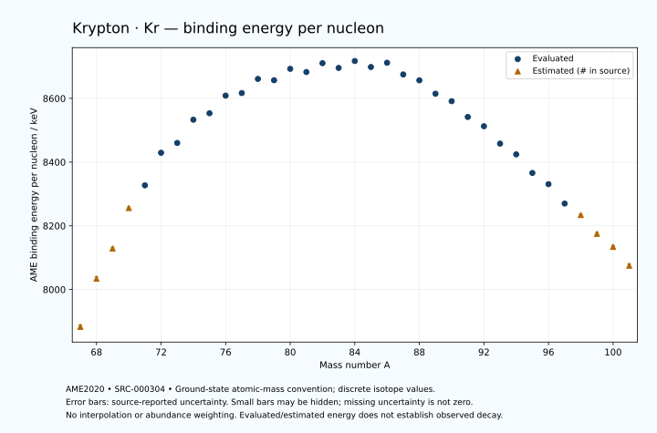

# Krypton — Atomic Masses and Reaction Energies

<!-- generated-by: sync-ame2020.mjs -->

**Dated evaluated data · scientific coverage remains partial.** 35 ground-state nuclides from AME2020. Values and uncertainties are transcribed from the retained unrounded analysis files; estimated quantities remain labelled.

- [Parent Krypton record](0036-Krypton-Kr.md) · [NUBASE states and decays](0036-Krypton-Kr-Nuclear-Evaluation.md)
- [Structured data](data/isotopes/0036-Krypton-Kr-AME2020-Evaluation.yaml)
- [Original mass table](../../data/catalog/sources/ame2020-mass_1.mas20.txt) · [Original reaction table](../../data/catalog/sources/ame2020-rct1.mas20.txt)
- [AME2020 methods](https://doi.org/10.1088/1674-1137/abddb0) (SRC-000303) · [Tables and definitions](https://doi.org/10.1088/1674-1137/abddaf) (SRC-000304)

## Reading the data

All table energies and uncertainties are in keV; binding energy is per nucleon. A # replaces a decimal point in the original estimated value. UNKNOWN (*) retains the source's not-calculable entry; it is neither zero nor automatically NOT APPLICABLE. Source lines are one-based in the retained files. Uncertainties remain those published by the evaluation, with no replacement by independent-mass quadrature.

Atomic-mass conventions apply. Qα is total decay energy, not alpha-particle kinetic energy. Positive Q alone does not establish a decay branch, rate or observation. He-4's source Qα of zero is a bookkeeping identity. These tables describe ground-state combinations, not isomer or excited-daughter transitions. Nuclear state and daughter lookups are explicit in the structured companion. The binding quantity follows [Z M(¹H) + N mₙ − M(A,Z)]c²/A; it has not been converted to a bare-nucleus convention.

## Mass and binding table

| Nuclide | N | Atomic mass excess / keV | AME binding per nucleon / keV | Mass-file line |
|---|---:|---|---|---:|
| Kr-67 | 31 | -15552# ± 424# | 7883# ± 6# | 702 |
| Kr-68 | 32 | -25626# ± 500# | 8034# ± 7# | 715 |
| Kr-69 | 33 | -32140# ± 300# | 8129# ± 4# | 728 |
| Kr-70 | 34 | -41100# ± 200# | 8256# ± 3# | 741 |
| Kr-71 | 35 | -46327.211 ± 128.769 | 8327.1310 ± 1.8136 | 753 |
| Kr-72 | 36 | -53940.582 ± 8.011 | 8429.3193 ± 0.1113 | 766 |
| Kr-73 | 37 | -56551.758 ± 6.578 | 8460.1847 ± 0.0901 | 779 |
| Kr-74 | 38 | -62331.844 ± 2.013 | 8533.0390 ± 0.0272 | 792 |
| Kr-75 | 39 | -64323.632 ± 8.104 | 8553.4399 ± 0.1081 | 805 |
| Kr-76 | 40 | -69013.706 ± 4.013 | 8608.8077 ± 0.0528 | 819 |
| Kr-77 | 41 | -70169.451 ± 1.956 | 8616.8370 ± 0.0254 | 832 |
| Kr-78 | 42 | -74178.283 ± 0.307 | 8661.2385 ± 0.0039 | 846 |
| Kr-79 | 43 | -74442.290 ± 3.480 | 8657.1130 ± 0.0441 | 859 |
| Kr-80 | 44 | -77893.455 ± 0.695 | 8692.9301 ± 0.0087 | 873 |
| Kr-81 | 45 | -77696.199 ± 1.074 | 8682.8206 ± 0.0133 | 887 |
| Kr-82 | 46 | -80591.79509 ± 0.00551 | 8710.6754 ± 0.0003 | 902 |
| Kr-83 | 47 | -79990.643 ± 0.009 | 8695.7295 ± 0.0003 | 916 |
| Kr-84 | 48 | -82439.34527 ± 0.00382 | 8717.4473 ± 0.0003 | 931 |
| Kr-85 | 49 | -81480.341 ± 2.000 | 8698.5633 ± 0.0235 | 945 |
| Kr-86 | 50 | -83265.67593 ± 0.00372 | 8712.0295 ± 0.0003 | 960 |
| Kr-87 | 51 | -80709.531 ± 0.246 | 8675.2840 ± 0.0028 | 974 |
| Kr-88 | 52 | -79691.295 ± 2.608 | 8656.8499 ± 0.0296 | 988 |
| Kr-89 | 53 | -76535.795 ± 2.142 | 8614.8158 ± 0.0241 | 1002 |
| Kr-90 | 54 | -74959.259 ± 1.863 | 8591.2599 ± 0.0207 | 1016 |
| Kr-91 | 55 | -70973.974 ± 2.236 | 8541.7519 ± 0.0246 | 1030 |
| Kr-92 | 56 | -68769.329 ± 2.701 | 8512.6750 ± 0.0294 | 1044 |
| Kr-93 | 57 | -64136.002 ± 2.515 | 8458.1085 ± 0.0270 | 1058 |
| Kr-94 | 58 | -61347.780 ± 12.109 | 8424.3318 ± 0.1288 | 1072 |
| Kr-95 | 59 | -56158.920 ± 18.630 | 8365.9963 ± 0.1961 | 1087 |
| Kr-96 | 60 | -53081.682 ± 19.277 | 8330.8721 ± 0.2008 | 1101 |
| Kr-97 | 61 | -47423.499 ± 130.409 | 8269.8645 ± 1.3444 | 1116 |
| Kr-98 | 62 | -44120# ± 300# | 8234# ± 3# | 1131 |
| Kr-99 | 63 | -38400# ± 400# | 8175# ± 4# | 1145 |
| Kr-100 | 64 | -34470# ± 400# | 8134# ± 4# | 1160 |
| Kr-101 | 65 | -28580# ± 500# | 8075# ± 5# | 1175 |

## Q-values and separation energies

| Nuclide | Qβ− / keV | Qα / keV | S₂n / keV | S₂p / keV | Reaction-file line |
|---|---|---|---|---|---:|
| Kr-67 | UNKNOWN (*) | -1127# ± 656# | UNKNOWN (*) | -2890# ± 300# | 701 |
| Kr-68 | UNKNOWN (*) | -1192# ± 707# | UNKNOWN (*) | -1456# ± 539# | 714 |
| Kr-69 | UNKNOWN (*) | -1546# ± 424# | 32731# ± 520# | 138# ± 307# | 727 |
| Kr-70 | UNKNOWN (*) | -1865# ± 283# | 31617# ± 539# | 1489# ± 200# | 740 |
| Kr-71 | -14037# ± 420# | -2171.8328 ± 145.1875 | 30330# ± 326# | 4470.4389 ± 128.7772 | 752 |
| Kr-72 | -15611# ± 500# | -2176.0492 ± 8.0262 | 28983# ± 200# | 6588.6246 ± 8.1659 | 765 |
| Kr-73 | -10540.1468 ± 41.3212 | -2541.9595 ± 6.7445 | 26367.1831 ± 128.9365 | 7983.1853 ± 7.1468 | 778 |
| Kr-74 | -10415.8280 ± 3.4240 | -2826.8603 ± 2.5616 | 24533.8980 ± 8.2600 | 9041.5974 ± 2.8072 | 791 |
| Kr-75 | -7104.9299 ± 8.1895 | -3602.0327 ± 8.5723 | 23914.5098 ± 10.4375 | 10674.1776 ± 10.9903 | 804 |
| Kr-76 | -8534.6172 ± 4.1214 | -3570.4330 ± 4.4646 | 22824.4980 ± 4.4900 | 11378.4376 ± 4.0133 | 818 |
| Kr-77 | -5338.9516 ± 2.3510 | -4366.9712 ± 7.6771 | 21988.4559 ± 8.3367 | 12577.9045 ± 1.9575 | 831 |
| Kr-78 | -7242.8560 ± 3.2520 | -4389.9886 ± 0.3073 | 21307.2135 ± 4.0175 | 13504.2661 ± 0.3066 | 845 |
| Kr-79 | -3639.5114 ± 3.9423 | -4697.7164 ± 3.4812 | 20415.4743 ± 3.9925 | 14420.7348 ± 3.4807 | 858 |
| Kr-80 | -5717.9785 ± 1.9883 | -5066.4115 ± 0.6948 | 19857.8078 ± 0.7576 | 15445.4455 ± 0.7160 | 872 |
| Kr-81 | -2239.4954 ± 5.0188 | -5521.6180 ± 1.0755 | 19396.5455 ± 3.6406 | 16356.6754 ± 1.0965 | 886 |
| Kr-82 | -4403.9824 ± 3.0088 | -5990.7594 ± 0.1787 | 18840.9763 ± 0.6946 | 17410.2500 ± 0.9468 | 901 |
| Kr-83 | -920.0039 ± 2.3288 | -6498.0934 ± 0.2227 | 18437.0804 ± 1.0737 | 18179.5664 ± 0.9774 | 915 |
| Kr-84 | -2680.3708 ± 2.1940 | -7104.7739 ± 0.9468 | 17990.1863 ± 0.0043 | 19423.3924 ± 0.4659 | 930 |
| Kr-85 | 687.0000 ± 2.0000 | -7516.2375 ± 2.2261 | 17632.3335 ± 2.0000 | 20717.7397 ± 3.6355 | 944 |
| Kr-86 | -518.6734 ± 0.2000 | -8096.6968 ± 0.4659 | 16968.9668 ± 0.0023 | 21895.8875 ± 1.9609 | 959 |
| Kr-87 | 3888.2706 ± 0.2463 | -7793.9036 ± 3.0459 | 15371.8264 ± 2.0151 | 22873.8281 ± 2.6243 | 973 |
| Kr-88 | 2917.7090 ± 2.6130 | -6168.4808 ± 3.2631 | 12568.2557 ± 2.6082 | 23766.0623 ± 3.6266 | 987 |
| Kr-89 | 5176.6042 ± 5.8342 | -6547.0654 ± 3.3788 | 11968.8998 ± 2.1565 | 24687.6039 ± 3.1004 | 1001 |
| Kr-90 | 4406.3133 ± 6.7158 | -6881.0001 ± 3.1337 | 11410.6001 ± 3.2052 | 25652.9984 ± 3.8394 | 1015 |
| Kr-91 | 6771.0748 ± 8.1153 | -6972.7569 ± 3.1655 | 10580.8154 ± 3.0964 | 26559.5175 ± 4.3482 | 1029 |
| Kr-92 | 6003.1210 ± 6.6924 | -7310.0413 ± 4.3090 | 9952.7053 ± 3.2815 | 27547.0480 ± 329.7600 | 1043 |
| Kr-93 | 8483.8977 ± 8.2243 | -7568.5199 ± 4.4982 | 9304.6648 ± 3.3650 | 28133.8148 ± 433.1521 | 1057 |
| Kr-94 | 7215.0114 ± 12.2782 | -7972.4730 ± 329.9712 | 8721.0874 ± 12.4071 | 29202# ± 400# | 1071 |
| Kr-95 | 9731.3868 ± 27.5124 | -8003.7065 ± 433.5452 | 8165.5541 ± 18.7989 | 29877# ± 400# | 1086 |
| Kr-96 | 8272.6693 ± 19.5669 | -8783# ± 400# | 7876.5379 ± 22.7653 | 30856# ± 501# | 1100 |
| Kr-97 | 11095.6460 ± 130.4232 | -8988# ± 420# | 7407.2143 ± 131.7332 | 31542# ± 517# | 1115 |
| Kr-98 | 10249# ± 300# | -9742# ± 583# | 7181# ± 301# | UNKNOWN (*) | 1130 |
| Kr-99 | 12721# ± 400# | -10365# ± 640# | 7119# ± 420# | UNKNOWN (*) | 1144 |
| Kr-100 | 11796# ± 400# | UNKNOWN (*) | 6492# ± 500# | UNKNOWN (*) | 1159 |
| Kr-101 | 13987# ± 501# | UNKNOWN (*) | 6323# ± 640# | UNKNOWN (*) | 1174 |

Qβ− comes from the mass-file line in the first table. The other three columns come from the reaction-file line. Definitions and original source strings are retained in the structured data.

## Binding-energy chart

Discrete source values and source-reported uncertainties. No interpolation, natural-abundance weighting or observed-decay claim is implied. This quantitative chart supplements the 22 separate illustrative panels.

## Remaining review

Later measurements, state-specific decay branches, isomer Q-values, additional reaction channels and full claim-level review remain open. Existing authored values retain their own provenance; this companion does not overwrite them.
