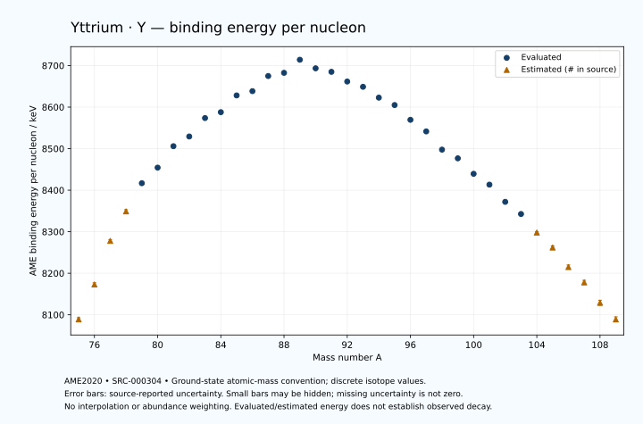

# Yttrium — Atomic Masses and Reaction Energies

<!-- generated-by: sync-ame2020.mjs -->

**Dated evaluated data · scientific coverage remains partial.** 35 ground-state nuclides from AME2020. Values and uncertainties are transcribed from the retained unrounded analysis files; estimated quantities remain labelled.

- [Parent Yttrium record](0039-Yttrium-Y.md) · [NUBASE states and decays](0039-Yttrium-Y-Nuclear-Evaluation.md)
- [Structured data](data/isotopes/0039-Yttrium-Y-AME2020-Evaluation.yaml)
- [Original mass table](../../data/catalog/sources/ame2020-mass_1.mas20.txt) · [Original reaction table](../../data/catalog/sources/ame2020-rct1.mas20.txt)
- [AME2020 methods](https://doi.org/10.1088/1674-1137/abddb0) (SRC-000303) · [Tables and definitions](https://doi.org/10.1088/1674-1137/abddaf) (SRC-000304)

## Reading the data

All table energies and uncertainties are in keV; binding energy is per nucleon. A # replaces a decimal point in the original estimated value. UNKNOWN (*) retains the source's not-calculable entry; it is neither zero nor automatically NOT APPLICABLE. Source lines are one-based in the retained files. Uncertainties remain those published by the evaluation, with no replacement by independent-mass quadrature.

Atomic-mass conventions apply. Qα is total decay energy, not alpha-particle kinetic energy. Positive Q alone does not establish a decay branch, rate or observation. He-4's source Qα of zero is a bookkeeping identity. These tables describe ground-state combinations, not isomer or excited-daughter transitions. Nuclear state and daughter lookups are explicit in the structured companion. The binding quantity follows [Z M(¹H) + N mₙ − M(A,Z)]c²/A; it has not been converted to a bare-nucleus convention.

## Mass and binding table

| Nuclide | N | Atomic mass excess / keV | AME binding per nucleon / keV | Mass-file line |
|---|---:|---|---|---:|
| Y-75 | 36 | -31820# ± 300# | 8089# ± 4# | 808 |
| Y-76 | 37 | -38250# ± 300# | 8173# ± 4# | 822 |
| Y-77 | 38 | -46439# ± 203# | 8278# ± 3# | 835 |
| Y-78 | 39 | -52173# ± 298# | 8349# ± 4# | 849 |
| Y-79 | 40 | -57802.935 ± 80.108 | 8416.7788 ± 1.0140 | 862 |
| Y-80 | 41 | -61148.162 ± 6.242 | 8454.2759 ± 0.0780 | 876 |
| Y-81 | 42 | -65712.919 ± 5.405 | 8505.9031 ± 0.0667 | 890 |
| Y-82 | 43 | -68064.097 ± 5.499 | 8529.2762 ± 0.0671 | 905 |
| Y-83 | 44 | -72205.672 ± 18.631 | 8573.6571 ± 0.2245 | 919 |
| Y-84 | 45 | -73894.439 ± 4.299 | 8587.7812 ± 0.0512 | 934 |
| Y-85 | 46 | -77842.131 ± 18.965 | 8628.1486 ± 0.2231 | 948 |
| Y-86 | 47 | -79283.100 ± 14.142 | 8638.4293 ± 0.1644 | 963 |
| Y-87 | 48 | -83018.387 ± 1.128 | 8674.8451 ± 0.0130 | 977 |
| Y-88 | 49 | -84299.029 ± 1.500 | 8682.5396 ± 0.0170 | 991 |
| Y-89 | 50 | -87711.202 ± 0.339 | 8714.0110 ± 0.0038 | 1005 |
| Y-90 | 51 | -86496.912 ± 0.354 | 8693.3778 ± 0.0039 | 1019 |
| Y-91 | 52 | -86351.321 ± 1.843 | 8684.9421 ± 0.0203 | 1033 |
| Y-92 | 53 | -84816.494 ± 9.127 | 8661.5894 ± 0.0992 | 1047 |
| Y-93 | 54 | -84227.155 ± 10.488 | 8648.9054 ± 0.1128 | 1061 |
| Y-94 | 55 | -82351.473 ± 6.380 | 8622.8068 ± 0.0679 | 1075 |
| Y-95 | 56 | -81207.937 ± 6.779 | 8604.9644 ± 0.0714 | 1090 |
| Y-96 | 57 | -78329.986 ± 6.075 | 8569.4269 ± 0.0633 | 1104 |
| Y-97 | 58 | -76115.455 ± 6.708 | 8541.4616 ± 0.0692 | 1119 |
| Y-98 | 59 | -72288.748 ± 7.919 | 8497.6162 ± 0.0808 | 1134 |
| Y-99 | 60 | -70643.730 ± 6.615 | 8476.6938 ± 0.0668 | 1148 |
| Y-100 | 61 | -67321.241 ± 11.179 | 8439.4151 ± 0.1118 | 1163 |
| Y-101 | 62 | -65054.787 ± 7.080 | 8413.3305 ± 0.0701 | 1178 |
| Y-102 | 63 | -61172.641 ± 4.081 | 8371.9172 ± 0.0400 | 1192 |
| Y-103 | 64 | -58457.034 ± 11.206 | 8342.6336 ± 0.1088 | 1207 |
| Y-104 | 65 | -54080# ± 200# | 8298# ± 2# | 1222 |
| Y-105 | 66 | -50570# ± 400# | 8262# ± 4# | 1237 |
| Y-106 | 67 | -45790# ± 500# | 8215# ± 5# | 1252 |
| Y-107 | 68 | -41970# ± 500# | 8178# ± 5# | 1268 |
| Y-108 | 69 | -36780# ± 600# | 8129# ± 6# | 1283 |
| Y-109 | 70 | -32480# ± 700# | 8089# ± 6# | 1299 |

## Q-values and separation energies

| Nuclide | Qβ− / keV | Qα / keV | S₂n / keV | S₂p / keV | Reaction-file line |
|---|---|---|---|---|---:|
| Y-75 | UNKNOWN (*) | -1955# ± 500# | UNKNOWN (*) | 386# ± 303# | 807 |
| Y-76 | UNKNOWN (*) | -2345# ± 583# | UNKNOWN (*) | 912# ± 300# | 821 |
| Y-77 | -14839# ± 448# | -2852# ± 207# | 30761# ± 362# | 3798# ± 203# | 834 |
| Y-78 | -11323# ± 499# | -2682# ± 298# | 30066# ± 423# | 6272# ± 298# | 848 |
| Y-79 | -11033# ± 310# | -3009.1491 ± 80.1172 | 27507# ± 218# | 7550.3773 ± 80.1191 | 861 |
| Y-80 | -6388# ± 300# | -3093.9896 ± 6.3122 | 25118# ± 298# | 8790.6773 ± 7.0318 | 875 |
| Y-81 | -8188.5003 ± 92.3762 | -3307.3346 ± 5.5603 | 24052.6197 ± 80.2906 | 9488.0825 ± 5.7437 | 889 |
| Y-82 | -4450.0341 ± 5.7221 | -3553.5860 ± 6.3809 | 23058.5711 ± 8.3177 | 10466.5631 ± 5.8056 | 904 |
| Y-83 | -6294.0125 ± 19.7074 | -3827.8097 ± 18.7317 | 22635.3895 ± 19.3976 | 11326.9104 ± 19.2654 | 918 |
| Y-84 | -2472.7471 ± 6.9767 | -4143.8787 ± 4.6856 | 21972.9780 ± 6.9767 | 12284.5687 ± 5.2476 | 933 |
| Y-85 | -4666.9352 ± 20.0257 | -4810.3435 ± 19.5893 | 21779.0954 ± 26.5855 | 13349.4340 ± 19.1078 | 947 |
| Y-86 | -1314.0763 ± 14.5847 | -5520.2030 ± 14.4587 | 21531.2967 ± 14.7812 | 14102.0674 ± 14.3113 | 962 |
| Y-87 | -3671.2405 ± 4.2962 | -6372.6635 ± 2.5874 | 21318.8919 ± 18.9989 | 15428.9885 ± 1.1278 | 976 |
| Y-88 | -670.1549 ± 5.6076 | -6964.9701 ± 2.6578 | 21158.5651 ± 14.2215 | 16129.9683 ± 1.5133 | 990 |
| Y-89 | -2833.2285 ± 2.7652 | -7968.7774 ± 0.3387 | 20835.4513 ± 1.1775 | 17691.3428 ± 0.3387 | 1004 |
| Y-90 | 2275.6350 ± 0.3726 | -6174.8256 ± 0.4063 | 18340.5196 ± 1.5411 | 18465.8499 ± 0.3877 | 1018 |
| Y-91 | 1544.2710 ± 1.8403 | -4178.4353 ± 1.8426 | 14782.7549 ± 1.8735 | 19216.8644 ± 5.7281 | 1032 |
| Y-92 | 3642.5294 ± 9.1271 | -4632.4058 ± 9.1285 | 14462.2183 ± 9.1340 | 20028.8638 ± 11.1775 | 1046 |
| Y-93 | 2894.8723 ± 10.4830 | -4939.6726 ± 11.8146 | 14018.4706 ± 10.6480 | 21060.0489 ± 13.0482 | 1060 |
| Y-94 | 4917.8589 ± 6.3799 | -5410.8157 ± 9.0738 | 13677.6143 ± 11.1357 | 22156.9652 ± 8.8428 | 1074 |
| Y-95 | 4452.0031 ± 6.7718 | -5887.8045 ± 10.3348 | 13123.4179 ± 12.4878 | 23165.9791 ± 10.3515 | 1089 |
| Y-96 | 7108.8741 ± 6.0740 | -5982.4522 ± 8.6254 | 12121.1494 ± 8.8095 | 24345.1368 ± 6.4049 | 1103 |
| Y-97 | 6821.2382 ± 6.7068 | -5920.4705 ± 10.3106 | 11050.1537 ± 9.5363 | 24803.0897 ± 21.3272 | 1118 |
| Y-98 | 8993.0098 ± 11.5755 | -6150.8723 ± 8.1744 | 10101.3978 ± 9.9791 | 25512.3389 ± 8.5993 | 1133 |
| Y-99 | 6972.9398 ± 12.4082 | -7178.3391 ± 21.2981 | 10670.9118 ± 9.4192 | 26702.5280 ± 6.8855 | 1147 |
| Y-100 | 9051.4949 ± 13.8293 | -8391.8060 ± 11.6707 | 11175.1295 ± 13.6980 | 27530.0307 ± 19.5859 | 1162 |
| Y-101 | 8106.2003 ± 10.9331 | -8960.5579 ± 7.3340 | 10553.6922 ± 9.6880 | 28511.5786 ± 8.1475 | 1177 |
| Y-102 | 10408.7856 ± 9.6618 | -9228.4047 ± 16.5923 | 9994.0364 ± 11.9003 | 29484.6993 ± 13.7439 | 1191 |
| Y-103 | 9351.9600 ± 14.5130 | -9760.7993 ± 11.9087 | 9544.8831 ± 13.2553 | 30467.5582 ± 23.3565 | 1206 |
| Y-104 | 11638# ± 200# | -10239# ± 201# | 9050# ± 200# | 31405# ± 217# | 1221 |
| Y-105 | 10888# ± 400# | -10427# ± 400# | 8255# ± 400# | 31988# ± 565# | 1236 |
| Y-106 | 12959# ± 539# | -10963# ± 507# | 7853# ± 539# | 32918# ± 707# | 1251 |
| Y-107 | 12050# ± 583# | -11235# ± 640# | 7543# ± 640# | UNKNOWN (*) | 1267 |
| Y-108 | 14170# ± 721# | -11755# ± 781# | 7132# ± 781# | UNKNOWN (*) | 1282 |
| Y-109 | 13250# ± 860# | UNKNOWN (*) | 6653# ± 860# | UNKNOWN (*) | 1298 |

Qβ− comes from the mass-file line in the first table. The other three columns come from the reaction-file line. Definitions and original source strings are retained in the structured data.

## Binding-energy chart

Discrete source values and source-reported uncertainties. No interpolation, natural-abundance weighting or observed-decay claim is implied. This quantitative chart supplements the 22 separate illustrative panels.

## Remaining review

Later measurements, state-specific decay branches, isomer Q-values, additional reaction channels and full claim-level review remain open. Existing authored values retain their own provenance; this companion does not overwrite them.
