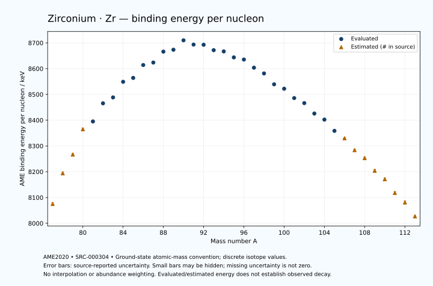

# Zirconium — Atomic Masses and Reaction Energies

<!-- generated-by: sync-ame2020.mjs -->

**Dated evaluated data · scientific coverage remains partial.** 37 ground-state nuclides from AME2020. Values and uncertainties are transcribed from the retained unrounded analysis files; estimated quantities remain labelled.

- [Parent Zirconium record](0040-Zirconium-Zr.md) · [NUBASE states and decays](0040-Zirconium-Zr-Nuclear-Evaluation.md)
- [Structured data](data/isotopes/0040-Zirconium-Zr-AME2020-Evaluation.yaml)
- [Original mass table](../../data/catalog/sources/ame2020-mass_1.mas20.txt) · [Original reaction table 1](../../data/catalog/sources/ame2020-rct1.mas20.txt) · [Original reaction table 2](../../data/catalog/sources/ame2020-rct2.mas20.txt)
- [AME2020 methods](https://doi.org/10.1088/1674-1137/abddb0) (SRC-000303) · [Tables and definitions](https://doi.org/10.1088/1674-1137/abddaf) (SRC-000304)

## Reading the data

All table energies and uncertainties are in keV; binding energy is per nucleon. A # replaces a decimal point in the original estimated value. UNKNOWN (*) retains the source's not-calculable entry; it is neither zero nor automatically NOT APPLICABLE. Source lines are one-based in the retained files. Uncertainties remain those published by the evaluation, with no replacement by independent-mass quadrature.

Atomic-mass conventions apply. Qα is total decay energy, not alpha-particle kinetic energy. Positive Q alone does not establish a decay branch, rate or observation. He-4's source Qα of zero is a bookkeeping identity. These tables describe ground-state combinations, not isomer or excited-daughter transitions. Nuclear state and daughter lookups are explicit in the structured companion. The binding quantity follows [Z M(¹H) + N mₙ − M(A,Z)]c²/A; it has not been converted to a bare-nucleus convention.

## Mass and binding table

| Nuclide | N | Atomic mass excess / keV | AME binding per nucleon / keV | Mass-file line |
|---|---:|---|---|---:|
| Zr-77 | 37 | -31600# ± 400# | 8075# ± 5# | 836 |
| Zr-78 | 38 | -40850# ± 400# | 8194# ± 5# | 850 |
| Zr-79 | 39 | -46770# ± 300# | 8267# ± 4# | 863 |
| Zr-80 | 40 | -54760# ± 300# | 8365# ± 4# | 877 |
| Zr-81 | 41 | -57524.418 ± 92.218 | 8395.1519 ± 1.1385 | 891 |
| Zr-82 | 42 | -63614.063 ± 1.584 | 8465.4666 ± 0.0193 | 906 |
| Zr-83 | 43 | -65911.659 ± 6.430 | 8488.3997 ± 0.0775 | 920 |
| Zr-84 | 44 | -71421.692 ± 5.499 | 8549.0301 ± 0.0655 | 935 |
| Zr-85 | 45 | -73175.196 ± 6.430 | 8564.0394 ± 0.0756 | 949 |
| Zr-86 | 46 | -77969.023 ± 3.566 | 8614.0523 ± 0.0415 | 964 |
| Zr-87 | 47 | -79347.147 ± 4.146 | 8623.6545 ± 0.0477 | 978 |
| Zr-88 | 48 | -83628.874 ± 5.403 | 8666.0339 ± 0.0614 | 992 |
| Zr-89 | 49 | -84877.974 ± 2.780 | 8673.3865 ± 0.0312 | 1006 |
| Zr-90 | 50 | -88772.547 ± 0.118 | 8709.9699 ± 0.0013 | 1020 |
| Zr-91 | 51 | -87895.592 ± 0.095 | 8693.3149 ± 0.0011 | 1034 |
| Zr-92 | 52 | -88459.024 ± 0.094 | 8692.6783 ± 0.0011 | 1048 |
| Zr-93 | 53 | -87122.028 ± 0.456 | 8671.6207 ± 0.0049 | 1062 |
| Zr-94 | 54 | -87269.332 ± 0.164 | 8666.8016 ± 0.0018 | 1076 |
| Zr-95 | 55 | -85659.940 ± 0.869 | 8643.5924 ± 0.0092 | 1091 |
| Zr-96 | 56 | -85438.860 ± 0.114 | 8635.3283 ± 0.0012 | 1105 |
| Zr-97 | 57 | -82936.693 ± 0.121 | 8603.7182 ± 0.0013 | 1120 |
| Zr-98 | 58 | -81281.757 ± 8.445 | 8581.3984 ± 0.0862 | 1135 |
| Zr-99 | 59 | -77616.670 ± 10.499 | 8539.2250 ± 0.1061 | 1149 |
| Zr-100 | 60 | -76372.736 ± 8.143 | 8522.1066 ± 0.0814 | 1164 |
| Zr-101 | 61 | -73160.987 ± 8.332 | 8485.8439 ± 0.0825 | 1179 |
| Zr-102 | 62 | -71581.427 ± 8.758 | 8466.2940 ± 0.0859 | 1193 |
| Zr-103 | 63 | -67808.993 ± 9.223 | 8425.8337 ± 0.0895 | 1208 |
| Zr-104 | 64 | -65717.660 ± 9.316 | 8402.3159 ± 0.0896 | 1223 |
| Zr-105 | 65 | -61458.274 ± 12.110 | 8358.5980 ± 0.1153 | 1238 |
| Zr-106 | 66 | -58749# ± 200# | 8330# ± 2# | 1253 |
| Zr-107 | 67 | -54020# ± 300# | 8284# ± 3# | 1269 |
| Zr-108 | 68 | -50950# ± 400# | 8253# ± 4# | 1284 |
| Zr-109 | 69 | -45730# ± 500# | 8204# ± 5# | 1300 |
| Zr-110 | 70 | -42220# ± 500# | 8171# ± 5# | 1315 |
| Zr-111 | 71 | -36480# ± 600# | 8118# ± 5# | 1330 |
| Zr-112 | 72 | -32420# ± 700# | 8081# ± 6# | 1346 |
| Zr-113 | 73 | -26340# ± 300# | 8027# ± 3# | 1362 |

## Q-values and separation energies

| Nuclide | Qβ− / keV | Qα / keV | S₂n / keV | S₂p / keV | Reaction-file line |
|---|---|---|---|---|---:|
| Zr-77 | UNKNOWN (*) | -2075# ± 566# | UNKNOWN (*) | -441# ± 456# | 835 |
| Zr-78 | UNKNOWN (*) | -2447# ± 412# | UNKNOWN (*) | 1180# ± 401# | 849 |
| Zr-79 | -15120# ± 583# | -2577# ± 372# | 31313# ± 500# | 3545# ± 300# | 862 |
| Zr-80 | -16339# ± 500# | -2937# ± 302# | 30053# ± 500# | 6164# ± 300# | 876 |
| Zr-81 | -11164# ± 410# | -2145.8909 ± 92.5572 | 26897# ± 314# | 6622.6963 ± 92.5161 | 890 |
| Zr-82 | -11804# ± 300# | -2865.0297 ± 7.6183 | 24997# ± 300# | 7880.5380 ± 3.8087 | 905 |
| Zr-83 | -8298.7493 ± 162.2075 | -2856.9112 ± 9.8193 | 24529.8773 ± 92.4418 | 8961.4675 ± 7.1503 | 919 |
| Zr-84 | -10227.8497 ± 5.5133 | -3535.1406 ± 6.4988 | 23950.2650 ± 5.7222 | 9989.5719 ± 8.1324 | 934 |
| Zr-85 | -6895.5120 ± 7.6250 | -4071.9778 ± 7.1504 | 23406.1727 ± 9.0896 | 10955.5227 ± 9.3829 | 948 |
| Zr-86 | -8834.9627 ± 6.5521 | -4383.8770 ± 6.9725 | 22689.9675 ± 6.5521 | 11897.3853 ± 3.7761 | 963 |
| Zr-87 | -5472.6536 ± 7.9633 | -4974.4469 ± 7.9927 | 22314.5866 ± 7.6476 | 12821.7990 ± 5.0100 | 977 |
| Zr-88 | -7457.3187 ± 57.8921 | -5404.2094 ± 5.5444 | 21802.4865 ± 6.4726 | 13683.7162 ± 5.4033 | 991 |
| Zr-89 | -4252.2191 ± 23.7199 | -6199.5999 ± 3.9547 | 21673.4633 ± 4.9910 | 14575.8394 ± 2.7795 | 1005 |
| Zr-90 | -6111.0165 ± 3.3163 | -6674.3634 ± 0.1179 | 21286.3096 ± 5.4038 | 15428.8606 ± 0.1179 | 1019 |
| Zr-91 | -1257.5644 ± 2.9243 | -5440.4314 ± 0.0947 | 19160.2544 ± 2.7811 | 16264.5077 ± 0.1320 | 1033 |
| Zr-92 | -2005.7335 ± 1.7823 | -2962.3109 ± 0.0943 | 15829.1127 ± 0.1466 | 17086.0211 ± 1.4518 | 1047 |
| Zr-93 | 90.8123 ± 1.4838 | -3337.9171 ± 0.4649 | 15369.0718 ± 0.4478 | 18048.0202 ± 5.4706 | 1061 |
| Zr-94 | -900.2684 ± 1.5000 | -3743.3025 ± 1.4580 | 14952.9438 ± 0.1888 | 18979.9029 ± 3.4273 | 1075 |
| Zr-95 | 1126.3312 ± 0.9854 | -4432.9066 ± 5.5217 | 14680.5488 ± 0.9816 | 20152.0388 ± 7.6040 | 1090 |
| Zr-96 | 163.9704 ± 0.1000 | -4996.4051 ± 3.4253 | 14312.1646 ± 0.1995 | 21171.0812 ± 1.6667 | 1104 |
| Zr-97 | 2666.1038 ± 4.2435 | -5275.7652 ± 7.5551 | 13419.3888 ± 0.8769 | 22397.3506 ± 5.8100 | 1119 |
| Zr-98 | 2242.8547 ± 9.8134 | -4860.9525 ± 8.6070 | 11985.5336 ± 8.4441 | 22941.4517 ± 11.9569 | 1134 |
| Zr-99 | 4718.6736 ± 15.9474 | -4924.3017 ± 11.9989 | 10822.6134 ± 10.4987 | 23613.9383 ± 11.0309 | 1148 |
| Zr-100 | 3418.5098 ± 11.3976 | -5879.4039 ± 11.7460 | 11233.6146 ± 11.7306 | 24528.2896 ± 8.7589 | 1163 |
| Zr-101 | 5730.5011 ± 9.1366 | -7005.2287 ± 8.9932 | 11686.9528 ± 13.4029 | 25220.4022 ± 9.5841 | 1178 |
| Zr-102 | 4716.8380 ± 9.0530 | -7583.9543 ± 9.3327 | 11351.3271 ± 11.9576 | 26341.8645 ± 11.1594 | 1192 |
| Zr-103 | 7219.6740 ± 10.0270 | -7715.3826 ± 10.3675 | 10790.6428 ± 12.4281 | 27062.0212 ± 12.5287 | 1207 |
| Zr-104 | 6093.3367 ± 9.4851 | -8325.0712 ± 11.6026 | 10278.8691 ± 12.7847 | 28136.2908 ± 67.7115 | 1222 |
| Zr-105 | 8457.2728 ± 12.7625 | -8558.2752 ± 14.7840 | 9791.9164 ± 15.2210 | 28756# ± 201# | 1237 |
| Zr-106 | 7453# ± 200# | -9015# ± 211# | 9174# ± 200# | 29568# ± 361# | 1252 |
| Zr-107 | 9704# ± 300# | -9165# ± 361# | 8704# ± 300# | 30408# ± 583# | 1268 |
| Zr-108 | 8595# ± 400# | -9615# ± 500# | 8343# ± 447# | 31227# ± 721# | 1283 |
| Zr-109 | 10960# ± 660# | -9964# ± 707# | 7852# ± 583# | 32057# ± 860# | 1299 |
| Zr-110 | 10090# ± 976# | -10344# ± 781# | 7413# ± 640# | UNKNOWN (*) | 1314 |
| Zr-111 | 12480# ± 671# | -10655# ± 922# | 6893# ± 781# | UNKNOWN (*) | 1329 |
| Zr-112 | 11650# ± 761# | UNKNOWN (*) | 6342# ± 860# | UNKNOWN (*) | 1345 |
| Zr-113 | 13870# ± 500# | UNKNOWN (*) | 6002# ± 671# | UNKNOWN (*) | 1361 |

## Additional decay-energy combinations

| Nuclide | Q₂β− / keV | Q₄β− / keV | Qεp / keV | Qβ−n / keV | Part 1 / part 2 line |
|---|---|---|---|---|---|
| Zr-77 | UNKNOWN (*) | UNKNOWN (*) | 15359# ± 401# | UNKNOWN (*) | 835 / 847 |
| Zr-78 | UNKNOWN (*) | UNKNOWN (*) | 9665# ± 400# | UNKNOWN (*) | 849 / 862 |
| Zr-79 | UNKNOWN (*) | UNKNOWN (*) | 9115# ± 300# | UNKNOWN (*) | 862 / 875 |
| Zr-80 | UNKNOWN (*) | UNKNOWN (*) | 3431# ± 300# | -31181# ± 583# | 876 / 889 |
| Zr-81 | -26064# ± 509# | UNKNOWN (*) | 5498.0780 ± 92.2829 | -27175# ± 410# | 890 / 903 |
| Zr-82 | -23244# ± 400# | UNKNOWN (*) | 625.0999 ± 3.5061 | -25325# ± 400# | 905 / 918 |
| Zr-83 | -19572# ± 401# | UNKNOWN (*) | 2809.4318 ± 8.7888 | -22173# ± 300# | 919 / 933 |
| Zr-84 | -17252# ± 298# | UNKNOWN (*) | -1913.0477 ± 8.7711 | -21880.0999 ± 162.1732 | 934 / 948 |
| Zr-85 | -15665.4358 ± 17.0910 | -42545# ± 500# | 185.4132 ± 6.5488 | -20052.6717 ± 6.4423 | 948 / 962 |
| Zr-86 | -13858.0964 ± 4.6162 | -38199# ± 400# | -4154.7048 ± 4.5418 | -19760.6574 ± 5.4325 | 963 / 977 |
| Zr-87 | -12462.3294 ± 5.0348 | -33617# ± 400# | -2113.0178 ± 4.1456 | -18284.4039 ± 6.8833 | 977 / 991 |
| Zr-88 | -10942.3209 ± 6.6167 | -29289# ± 300# | -6037.7685 ± 5.4033 | -17825.6990 ± 8.6844 | 991 / 1006 |
| Zr-89 | -9863.0296 ± 4.7991 | -26508.5498 ± 24.3778 | -4245.3160 ± 2.7795 | -16777.7367 ± 57.8753 | 1005 / 1020 |
| Zr-90 | -8600.0330 ± 3.4630 | -23888.7462 ± 3.7322 | -9852.4919 ± 0.1495 | -16218.1107 ± 23.6299 | 1019 / 1034 |
| Zr-91 | -5686.7579 ± 6.2387 | -19655.7593 ± 2.2228 | -9233.6182 ± 1.4519 | -13305.3793 ± 3.3183 | 1033 / 1048 |
| Zr-92 | -1650.4367 ± 0.1827 | -14157.8131 ± 2.7196 | -12096.0453 ± 5.4524 | -9892.3143 ± 2.9246 | 1047 / 1062 |
| Zr-93 | -314.9487 ± 0.4901 | -9905.3044 ± 2.1144 | -11543.6280 ± 3.4535 | -8740.0554 ± 1.8181 | 1061 / 1077 |
| Zr-94 | 1144.7478 ± 0.2159 | -4685.7293 ± 3.1474 | -14472.4590 ± 7.5559 | -8127.8096 ± 1.4993 | 1075 / 1091 |
| Zr-95 | 2051.9321 ± 0.8768 | -2202.1816 ± 9.5414 | -14103.1905 ± 1.8762 | -7362.1953 ± 1.7259 | 1090 / 1106 |
| Zr-96 | 3356.0294 ± 0.0744 | 641.5251 ± 0.1421 | -17610.5466 ± 5.8099 | -6723.9065 ± 0.5012 | 1104 / 1120 |
| Zr-97 | 4608.0075 ± 0.1745 | 3183.8713 ± 2.7614 | -17307.4161 ± 8.4655 | -5405.1806 ± 0.1077 | 1119 / 1135 |
| Zr-98 | 6834.2228 ± 8.4460 | 6943.1139 ± 10.6339 | -19990.0545 ± 9.0977 | -3750.2788 ± 9.4503 | 1134 / 1151 |
| Zr-99 | 8353.4360 ± 10.5011 | 10008.7146 ± 10.5046 | -18483.2528 ± 10.9833 | -2163.3761 ± 11.6286 | 1148 / 1165 |
| Zr-100 | 9820.2928 ± 8.1488 | 12854.6553 ± 8.1504 | -21143.1802 ± 9.4204 | -2108.7102 ± 14.5053 | 1163 / 1180 |
| Zr-101 | 10358.9647 ± 8.3378 | 14797.1258 ± 8.3424 | -20632.4533 ± 10.8289 | -1441.0591 ± 11.5333 | 1178 / 1195 |
| Zr-102 | 11979.4387 ± 12.0684 | 17525.0079 ± 8.7675 | -23545.4835 ± 12.1904 | -761.2571 ± 9.5262 | 1192 / 1209 |
| Zr-103 | 13145.3379 ± 13.0416 | 19458.1741 ± 9.2332 | -22938.6533 ± 67.6987 | 417.9533 ± 9.5566 | 1207 / 1225 |
| Zr-104 | 14626.0878 ± 12.8903 | 22378.1036 ± 9.6450 | -25727# ± 200# | 1239.6896 ± 10.1127 | 1222 / 1240 |
| Zr-105 | 15872.5139 ± 15.1202 | 24476.2692 ± 12.3653 | -24988# ± 300# | 2281.4048 ± 12.2408 | 1237 / 1255 |
| Zr-106 | 17379# ± 200# | 27574# ± 200# | -27848# ± 539# | 3095# ± 200# | 1252 / 1270 |
| Zr-107 | 18525# ± 300# | 29842# ± 300# | -27009# ± 671# | 4111# ± 300# | 1268 / 1286 |
| Zr-108 | 19799# ± 400# | 32711# ± 400# | -29989# ± 806# | 4703# ± 400# | 1283 / 1302 |
| Zr-109 | 20929# ± 500# | 35009# ± 500# | UNKNOWN (*) | 5744# ± 500# | 1299 / 1318 |
| Zr-110 | 22316# ± 501# | 37853# ± 500# | UNKNOWN (*) | 6399# ± 660# | 1314 / 1333 |
| Zr-111 | 23460# ± 600# | 40305# ± 600# | UNKNOWN (*) | 7758# ± 1031# | 1329 / 1348 |
| Zr-112 | 25060# ± 728# | 43211# ± 700# | UNKNOWN (*) | 8469# ± 761# | 1345 / 1364 |
| Zr-113 | 26310# ± 424# | 45528# ± 302# | UNKNOWN (*) | 9659# ± 424# | 1361 / 1381 |

## Single-nucleon separation and reaction energies

| Nuclide | Sₙ / keV | Sₚ / keV | Q(d,α) / keV | Q(p,α) / keV | Q(n,α) / keV | Part 2 line |
|---|---|---|---|---|---|---:|
| Zr-77 | UNKNOWN (*) | 639# ± 500# | 10931# ± 500# | UNKNOWN (*) | 14874# ± 412# | 847 |
| Zr-78 | 17321# ± 565# | 1700# ± 448# | 8111# ± 500# | -4166# ± 500# | 11415# ± 456# | 862 |
| Zr-79 | 13992# ± 500# | 1886# ± 423# | 10379# ± 362# | -3656# ± 424# | 13124# ± 302# | 875 |
| Zr-80 | 16061# ± 424# | 4246# ± 310# | 8124# ± 423# | -3457# ± 362# | 8690# ± 300# | 889 |
| Zr-81 | 10836# ± 314# | 3665.2269 ± 92.4289 | 10989.3238 ± 122.1537 | -487# ± 312# | 11295.9333 ± 92.5185 | 903 |
| Zr-82 | 14160.9630 ± 92.2315 | 5190.1157 ± 5.6324 | 8244.9062 ± 6.4399 | -947.0730 ± 80.1241 | 7512.0031 ± 7.5884 | 918 |
| Zr-83 | 10368.9143 ± 6.6218 | 5136.5332 ± 8.4566 | 10512.0661 ± 8.3966 | 100.5581 ± 8.9605 | 10046.2101 ± 7.3034 | 933 |
| Zr-84 | 13581.3507 ± 8.4566 | 6504.9912 ± 19.4236 | 7353.2123 ± 7.7723 | -844.7183 ± 7.7070 | 5752.8443 ± 6.3262 | 948 |
| Zr-85 | 9824.8220 ± 8.4566 | 6569.7279 ± 7.7318 | 9741.2830 ± 19.7074 | -247.0435 ± 8.4566 | 8481.2685 ± 8.7888 | 962 |
| Zr-86 | 12865.1454 ± 7.3510 | 7415.8632 ± 19.2977 | 6636.2228 ± 5.5843 | -899.2962 ± 18.9683 | 4474.9943 ± 7.7078 | 977 |
| Zr-87 | 9449.4412 ± 5.4669 | 7353.0178 ± 14.7372 | 9205.7918 ± 19.4132 | -588.6521 ± 5.9695 | 6948.8359 ± 4.3279 | 991 |
| Zr-88 | 12353.0453 ± 6.8079 | 7899.4578 ± 5.5197 | 6365.0330 ± 15.1392 | -922.6873 ± 19.7201 | 3120.8181 ± 6.0917 | 1006 |
| Zr-89 | 9320.4180 ± 6.0762 | 7867.9160 ± 3.1584 | 8851.2203 ± 2.9996 | -730.8187 ± 14.4127 | 5291.5282 ± 2.7795 | 1020 |
| Zr-90 | 11965.8916 ± 2.7812 | 8350.3161 ± 0.3585 | 6237.2885 ± 1.5046 | -890.1050 ± 1.1339 | 1753.9314 ± 0.1178 | 1034 |
| Zr-91 | 7194.3628 ± 0.1464 | 8687.6508 ± 0.3661 | 10526.4172 ± 0.3517 | 1267.4920 ± 1.5030 | 5672.4390 ± 0.0948 | 1048 |
| Zr-92 | 8634.7499 ± 0.0391 | 9396.6739 ± 1.8407 | 8748.6955 ± 0.3660 | 4116.2336 ± 0.3516 | 3396.4049 ± 0.1317 | 1062 |
| Zr-93 | 6734.3219 ± 0.4461 | 9594.5043 ± 9.1380 | 9940.1003 ± 1.8940 | 4238.9398 ± 0.5768 | 4475.3194 ± 1.5187 | 1077 |
| Zr-94 | 8218.6219 ± 0.4841 | 10331.1472 ± 10.4894 | 8257.9699 ± 9.1282 | 3946.0446 ± 1.8499 | 2029.0203 ± 5.4553 | 1091 |
| Zr-95 | 6461.9268 ± 0.8566 | 10597.4387 ± 6.4370 | 9278.0221 ± 10.5241 | 4020.6093 ± 9.1681 | 2853.8326 ± 3.5321 | 1106 |
| Zr-96 | 7850.2378 ± 0.8760 | 11519.8939 ± 6.7793 | 7623.4196 ± 6.3807 | 3652.3506 ± 10.4888 | 293.3858 ± 7.5550 | 1120 |
| Zr-97 | 5569.1510 ± 0.0400 | 11895.6781 ± 6.0739 | 8982.0513 ± 6.7794 | 4278.8349 ± 6.3808 | 1555.4301 ± 1.6672 | 1135 |
| Zr-98 | 6416.3826 ± 8.4440 | 12455.2738 ± 10.7834 | 7759.0355 ± 10.4016 | 4790.2349 ± 10.8287 | -518.0709 ± 10.2497 | 1151 |
| Zr-99 | 4406.2308 ± 13.4731 | 12616.8936 ± 13.1497 | 9209.5916 ± 12.4581 | 5577.3709 ± 12.1291 | 947.9799 ± 13.4866 | 1165 |
| Zr-100 | 6827.3838 ± 13.2863 | 13017.9766 ± 10.4902 | 6626.8187 ± 11.3576 | 4606.7740 ± 10.5492 | -2145.6597 ± 8.8185 | 1180 |
| Zr-101 | 4859.5690 ± 11.6498 | 13128.7168 ± 13.9413 | 8193.5506 ± 10.6374 | 3991.8160 ± 11.4937 | -1092.1961 ± 8.9347 | 1195 |
| Zr-102 | 6491.7581 ± 12.0870 | 13815.6114 ± 11.2604 | 6450.6212 ± 14.1995 | 3926.3587 ± 10.9736 | -3416.4979 ± 9.9560 | 1209 |
| Zr-103 | 4298.8847 ± 12.7169 | 13925.3233 ± 10.0853 | 7956.6001 ± 11.6258 | 4376.3028 ± 14.4909 | -2345.0867 ± 11.5280 | 1225 |
| Zr-104 | 5979.9844 ± 13.1076 | 14549.5974 ± 14.5724 | 6165.7885 ± 10.1705 | 4201.1819 ± 11.6998 | -4746.3433 ± 12.5974 | 1240 |
| Zr-105 | 3811.9319 ± 15.2776 | 14667# ± 201# | 7709.5668 ± 16.4992 | 4578.4228 ± 12.7793 | -3652.5603 ± 68.1521 | 1255 |
| Zr-106 | 5362# ± 201# | 15468# ± 447# | 6041# ± 283# | 4572# ± 201# | -5823# ± 283# | 1270 |
| Zr-107 | 3342# ± 361# | 15519# ± 583# | 7261# ± 500# | 4924# ± 361# | -4614# ± 424# | 1286 |
| Zr-108 | 5001# ± 500# | 16269# ± 640# | 5551# ± 640# | 4484# ± 565# | -7113# ± 640# | 1302 |
| Zr-109 | 2851# ± 640# | 16239# ± 781# | 6951# ± 707# | 4925# ± 707# | -5783# ± 781# | 1318 |
| Zr-110 | 4561# ± 707# | 17029# ± 860# | 5271# ± 781# | 4614# ± 707# | -8323# ± 860# | 1333 |
| Zr-111 | 2331# ± 781# | UNKNOWN (*) | 6711# ± 922# | 5164# ± 848# | UNKNOWN (*) | 1348 |
| Zr-112 | 4011# ± 922# | UNKNOWN (*) | UNKNOWN (*) | 4925# ± 989# | UNKNOWN (*) | 1364 |
| Zr-113 | 1991# ± 761# | UNKNOWN (*) | UNKNOWN (*) | UNKNOWN (*) | UNKNOWN (*) | 1381 |

Qβ− comes from the mass-file line in the first table. Qα, S₂n, S₂p, Q₂β−, Qεp and Qβ−n come from reaction part 1; Q₄β− and the last table come from part 2. Qεp is electron-capture/proton energy balance; Qβ−n is beta-minus/neutron energy balance. These are evaluated mass combinations, not observations of decay modes, cross sections or reaction rates. Light-nuclide zero entries can be bookkeeping identities, without a physical A=0 residual. Definitions and original source strings are retained in the structured data.

## Binding-energy chart

Discrete source values and source-reported uncertainties. No interpolation, natural-abundance weighting or observed-decay claim is implied. This quantitative chart supplements the 22 separate illustrative panels.

## Remaining review

Later measurements, state-specific decay branches, isomer Q-values, reaction rates, applicability and full claim-level review remain open. Existing authored values retain their own provenance; this companion does not overwrite them.
