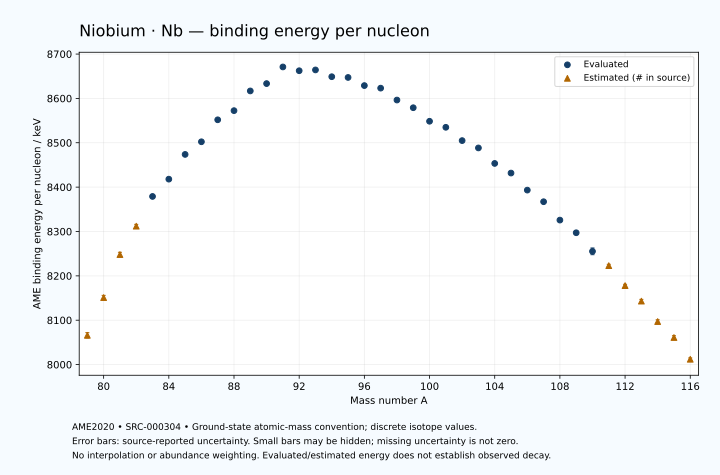

# Niobium — Atomic Masses and Reaction Energies

<!-- generated-by: sync-ame2020.mjs -->

**Dated evaluated data · scientific coverage remains partial.** 38 ground-state nuclides from AME2020. Values and uncertainties are transcribed from the retained unrounded analysis files; estimated quantities remain labelled.

- [Parent Niobium record](0041-Niobium-Nb.md) · [NUBASE states and decays](0041-Niobium-Nb-Nuclear-Evaluation.md)
- [Structured data](data/isotopes/0041-Niobium-Nb-AME2020-Evaluation.yaml)
- [Original mass table](../../data/catalog/sources/ame2020-mass_1.mas20.txt) · [Original reaction table](../../data/catalog/sources/ame2020-rct1.mas20.txt)
- [AME2020 methods](https://doi.org/10.1088/1674-1137/abddb0) (SRC-000303) · [Tables and definitions](https://doi.org/10.1088/1674-1137/abddaf) (SRC-000304)

## Reading the data

All table energies and uncertainties are in keV; binding energy is per nucleon. A # replaces a decimal point in the original estimated value. UNKNOWN (*) retains the source's not-calculable entry; it is neither zero nor automatically NOT APPLICABLE. Source lines are one-based in the retained files. Uncertainties remain those published by the evaluation, with no replacement by independent-mass quadrature.

Atomic-mass conventions apply. Qα is total decay energy, not alpha-particle kinetic energy. Positive Q alone does not establish a decay branch, rate or observation. He-4's source Qα of zero is a bookkeeping identity. These tables describe ground-state combinations, not isomer or excited-daughter transitions. Nuclear state and daughter lookups are explicit in the structured companion. The binding quantity follows [Z M(¹H) + N mₙ − M(A,Z)]c²/A; it has not been converted to a bare-nucleus convention.

## Mass and binding table

| Nuclide | N | Atomic mass excess / keV | AME binding per nucleon / keV | Mass-file line |
|---|---:|---|---|---:|
| Nb-79 | 38 | -31650# ± 500# | 8066# ± 6# | 864 |
| Nb-80 | 39 | -38420# ± 400# | 8151# ± 5# | 878 |
| Nb-81 | 40 | -46360# ± 400# | 8248# ± 5# | 892 |
| Nb-82 | 41 | -51810# ± 300# | 8312# ± 4# | 907 |
| Nb-83 | 42 | -57612.910 ± 162.080 | 8378.9889 ± 1.9528 | 921 |
| Nb-84 | 43 | -61193.842 ± 0.401 | 8417.9563 ± 0.0048 | 936 |
| Nb-85 | 44 | -66279.684 ± 4.099 | 8473.7117 ± 0.0482 | 950 |
| Nb-86 | 45 | -69134.061 ± 5.499 | 8502.2231 ± 0.0639 | 965 |
| Nb-87 | 46 | -73874.493 ± 6.802 | 8551.7579 ± 0.0782 | 979 |
| Nb-88 | 47 | -76171.555 ± 57.808 | 8572.4013 ± 0.6569 | 993 |
| Nb-89 | 48 | -80625.755 ± 23.630 | 8616.8184 ± 0.2655 | 1007 |
| Nb-90 | 49 | -82661.531 ± 3.317 | 8633.3770 ± 0.0369 | 1021 |
| Nb-91 | 50 | -86638.028 ± 2.926 | 8670.8983 ± 0.0322 | 1035 |
| Nb-92 | 51 | -86453.290 ± 1.784 | 8662.3731 ± 0.0194 | 1049 |
| Nb-93 | 52 | -87212.840 ± 1.490 | 8664.1849 ± 0.0160 | 1063 |
| Nb-94 | 53 | -86369.063 ± 1.491 | 8648.9014 ± 0.0159 | 1077 |
| Nb-95 | 54 | -86786.272 ± 0.508 | 8647.2133 ± 0.0054 | 1092 |
| Nb-96 | 55 | -85602.830 ± 0.147 | 8628.8868 ± 0.0015 | 1106 |
| Nb-97 | 56 | -85602.797 ± 4.244 | 8623.1384 ± 0.0438 | 1121 |
| Nb-98 | 57 | -83524.612 ± 5.001 | 8596.3016 ± 0.0510 | 1136 |
| Nb-99 | 58 | -82335.344 ± 12.004 | 8578.9859 ± 0.1213 | 1150 |
| Nb-100 | 59 | -79791.246 ± 7.976 | 8548.4683 ± 0.0798 | 1165 |
| Nb-101 | 60 | -78891.488 ± 3.749 | 8534.8355 ± 0.0371 | 1180 |
| Nb-102 | 61 | -76298.265 ± 2.511 | 8504.8675 ± 0.0246 | 1194 |
| Nb-103 | 62 | -75028.667 ± 3.935 | 8488.3320 ± 0.0382 | 1209 |
| Nb-104 | 63 | -71810.997 ± 1.784 | 8453.3832 ± 0.0172 | 1224 |
| Nb-105 | 64 | -69915.547 ± 4.028 | 8431.6925 ± 0.0384 | 1239 |
| Nb-106 | 65 | -66202.678 ± 1.416 | 8393.2657 ± 0.0134 | 1254 |
| Nb-107 | 66 | -63723.805 ± 8.023 | 8367.0898 ± 0.0750 | 1270 |
| Nb-108 | 67 | -59545.198 ± 8.239 | 8325.6604 ± 0.0763 | 1285 |
| Nb-109 | 68 | -56689.800 ± 430.816 | 8297.1307 ± 3.9524 | 1301 |
| Nb-110 | 69 | -52309.914 ± 838.345 | 8255.2607 ± 7.6213 | 1316 |
| Nb-111 | 70 | -48960# ± 300# | 8223# ± 3# | 1331 |
| Nb-112 | 71 | -44070# ± 300# | 8178# ± 3# | 1347 |
| Nb-113 | 72 | -40210# ± 400# | 8143# ± 4# | 1363 |
| Nb-114 | 73 | -34960# ± 500# | 8097# ± 4# | 1379 |
| Nb-115 | 74 | -30880# ± 500# | 8061# ± 4# | 1395 |
| Nb-116 | 75 | -25230# ± 300# | 8012# ± 3# | 1411 |

## Q-values and separation energies

| Nuclide | Qβ− / keV | Qα / keV | S₂n / keV | S₂p / keV | Reaction-file line |
|---|---|---|---|---|---:|
| Nb-79 | UNKNOWN (*) | -2255# ± 583# | UNKNOWN (*) | -210# ± 540# | 863 |
| Nb-80 | UNKNOWN (*) | -2595# ± 500# | UNKNOWN (*) | 825# ± 499# | 877 |
| Nb-81 | -14900# ± 640# | -2347# ± 448# | 30853# ± 640# | 3135# ± 408# | 891 |
| Nb-82 | -11440# ± 500# | -2062# ± 423# | 29532# ± 500# | 5239# ± 300# | 906 |
| Nb-83 | -11273# ± 432# | -2234.8911 ± 180.7963 | 27395# ± 431# | 6477.9338 ± 162.1701 | 920 |
| Nb-84 | -7024# ± 298# | -2470.5959 ± 6.2550 | 25527# ± 300# | 7707.6872 ± 5.5131 | 935 |
| Nb-85 | -8769.9238 ± 16.3572 | -2991.6814 ± 6.7834 | 24809.4100 ± 162.1318 | 8651.9542 ± 19.0762 | 949 |
| Nb-86 | -5023.1337 ± 6.2316 | -3494.8792 ± 7.7723 | 24082.8544 ± 5.5134 | 9817.5636 ± 6.9767 | 964 |
| Nb-87 | -6989.6757 ± 7.3781 | -4093.7368 ± 19.8321 | 23737.4449 ± 7.9417 | 10610.3038 ± 20.1484 | 978 |
| Nb-88 | -3485.0021 ± 57.9345 | -4702.0317 ± 57.9678 | 23180.1305 ± 58.0689 | 11466.3974 ± 59.5132 | 992 |
| Nb-89 | -5610.8105 ± 23.9513 | -5208.5392 ± 30.2992 | 22893.8979 ± 24.5892 | 12185.3097 ± 23.6565 | 1006 |
| Nb-90 | -2489.0165 ± 3.3163 | -5803.3469 ± 14.5260 | 22632.6118 ± 57.9036 | 12940.4441 ± 3.6405 | 1020 |
| Nb-91 | -4429.1934 ± 6.7439 | -6044.5564 ± 3.1356 | 22154.9090 ± 23.8100 | 13504.7675 ± 2.9453 | 1034 |
| Nb-92 | 355.2968 ± 1.7911 | -4579.1774 ± 2.3310 | 19934.3957 ± 3.7665 | 14534.3202 ± 1.8190 | 1048 |
| Nb-93 | -405.7609 ± 1.5012 | -1926.5536 ± 1.5283 | 16717.4485 ± 3.2818 | 15439.4611 ± 2.3676 | 1062 |
| Nb-94 | 2045.0163 ± 1.4937 | -2297.0667 ± 1.5325 | 16058.4089 ± 1.9872 | 16130.5108 ± 9.2478 | 1076 |
| Nb-95 | 925.6009 ± 0.4938 | -2859.8664 ± 1.9114 | 15716.0677 ± 1.5721 | 17137.0583 ± 10.5005 | 1091 |
| Nb-96 | 3192.0590 ± 0.1070 | -3211.2518 ± 9.1283 | 15376.4034 ± 1.4962 | 17829.2999 ± 6.3814 | 1105 |
| Nb-97 | 1941.9038 ± 4.2435 | -3800.5572 ± 11.3144 | 14959.1613 ± 4.2725 | 18972.8016 ± 7.9976 | 1120 |
| Nb-98 | 4591.3681 ± 5.0032 | -3598.0554 ± 8.1064 | 14064.4180 ± 5.0010 | 19772.5684 ± 7.8673 | 1135 |
| Nb-99 | 3634.7623 ± 12.0059 | -3552.3225 ± 13.7857 | 12875.1833 ± 12.7320 | 20797.8312 ± 13.7508 | 1149 |
| Nb-100 | 6401.7829 ± 7.9817 | -3886.1757 ± 10.0246 | 12409.2697 ± 9.4129 | 22080.4402 ± 11.2379 | 1164 |
| Nb-101 | 4628.4637 ± 3.7378 | -5200.9490 ± 7.6842 | 12698.7802 ± 12.5685 | 22825.6996 ± 7.6031 | 1179 |
| Nb-102 | 7262.6008 ± 8.6750 | -6434.4331 ± 8.3052 | 12649.6552 ± 8.3599 | 23554.9659 ± 11.4557 | 1193 |
| Nb-103 | 5925.6639 ± 10.0270 | -6809.8529 ± 7.6966 | 12279.8157 ± 5.4027 | 24551.8231 ± 8.1003 | 1208 |
| Nb-104 | 8532.7512 ± 9.0879 | -6914.6714 ± 11.3201 | 11655.3678 ± 3.0800 | 25216.2974 ± 4.4540 | 1223 |
| Nb-105 | 7415.2411 ± 9.9106 | -7285.6759 ± 8.1461 | 11029.5152 ± 5.5991 | 26036.4551 ± 11.9078 | 1238 |
| Nb-106 | 9925.3249 ± 9.2388 | -7454.9528 ± 4.3198 | 10534.3178 ± 2.2577 | 26701# ± 200# | 1253 |
| Nb-107 | 8821.1703 ± 12.2239 | -7691.6869 ± 13.7816 | 9950.8942 ± 8.9564 | 27732# ± 400# | 1269 |
| Nb-108 | 11204.0998 ± 12.3668 | -7890# ± 200# | 9485.1555 ± 8.3597 | 28333# ± 500# | 1284 |
| Nb-109 | 9969.4851 ± 430.9610 | -8545# ± 588# | 9108.6311 ± 430.8907 | 29297# ± 660# | 1300 |
| Nb-110 | 12225.9002 ± 838.6945 | -8944# ± 976# | 8907.3528 ± 838.3852 | 30108# ± 1031# | 1315 |
| Nb-111 | 10980# ± 300# | -9415# ± 583# | 8413# ± 525# | 31058# ± 761# | 1330 |
| Nb-112 | 13410# ± 361# | -9715# ± 671# | 7903# ± 890# | UNKNOWN (*) | 1346 |
| Nb-113 | 12440# ± 500# | -10154# ± 806# | 7392# ± 500# | UNKNOWN (*) | 1362 |
| Nb-114 | 14720# ± 583# | UNKNOWN (*) | 7033# ± 583# | UNKNOWN (*) | 1378 |
| Nb-115 | 13670# ± 640# | UNKNOWN (*) | 6813# ± 640# | UNKNOWN (*) | 1394 |
| Nb-116 | 15980# ± 583# | UNKNOWN (*) | 6413# ± 583# | UNKNOWN (*) | 1410 |

Qβ− comes from the mass-file line in the first table. The other three columns come from the reaction-file line. Definitions and original source strings are retained in the structured data.

## Binding-energy chart

Discrete source values and source-reported uncertainties. No interpolation, natural-abundance weighting or observed-decay claim is implied. This quantitative chart supplements the 22 separate illustrative panels.

## Remaining review

Later measurements, state-specific decay branches, isomer Q-values, additional reaction channels and full claim-level review remain open. Existing authored values retain their own provenance; this companion does not overwrite them.
