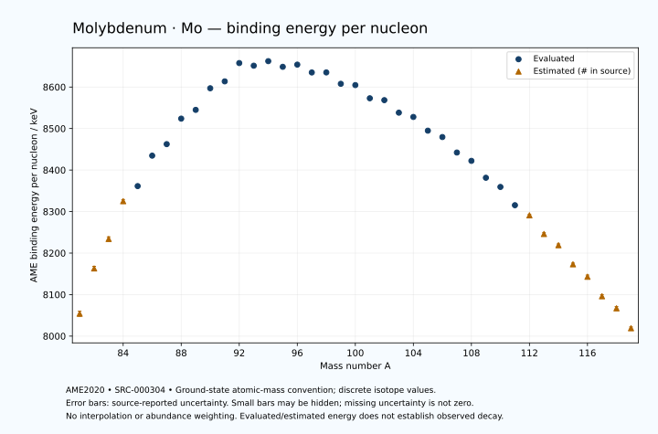

# Molybdenum — Atomic Masses and Reaction Energies

<!-- generated-by: sync-ame2020.mjs -->

**Dated evaluated data · scientific coverage remains partial.** 39 ground-state nuclides from AME2020. Values and uncertainties are transcribed from the retained unrounded analysis files; estimated quantities remain labelled.

- [Parent Molybdenum record](0042-Molybdenum-Mo.md) · [NUBASE states and decays](0042-Molybdenum-Mo-Nuclear-Evaluation.md)
- [Structured data](data/isotopes/0042-Molybdenum-Mo-AME2020-Evaluation.yaml)
- [Original mass table](../../data/catalog/sources/ame2020-mass_1.mas20.txt) · [Original reaction table 1](../../data/catalog/sources/ame2020-rct1.mas20.txt) · [Original reaction table 2](../../data/catalog/sources/ame2020-rct2.mas20.txt)
- [AME2020 methods](https://doi.org/10.1088/1674-1137/abddb0) (SRC-000303) · [Tables and definitions](https://doi.org/10.1088/1674-1137/abddaf) (SRC-000304)

## Reading the data

All table energies and uncertainties are in keV; binding energy is per nucleon. A # replaces a decimal point in the original estimated value. UNKNOWN (*) retains the source's not-calculable entry; it is neither zero nor automatically NOT APPLICABLE. Source lines are one-based in the retained files. Uncertainties remain those published by the evaluation, with no replacement by independent-mass quadrature.

Atomic-mass conventions apply. Qα is total decay energy, not alpha-particle kinetic energy. Positive Q alone does not establish a decay branch, rate or observation. He-4's source Qα of zero is a bookkeeping identity. These tables describe ground-state combinations, not isomer or excited-daughter transitions. Nuclear state and daughter lookups are explicit in the structured companion. The binding quantity follows [Z M(¹H) + N mₙ − M(A,Z)]c²/A; it has not been converted to a bare-nucleus convention.

## Mass and binding table

| Nuclide | N | Atomic mass excess / keV | AME binding per nucleon / keV | Mass-file line |
|---|---:|---|---|---:|
| Mo-81 | 39 | -31460# ± 500# | 8054# ± 6# | 893 |
| Mo-82 | 40 | -40370# ± 400# | 8163# ± 5# | 908 |
| Mo-83 | 41 | -46340# ± 401# | 8234# ± 5# | 922 |
| Mo-84 | 42 | -54170# ± 298# | 8325# ± 4# | 937 |
| Mo-85 | 43 | -57509.760 ± 15.835 | 8361.3320 ± 0.1863 | 951 |
| Mo-86 | 44 | -64110.927 ± 2.932 | 8434.7175 ± 0.0341 | 966 |
| Mo-87 | 45 | -66884.817 ± 2.857 | 8462.4243 ± 0.0328 | 980 |
| Mo-88 | 46 | -72686.553 ± 3.819 | 8523.9087 ± 0.0434 | 994 |
| Mo-89 | 47 | -75014.944 ± 3.912 | 8544.9851 ± 0.0440 | 1008 |
| Mo-90 | 48 | -80172.514 ± 3.463 | 8597.0285 ± 0.0385 | 1022 |
| Mo-91 | 49 | -82208.834 ± 6.238 | 8613.6286 ± 0.0686 | 1036 |
| Mo-92 | 50 | -86808.587 ± 0.157 | 8657.7312 ± 0.0017 | 1050 |
| Mo-93 | 51 | -86807.079 ± 0.181 | 8651.4095 ± 0.0020 | 1064 |
| Mo-94 | 52 | -88414.079 ± 0.141 | 8662.3341 ± 0.0015 | 1078 |
| Mo-95 | 53 | -87711.872 ± 0.123 | 8648.7212 ± 0.0013 | 1093 |
| Mo-96 | 54 | -88794.889 ± 0.120 | 8653.9880 ± 0.0013 | 1107 |
| Mo-97 | 55 | -87544.700 ± 0.165 | 8635.0926 ± 0.0017 | 1122 |
| Mo-98 | 56 | -88115.980 ± 0.174 | 8635.1691 ± 0.0018 | 1137 |
| Mo-99 | 57 | -85970.106 ± 0.229 | 8607.7982 ± 0.0023 | 1151 |
| Mo-100 | 58 | -86193.029 ± 0.301 | 8604.6626 ± 0.0030 | 1166 |
| Mo-101 | 59 | -83519.952 ± 0.308 | 8572.9159 ± 0.0031 | 1181 |
| Mo-102 | 60 | -83560.866 ± 8.305 | 8568.3994 ± 0.0814 | 1195 |
| Mo-103 | 61 | -80954.331 ± 9.223 | 8538.2672 ± 0.0895 | 1210 |
| Mo-104 | 62 | -80343.748 ± 8.911 | 8527.9063 ± 0.0857 | 1225 |
| Mo-105 | 63 | -77330.788 ± 9.055 | 8494.8630 ± 0.0862 | 1240 |
| Mo-106 | 64 | -76128.003 ± 9.130 | 8479.5202 ± 0.0861 | 1255 |
| Mo-107 | 65 | -72544.975 ± 9.223 | 8442.2190 ± 0.0862 | 1271 |
| Mo-108 | 66 | -70749.297 ± 9.223 | 8422.1581 ± 0.0854 | 1286 |
| Mo-109 | 67 | -66659.285 ± 11.179 | 8381.4163 ± 0.1026 | 1302 |
| Mo-110 | 68 | -64535.814 ± 24.219 | 8359.2930 ± 0.2202 | 1317 |
| Mo-111 | 69 | -59939.813 ± 12.578 | 8315.2932 ± 0.1133 | 1332 |
| Mo-112 | 70 | -57480# ± 200# | 8291# ± 2# | 1348 |
| Mo-113 | 71 | -52650# ± 300# | 8246# ± 3# | 1364 |
| Mo-114 | 72 | -49680# ± 300# | 8219# ± 3# | 1380 |
| Mo-115 | 73 | -44550# ± 400# | 8173# ± 3# | 1396 |
| Mo-116 | 74 | -41210# ± 500# | 8143# ± 4# | 1412 |
| Mo-117 | 75 | -35689# ± 500# | 8096# ± 4# | 1428 |
| Mo-118 | 76 | -32370# ± 500# | 8067# ± 4# | 1444 |
| Mo-119 | 77 | -26580# ± 300# | 8019# ± 3# | 1460 |

## Q-values and separation energies

| Nuclide | Qβ− / keV | Qα / keV | S₂n / keV | S₂p / keV | Reaction-file line |
|---|---|---|---|---|---:|
| Mo-81 | UNKNOWN (*) | -2285# ± 640# | UNKNOWN (*) | -732# ± 583# | 892 |
| Mo-82 | UNKNOWN (*) | -1945# ± 565# | UNKNOWN (*) | 188# ± 500# | 907 |
| Mo-83 | -15020# ± 641# | -1995# ± 500# | 31022# ± 641# | 3393# ± 411# | 921 |
| Mo-84 | -16470# ± 499# | -1835# ± 423# | 29943# ± 499# | 5134# ± 298# | 936 |
| Mo-85 | -11660# ± 400# | -2410.2578 ± 93.5676 | 27312# ± 401# | 6176.0429 ± 17.0910 | 950 |
| Mo-86 | -12541# ± 300# | -2921.7797 ± 3.3321 | 26083# ± 298# | 7267.1771 ± 6.2314 | 965 |
| Mo-87 | -9194.7656 ± 5.0729 | -3398.0735 ± 7.0360 | 25517.6930 ± 16.0911 | 8287.5633 ± 7.0360 | 979 |
| Mo-88 | -11016.2515 ± 5.6021 | -3689.7767 ± 6.6949 | 24718.2620 ± 4.8147 | 9295.4717 ± 5.2249 | 993 |
| Mo-89 | -7620.0875 ± 5.4673 | -4264.6639 ± 7.5265 | 24272.7631 ± 4.8445 | 10245.7397 ± 5.7002 | 1007 |
| Mo-90 | -9447.8181 ± 3.6110 | -4628.4067 ± 4.9702 | 23628.5974 ± 5.1551 | 11121.5826 ± 6.4173 | 1021 |
| Mo-91 | -6222.1768 ± 6.6706 | -5286.6035 ± 7.4900 | 23336.5262 ± 7.3634 | 11908.8025 ± 6.8293 | 1035 |
| Mo-92 | -7882.8841 ± 3.1063 | -5604.6291 ± 5.4055 | 22778.7090 ± 3.4661 | 12613.9819 ± 0.1959 | 1049 |
| Mo-93 | -3200.9629 ± 1.0040 | -4354.0211 ± 2.7854 | 20740.8810 ± 6.2398 | 13489.4291 ± 0.2039 | 1063 |
| Mo-94 | -4255.7476 ± 4.0687 | -2066.4479 ± 0.1838 | 17748.1284 ± 0.2108 | 14532.9977 ± 0.1696 | 1077 |
| Mo-95 | -1690.5175 ± 5.0782 | -2241.1963 ± 0.1555 | 17047.4295 ± 0.2188 | 15167.7869 ± 0.4716 | 1092 |
| Mo-96 | -2973.2411 ± 5.1450 | -2760.7814 ± 0.1522 | 16523.4461 ± 0.1042 | 16103.5000 ± 0.2026 | 1106 |
| Mo-97 | -320.2640 ± 4.1169 | -2847.5887 ± 0.4843 | 15975.4642 ± 0.1681 | 16462.7023 ± 0.8843 | 1121 |
| Mo-98 | -1683.7664 ± 3.3768 | -3271.5647 ± 0.2388 | 15463.7271 ± 0.1734 | 17255.0624 ± 0.1796 | 1136 |
| Mo-99 | 1357.7631 ± 0.8905 | -2735.0817 ± 0.8985 | 14568.0418 ± 0.1629 | 17611.3554 ± 0.2367 | 1150 |
| Mo-100 | -172.0776 ± 1.3704 | -3179.0846 ± 0.3215 | 14219.6845 ± 0.3460 | 19489.2134 ± 8.4502 | 1165 |
| Mo-101 | 2824.6411 ± 24.0018 | -3008.1745 ± 0.3311 | 13692.4815 ± 0.3817 | 20481.2235 ± 10.5035 | 1180 |
| Mo-102 | 1012.0557 ± 12.3682 | -4704.0240 ± 11.8435 | 13510.4730 ± 8.3089 | 21766.0718 ± 11.6306 | 1194 |
| Mo-103 | 3649.5889 ± 13.4648 | -5762.5771 ± 13.9738 | 13577.0159 ± 9.2278 | 22371.2867 ± 12.4281 | 1209 |
| Mo-104 | 2155.2212 ± 24.1665 | -6395.9277 ± 12.0704 | 12925.5182 ± 12.1802 | 23340.2630 ± 12.4928 | 1224 |
| Mo-105 | 4955.5157 ± 35.0307 | -6594.7166 ± 12.3043 | 12519.0923 ± 12.9237 | 24099.7363 ± 12.9237 | 1239 |
| Mo-106 | 3648.2494 ± 15.2778 | -6971.4921 ± 12.6496 | 11926.8915 ± 12.7563 | 24988.2854 ± 13.0422 | 1254 |
| Mo-107 | 6204.9921 ± 12.6599 | -7160.8972 ± 13.0416 | 11356.8234 ± 12.9237 | 25664.6433 ± 15.2210 | 1270 |
| Mo-108 | 5173.5330 ± 12.7262 | -7456.5535 ± 13.1076 | 10763.9305 ± 12.9759 | 26578# ± 200# | 1285 |
| Mo-109 | 7623.5438 ± 14.7805 | -7625.9268 ± 16.4798 | 10256.9459 ± 14.4909 | 27217# ± 300# | 1301 |
| Mo-110 | 6498.7491 ± 26.0147 | -8211# ± 202# | 9929.1532 ± 25.9151 | 28164# ± 400# | 1316 |
| Mo-111 | 9084.8620 ± 6.7999 | -8345# ± 300# | 9423.1650 ± 16.8277 | 28788# ± 500# | 1331 |
| Mo-112 | 7779# ± 200# | -8955# ± 447# | 9087# ± 202# | 29838# ± 539# | 1347 |
| Mo-113 | 10162# ± 300# | -9345# ± 583# | 8853# ± 300# | 30748# ± 671# | 1363 |
| Mo-114 | 8920# ± 527# | -9885# ± 583# | 8343# ± 361# | 31839# ± 761# | 1379 |
| Mo-115 | 11247# ± 445# | -10494# ± 721# | 8042# ± 500# | 32788# ± 500# | 1395 |
| Mo-116 | 10003# ± 582# | -11215# ± 860# | 7673# ± 583# | UNKNOWN (*) | 1411 |
| Mo-117 | 12450# ± 640# | -11774# ± 583# | 7282# ± 640# | UNKNOWN (*) | 1427 |
| Mo-118 | 10920# ± 640# | UNKNOWN (*) | 7303# ± 707# | UNKNOWN (*) | 1443 |
| Mo-119 | 13590# ± 583# | UNKNOWN (*) | 7034# ± 583# | UNKNOWN (*) | 1459 |

## Additional decay-energy combinations

| Nuclide | Q₂β− / keV | Q₄β− / keV | Qεp / keV | Qβ−n / keV | Part 1 / part 2 line |
|---|---|---|---|---|---|
| Mo-81 | UNKNOWN (*) | UNKNOWN (*) | 16010# ± 583# | UNKNOWN (*) | 892 / 905 |
| Mo-82 | UNKNOWN (*) | UNKNOWN (*) | 9865# ± 410# | UNKNOWN (*) | 907 / 920 |
| Mo-83 | UNKNOWN (*) | UNKNOWN (*) | 9985# ± 401# | UNKNOWN (*) | 921 / 935 |
| Mo-84 | UNKNOWN (*) | UNKNOWN (*) | 4453# ± 298# | -30922# ± 582# | 936 / 950 |
| Mo-85 | -26879# ± 500# | UNKNOWN (*) | 6622.9608 ± 16.7629 | -27881# ± 400# | 950 / 964 |
| Mo-86 | -24341# ± 400# | UNKNOWN (*) | 1775.2979 ± 7.0667 | -26332# ± 400# | 965 / 979 |
| Mo-87 | -21155# ± 400# | UNKNOWN (*) | 3795.2352 ± 4.5692 | -23386# ± 300# | 979 / 993 |
| Mo-88 | -18347# ± 300# | UNKNOWN (*) | -628.3775 ± 5.6366 | -23067.8195 ± 5.6706 | 993 / 1008 |
| Mo-89 | -16645.5202 ± 24.5328 | UNKNOWN (*) | 1324.9587 ± 6.6709 | -21415.9607 ± 5.6661 | 1007 / 1022 |
| Mo-90 | -15288.7132 ± 5.0897 | -40463# ± 400# | -2583.5116 ± 4.4400 | -20848.9757 ± 5.1551 | 1021 / 1036 |
| Mo-91 | -13969.0014 ± 6.6216 | -36039# ± 423# | -725.2579 ± 6.2392 | -19555.4560 ± 6.3217 | 1035 / 1050 |
| Mo-92 | -12507.3763 ± 2.7225 | -32029.4919 ± 345.0278 | -6201.9662 ± 0.1829 | -18893.2478 ± 2.3679 | 1049 / 1064 |
| Mo-93 | -9590.3558 ± 2.0726 | -27825.2694 ± 370.0094 | -5637.0262 ± 0.2037 | -15952.6941 ± 3.1076 | 1063 / 1079 |
| Mo-94 | -5830.4772 ± 3.1463 | -22311.7988 ± 4.2849 | -8581.0228 ± 0.4763 | -12879.2813 ± 1.0220 | 1077 / 1093 |
| Mo-95 | -4254.1137 ± 9.5011 | -17745.9595 ± 3.0292 | -7731.5120 ± 0.2048 | -11624.8587 ± 4.0698 | 1092 / 1108 |
| Mo-96 | -2714.5043 ± 0.1211 | -12611.4698 ± 4.1931 | -10423.9201 ± 0.8764 | -10844.8526 ± 5.0784 | 1106 / 1122 |
| Mo-97 | -1424.1362 ± 2.7649 | -9738.8480 ± 4.8466 | -9394.8115 ± 0.1698 | -9794.3703 ± 5.1475 | 1121 / 1137 |
| Mo-98 | 108.8911 ± 6.4646 | -6794.9949 ± 4.7453 | -12468.2584 ± 0.1840 | -8962.8619 ± 4.1173 | 1136 / 1153 |
| Mo-99 | 1655.2787 ± 0.4093 | -3787.2448 ± 5.1106 | -11977.3198 ± 8.4473 | -7609.2104 ± 3.3771 | 1150 / 1167 |
| Mo-100 | 3034.3626 ± 0.1670 | -980.3563 ± 17.6367 | -15865.3296 ± 10.5033 | -6936.4775 ± 0.9370 | 1165 / 1182 |
| Mo-101 | 4438.1611 ± 0.2956 | 1912.1931 ± 4.5973 | -14436.1867 ± 8.1491 | -5570.3185 ± 1.3721 | 1180 / 1197 |
| Mo-102 | 5545.5691 ± 8.3139 | 4342.0974 ± 8.3140 | -17688.8498 ± 11.7636 | -5287.5910 ± 25.3992 | 1194 / 1211 |
| Mo-103 | 6312.8362 ± 9.2332 | 6502.6488 ± 9.2644 | -16661.8756 ± 12.7169 | -4452.7281 ± 13.0028 | 1209 / 1227 |
| Mo-104 | 7752.0157 ± 9.2360 | 9051.3752 ± 9.0095 | -19823.7253 ± 12.8231 | -3811.1455 ± 13.2402 | 1224 / 1242 |
| Mo-105 | 8603.7553 ± 9.3830 | 11087.1172 ± 9.1258 | -18902.0988 ± 12.9903 | -2903.1367 ± 26.4811 | 1239 / 1257 |
| Mo-106 | 10195.2494 ± 10.6023 | 13779.5397 ± 9.1963 | -21958.7005 ± 15.1648 | -1913.0178 ± 36.4253 | 1254 / 1272 |
| Mo-107 | 11317.5906 ± 12.6599 | 15827.6790 ± 9.3007 | -21085# ± 200# | -840.0404 ± 15.3336 | 1270 / 1288 |
| Mo-108 | 12912.1066 ± 12.6650 | 18774.9178 ± 9.2891 | -24018# ± 300# | -70.6486 ± 12.6600 | 1285 / 1304 |
| Mo-109 | 14079.1706 ± 14.3225 | 20947.1991 ± 11.2341 | -22998# ± 400# | 1192.2278 ± 14.2078 | 1301 / 1320 |
| Mo-110 | 15536.8145 ± 25.8111 | 23795.0899 ± 24.2270 | -26095# ± 501# | 1675.6959 ± 26.0781 | 1316 / 1335 |
| Mo-111 | 16845.5119 ± 15.4271 | 26046.0728 ± 12.5992 | -25009# ± 500# | 3023.4320 ± 15.3154 | 1331 / 1350 |
| Mo-112 | 18151# ± 201# | 28841# ± 200# | -28289# ± 632# | 3474# ± 201# | 1347 / 1366 |
| Mo-113 | 19218# ± 302# | 30941# ± 300# | -27519# ± 761# | 4538# ± 300# | 1363 / 1383 |
| Mo-114 | 20541# ± 300# | 33810# ± 300# | -30629# ± 424# | 5060# ± 300# | 1379 / 1399 |
| Mo-115 | 21556# ± 400# | 35876# ± 400# | UNKNOWN (*) | 5979# ± 589# | 1395 / 1415 |
| Mo-116 | 22859# ± 500# | 38621# ± 500# | UNKNOWN (*) | 6515# ± 537# | 1411 / 1431 |
| Mo-117 | 23801# ± 662# | 40735# ± 500# | UNKNOWN (*) | 7453# ± 582# | 1427 / 1448 |
| Mo-118 | 24630# ± 539# | 43018# ± 500# | UNKNOWN (*) | 7698# ± 640# | 1443 / 1464 |
| Mo-119 | 25500# ± 424# | 44827# ± 300# | UNKNOWN (*) | 8639# ± 500# | 1459 / 1480 |

## Single-nucleon separation and reaction energies

| Nuclide | Sₙ / keV | Sₚ / keV | Q(d,α) / keV | Q(p,α) / keV | Q(n,α) / keV | Part 2 line |
|---|---|---|---|---|---|---:|
| Mo-81 | UNKNOWN (*) | 329# ± 640# | 10901# ± 707# | UNKNOWN (*) | 15036# ± 640# | 905 |
| Mo-82 | 16981# ± 640# | 1299# ± 565# | 8761# ± 565# | -3856# ± 640# | 12047# ± 500# | 920 |
| Mo-83 | 14041# ± 566# | 1819# ± 500# | 10731# ± 566# | -3056# ± 566# | 14066# ± 500# | 935 |
| Mo-84 | 15901# ± 499# | 3846# ± 339# | 8350# ± 423# | -2946# ± 499# | 9001# ± 312# | 950 |
| Mo-85 | 11411# ± 298# | 3604.8889 ± 15.8405 | 10813.9570 ± 162.8517 | -836# ± 300# | 11750.7052 ± 15.9144 | 964 |
| Mo-86 | 14672.4849 ± 16.1045 | 5120.2140 ± 5.0392 | 7793.7224 ± 2.9590 | -1633.9616 ± 162.1065 | 7447.1346 ± 7.0666 | 979 |
| Mo-87 | 10845.2082 ± 4.0938 | 5039.7275 ± 6.1968 | 10105.6739 ± 4.9962 | -826.9195 ± 2.8851 | 10183.2771 ± 6.1967 | 993 |
| Mo-88 | 13873.0539 ± 4.7696 | 6101.0311 ± 7.8012 | 7158.3148 ± 6.6950 | -1542.8137 ± 5.6021 | 6135.0453 ± 7.4785 | 1008 |
| Mo-89 | 10399.7092 ± 5.4673 | 6132.3601 ± 57.9407 | 9570.3558 ± 7.8472 | -1016.8282 ± 6.7485 | 8600.4815 ± 5.2934 | 1022 |
| Mo-90 | 13228.8882 ± 5.2245 | 6835.7307 ± 23.8819 | 6709.8478 ± 57.9121 | -1433.9662 ± 7.6329 | 4821.0345 ± 5.4011 | 1036 |
| Mo-91 | 10107.6379 ± 7.1346 | 6836.2744 ± 7.0652 | 9127.7275 ± 24.4391 | -1173.2239 ± 58.1441 | 7066.4419 ± 8.2528 | 1050 |
| Mo-92 | 12671.0710 ± 6.2392 | 7459.5306 ± 2.9299 | 6563.7507 ± 3.3208 | -1318.7772 ± 23.6301 | 3715.7888 ± 2.7839 | 1064 |
| Mo-93 | 8069.8100 ± 0.0900 | 7642.7597 ± 1.7934 | 10541.7556 ± 2.9313 | 718.5070 ± 3.3220 | 7611.8705 ± 0.2156 | 1079 |
| Mo-94 | 9678.3184 ± 0.2292 | 8490.2105 ± 1.4929 | 8750.0180 ± 1.7887 | 3088.0034 ± 2.9292 | 5127.9148 ± 0.1698 | 1093 |
| Mo-95 | 7369.1111 ± 0.0944 | 8631.7804 ± 1.4935 | 10211.7746 ± 1.4927 | 3605.4731 ± 1.7878 | 6393.5536 ± 0.1552 | 1108 |
| Mo-96 | 9154.3350 ± 0.0491 | 9297.5889 ± 0.4961 | 8284.9807 ± 1.4935 | 3282.0058 ± 1.4927 | 3973.5405 ± 0.4707 | 1122 |
| Mo-97 | 6821.1292 ± 0.1630 | 9230.8411 ± 0.1897 | 9952.3781 ± 0.5212 | 3688.4178 ± 1.4989 | 5371.0333 ± 0.2320 | 1137 |
| Mo-98 | 8642.5979 ± 0.0647 | 9802.1547 ± 4.2440 | 8197.6571 ± 0.1985 | 3534.3464 ± 0.5245 | 3190.3622 ± 0.8861 | 1153 |
| Mo-99 | 5925.4439 ± 0.1497 | 9734.4650 ± 5.0054 | 10343.4976 ± 4.2466 | 4496.7794 ± 0.2482 | 5115.1560 ± 0.2333 | 1167 |
| Mo-100 | 8294.2406 ± 0.3756 | 11146.6559 ± 12.0000 | 8042.3905 ± 5.0103 | 4273.8232 ± 4.2548 | 2390.0664 ± 0.3240 | 1182 |
| Mo-101 | 5398.2409 ± 0.0681 | 11017.6769 ± 7.9820 | 9526.1993 ± 12.0002 | 4868.7158 ± 5.0108 | 3408.2081 ± 8.4505 | 1197 |
| Mo-102 | 8112.2321 ± 8.3092 | 11958.3488 ± 9.1105 | 6941.1872 ± 11.5139 | 3638.5334 ± 14.5958 | -297.7932 ± 13.3862 | 1211 |
| Mo-103 | 5464.7839 ± 12.4100 | 11945.0376 ± 9.5566 | 8647.9635 ± 9.9554 | 3700.9695 ± 12.1919 | 1064.8067 ± 12.3023 | 1227 |
| Mo-104 | 7460.7344 ± 12.8231 | 12604.0513 ± 9.7408 | 6665.3242 ± 9.2562 | 3411.7954 ± 9.6671 | -1536.3587 ± 12.1986 | 1242 |
| Mo-105 | 5058.3580 ± 12.7030 | 12808.7621 ± 9.2293 | 8408.6869 ± 9.8730 | 3831.5324 ± 9.3951 | -102.9585 ± 12.5960 | 1257 |
| Mo-106 | 6868.5336 ± 12.8574 | 13501.4276 ± 9.9788 | 6393.8004 ± 9.3023 | 3764.7195 ± 9.9414 | -2672.6074 ± 12.9759 | 1272 |
| Mo-107 | 4488.2898 ± 12.9759 | 13631.2677 ± 9.3308 | 8081.3787 ± 10.0641 | 4130.0769 ± 9.3937 | -1180.9128 ± 13.1076 | 1288 |
| Mo-108 | 6275.6407 ± 13.0416 | 14314.4640 ± 12.2239 | 6164.1878 ± 9.3309 | 4030.3043 ± 10.0641 | -3644.6215 ± 15.2210 | 1304 |
| Mo-109 | 3981.3053 ± 14.4909 | 14403.0581 ± 13.8868 | 7775.3269 ± 13.7597 | 4407.4488 ± 11.2681 | -2264# ± 201# | 1320 |
| Mo-110 | 5947.8479 ± 26.6739 | 15134.9860 ± 431.4963 | 5720.1902 ± 25.5822 | 4052.0453 ± 25.5134 | -4869# ± 301# | 1335 |
| Mo-111 | 3475.3171 ± 27.2906 | 14918.8702 ± 838.4390 | 7460.7931 ± 430.9996 | 4469.4393 ± 15.0362 | -3343# ± 400# | 1350 |
| Mo-112 | 5611# ± 201# | 15808# ± 361# | 5541# ± 862# | 4074# ± 475# | -6103# ± 539# | 1366 |
| Mo-113 | 3242# ± 361# | 15869# ± 424# | 7021# ± 424# | 4524# ± 890# | -4784# ± 583# | 1383 |
| Mo-114 | 5102# ± 424# | 16759# ± 500# | 5100# ± 424# | 4144# ± 424# | -7554# ± 671# | 1399 |
| Mo-115 | 2941# ± 500# | 16879# ± 640# | 6371# ± 565# | 4384# ± 500# | -6484# ± 806# | 1415 |
| Mo-116 | 4732# ± 640# | 17619# ± 707# | 4460# ± 707# | 3864# ± 640# | -9224# ± 583# | 1431 |
| Mo-117 | 2550# ± 707# | 17748# ± 583# | 5902# ± 707# | 4135# ± 707# | UNKNOWN (*) | 1448 |
| Mo-118 | 4752# ± 707# | UNKNOWN (*) | 3571# ± 583# | 3374# ± 707# | UNKNOWN (*) | 1464 |
| Mo-119 | 2281# ± 583# | UNKNOWN (*) | UNKNOWN (*) | 3514# ± 424# | UNKNOWN (*) | 1480 |

Qβ− comes from the mass-file line in the first table. Qα, S₂n, S₂p, Q₂β−, Qεp and Qβ−n come from reaction part 1; Q₄β− and the last table come from part 2. Qεp is electron-capture/proton energy balance; Qβ−n is beta-minus/neutron energy balance. These are evaluated mass combinations, not observations of decay modes, cross sections or reaction rates. Light-nuclide zero entries can be bookkeeping identities, without a physical A=0 residual. Definitions and original source strings are retained in the structured data.

## Binding-energy chart

Discrete source values and source-reported uncertainties. No interpolation, natural-abundance weighting or observed-decay claim is implied. This quantitative chart supplements the 22 separate illustrative panels.

## Remaining review

Later measurements, state-specific decay branches, isomer Q-values, reaction rates, applicability and full claim-level review remain open. Existing authored values retain their own provenance; this companion does not overwrite them.
