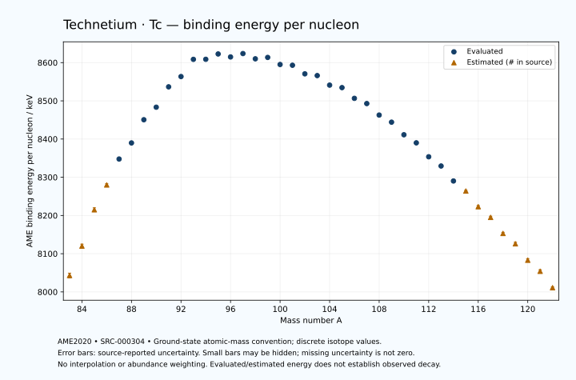

# Technetium — Atomic Masses and Reaction Energies

<!-- generated-by: sync-ame2020.mjs -->

**Dated evaluated data · scientific coverage remains partial.** 40 ground-state nuclides from AME2020. Values and uncertainties are transcribed from the retained unrounded analysis files; estimated quantities remain labelled.

- [Parent Technetium record](0043-Technetium-Tc.md) · [NUBASE states and decays](0043-Technetium-Tc-Nuclear-Evaluation.md)
- [Structured data](data/isotopes/0043-Technetium-Tc-AME2020-Evaluation.yaml)
- [Original mass table](../../data/catalog/sources/ame2020-mass_1.mas20.txt) · [Original reaction table](../../data/catalog/sources/ame2020-rct1.mas20.txt)
- [AME2020 methods](https://doi.org/10.1088/1674-1137/abddb0) (SRC-000303) · [Tables and definitions](https://doi.org/10.1088/1674-1137/abddaf) (SRC-000304)

## Reading the data

All table energies and uncertainties are in keV; binding energy is per nucleon. A # replaces a decimal point in the original estimated value. UNKNOWN (*) retains the source's not-calculable entry; it is neither zero nor automatically NOT APPLICABLE. Source lines are one-based in the retained files. Uncertainties remain those published by the evaluation, with no replacement by independent-mass quadrature.

Atomic-mass conventions apply. Qα is total decay energy, not alpha-particle kinetic energy. Positive Q alone does not establish a decay branch, rate or observation. He-4's source Qα of zero is a bookkeeping identity. These tables describe ground-state combinations, not isomer or excited-daughter transitions. Nuclear state and daughter lookups are explicit in the structured companion. The binding quantity follows [Z M(¹H) + N mₙ − M(A,Z)]c²/A; it has not been converted to a bare-nucleus convention.

## Mass and binding table

| Nuclide | N | Atomic mass excess / keV | AME binding per nucleon / keV | Mass-file line |
|---|---:|---|---|---:|
| Tc-83 | 40 | -31320# ± 500# | 8043# ± 6# | 923 |
| Tc-84 | 41 | -37700# ± 400# | 8120# ± 5# | 938 |
| Tc-85 | 42 | -45850# ± 400# | 8215# ± 5# | 952 |
| Tc-86 | 43 | -51570# ± 300# | 8280# ± 3# | 967 |
| Tc-87 | 44 | -57690.052 ± 4.192 | 8347.7449 ± 0.0482 | 981 |
| Tc-88 | 45 | -61670.301 ± 4.099 | 8389.8338 ± 0.0466 | 995 |
| Tc-89 | 46 | -67394.857 ± 3.819 | 8450.5758 ± 0.0429 | 1009 |
| Tc-90 | 47 | -70724.696 ± 1.025 | 8483.3600 ± 0.0114 | 1023 |
| Tc-91 | 48 | -75986.657 ± 2.363 | 8536.6558 ± 0.0260 | 1037 |
| Tc-92 | 49 | -78925.703 ± 3.102 | 8563.5440 ± 0.0337 | 1051 |
| Tc-93 | 50 | -83606.116 ± 1.012 | 8608.5782 ± 0.0109 | 1065 |
| Tc-94 | 51 | -84158.332 ± 4.071 | 8608.7373 ± 0.0433 | 1079 |
| Tc-95 | 52 | -86021.355 ± 5.080 | 8622.6911 ± 0.0535 | 1094 |
| Tc-96 | 53 | -85821.648 ± 5.146 | 8614.8673 ± 0.0536 | 1108 |
| Tc-97 | 54 | -87224.436 ± 4.118 | 8623.7254 ± 0.0425 | 1123 |
| Tc-98 | 55 | -86432.214 ± 3.380 | 8610.0047 ± 0.0345 | 1138 |
| Tc-99 | 56 | -87327.869 ± 0.908 | 8613.6105 ± 0.0092 | 1152 |
| Tc-100 | 57 | -86020.951 ± 1.351 | 8595.1184 ± 0.0135 | 1167 |
| Tc-101 | 58 | -86344.593 ± 24.004 | 8593.1366 ± 0.2377 | 1182 |
| Tc-102 | 59 | -84572.921 ± 9.166 | 8570.6514 ± 0.0899 | 1196 |
| Tc-103 | 60 | -84603.920 ± 9.810 | 8566.1045 ± 0.0952 | 1211 |
| Tc-104 | 61 | -82498.969 ± 24.886 | 8541.1070 ± 0.2393 | 1226 |
| Tc-105 | 62 | -82286.303 ± 35.263 | 8534.6074 ± 0.3358 | 1241 |
| Tc-106 | 63 | -79776.253 ± 12.250 | 8506.5570 ± 0.1156 | 1256 |
| Tc-107 | 64 | -78749.967 ± 8.673 | 8492.8979 ± 0.0811 | 1272 |
| Tc-108 | 65 | -75922.831 ± 8.769 | 8462.8172 ± 0.0812 | 1287 |
| Tc-109 | 66 | -74282.828 ± 9.669 | 8444.1796 ± 0.0887 | 1303 |
| Tc-110 | 67 | -71034.564 ± 9.497 | 8411.2603 ± 0.0863 | 1318 |
| Tc-111 | 68 | -69024.675 ± 10.582 | 8390.0906 ± 0.0953 | 1333 |
| Tc-112 | 69 | -65258.932 ± 5.515 | 8353.6217 ± 0.0492 | 1349 |
| Tc-113 | 70 | -62811.549 ± 3.353 | 8329.4652 ± 0.0297 | 1365 |
| Tc-114 | 71 | -58600.294 ± 433.145 | 8290.2599 ± 3.7995 | 1381 |
| Tc-115 | 72 | -55796# ± 196# | 8264# ± 2# | 1397 |
| Tc-116 | 73 | -51214# ± 298# | 8223# ± 3# | 1413 |
| Tc-117 | 74 | -48140# ± 400# | 8195# ± 3# | 1429 |
| Tc-118 | 75 | -43290# ± 400# | 8153# ± 3# | 1445 |
| Tc-119 | 76 | -40170# ± 500# | 8126# ± 4# | 1461 |
| Tc-120 | 77 | -35000# ± 500# | 8083# ± 4# | 1477 |
| Tc-121 | 78 | -31540# ± 500# | 8054# ± 4# | 1493 |
| Tc-122 | 79 | -26305# ± 300# | 8011# ± 2# | 1510 |

## Q-values and separation energies

| Nuclide | Qβ− / keV | Qα / keV | S₂n / keV | S₂p / keV | Reaction-file line |
|---|---|---|---|---|---:|
| Tc-83 | UNKNOWN (*) | -2094# ± 707# | UNKNOWN (*) | -463# ± 640# | 922 |
| Tc-84 | UNKNOWN (*) | -1705# ± 565# | UNKNOWN (*) | 469# ± 500# | 937 |
| Tc-85 | -15220# ± 640# | -1914# ± 565# | 30673# ± 640# | 2815# ± 431# | 951 |
| Tc-86 | -11800# ± 500# | -2186# ± 424# | 30013# ± 500# | 4954# ± 300# | 966 |
| Tc-87 | -11960# ± 400# | -2502.0572 ± 162.1342 | 27983# ± 400# | 5988.3096 ± 5.8625 | 980 |
| Tc-88 | -7331# ± 300# | -2901.3749 ± 4.1181 | 26243# ± 300# | 7114.1829 ± 6.8582 | 994 |
| Tc-89 | -9025.4327 ± 24.5181 | -3540.0884 ± 5.6021 | 25847.4412 ± 5.6706 | 8098.3058 ± 7.8012 | 1008 |
| Tc-90 | -5840.8951 ± 3.8685 | -4015.5513 ± 5.5935 | 25197.0308 ± 4.2247 | 9131.0832 ± 57.8176 | 1022 |
| Tc-91 | -7746.8246 ± 3.2422 | -4537.0803 ± 7.2008 | 24734.4369 ± 4.4909 | 9938.8448 ± 23.7474 | 1036 |
| Tc-92 | -4624.4922 ± 4.1246 | -5179.0638 ± 57.8917 | 24343.6429 ± 3.2672 | 10842.1144 ± 4.5418 | 1050 |
| Tc-93 | -6389.3929 ± 2.2995 | -5405.2773 ± 23.6513 | 23762.0949 ± 2.5704 | 11546.0306 ± 3.0959 | 1064 |
| Tc-94 | -1574.7296 ± 5.1433 | -3921.7168 ± 5.2514 | 21375.2649 ± 5.1185 | 12282.9835 ± 4.4445 | 1078 |
| Tc-95 | -2563.5961 ± 10.5310 | -1808.2432 ± 5.8620 | 18557.8749 ± 5.1795 | 13386.4571 ± 5.2930 | 1093 |
| Tc-96 | 258.7369 ± 5.1464 | -1793.2738 ± 5.4467 | 17805.9526 ± 6.5601 | 14030.5273 ± 5.3573 | 1107 |
| Tc-97 | -1103.8722 ± 4.9563 | -2436.5124 ± 4.3784 | 17345.7177 ± 6.5374 | 15016.1071 ± 4.1464 | 1122 |
| Tc-98 | 1792.6575 ± 7.1568 | -2488.0667 ± 3.6936 | 16753.2018 ± 6.1559 | 15407.3256 ± 3.3814 | 1137 |
| Tc-99 | 297.5156 ± 0.9453 | -2966.5136 ± 1.0353 | 16246.0689 ± 4.2134 | 16303.0147 ± 4.3372 | 1151 |
| Tc-100 | 3206.4401 ± 1.3760 | -2843.0366 ± 1.3549 | 15731.3734 ± 3.5027 | 17074.2811 ± 5.1796 | 1166 |
| Tc-101 | 1613.5200 ± 24.0000 | -3166.7118 ± 24.3759 | 15159.3595 ± 24.0197 | 18587.1909 ± 26.8344 | 1181 |
| Tc-102 | 4533.5134 ± 9.1646 | -3473.2250 ± 10.4417 | 14694.6063 ± 9.2634 | 19359.6177 ± 12.1504 | 1195 |
| Tc-103 | 2663.2474 ± 9.8086 | -4693.4923 ± 15.4992 | 14401.9637 ± 25.9271 | 20290.3745 ± 10.4925 | 1210 |
| Tc-104 | 5596.7945 ± 24.9370 | -5132.6391 ± 26.1329 | 14068.6838 ± 26.4644 | 20778.6462 ± 25.0123 | 1225 |
| Tc-105 | 3648.2396 ± 35.2787 | -5819.7313 ± 35.4604 | 13825.0192 ± 36.5320 | 21835.5780 ± 35.4805 | 1240 |
| Tc-106 | 6547.0000 ± 11.0000 | -5902.9035 ± 12.5045 | 13419.9197 ± 27.7095 | 22543.1981 ± 12.3791 | 1255 |
| Tc-107 | 5112.5985 ± 11.7243 | -6146.2153 ± 9.5125 | 12606.2997 ± 36.2416 | 23412.3625 ± 9.5514 | 1271 |
| Tc-108 | 7738.5736 ± 11.7903 | -6536.7498 ± 8.9487 | 12289.2141 ± 14.8828 | 24298.0944 ± 8.8812 | 1286 |
| Tc-109 | 6455.6267 ± 12.6574 | -6792.1978 ± 10.4646 | 11675.4977 ± 12.4699 | 25136.9660 ± 12.5555 | 1302 |
| Tc-110 | 9038.0654 ± 12.5086 | -7256.8012 ± 9.6006 | 11254.3692 ± 12.3942 | 26067.3080 ± 12.5727 | 1317 |
| Tc-111 | 7760.6500 ± 13.8477 | -7725.7868 ± 13.2705 | 10884.4831 ± 13.8477 | 26912.8180 ± 430.9460 | 1332 |
| Tc-112 | 10371.9409 ± 11.0602 | -8138.6503 ± 9.9142 | 10367.0046 ± 10.9714 | 27526.9599 ± 838.3628 | 1348 |
| Tc-113 | 9056.2674 ± 38.4285 | -8546.6650 ± 430.8291 | 9929.5094 ± 11.1002 | 28429# ± 300# | 1364 |
| Tc-114 | 11620.9190 ± 433.1594 | -8715.2955 ± 943.6293 | 9483.9980 ± 433.1799 | 29108# ± 527# | 1380 |
| Tc-115 | 10309# ± 197# | -9261# ± 358# | 9128# ± 196# | 30165# ± 445# | 1396 |
| Tc-116 | 12855# ± 298# | -9569# ± 423# | 8756# ± 526# | 30832# ± 582# | 1412 |
| Tc-117 | 11350# ± 589# | -10355# ± 565# | 8486# ± 445# | 31838# ± 640# | 1428 |
| Tc-118 | 13710# ± 447# | -10755# ± 640# | 8219# ± 499# | 32638# ± 500# | 1444 |
| Tc-119 | 11910# ± 583# | -11715# ± 707# | 8173# ± 640# | UNKNOWN (*) | 1460 |
| Tc-120 | 14720# ± 640# | -12194# ± 583# | 7852# ± 640# | UNKNOWN (*) | 1476 |
| Tc-121 | 13080# ± 640# | UNKNOWN (*) | 7513# ± 707# | UNKNOWN (*) | 1492 |
| Tc-122 | 15475# ± 583# | UNKNOWN (*) | 7448# ± 583# | UNKNOWN (*) | 1509 |

Qβ− comes from the mass-file line in the first table. The other three columns come from the reaction-file line. Definitions and original source strings are retained in the structured data.

## Binding-energy chart

Discrete source values and source-reported uncertainties. No interpolation, natural-abundance weighting or observed-decay claim is implied. This quantitative chart supplements the 22 separate illustrative panels.

## Remaining review

Later measurements, state-specific decay branches, isomer Q-values, additional reaction channels and full claim-level review remain open. Existing authored values retain their own provenance; this companion does not overwrite them.
