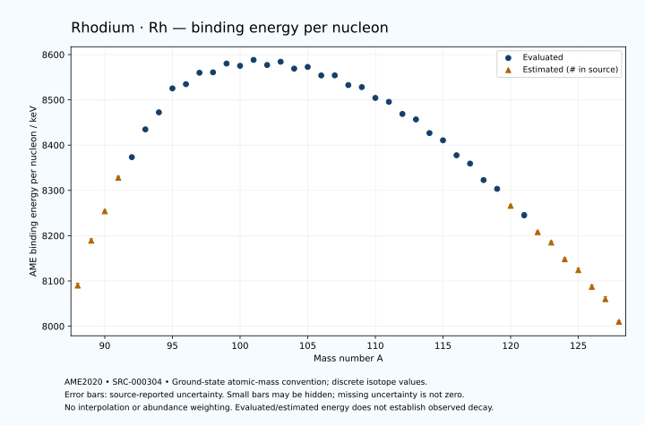

# Rhodium — Atomic Masses and Reaction Energies

<!-- generated-by: sync-ame2020.mjs -->

**Dated evaluated data · scientific coverage remains partial.** 41 ground-state nuclides from AME2020. Values and uncertainties are transcribed from the retained unrounded analysis files; estimated quantities remain labelled.

- [Parent Rhodium record](0045-Rhodium-Rh.md) · [NUBASE states and decays](0045-Rhodium-Rh-Nuclear-Evaluation.md)
- [Structured data](data/isotopes/0045-Rhodium-Rh-AME2020-Evaluation.yaml)
- [Original mass table](../../data/catalog/sources/ame2020-mass_1.mas20.txt) · [Original reaction table 1](../../data/catalog/sources/ame2020-rct1.mas20.txt) · [Original reaction table 2](../../data/catalog/sources/ame2020-rct2.mas20.txt)
- [AME2020 methods](https://doi.org/10.1088/1674-1137/abddb0) (SRC-000303) · [Tables and definitions](https://doi.org/10.1088/1674-1137/abddaf) (SRC-000304)

## Reading the data

All table energies and uncertainties are in keV; binding energy is per nucleon. A # replaces a decimal point in the original estimated value. UNKNOWN (*) retains the source's not-calculable entry; it is neither zero nor automatically NOT APPLICABLE. Source lines are one-based in the retained files. Uncertainties remain those published by the evaluation, with no replacement by independent-mass quadrature.

Atomic-mass conventions apply. Qα is total decay energy, not alpha-particle kinetic energy. Positive Q alone does not establish a decay branch, rate or observation. He-4's source Qα of zero is a bookkeeping identity. These tables describe ground-state combinations, not isomer or excited-daughter transitions. Nuclear state and daughter lookups are explicit in the structured companion. The binding quantity follows [Z M(¹H) + N mₙ − M(A,Z)]c²/A; it has not been converted to a bare-nucleus convention.

## Mass and binding table

| Nuclide | N | Atomic mass excess / keV | AME binding per nucleon / keV | Mass-file line |
|---|---:|---|---|---:|
| Rh-88 | 43 | -36860# ± 400# | 8090# ± 5# | 997 |
| Rh-89 | 44 | -45651# ± 361# | 8189# ± 4# | 1011 |
| Rh-90 | 45 | -51634# ± 200# | 8254# ± 2# | 1025 |
| Rh-91 | 46 | -58570# ± 298# | 8328# ± 3# | 1039 |
| Rh-92 | 47 | -62999.095 ± 4.378 | 8373.4211 ± 0.0476 | 1053 |
| Rh-93 | 48 | -69011.810 ± 2.629 | 8434.8255 ± 0.0283 | 1067 |
| Rh-94 | 49 | -72907.623 ± 3.379 | 8472.4033 ± 0.0359 | 1081 |
| Rh-95 | 50 | -78340.616 ± 3.886 | 8525.3707 ± 0.0409 | 1096 |
| Rh-96 | 51 | -79687.732 ± 10.001 | 8534.6735 ± 0.1042 | 1110 |
| Rh-97 | 52 | -82597.564 ± 35.463 | 8559.8949 ± 0.3656 | 1125 |
| Rh-98 | 53 | -83175.219 ± 11.906 | 8560.8038 ± 0.1215 | 1140 |
| Rh-99 | 54 | -85584.522 ± 19.451 | 8580.1959 ± 0.1965 | 1154 |
| Rh-100 | 55 | -85591.130 ± 18.125 | 8575.1732 ± 0.1813 | 1169 |
| Rh-101 | 56 | -87412.428 ± 5.841 | 8588.2172 ± 0.0578 | 1184 |
| Rh-102 | 57 | -86783.316 ± 6.410 | 8576.9818 ± 0.0628 | 1198 |
| Rh-103 | 58 | -88031.705 ± 2.301 | 8584.1927 ± 0.0223 | 1213 |
| Rh-104 | 59 | -86959.344 ± 2.303 | 8568.9501 ± 0.0221 | 1228 |
| Rh-105 | 60 | -87851.270 ± 2.502 | 8572.7053 ± 0.0238 | 1243 |
| Rh-106 | 61 | -86362.656 ± 5.390 | 8553.9317 ± 0.0508 | 1258 |
| Rh-107 | 62 | -86863.711 ± 12.051 | 8554.1040 ± 0.1126 | 1274 |
| Rh-108 | 63 | -85031.156 ± 13.997 | 8532.6657 ± 0.1296 | 1289 |
| Rh-109 | 64 | -84999.251 ± 4.040 | 8528.1404 ± 0.0371 | 1305 |
| Rh-110 | 65 | -82828.693 ± 17.805 | 8504.2551 ± 0.1619 | 1320 |
| Rh-111 | 66 | -82303.871 ± 6.853 | 8495.6267 ± 0.0617 | 1335 |
| Rh-112 | 67 | -79731.052 ± 44.085 | 8468.8666 ± 0.3936 | 1351 |
| Rh-113 | 68 | -78766.944 ± 7.132 | 8456.8165 ± 0.0631 | 1367 |
| Rh-114 | 69 | -75710.275 ± 71.561 | 8426.6221 ± 0.6277 | 1383 |
| Rh-115 | 70 | -74229.228 ± 7.319 | 8410.6538 ± 0.0636 | 1399 |
| Rh-116 | 71 | -70735.742 ± 73.832 | 8377.6123 ± 0.6365 | 1415 |
| Rh-117 | 72 | -68896.758 ± 8.895 | 8359.2766 ± 0.0760 | 1431 |
| Rh-118 | 73 | -64886.840 ± 24.236 | 8322.8539 ± 0.2054 | 1447 |
| Rh-119 | 74 | -62822.802 ± 9.315 | 8303.3953 ± 0.0783 | 1463 |
| Rh-120 | 75 | -58620# ± 200# | 8266# ± 2# | 1479 |
| Rh-121 | 76 | -56250.134 ± 619.444 | 8245.2397 ± 5.1194 | 1495 |
| Rh-122 | 77 | -51880# ± 300# | 8208# ± 2# | 1512 |
| Rh-123 | 78 | -49190# ± 400# | 8185# ± 3# | 1528 |
| Rh-124 | 79 | -44710# ± 400# | 8148# ± 3# | 1544 |
| Rh-125 | 80 | -41830# ± 500# | 8124# ± 4# | 1561 |
| Rh-126 | 81 | -37200# ± 500# | 8087# ± 4# | 1577 |
| Rh-127 | 82 | -33730# ± 600# | 8060# ± 5# | 1594 |
| Rh-128 | 83 | -27340# ± 300# | 8010# ± 2# | 1611 |

## Q-values and separation energies

| Nuclide | Qβ− / keV | Qα / keV | S₂n / keV | S₂p / keV | Reaction-file line |
|---|---|---|---|---|---:|
| Rh-88 | UNKNOWN (*) | -1585# ± 565# | UNKNOWN (*) | -132# ± 500# | 996 |
| Rh-89 | UNKNOWN (*) | -2226# ± 538# | UNKNOWN (*) | 2539# ± 361# | 1010 |
| Rh-90 | -11924# ± 447# | -2488# ± 361# | 30916# ± 447# | 4541# ± 200# | 1024 |
| Rh-91 | -12400# ± 300# | -3304# ± 298# | 29062# ± 468# | 5753# ± 298# | 1038 |
| Rh-92 | -8220.0000 ± 345.0000 | -3753.7096 ± 5.9971 | 27508# ± 200# | 6852.3412 ± 4.4963 | 1052 |
| Rh-93 | -10030.0000 ± 370.0000 | -4041.8688 ± 4.6363 | 26585# ± 298# | 7603.0943 ± 3.5344 | 1066 |
| Rh-94 | -6805.3428 ± 5.4588 | -4607.8430 ± 3.5311 | 26051.1642 ± 5.5305 | 8559.8625 ± 4.5873 | 1080 |
| Rh-95 | -8374.7035 ± 4.9281 | -4778.8750 ± 4.5477 | 25471.4430 ± 4.6913 | 9312.4425 ± 4.0154 | 1095 |
| Rh-96 | -3504.3127 ± 10.8442 | -3186.9451 ± 10.4716 | 22922.7450 ± 10.5569 | 10107.3426 ± 10.7972 | 1109 |
| Rh-97 | -4791.7118 ± 35.7924 | -1416.3640 ± 35.4776 | 20399.5839 ± 35.6754 | 11154.1515 ± 35.8247 | 1124 |
| Rh-98 | -1854.2331 ± 12.8161 | -1441.8027 ± 12.5832 | 19630.1224 ± 15.5497 | 11931.5124 ± 12.9711 | 1139 |
| Rh-99 | -3401.6603 ± 18.9153 | -1988.0827 ± 20.1023 | 19129.5936 ± 40.4467 | 12938.0274 ± 19.8811 | 1153 |
| Rh-100 | -378.4577 ± 25.2879 | -2194.3977 ± 18.8416 | 18558.5476 ± 21.6861 | 13736.8583 ± 18.4370 | 1168 |
| Rh-101 | -1980.2833 ± 3.9027 | -2612.9074 ± 7.1447 | 17970.5425 ± 20.3079 | 14662.5009 ± 5.9094 | 1183 |
| Rh-102 | 1119.6470 ± 6.3962 | -2776.0181 ± 7.2441 | 17334.8222 ± 19.2202 | 15340.3070 ± 6.5467 | 1197 |
| Rh-103 | -574.7252 ± 2.3928 | -3128.7521 ± 2.4642 | 16761.9136 ± 6.1774 | 16265.0549 ± 24.1066 | 1212 |
| Rh-104 | 2435.7789 ± 2.6595 | -3363.3087 ± 2.6606 | 16318.6640 ± 6.7855 | 16964.3648 ± 9.4394 | 1227 |
| Rh-105 | 566.6347 ± 2.3459 | -3931.5933 ± 24.1321 | 15962.2007 ± 3.3874 | 17825.2919 ± 9.9060 | 1242 |
| Rh-106 | 3544.8865 ± 5.3348 | -4214.6509 ± 10.4317 | 15545.9485 ± 5.8527 | 18441.6295 ± 25.4323 | 1257 |
| Rh-107 | 1508.9427 ± 12.1108 | -4684.7068 ± 15.5393 | 15155.0773 ± 12.3080 | 19155.3500 ± 37.2652 | 1273 |
| Rh-108 | 4493.0596 ± 14.0405 | -4957.1026 ± 28.5525 | 14811.1355 ± 14.9987 | 19832.8453 ± 18.6004 | 1288 |
| Rh-109 | 2607.2327 ± 4.1874 | -5137.8635 ± 35.4935 | 14278.1759 ± 12.7091 | 20827.2262 ± 9.5673 | 1304 |
| Rh-110 | 5502.2116 ± 17.7967 | -5477.3562 ± 21.5959 | 13940.1732 ± 22.6472 | 21483.8044 ± 19.8052 | 1319 |
| Rh-111 | 3682.0153 ± 6.8899 | -5978.8199 ± 11.0534 | 13447.2561 ± 7.9219 | 22598.9846 ± 11.8516 | 1334 |
| Rh-112 | 6589.9874 ± 43.9269 | -6233.1373 ± 44.9491 | 13044.9952 ± 47.5444 | 23274.4305 ± 45.0968 | 1350 |
| Rh-113 | 4823.5559 ± 9.8809 | -6909.0311 ± 12.0153 | 12605.7089 ± 9.8161 | 24320.2104 ± 12.7608 | 1366 |
| Rh-114 | 7780.0712 ± 71.8915 | -7100.6275 ± 72.1886 | 12121.8594 ± 84.0467 | 25029.2853 ± 71.7734 | 1382 |
| Rh-115 | 6196.5938 ± 15.3503 | -7629.4686 ± 12.8660 | 11604.9206 ± 10.1443 | 25995.6216 ± 8.0506 | 1398 |
| Rh-116 | 9095.2839 ± 74.1690 | -7901.7262 ± 74.0374 | 11168.1033 ± 102.8181 | 26713.3905 ± 439.3922 | 1414 |
| Rh-117 | 7527.1313 ± 11.4108 | -8510.1255 ± 9.5057 | 10810.1663 ± 11.4498 | 27678# ± 196# | 1430 |
| Rh-118 | 10501.5182 ± 24.3424 | -8711.4614 ± 433.8223 | 10293.7333 ± 77.7013 | 28251# ± 299# | 1446 |
| Rh-119 | 8584.4751 ± 12.4416 | -9451# ± 196# | 10068.6798 ± 12.8795 | 29261# ± 400# | 1462 |
| Rh-120 | 11660# ± 200# | -9831# ± 359# | 9876# ± 202# | 29908# ± 447# | 1478 |
| Rh-121 | 9932.2030 ± 619.4527 | -10535# ± 737# | 9569.9685 ± 619.5136 | 30658# ± 796# | 1494 |
| Rh-122 | 12737# ± 301# | -11014# ± 500# | 9402# ± 361# | 31458# ± 583# | 1511 |
| Rh-123 | 11239# ± 885# | -11446# ± 640# | 9083# ± 737# | 32228# ± 640# | 1527 |
| Rh-124 | 13690# ± 500# | -12135# ± 640# | 8973# ± 500# | 32982# ± 500# | 1543 |
| Rh-125 | 12130# ± 640# | -12714# ± 707# | 8782# ± 640# | UNKNOWN (*) | 1560 |
| Rh-126 | 14590# ± 640# | -13320# ± 583# | 8633# ± 640# | UNKNOWN (*) | 1576 |
| Rh-127 | 13490# ± 781# | UNKNOWN (*) | 8043# ± 781# | UNKNOWN (*) | 1593 |
| Rh-128 | 17050# ± 583# | UNKNOWN (*) | 6283# ± 583# | UNKNOWN (*) | 1610 |

## Additional decay-energy combinations

| Nuclide | Q₂β− / keV | Q₄β− / keV | Qεp / keV | Qβ−n / keV | Part 1 / part 2 line |
|---|---|---|---|---|---|
| Rh-88 | UNKNOWN (*) | UNKNOWN (*) | 13541# ± 400# | UNKNOWN (*) | 996 / 1011 |
| Rh-89 | UNKNOWN (*) | UNKNOWN (*) | 8731# ± 361# | UNKNOWN (*) | 1010 / 1025 |
| Rh-90 | UNKNOWN (*) | UNKNOWN (*) | 8472# ± 200# | UNKNOWN (*) | 1024 / 1039 |
| Rh-91 | UNKNOWN (*) | UNKNOWN (*) | 4866# ± 298# | -26931# ± 499# | 1038 / 1053 |
| Rh-92 | -25469# ± 400# | UNKNOWN (*) | 5698.5911 ± 4.9749 | -24901# ± 423# | 1052 / 1067 |
| Rh-93 | -22612# ± 401# | UNKNOWN (*) | 2624.9224 ± 4.0662 | -22304.0324 ± 345.0378 | 1066 / 1082 |
| Rh-94 | -20505# ± 400# | UNKNOWN (*) | 3409.5217 ± 3.5275 | -21997.1318 ± 370.0248 | 1080 / 1096 |
| Rh-95 | -18435# ± 400# | UNKNOWN (*) | -1471.2558 ± 5.6279 | -20309.6540 ± 5.7861 | 1095 / 1111 |
| Rh-96 | -15176.0868 ± 90.6373 | -41598# ± 500# | -955.3484 ± 11.2162 | -17793.1374 ± 10.4495 | 1109 / 1125 |
| Rh-97 | -11693.5373 ± 37.4436 | -35208# ± 402# | -4064.8871 ± 35.8342 | -14485.4628 ± 35.7099 | 1124 / 1140 |
| Rh-98 | -10108.7938 ± 34.9950 | -29269# ± 305# | -3239.7531 ± 12.5983 | -13440.6841 ± 12.8541 | 1139 / 1156 |
| Rh-99 | -8872.0388 ± 20.4347 | -24208# ± 299# | -6441.2789 ± 19.7417 | -12334.8543 ± 20.0203 | 1153 / 1170 |
| Rh-100 | -7453.1606 ± 18.8022 | -21412.9838 ± 18.2626 | -5552.2318 ± 18.1468 | -11479.5867 ± 18.8309 | 1168 / 1185 |
| Rh-101 | -6078.0439 ± 7.5843 | -18867.5266 ± 13.0428 | -8680.4479 ± 5.9934 | -10271.0737 ± 18.5779 | 1183 / 1200 |
| Rh-102 | -4536.6145 ± 10.3849 | -16088.4204 ± 7.8736 | -7727.6945 ± 24.8377 | -9422.4894 ± 7.8810 | 1197 / 1214 |
| Rh-103 | -3229.0031 ± 4.7004 | -13399.3084 ± 9.2706 | -10747.7552 ± 9.4390 | -8200.0605 ± 2.2649 | 1212 / 1230 |
| Rh-104 | -1842.8740 ± 4.8035 | -10776.6693 ± 6.2174 | -9644.3948 ± 10.0657 | -7573.6818 ± 2.3941 | 1227 / 1245 |
| Rh-105 | -780.4217 ± 5.1764 | -8210.6879 ± 10.5474 | -12641.2722 ± 24.9858 | -6527.4652 ± 2.4481 | 1242 / 1260 |
| Rh-106 | 579.7431 ± 6.0314 | -5754.5066 ± 13.2941 | -11365.3240 ± 35.6418 | -6016.0696 ± 5.3406 | 1257 / 1275 |
| Rh-107 | 1542.9884 ± 12.2841 | -3297.0443 ± 15.4409 | -14376.4297 ± 17.1839 | -5027.4864 ± 12.1016 | 1273 / 1291 |
| Rh-108 | 2575.6358 ± 14.1991 | -911.3275 ± 16.4493 | -13570.1598 ± 16.4660 | -4729.8199 ± 14.0484 | 1288 / 1307 |
| Rh-109 | 3720.1797 ± 4.2291 | 1490.2748 ± 5.6649 | -16365.3916 ± 9.6548 | -3546.3538 ± 4.1858 | 1304 / 1323 |
| Rh-110 | 4628.6134 ± 17.8478 | 3641.2767 ± 21.2199 | -15834.8354 ± 20.2196 | -3293.5271 ± 17.8385 | 1319 / 1338 |
| Rh-111 | 5911.5761 ± 7.0045 | 6088.1788 ± 7.6599 | -18558.2785 ± 11.7114 | -2044.2846 ± 6.8782 | 1334 / 1353 |
| Rh-112 | 6852.6771 ± 44.1519 | 8259.0749 ± 44.2895 | -17995.3475 ± 45.3376 | -1816.4837 ± 44.0907 | 1350 / 1369 |
| Rh-113 | 8259.8811 ± 18.1062 | 10600.1797 ± 7.1340 | -20796.9827 ± 9.0156 | -517.2225 ± 9.6121 | 1366 / 1386 |
| Rh-114 | 9220.5355 ± 71.7066 | 12859.5319 ± 71.5618 | -20187.6976 ± 71.6397 | -191.0936 ± 71.8914 | 1382 / 1402 |
| Rh-115 | 10753.3585 ± 19.6744 | 15307.1283 ± 7.3189 | -22917.9053 ± 433.2066 | 1189.8002 ± 10.0152 | 1398 / 1418 |
| Rh-116 | 11806.9217 ± 73.9037 | 17514.0161 ± 73.8321 | -22228# ± 209# | 1618.7616 ± 75.0582 | 1414 / 1434 |
| Rh-117 | 13285.1596 ± 16.2186 | 20046.2768 ± 10.1429 | -24972# ± 298# | 2862.9499 ± 11.3325 | 1430 / 1451 |
| Rh-118 | 14666.9626 ± 24.3659 | 22341.3372 ± 25.4429 | -24036# ± 400# | 3465.7320 ± 25.2676 | 1446 / 1467 |
| Rh-119 | 15822.9567 ± 17.4050 | 24875.8563 ± 11.8407 | -26822# ± 400# | 4494.2377 ± 9.6430 | 1462 / 1483 |
| Rh-120 | 17032# ± 200# | 27108# ± 204# | -25739# ± 539# | 4716# ± 200# | 1478 / 1499 |
| Rh-121 | 18152.6965 ± 619.5619 | 29584.4586 ± 620.0501 | -28539# ± 796# | 5958.1518 ± 619.4478 | 1494 / 1516 |
| Rh-122 | 19227# ± 302# | 31692# ± 304# | -27628# ± 583# | 6231# ± 300# | 1511 / 1533 |
| Rh-123 | 20378# ± 401# | 34239# ± 400# | -30174# ± 500# | 7355# ± 400# | 1527 / 1549 |
| Rh-124 | 21520# ± 472# | 36158# ± 401# | UNKNOWN (*) | 7649# ± 885# | 1543 / 1565 |
| Rh-125 | 22690# ± 662# | 38583# ± 500# | UNKNOWN (*) | 8499# ± 583# | 1560 / 1583 |
| Rh-126 | 23520# ± 539# | 40609# ± 500# | UNKNOWN (*) | 8688# ± 640# | 1576 / 1599 |
| Rh-127 | 24919# ± 632# | 43150# ± 600# | UNKNOWN (*) | 9988# ± 721# | 1593 / 1616 |
| Rh-128 | 27370# ± 424# | 46850# ± 300# | UNKNOWN (*) | 11809# ± 583# | 1610 / 1633 |

## Single-nucleon separation and reaction energies

| Nuclide | Sₙ / keV | Sₚ / keV | Q(d,α) / keV | Q(p,α) / keV | Q(n,α) / keV | Part 2 line |
|---|---|---|---|---|---|---:|
| Rh-88 | UNKNOWN (*) | -1581# ± 565# | 13621# ± 565# | -1366# ± 640# | 14636# ± 565# | 1011 |
| Rh-89 | 16862# ± 538# | -1400# ± 200# | 10790# ± 538# | -1016# ± 538# | 11566# ± 469# | 1025 |
| Rh-90 | 14054# ± 412# | 553# ± 201# | 13417# ± 361# | -1040# ± 447# | 11703# ± 200# | 1039 |
| Rh-91 | 15007# ± 359# | 975# ± 298# | 10511# ± 299# | 634# ± 423# | 8747# ± 298# | 1053 |
| Rh-92 | 12501# ± 298# | 2048.2336 ± 4.9091 | 12595.5129 ± 5.7518 | 234.3839 ± 24.6114 | 10042.1636 ± 5.8097 | 1067 |
| Rh-93 | 14084.0324 ± 5.1065 | 1999.5699 ± 3.7811 | 9938.8302 ± 3.4412 | 736.0467 ± 4.5635 | 7359.2888 ± 2.8212 | 1082 |
| Rh-94 | 11967.1318 ± 4.2812 | 2979.8712 ± 3.9601 | 12104.3945 ± 4.3366 | 196.2646 ± 4.0436 | 8725.4362 ± 4.1233 | 1096 |
| Rh-95 | 13504.3112 ± 5.1495 | 3045.9853 ± 4.9978 | 9586.9138 ± 4.4002 | 824.6495 ± 4.7420 | 6231.4887 ± 4.9723 | 1111 |
| Rh-96 | 9418.4338 ± 10.7298 | 3518.9445 ± 13.7934 | 13606.6770 ± 10.4837 | 2393.0462 ± 10.2124 | 9564.7861 ± 10.0525 | 1125 |
| Rh-97 | 10981.1501 ± 36.8457 | 3806.1502 ± 35.4627 | 11571.0015 ± 36.7132 | 4850.0931 ± 35.6021 | 7207.1697 ± 35.6957 | 1140 |
| Rh-98 | 8648.9723 ± 37.4085 | 4343.6253 ± 12.2228 | 13615.9736 ± 11.9077 | 5146.5954 ± 15.2331 | 8492.5385 ± 12.9448 | 1156 |
| Rh-99 | 10480.6212 ± 22.8055 | 4648.6213 ± 20.4961 | 11246.8496 ± 19.6451 | 5359.9186 ± 19.4507 | 5883.5287 ± 20.1192 | 1170 |
| Rh-100 | 8077.9264 ± 26.5862 | 5254.7162 ± 18.1231 | 13344.5484 ± 19.2428 | 5393.4894 ± 18.3345 | 7279.7086 ± 18.5870 | 1185 |
| Rh-101 | 9892.6161 ± 19.0424 | 5474.0078 ± 5.8483 | 10923.7639 ± 5.8484 | 5676.4986 ± 8.7107 | 4666.1880 ± 6.7469 | 1200 |
| Rh-102 | 7442.2061 ± 8.6692 | 6114.1745 ± 6.3962 | 13154.8822 ± 6.4005 | 5706.1240 ± 6.4006 | 6190.9554 ± 6.4698 | 1214 |
| Rh-103 | 9319.7075 ± 6.7850 | 6214.2417 ± 2.2644 | 10637.2142 ± 2.2650 | 6059.7410 ± 2.2767 | 3635.6479 ± 2.6594 | 1230 |
| Rh-104 | 6998.9566 ± 0.0814 | 6981.1474 ± 2.2612 | 12857.8978 ± 2.2659 | 5862.8239 ± 2.2664 | 5031.6509 ± 24.1068 | 1245 |
| Rh-105 | 8963.2442 ± 3.3884 | 7044.4777 ± 2.8510 | 10126.7046 ± 2.5245 | 6119.2199 ± 2.5220 | 2368.0535 ± 9.3150 | 1260 |
| Rh-106 | 6582.7043 ± 5.6941 | 7717.0845 ± 5.4767 | 12443.9142 ± 5.4769 | 5768.5665 ± 5.3987 | 3887.6661 ± 10.9543 | 1275 |
| Rh-107 | 8572.3729 ± 13.2013 | 7829.4297 ± 13.2018 | 9781.6388 ± 12.3075 | 6096.1075 ± 12.3073 | 1281.6600 ± 27.6507 | 1291 |
| Rh-108 | 6238.7626 ± 18.4699 | 8457.5613 ± 16.4660 | 12002.9038 ± 14.9991 | 5767.4424 ± 14.2183 | 2901.5498 ± 37.9392 | 1307 |
| Rh-109 | 8039.4133 ± 14.5507 | 8626.8180 ± 9.5740 | 9574.1215 ± 9.5673 | 6188.0567 ± 6.7364 | 423.4037 ± 12.8988 | 1323 |
| Rh-110 | 5900.7599 ± 18.2454 | 9379.2087 ± 19.8873 | 11543.5183 ± 19.7659 | 5897.9279 ± 19.7631 | 1567.6763 ± 19.7631 | 1338 |
| Rh-111 | 7546.4963 ± 19.0773 | 9520.2131 ± 11.2519 | 9145.3912 ± 11.2754 | 6221.5883 ± 11.0592 | -734.6383 ± 11.1292 | 1353 |
| Rh-112 | 5498.4990 ± 44.6022 | 10234.6975 ± 45.1362 | 11052.3841 ± 44.9796 | 5871.4585 ± 44.9855 | 198.1788 ± 45.1334 | 1369 |
| Rh-113 | 7107.2099 ± 44.6458 | 10425.0419 ± 11.9592 | 8729.1887 ± 12.0256 | 6169.7405 ± 11.4241 | -2085.9780 ± 11.8769 | 1386 |
| Rh-114 | 5014.6495 ± 71.9095 | 11131.4302 ± 81.1573 | 10631.4048 ± 72.2022 | 5939.1054 ± 72.2133 | -1039.1975 ± 72.3393 | 1402 |
| Rh-115 | 6590.2711 ± 71.9282 | 11296.9863 ± 8.0417 | 8349.3949 ± 38.9752 | 6265.6999 ± 12.0714 | -3323.8939 ± 9.1640 | 1418 |
| Rh-116 | 4577.8322 ± 74.1870 | 11919.4179 ± 77.9965 | 10196.2776 ± 73.9107 | 5996.1289 ± 83.1663 | -2277.7915 ± 73.9079 | 1434 |
| Rh-117 | 6232.3340 ± 74.3589 | 12116.8123 ± 9.6434 | 7919.3442 ± 26.6617 | 6188.5098 ± 9.4967 | -4650.0622 ± 433.2361 | 1451 |
| Rh-118 | 4061.3992 ± 25.7849 | 12685.9397 ± 433.8223 | 9892.8847 ± 24.5205 | 6082.5112 ± 34.9155 | -3444# ± 197# | 1467 |
| Rh-119 | 6007.2806 ± 25.9642 | 13112# ± 200# | 7377.8759 ± 433.2449 | 6110.1703 ± 10.0325 | -5963# ± 298# | 1483 |
| Rh-120 | 3868# ± 200# | 13829# ± 361# | 9091# ± 283# | 5734# ± 477# | -4834# ± 447# | 1499 |
| Rh-121 | 5702# ± 651# | 13819# ± 737# | 6541# ± 688# | 5614# ± 651# | -7313# ± 737# | 1516 |
| Rh-122 | 3701# ± 688# | 14548# ± 500# | 8552# ± 500# | 5064# ± 424# | -6063# ± 583# | 1533 |
| Rh-123 | 5382# ± 500# | 14699# ± 640# | 6141# ± 565# | 5394# ± 565# | -8544# ± 640# | 1549 |
| Rh-124 | 3591# ± 565# | 15449# ± 640# | 7781# ± 640# | 4775# ± 565# | -7523# ± 640# | 1565 |
| Rh-125 | 5191# ± 640# | 15529# ± 781# | 5431# ± 707# | 4815# ± 707# | -9878# ± 583# | 1583 |
| Rh-126 | 3442# ± 707# | 16120# ± 583# | 7100# ± 781# | 4214# ± 707# | UNKNOWN (*) | 1599 |
| Rh-127 | 4602# ± 781# | UNKNOWN (*) | 5350# ± 671# | 4723# ± 848# | UNKNOWN (*) | 1616 |
| Rh-128 | 1681# ± 671# | UNKNOWN (*) | UNKNOWN (*) | 5893# ± 424# | UNKNOWN (*) | 1633 |

Qβ− comes from the mass-file line in the first table. Qα, S₂n, S₂p, Q₂β−, Qεp and Qβ−n come from reaction part 1; Q₄β− and the last table come from part 2. Qεp is electron-capture/proton energy balance; Qβ−n is beta-minus/neutron energy balance. These are evaluated mass combinations, not observations of decay modes, cross sections or reaction rates. Light-nuclide zero entries can be bookkeeping identities, without a physical A=0 residual. Definitions and original source strings are retained in the structured data.

## Binding-energy chart

Discrete source values and source-reported uncertainties. No interpolation, natural-abundance weighting or observed-decay claim is implied. This quantitative chart supplements the 22 separate illustrative panels.

## Remaining review

Later measurements, state-specific decay branches, isomer Q-values, reaction rates, applicability and full claim-level review remain open. Existing authored values retain their own provenance; this companion does not overwrite them.
