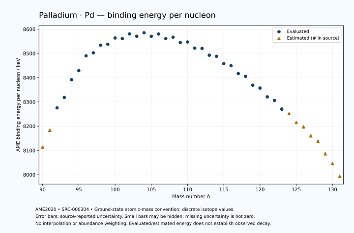

# Palladium — Atomic Masses and Reaction Energies

<!-- generated-by: sync-ame2020.mjs -->

**Dated evaluated data · scientific coverage remains partial.** 42 ground-state nuclides from AME2020. Values and uncertainties are transcribed from the retained unrounded analysis files; estimated quantities remain labelled.

- [Parent Palladium record](0046-Palladium-Pd.md) · [NUBASE states and decays](0046-Palladium-Pd-Nuclear-Evaluation.md)
- [Structured data](data/isotopes/0046-Palladium-Pd-AME2020-Evaluation.yaml)
- [Original mass table](../../data/catalog/sources/ame2020-mass_1.mas20.txt) · [Original reaction table 1](../../data/catalog/sources/ame2020-rct1.mas20.txt) · [Original reaction table 2](../../data/catalog/sources/ame2020-rct2.mas20.txt)
- [AME2020 methods](https://doi.org/10.1088/1674-1137/abddb0) (SRC-000303) · [Tables and definitions](https://doi.org/10.1088/1674-1137/abddaf) (SRC-000304)

## Reading the data

All table energies and uncertainties are in keV; binding energy is per nucleon. A # replaces a decimal point in the original estimated value. UNKNOWN (*) retains the source's not-calculable entry; it is neither zero nor automatically NOT APPLICABLE. Source lines are one-based in the retained files. Uncertainties remain those published by the evaluation, with no replacement by independent-mass quadrature.

Atomic-mass conventions apply. Qα is total decay energy, not alpha-particle kinetic energy. Positive Q alone does not establish a decay branch, rate or observation. He-4's source Qα of zero is a bookkeeping identity. These tables describe ground-state combinations, not isomer or excited-daughter transitions. Nuclear state and daughter lookups are explicit in the structured companion. The binding quantity follows [Z M(¹H) + N mₙ − M(A,Z)]c²/A; it has not been converted to a bare-nucleus convention.

## Mass and binding table

| Nuclide | N | Atomic mass excess / keV | AME binding per nucleon / keV | Mass-file line |
|---|---:|---|---|---:|
| Pd-90 | 44 | -39710# ± 400# | 8113# ± 4# | 1026 |
| Pd-91 | 45 | -46170# ± 423# | 8183# ± 5# | 1040 |
| Pd-92 | 46 | -54779.095 ± 345.028 | 8275.5695 ± 3.7503 | 1054 |
| Pd-93 | 47 | -58981.810 ± 370.009 | 8318.5637 ± 3.9786 | 1068 |
| Pd-94 | 48 | -66102.281 ± 4.287 | 8391.6832 ± 0.0456 | 1082 |
| Pd-95 | 49 | -69965.913 ± 3.031 | 8428.9807 ± 0.0319 | 1097 |
| Pd-96 | 50 | -76183.420 ± 4.194 | 8490.0207 ± 0.0437 | 1111 |
| Pd-97 | 51 | -77805.852 ± 4.844 | 8502.4303 ± 0.0499 | 1126 |
| Pd-98 | 52 | -81320.985 ± 4.742 | 8533.8999 ± 0.0484 | 1141 |
| Pd-99 | 53 | -82182.861 ± 5.107 | 8537.9332 ± 0.0516 | 1155 |
| Pd-100 | 54 | -85212.672 ± 17.637 | 8563.5652 ± 0.1764 | 1170 |
| Pd-101 | 55 | -85432.145 ± 4.588 | 8560.8644 ± 0.0454 | 1185 |
| Pd-102 | 56 | -87902.963 ± 0.419 | 8580.2887 ± 0.0041 | 1199 |
| Pd-103 | 57 | -87456.980 ± 0.878 | 8571.0173 ± 0.0085 | 1214 |
| Pd-104 | 58 | -89395.123 ± 1.336 | 8584.8485 ± 0.0129 | 1229 |
| Pd-105 | 59 | -88417.905 ± 1.138 | 8570.6509 ± 0.0108 | 1244 |
| Pd-106 | 60 | -89907.543 ± 1.106 | 8579.9934 ± 0.0104 | 1259 |
| Pd-107 | 61 | -88372.654 ± 1.201 | 8560.8946 ± 0.0112 | 1275 |
| Pd-108 | 62 | -89524.215 ± 1.108 | 8567.0241 ± 0.0103 | 1290 |
| Pd-109 | 63 | -87606.484 ± 1.114 | 8544.8825 ± 0.0102 | 1306 |
| Pd-110 | 64 | -88330.904 ± 0.612 | 8547.1630 ± 0.0056 | 1321 |
| Pd-111 | 65 | -85985.886 ± 0.731 | 8521.7498 ± 0.0066 | 1336 |
| Pd-112 | 66 | -86321.039 ± 6.546 | 8520.7205 ± 0.0584 | 1352 |
| Pd-113 | 67 | -83590.500 ± 6.947 | 8492.5795 ± 0.0615 | 1368 |
| Pd-114 | 68 | -83490.346 ± 6.948 | 8488.0056 ± 0.0610 | 1384 |
| Pd-115 | 69 | -80425.822 ± 13.547 | 8457.7342 ± 0.1178 | 1400 |
| Pd-116 | 70 | -79831.026 ± 7.135 | 8449.2755 ± 0.0615 | 1416 |
| Pd-117 | 71 | -76423.890 ± 7.255 | 8416.9243 ± 0.0620 | 1432 |
| Pd-118 | 72 | -75388.358 ± 2.494 | 8405.2197 ± 0.0211 | 1448 |
| Pd-119 | 73 | -71407.277 ± 8.248 | 8368.9594 ± 0.0693 | 1464 |
| Pd-120 | 74 | -70279.604 ± 2.296 | 8357.0817 ± 0.0191 | 1480 |
| Pd-121 | 75 | -66182.337 ± 3.353 | 8320.8584 ± 0.0277 | 1496 |
| Pd-122 | 76 | -64616.169 ± 19.561 | 8305.9755 ± 0.1603 | 1513 |
| Pd-123 | 77 | -60429.748 ± 789.441 | 8270.0318 ± 6.4182 | 1529 |
| Pd-124 | 78 | -58400# ± 300# | 8252# ± 2# | 1545 |
| Pd-125 | 79 | -53960# ± 400# | 8215# ± 3# | 1562 |
| Pd-126 | 80 | -51790# ± 400# | 8197# ± 3# | 1578 |
| Pd-127 | 81 | -47220# ± 500# | 8160# ± 4# | 1595 |
| Pd-128 | 82 | -44390# ± 500# | 8137# ± 4# | 1612 |
| Pd-129 | 83 | -37880# ± 600# | 8086# ± 5# | 1629 |
| Pd-130 | 84 | -32730# ± 300# | 8046# ± 2# | 1646 |
| Pd-131 | 85 | -25740# ± 300# | 7993# ± 2# | 1664 |

## Q-values and separation energies

| Nuclide | Qβ− / keV | Qα / keV | S₂n / keV | S₂p / keV | Reaction-file line |
|---|---|---|---|---|---:|
| Pd-90 | UNKNOWN (*) | -2364# ± 565# | UNKNOWN (*) | -52# ± 500# | 1025 |
| Pd-91 | UNKNOWN (*) | -2865# ± 582# | UNKNOWN (*) | 2378# ± 424# | 1039 |
| Pd-92 | -17249# ± 528# | -2864# ± 457# | 31212# ± 528# | 4473.2363 ± 345.0479 | 1053 |
| Pd-93 | -12582# ± 545# | -3037.3015 ± 370.8011 | 28955# ± 562# | 5319.9190 ± 370.0160 | 1067 |
| Pd-94 | -13700# ± 400# | -3643.3953 ± 5.6829 | 27465.8215 ± 345.0544 | 6379.0119 ± 5.0762 | 1081 |
| Pd-95 | -10060# ± 400# | -4150.9961 ± 3.7563 | 27126.7395 ± 370.0218 | 7327.1318 ± 3.6675 | 1096 |
| Pd-96 | -11671.7741 ± 90.1814 | -4307.1247 ± 4.9979 | 26223.7751 ± 5.9942 | 8177.7595 ± 5.2412 | 1110 |
| Pd-97 | -6901.8255 ± 12.9558 | -3014.0451 ± 5.2655 | 23982.5757 ± 5.7140 | 8926.0359 ± 10.6652 | 1125 |
| Pd-98 | -8254.5607 ± 33.0975 | -1162.2991 ± 5.6892 | 21280.2020 ± 6.3308 | 9818.5425 ± 4.7452 | 1140 |
| Pd-99 | -5470.3785 ± 8.0829 | -1150.0185 ± 10.7859 | 20519.6450 ± 7.0387 | 10640.2393 ± 5.8038 | 1154 |
| Pd-100 | -7074.7030 ± 18.3319 | -1557.2031 ± 17.6370 | 20034.3231 ± 18.2633 | 11565.7431 ± 18.7836 | 1169 |
| Pd-101 | -4097.7606 ± 6.6679 | -1736.4963 ± 5.3532 | 19391.9194 ± 6.8632 | 12384.7020 ± 4.5993 | 1184 |
| Pd-102 | -5656.2615 ± 8.1816 | -2103.0075 ± 6.4759 | 18832.9268 ± 17.6365 | 13253.5139 ± 0.2441 | 1198 |
| Pd-103 | -2654.2778 ± 4.1916 | -2256.5112 ± 0.8098 | 18167.4716 ± 4.6690 | 14076.8097 ± 0.7747 | 1213 |
| Pd-104 | -4278.6529 ± 4.0000 | -2592.6475 ± 1.3762 | 17634.7960 ± 1.3957 | 14866.6302 ± 1.3950 | 1228 |
| Pd-105 | -1347.0564 ± 4.6695 | -2884.7080 ± 1.2057 | 17103.5607 ± 1.4330 | 15728.6793 ± 1.2148 | 1243 |
| Pd-106 | -2965.1434 ± 2.8172 | -3226.0240 ± 1.1759 | 16655.0561 ± 0.7548 | 16389.7215 ± 2.5860 | 1258 |
| Pd-107 | 34.0458 ± 2.3174 | -3530.4021 ± 1.2744 | 16097.3852 ± 0.5717 | 17016.0531 ± 2.6307 | 1274 |
| Pd-108 | -1917.4238 ± 2.6323 | -3853.3677 ± 2.7330 | 15759.3086 ± 1.5651 | 17778.9049 ± 5.5034 | 1289 |
| Pd-109 | 1112.9469 ± 1.4024 | -4096.8567 ± 2.7363 | 15376.4660 ± 1.6383 | 18321.8604 ± 8.7439 | 1305 |
| Pd-110 | -873.5982 ± 1.3777 | -4432.5678 ± 5.4253 | 14949.3252 ± 1.2511 | 19247.4425 ± 8.7015 | 1320 |
| Pd-111 | 2229.5607 ± 1.5721 | -4548.2367 ± 8.7034 | 14522.0387 ± 1.3184 | 19825.3732 ± 8.9835 | 1335 |
| Pd-112 | 262.6897 ± 6.9799 | -5084.5511 ± 10.8718 | 14132.7710 ± 6.5669 | 20826.3524 ± 11.0677 | 1351 |
| Pd-113 | 3436.3252 ± 18.0341 | -5276.9603 ± 11.3330 | 13747.2495 ± 6.9837 | 21383.1163 ± 11.9169 | 1367 |
| Pd-114 | 1440.4642 ± 8.3133 | -5842.6333 ± 11.3102 | 13311.9433 ± 9.4758 | 22437.4156 ± 11.8504 | 1383 |
| Pd-115 | 4556.7647 ± 21.6496 | -6065.4124 ± 16.6513 | 12977.9585 ± 15.1774 | 23135.9480 ± 40.6082 | 1399 |
| Pd-116 | 2711.6378 ± 7.8446 | -6625.0692 ± 11.9608 | 12483.3160 ± 9.8809 | 24187.7555 ± 7.8738 | 1415 |
| Pd-117 | 5758.0284 ± 14.7674 | -6980.9894 ± 38.9633 | 12140.7037 ± 15.3211 | 24896.5362 ± 26.1617 | 1431 |
| Pd-118 | 4165.4444 ± 3.5419 | -7592.0606 ± 4.2263 | 11699.9676 ± 7.4907 | 25897.3827 ± 4.4836 | 1447 |
| Pd-119 | 7238.4816 ± 16.8566 | -7726.8974 ± 26.4525 | 11126.0236 ± 10.9130 | 26495.3484 ± 433.2233 | 1463 |
| Pd-120 | 5371.9076 ± 5.0261 | -8635.6029 ± 4.3765 | 11033.8826 ± 3.2773 | 27858# ± 200# | 1479 |
| Pd-121 | 8220.4934 ± 12.5652 | -9117.3824 ± 433.1577 | 10917.6964 ± 8.9035 | 28680# ± 300# | 1495 |
| Pd-122 | 6489.9492 ± 42.9094 | -10041# ± 201# | 10479.2008 ± 19.6956 | 29474# ± 400# | 1512 |
| Pd-123 | 9138.8323 ± 790.1142 | -10775# ± 845# | 10390.0472 ± 789.4484 | 30387# ± 885# | 1528 |
| Pd-124 | 7830# ± 391# | -11105# ± 500# | 9926# ± 301# | 31198# ± 583# | 1544 |
| Pd-125 | 10560# ± 589# | -11764# ± 565# | 9672# ± 885# | 31988# ± 640# | 1561 |
| Pd-126 | 8930# ± 447# | -12435# ± 640# | 9533# ± 500# | 32778# ± 721# | 1577 |
| Pd-127 | 11429# ± 539# | -13095# ± 707# | 9403# ± 640# | 33429# ± 583# | 1594 |
| Pd-128 | 10320# ± 583# | -13226# ± 781# | 8743# ± 640# | UNKNOWN (*) | 1611 |
| Pd-129 | 13990# ± 721# | -11935# ± 671# | 6803# ± 781# | UNKNOWN (*) | 1628 |
| Pd-130 | 13168# ± 520# | UNKNOWN (*) | 4482# ± 583# | UNKNOWN (*) | 1645 |
| Pd-131 | 15010# ± 583# | UNKNOWN (*) | 4002# ± 671# | UNKNOWN (*) | 1663 |

## Additional decay-energy combinations

| Nuclide | Q₂β− / keV | Q₄β− / keV | Qεp / keV | Qβ−n / keV | Part 1 / part 2 line |
|---|---|---|---|---|---|
| Pd-90 | UNKNOWN (*) | UNKNOWN (*) | 11371# ± 400# | UNKNOWN (*) | 1025 / 1040 |
| Pd-91 | UNKNOWN (*) | UNKNOWN (*) | 11425# ± 423# | UNKNOWN (*) | 1039 / 1054 |
| Pd-92 | UNKNOWN (*) | UNKNOWN (*) | 6171.7664 ± 345.0349 | UNKNOWN (*) | 1053 / 1068 |
| Pd-93 | UNKNOWN (*) | UNKNOWN (*) | 8030.4301 ± 370.0193 | -29523# ± 545# | 1067 / 1083 |
| Pd-94 | -25662# ± 500# | UNKNOWN (*) | 3825.4716 ± 4.7585 | -27774# ± 401# | 1081 / 1097 |
| Pd-95 | -22910# ± 566# | UNKNOWN (*) | 5328.7182 ± 4.3665 | -25635# ± 400# | 1096 / 1112 |
| Pd-96 | -20612# ± 410# | UNKNOWN (*) | -14.6319 ± 10.3851 | -24349# ± 400# | 1110 / 1126 |
| Pd-97 | -17071.8255 ± 420.1998 | UNKNOWN (*) | 985.5616 ± 4.8468 | -21365.5251 ± 90.2140 | 1125 / 1141 |
| Pd-98 | -13684.5607 ± 51.9177 | UNKNOWN (*) | -2489.3923 ± 5.4882 | -18488.2765 ± 12.9181 | 1140 / 1157 |
| Pd-99 | -12251.7296 ± 5.3468 | -34207# ± 582# | -1246.9610 ± 8.2368 | -17187.7547 ± 33.3012 | 1154 / 1171 |
| Pd-100 | -11018.0770 ± 17.7164 | -28064.5262 ± 240.6576 | -4876.2586 ± 17.6367 | -16571.5075 ± 18.7166 | 1169 / 1186 |
| Pd-101 | -9595.6791 ± 4.8243 | -25126.5203 ± 300.0398 | -3493.7245 ± 4.5993 | -15365.4934 ± 6.7861 | 1184 / 1201 |
| Pd-102 | -8243.2615 ± 1.7143 | -22968.0674 ± 100.1054 | -7233.8214 ± 0.0671 | -14639.8969 ± 4.8562 | 1198 / 1215 |
| Pd-103 | -6805.3539 ± 2.0121 | -20365# ± 100# | -5639.5165 ± 0.7730 | -13281.5967 ± 8.2179 | 1213 / 1231 |
| Pd-104 | -5426.7316 ± 2.1412 | -17768.0657 ± 5.8984 | -9416.9263 ± 1.4021 | -12663.7386 ± 4.3110 | 1228 / 1246 |
| Pd-105 | -4084.0553 ± 1.7949 | -15079.9033 ± 4.1311 | -7611.1124 ± 2.5924 | -11372.7529 ± 4.0608 | 1243 / 1261 |
| Pd-106 | -2775.3900 ± 0.1024 | -12553.8453 ± 5.2096 | -11261.9710 ± 2.5867 | -10908.0125 ± 4.6616 | 1258 / 1276 |
| Pd-107 | -1382.3284 ± 1.9787 | -9860.4151 ± 5.4437 | -9338.3724 ± 5.3584 | -9501.5725 ± 2.8574 | 1274 / 1292 |
| Pd-108 | -271.7927 ± 0.7669 | -7454.2664 ± 5.4882 | -12950.6209 ± 8.7431 | -9188.8337 ± 2.6268 | 1289 / 1308 |
| Pd-109 | 897.8468 ± 1.8190 | -4976.3032 ± 8.0258 | -11234.0507 ± 8.7512 | -8071.0103 ± 2.6349 | 1305 / 1324 |
| Pd-110 | 2017.0651 ± 0.5419 | -2488.9119 ± 13.7907 | -14881.4203 ± 8.9746 | -7682.7918 ± 1.3784 | 1320 / 1339 |
| Pd-111 | 3266.3607 ± 0.6866 | -47.3057 ± 5.3786 | -13202.2284 ± 8.9530 | -6599.8982 ± 1.4346 | 1335 / 1354 |
| Pd-112 | 4253.8180 ± 6.5483 | 2334.0099 ± 6.5494 | -16824.6849 ± 11.6876 | -6176.9103 ± 6.7034 | 1351 / 1370 |
| Pd-113 | 5452.7868 ± 6.9503 | 4737.6297 ± 7.1214 | -15248.5978 ± 11.8498 | -5078.0887 ± 7.3574 | 1367 / 1387 |
| Pd-114 | 6524.5875 ± 6.9524 | 7069.3888 ± 6.9483 | -18911.5014 ± 38.9073 | -4534.8396 ± 18.0345 | 1383 / 1403 |
| Pd-115 | 7658.6577 ± 13.5615 | 9608.0237 ± 13.5469 | -17493.5801 ± 13.9542 | -3566.3294 ± 14.2952 | 1399 / 1419 |
| Pd-116 | 8881.4626 ± 7.1367 | 11694.9525 ± 7.1355 | -21014.7018 ± 26.1277 | -2919.7576 ± 19.6067 | 1415 / 1435 |
| Pd-117 | 9994.5074 ± 7.3252 | 13973.8528 ± 7.2673 | -19643.9435 ± 8.1559 | -1952.5436 ± 7.9539 | 1431 / 1452 |
| Pd-118 | 11313.2913 ± 20.1555 | 16264.4853 ± 2.5355 | -23187.4579 ± 433.1519 | -1277.7578 ± 13.7930 | 1447 / 1468 |
| Pd-119 | 12569.6615 ± 38.5824 | 18657.7075 ± 8.2712 | -21696# ± 200# | 75.2070 ± 8.6227 | 1463 / 1484 |
| Pd-120 | 13677.7611 ± 4.3765 | 20818.1366 ± 2.2163 | -25489# ± 300# | 294.8364 ± 14.8796 | 1479 / 1500 |
| Pd-121 | 14891.4992 ± 3.8752 | 23014.2887 ± 3.4932 | -23751# ± 400# | 1397.8564 ± 5.5890 | 1495 / 1517 |
| Pd-122 | 15996.2154 ± 19.6960 | 25323.7840 ± 19.7140 | -27285# ± 400# | 1715.3439 ± 23.0062 | 1512 / 1534 |
| Pd-123 | 16984.4349 ± 789.4459 | 27384.9342 ± 789.4451 | -25938# ± 935# | 2605.0515 ± 790.3645 | 1528 / 1550 |
| Pd-124 | 18299# ± 300# | 29831# ± 300# | -29139# ± 583# | 3097# ± 302# | 1544 / 1566 |
| Pd-125 | 19388# ± 400# | 31934# ± 400# | -27659# ± 721# | 4199# ± 472# | 1561 / 1584 |
| Pd-126 | 20466# ± 400# | 34225# ± 400# | -30710# ± 500# | 4658# ± 589# | 1577 / 1600 |
| Pd-127 | 21521# ± 500# | 36249# ± 500# | UNKNOWN (*) | 5429# ± 539# | 1594 / 1617 |
| Pd-128 | 22848# ± 500# | 38971# ± 501# | UNKNOWN (*) | 6188# ± 539# | 1611 / 1634 |
| Pd-129 | 25242# ± 600# | 42710# ± 600# | UNKNOWN (*) | 8759# ± 671# | 1628 / 1652 |
| Pd-130 | 28388# ± 301# | 47402# ± 300# | UNKNOWN (*) | 11069# ± 500# | 1645 / 1669 |
| Pd-131 | 29472# ± 301# | 51525# ± 300# | UNKNOWN (*) | 12086# ± 520# | 1663 / 1687 |

## Single-nucleon separation and reaction energies

| Nuclide | Sₙ / keV | Sₚ / keV | Q(d,α) / keV | Q(p,α) / keV | Q(n,α) / keV | Part 2 line |
|---|---|---|---|---|---|---:|
| Pd-90 | UNKNOWN (*) | 1348# ± 538# | 7861# ± 565# | UNKNOWN (*) | 11667# ± 565# | 1040 |
| Pd-91 | 14531# ± 582# | 1825# ± 468# | 10192# ± 556# | -4445# ± 582# | 13816# ± 518# | 1054 |
| Pd-92 | 16681# ± 546# | 3499# ± 456# | 7566# ± 399# | -4264# ± 499# | 9236.7309 ± 345.8767 | 1068 |
| Pd-93 | 12274.0324 ± 505.9161 | 3271.6854 ± 370.0352 | 10299# ± 475# | -2484# ± 421# | 11548.3937 ± 370.0281 | 1083 |
| Pd-94 | 15191.7890 ± 370.0342 | 4379.4420 ± 5.0289 | 7607.6217 ± 6.1276 | -2669# ± 298# | 7783.9544 ± 4.8272 | 1097 |
| Pd-95 | 11934.9504 ± 5.2466 | 4347.2606 ± 4.5394 | 9756.7037 ± 4.0121 | -2102.7625 ± 5.3249 | 9981.7000 ± 4.0712 | 1112 |
| Pd-96 | 14288.8247 ± 5.1708 | 5131.7742 ± 5.7175 | 7435.0108 ± 5.3861 | -2307.5548 ± 4.9498 | 6679.7059 ± 4.6749 | 1126 |
| Pd-97 | 9693.7510 ± 6.4073 | 5407.0913 ± 11.1127 | 11245.5710 ± 6.2098 | -34.1739 ± 5.9060 | 10424.1519 ± 5.7742 | 1141 |
| Pd-98 | 11586.4510 ± 6.7786 | 6012.3923 ± 35.7788 | 9077.5538 ± 11.0687 | 1883.6862 ± 6.1308 | 7783.1755 ± 10.6194 | 1157 |
| Pd-99 | 8933.1940 ± 6.9691 | 6296.6139 ± 12.9555 | 11125.5099 ± 35.8285 | 2368.9260 ± 11.2285 | 9543.9259 ± 5.1069 | 1171 |
| Pd-100 | 11101.1290 ± 18.3610 | 6917.1217 ± 26.2557 | 8673.3532 ± 21.2796 | 2248.9471 ± 39.6064 | 6554.2941 ± 17.8512 | 1186 |
| Pd-101 | 8290.7904 ± 18.2233 | 7129.9857 ± 18.6966 | 10863.1840 ± 19.9838 | 2607.1290 ± 12.7599 | 8439.1289 ± 7.9256 | 1201 |
| Pd-102 | 10542.1364 ± 4.6048 | 7779.5061 ± 5.8522 | 8398.9740 ± 18.1248 | 2545.6139 ± 19.4544 | 5368.8240 ± 0.2455 | 1215 |
| Pd-103 | 7625.3353 ± 0.7717 | 7962.6352 ± 6.4426 | 10666.2548 ± 5.9028 | 2998.2050 ± 18.1412 | 7416.8132 ± 0.8094 | 1231 |
| Pd-104 | 10009.4607 ± 1.5948 | 8652.3885 ± 2.6583 | 8099.0002 ± 6.5464 | 2881.3603 ± 5.9915 | 4209.3920 ± 1.3942 | 1246 |
| Pd-105 | 7094.1000 ± 0.7000 | 8747.5319 ± 2.5658 | 10324.6077 ± 2.5645 | 3229.4665 ± 6.5088 | 6334.9322 ± 1.2066 | 1261 |
| Pd-106 | 9560.9561 ± 0.2823 | 9345.2439 ± 2.3555 | 7762.6081 ± 2.5515 | 2988.2178 ± 2.5502 | 3006.0269 ± 1.1844 | 1276 |
| Pd-107 | 6536.4290 ± 0.4972 | 9298.9686 ± 5.3572 | 10189.4232 ± 2.4062 | 3450.7453 ± 2.5945 | 5369.5118 ± 2.6299 | 1292 |
| Pd-108 | 9222.8795 ± 1.6342 | 9949.4752 ± 12.0000 | 7549.2481 ± 5.5023 | 3191.1100 ± 2.7360 | 2056.7298 ± 2.7338 | 1308 |
| Pd-109 | 6153.5865 ± 0.1477 | 9864.2991 ± 14.0410 | 9968.0345 ± 12.0009 | 3620.2278 ± 5.5035 | 4363.1710 ± 5.5046 | 1324 |
| Pd-110 | 8795.7387 ± 1.2563 | 10620.6245 ± 4.0252 | 7411.0583 ± 14.0093 | 3396.8620 ± 12.0650 | 1178.0633 ± 8.6942 | 1339 |
| Pd-111 | 5726.3000 ± 0.4000 | 10446.1646 ± 17.8012 | 9724.1717 ± 4.0450 | 3909.3246 ± 14.0151 | 3321.9199 ± 8.7107 | 1354 |
| Pd-112 | 8406.4711 ± 6.5791 | 11306.1394 ± 9.4080 | 7218.4605 ± 18.9675 | 3542.2669 ± 7.6582 | 63.8181 ± 11.0916 | 1370 |
| Pd-113 | 5340.7784 ± 9.4757 | 11148.4188 ± 44.6166 | 9424.1784 ± 9.6826 | 4102.2484 ± 19.1114 | 2128.5315 ± 11.3096 | 1387 |
| Pd-114 | 7971.1649 ± 9.7483 | 12012.3738 ± 9.8809 | 6951.5125 ± 44.6166 | 3677.5797 ± 9.6826 | -1058.6188 ± 11.9174 | 1403 |
| Pd-115 | 5006.7936 ± 15.1774 | 12004.5179 ± 72.8263 | 9051.9287 ± 15.2629 | 4169.2851 ± 46.1080 | 851.4531 ± 16.6034 | 1419 |
| Pd-116 | 7476.5223 ± 15.2630 | 12890.7692 ± 10.1443 | 6590.0559 ± 71.9097 | 3799.9726 ± 10.0117 | -2316.8080 ± 38.9411 | 1435 |
| Pd-117 | 4664.1814 ± 10.1002 | 12977.1183 ± 74.1809 | 8516.1456 ± 10.2317 | 4150.4408 ± 71.9219 | -556.2744 ± 7.9860 | 1452 |
| Pd-118 | 7035.7862 ± 7.6073 | 13780.5705 ± 9.1818 | 6058.1917 ± 73.8695 | 3704.9257 ± 7.6666 | -3636.6600 ± 25.2691 | 1468 |
| Pd-119 | 4090.2374 ± 8.5558 | 13809.4086 ± 25.5685 | 8200.2883 ± 12.0624 | 4192.5205 ± 74.2842 | -1691.9578 ± 9.0504 | 1484 |
| Pd-120 | 6943.6452 ± 8.4913 | 14745.7732 ± 9.5937 | 5318.0424 ± 24.3199 | 3481.2093 ± 9.1219 | -5143.3311 ± 433.1508 | 1500 |
| Pd-121 | 3974.0512 ± 4.0640 | 14851# ± 200# | 7351.2717 ± 9.9002 | 3568.5573 ± 24.4666 | -3536# ± 200# | 1517 |
| Pd-122 | 6505.1495 ± 19.8467 | 15655.0055 ± 619.7524 | 4714# ± 201# | 3070.6884 ± 21.6660 | -6890# ± 301# | 1534 |
| Pd-123 | 3884.8976 ± 789.6836 | 15839# ± 845# | 6531.1930 ± 1003.4579 | 3054# ± 814# | -5063# ± 885# | 1550 |
| Pd-124 | 6042# ± 845# | 16499# ± 500# | 4190# ± 424# | 2714# ± 688# | -8133# ± 500# | 1566 |
| Pd-125 | 3631# ± 500# | 16539# ± 565# | 5942# ± 565# | 2784# ± 500# | -6533# ± 640# | 1584 |
| Pd-126 | 5902# ± 565# | 17249# ± 640# | 3631# ± 565# | 2264# ± 565# | -9594# ± 640# | 1600 |
| Pd-127 | 3501# ± 640# | 17309# ± 707# | 5320# ± 707# | 2354# ± 640# | -7984# ± 781# | 1617 |
| Pd-128 | 5241# ± 707# | 17949# ± 781# | 3521# ± 707# | 2303# ± 707# | -10374# ± 583# | 1634 |
| Pd-129 | 1561# ± 781# | 17829# ± 671# | 6561# ± 848# | 4184# ± 781# | UNKNOWN (*) | 1652 |
| Pd-130 | 2921# ± 671# | UNKNOWN (*) | 5321# ± 424# | 5864# ± 671# | UNKNOWN (*) | 1669 |
| Pd-131 | 1081# ± 424# | UNKNOWN (*) | UNKNOWN (*) | 6464# ± 424# | UNKNOWN (*) | 1687 |

Qβ− comes from the mass-file line in the first table. Qα, S₂n, S₂p, Q₂β−, Qεp and Qβ−n come from reaction part 1; Q₄β− and the last table come from part 2. Qεp is electron-capture/proton energy balance; Qβ−n is beta-minus/neutron energy balance. These are evaluated mass combinations, not observations of decay modes, cross sections or reaction rates. Light-nuclide zero entries can be bookkeeping identities, without a physical A=0 residual. Definitions and original source strings are retained in the structured data.

## Binding-energy chart

Discrete source values and source-reported uncertainties. No interpolation, natural-abundance weighting or observed-decay claim is implied. This quantitative chart supplements the 22 separate illustrative panels.

## Remaining review

Later measurements, state-specific decay branches, isomer Q-values, reaction rates, applicability and full claim-level review remain open. Existing authored values retain their own provenance; this companion does not overwrite them.
