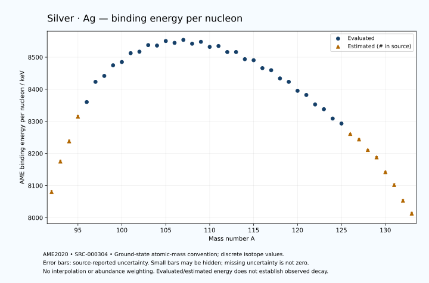

# Silver — Atomic Masses and Reaction Energies

<!-- generated-by: sync-ame2020.mjs -->

**Dated evaluated data · scientific coverage remains partial.** 42 ground-state nuclides from AME2020. Values and uncertainties are transcribed from the retained unrounded analysis files; estimated quantities remain labelled.

- [Parent Silver record](0047-Silver-Ag.md) · [NUBASE states and decays](0047-Silver-Ag-Nuclear-Evaluation.md)
- [Structured data](data/isotopes/0047-Silver-Ag-AME2020-Evaluation.yaml)
- [Original mass table](../../data/catalog/sources/ame2020-mass_1.mas20.txt) · [Original reaction table](../../data/catalog/sources/ame2020-rct1.mas20.txt)
- [AME2020 methods](https://doi.org/10.1088/1674-1137/abddb0) (SRC-000303) · [Tables and definitions](https://doi.org/10.1088/1674-1137/abddaf) (SRC-000304)

## Reading the data

All table energies and uncertainties are in keV; binding energy is per nucleon. A # replaces a decimal point in the original estimated value. UNKNOWN (*) retains the source's not-calculable entry; it is neither zero nor automatically NOT APPLICABLE. Source lines are one-based in the retained files. Uncertainties remain those published by the evaluation, with no replacement by independent-mass quadrature.

Atomic-mass conventions apply. Qα is total decay energy, not alpha-particle kinetic energy. Positive Q alone does not establish a decay branch, rate or observation. He-4's source Qα of zero is a bookkeeping identity. These tables describe ground-state combinations, not isomer or excited-daughter transitions. Nuclear state and daughter lookups are explicit in the structured companion. The binding quantity follows [Z M(¹H) + N mₙ − M(A,Z)]c²/A; it has not been converted to a bare-nucleus convention.

## Mass and binding table

| Nuclide | N | Atomic mass excess / keV | AME binding per nucleon / keV | Mass-file line |
|---|---:|---|---|---:|
| Ag-92 | 45 | -37530# ± 400# | 8080# ± 4# | 1055 |
| Ag-93 | 46 | -46400# ± 401# | 8175# ± 4# | 1069 |
| Ag-94 | 47 | -52402# ± 400# | 8238# ± 4# | 1083 |
| Ag-95 | 48 | -59906# ± 400# | 8315# ± 4# | 1098 |
| Ag-96 | 49 | -64511.645 ± 90.084 | 8360.2903 ± 0.9384 | 1112 |
| Ag-97 | 50 | -70904.027 ± 12.016 | 8423.2121 ± 0.1239 | 1127 |
| Ag-98 | 51 | -73066.425 ± 32.907 | 8441.6866 ± 0.3358 | 1142 |
| Ag-99 | 52 | -76712.483 ± 6.265 | 8474.7744 ± 0.0633 | 1156 |
| Ag-100 | 53 | -78137.969 ± 5.000 | 8484.9947 ± 0.0500 | 1171 |
| Ag-101 | 54 | -81334.384 ± 4.838 | 8512.5465 ± 0.0479 | 1186 |
| Ag-102 | 55 | -82246.702 ± 8.171 | 8517.1650 ± 0.0801 | 1200 |
| Ag-103 | 56 | -84802.702 ± 4.099 | 8537.6520 ± 0.0398 | 1215 |
| Ag-104 | 57 | -85116.470 ± 4.217 | 8536.1850 ± 0.0406 | 1230 |
| Ag-105 | 58 | -87070.848 ± 4.544 | 8550.3708 ± 0.0433 | 1245 |
| Ag-106 | 59 | -86942.399 ± 3.016 | 8544.6397 ± 0.0285 | 1260 |
| Ag-107 | 60 | -88406.700 ± 2.382 | 8553.9012 ± 0.0223 | 1276 |
| Ag-108 | 61 | -87606.792 ± 2.388 | 8542.0262 ± 0.0221 | 1291 |
| Ag-109 | 62 | -88719.431 ± 1.287 | 8547.9155 ± 0.0118 | 1307 |
| Ag-110 | 63 | -87457.306 ± 1.286 | 8532.1089 ± 0.0117 | 1322 |
| Ag-111 | 64 | -88215.447 ± 1.459 | 8534.7878 ± 0.0131 | 1337 |
| Ag-112 | 65 | -86583.729 ± 2.422 | 8516.0807 ± 0.0216 | 1353 |
| Ag-113 | 66 | -87026.825 ± 16.643 | 8516.0660 ± 0.1473 | 1369 |
| Ag-114 | 67 | -84930.811 ± 4.564 | 8493.7786 ± 0.0400 | 1385 |
| Ag-115 | 68 | -84982.587 ± 18.268 | 8490.5553 ± 0.1589 | 1401 |
| Ag-116 | 69 | -82542.664 ± 3.260 | 8465.9073 ± 0.0281 | 1417 |
| Ag-117 | 70 | -82181.918 ± 13.572 | 8459.4515 ± 0.1160 | 1433 |
| Ag-118 | 71 | -79553.802 ± 2.515 | 8433.8900 ± 0.0213 | 1449 |
| Ag-119 | 72 | -78645.759 ± 14.703 | 8423.2126 ± 0.1236 | 1465 |
| Ag-120 | 73 | -75651.512 ± 4.471 | 8395.3281 ± 0.0373 | 1481 |
| Ag-121 | 74 | -74402.831 ± 12.109 | 8382.3306 ± 0.1001 | 1497 |
| Ag-122 | 75 | -71106.118 ± 38.191 | 8352.7591 ± 0.3130 | 1514 |
| Ag-123 | 76 | -69568.581 ± 32.602 | 8337.9707 ± 0.2651 | 1530 |
| Ag-124 | 77 | -66229.951 ± 251.503 | 8308.8958 ± 2.0283 | 1546 |
| Ag-125 | 78 | -64519.939 ± 433.145 | 8293.3151 ± 3.4652 | 1563 |
| Ag-126 | 79 | -60720# ± 200# | 8261# ± 2# | 1579 |
| Ag-127 | 80 | -58650# ± 200# | 8244# ± 2# | 1596 |
| Ag-128 | 81 | -54710# ± 300# | 8211# ± 2# | 1613 |
| Ag-129 | 82 | -51870# ± 400# | 8188# ± 3# | 1630 |
| Ag-130 | 83 | -45898# ± 424# | 8142# ± 3# | 1647 |
| Ag-131 | 84 | -40750# ± 500# | 8102# ± 4# | 1665 |
| Ag-132 | 85 | -34400# ± 500# | 8053# ± 4# | 1682 |
| Ag-133 | 86 | -29080# ± 500# | 8013# ± 4# | 1699 |

## Q-values and separation energies

| Nuclide | Qβ− / keV | Qα / keV | S₂n / keV | S₂p / keV | Reaction-file line |
|---|---|---|---|---|---:|
| Ag-92 | UNKNOWN (*) | -3095# ± 565# | UNKNOWN (*) | 474# ± 447# | 1054 |
| Ag-93 | UNKNOWN (*) | -3174# ± 539# | UNKNOWN (*) | 2408# ± 499# | 1068 |
| Ag-94 | -11962# ± 640# | -3193# ± 447# | 31015# ± 565# | 3981# ± 400# | 1082 |
| Ag-95 | -12850# ± 400# | -3761# ± 499# | 29649# ± 566# | 5472# ± 400# | 1097 |
| Ag-96 | -8940# ± 400# | -3937.4661 ± 90.1902 | 28252# ± 410# | 6181.9642 ± 90.1472 | 1111 |
| Ag-97 | -10170.0000 ± 420.0000 | -4317.1333 ± 12.3004 | 27141# ± 400# | 7141.3527 ± 12.6289 | 1126 |
| Ag-98 | -5430.0000 ± 40.0000 | -2583.7173 ± 33.0803 | 24697.4154 ± 95.9061 | 7956.6347 ± 34.3936 | 1141 |
| Ag-99 | -6781.3511 ± 6.4622 | -796.7823 ± 7.3723 | 21951.0920 ± 13.5515 | 8692.8608 ± 36.0123 | 1155 |
| Ag-100 | -3943.3740 ± 5.2735 | -875.1531 ± 11.1816 | 21214.1808 ± 33.2849 | 9540.6930 ± 12.9137 | 1170 |
| Ag-101 | -5497.9186 ± 5.0625 | -1161.7358 ± 35.7916 | 20764.5374 ± 7.9158 | 10327.8046 ± 20.0433 | 1185 |
| Ag-102 | -2587.0000 ± 8.0000 | -1496.3989 ± 14.4405 | 20251.3683 ± 9.5793 | 11233.5137 ± 19.8818 | 1199 |
| Ag-103 | -4151.0761 ± 4.4806 | -1643.0966 ± 19.8777 | 19610.9544 ± 6.3408 | 11968.2165 ± 7.1352 | 1214 |
| Ag-104 | -1148.0787 ± 4.5370 | -1950.2558 ± 18.6092 | 19012.4045 ± 9.1951 | 12911.0961 ± 7.6717 | 1229 |
| Ag-105 | -2736.9989 ± 4.3618 | -2083.3363 ± 7.3998 | 18410.7821 ± 6.1190 | 13617.0851 ± 5.0929 | 1244 |
| Ag-106 | 189.7534 ± 2.8190 | -2583.9992 ± 7.0827 | 17968.5656 ± 4.9484 | 14560.9976 ± 3.7925 | 1259 |
| Ag-107 | -1416.3741 ± 2.5654 | -2799.9100 ± 3.3105 | 17478.4873 ± 5.0277 | 15133.3717 ± 3.2804 | 1275 |
| Ag-108 | 1645.6311 ± 2.6386 | -3072.3634 ± 3.3159 | 16807.0282 ± 3.5598 | 15822.0773 ± 5.8012 | 1290 |
| Ag-109 | -215.1002 ± 1.7795 | -3293.0765 ± 2.8131 | 16455.3672 ± 2.7071 | 16433.6616 ± 12.0816 | 1306 |
| Ag-110 | 2890.6633 ± 1.2771 | -3519.5657 ± 5.5409 | 15993.1508 ± 2.7122 | 17004.0926 ± 14.0553 | 1321 |
| Ag-111 | 1036.8000 ± 1.4142 | -3776.6517 ± 12.1373 | 15638.6525 ± 1.9083 | 17794.1382 ± 4.2795 | 1336 |
| Ag-112 | 3991.1283 ± 2.4348 | -3977.4892 ± 14.2049 | 15269.0590 ± 2.7422 | 18332.9783 ± 17.9686 | 1352 |
| Ag-113 | 2016.4615 ± 16.6410 | -4452.4897 ± 17.1249 | 14954.0139 ± 16.7046 | 19300.8960 ± 17.9980 | 1368 |
| Ag-114 | 5084.1233 ± 4.5727 | -4527.0337 ± 18.3804 | 14489.7178 ± 5.1671 | 19777.7009 ± 44.3211 | 1384 |
| Ag-115 | 3101.8930 ± 18.2744 | -5103.6316 ± 19.5060 | 14098.3980 ± 24.7117 | 20793.5851 ± 19.6058 | 1400 |
| Ag-116 | 6169.8248 ± 3.2642 | -5236.5280 ± 44.2058 | 13754.4895 ± 5.6091 | 21410.3310 ± 71.6354 | 1416 |
| Ag-117 | 4236.4790 ± 13.6099 | -5839.8901 ± 15.3234 | 13341.9674 ± 22.7570 | 22530.6319 ± 15.4111 | 1432 |
| Ag-118 | 7147.8469 ± 20.1582 | -6268.4428 ± 71.6054 | 13153.7742 ± 4.1176 | 23396.0019 ± 73.8746 | 1448 |
| Ag-119 | 5331.1799 ± 35.9259 | -6841.4463 ± 16.4222 | 12606.4768 ± 20.0090 | 24326.9425 ± 17.1824 | 1464 |
| Ag-120 | 8305.8535 ± 5.8202 | -7340.6853 ± 73.9670 | 12240.3458 ± 5.1300 | 25342.6144 ± 24.6447 | 1480 |
| Ag-121 | 6671.0057 ± 12.2642 | -7930.9884 ± 15.0250 | 11899.7083 ± 19.0474 | 26157.9709 ± 15.2776 | 1496 |
| Ag-122 | 9506.2662 ± 38.2604 | -8644.1944 ± 45.2321 | 11597.2423 ± 38.4521 | 27064# ± 204# | 1513 |
| Ag-123 | 7845.6026 ± 32.7136 | -9170.6945 ± 33.9069 | 11308.3860 ± 34.7786 | 27896.3884 ± 620.3009 | 1529 |
| Ag-124 | 10469.4858 ± 251.5169 | -10035# ± 322# | 11266.4687 ± 254.3866 | 28928# ± 391# | 1545 |
| Ag-125 | 8828.1511 ± 433.1544 | -10694.7205 ± 755.8603 | 11093.9945 ± 434.3700 | 29908# ± 589# | 1562 |
| Ag-126 | 11535# ± 200# | -11266# ± 361# | 10633# ± 322# | 30588# ± 447# | 1578 |
| Ag-127 | 10092# ± 200# | -11884# ± 447# | 10272# ± 477# | 31398# ± 539# | 1595 |
| Ag-128 | 12528# ± 300# | -12425# ± 500# | 10133# ± 361# | 32088# ± 583# | 1612 |
| Ag-129 | 11252# ± 400# | -12465# ± 640# | 9363# ± 447# | 32718# ± 721# | 1629 |
| Ag-130 | 15220# ± 425# | -11123# ± 656# | 7330# ± 300# | 33135# ± 520# | 1646 |
| Ag-131 | 14462# ± 501# | -9445# ± 781# | 5022# ± 640# | UNKNOWN (*) | 1664 |
| Ag-132 | 16065# ± 504# | -9485# ± 583# | 4645# ± 656# | UNKNOWN (*) | 1681 |
| Ag-133 | 15059# ± 539# | UNKNOWN (*) | 4473# ± 707# | UNKNOWN (*) | 1698 |

Qβ− comes from the mass-file line in the first table. The other three columns come from the reaction-file line. Definitions and original source strings are retained in the structured data.

## Binding-energy chart

Discrete source values and source-reported uncertainties. No interpolation, natural-abundance weighting or observed-decay claim is implied. This quantitative chart supplements the 22 separate illustrative panels.

## Remaining review

Later measurements, state-specific decay branches, isomer Q-values, additional reaction channels and full claim-level review remain open. Existing authored values retain their own provenance; this companion does not overwrite them.
