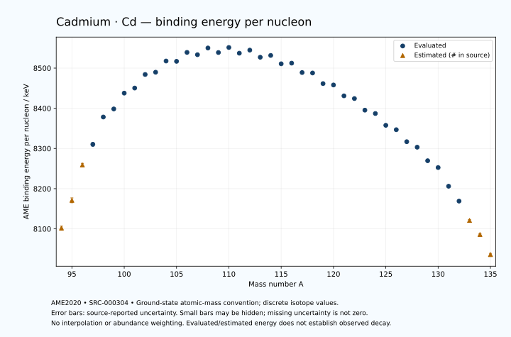

# Cadmium — Atomic Masses and Reaction Energies

<!-- generated-by: sync-ame2020.mjs -->

**Dated evaluated data · scientific coverage remains partial.** 42 ground-state nuclides from AME2020. Values and uncertainties are transcribed from the retained unrounded analysis files; estimated quantities remain labelled.

- [Parent Cadmium record](0048-Cadmium-Cd.md) · [NUBASE states and decays](0048-Cadmium-Cd-Nuclear-Evaluation.md)
- [Structured data](data/isotopes/0048-Cadmium-Cd-AME2020-Evaluation.yaml)
- [Original mass table](../../data/catalog/sources/ame2020-mass_1.mas20.txt) · [Original reaction table 1](../../data/catalog/sources/ame2020-rct1.mas20.txt) · [Original reaction table 2](../../data/catalog/sources/ame2020-rct2.mas20.txt)
- [AME2020 methods](https://doi.org/10.1088/1674-1137/abddb0) (SRC-000303) · [Tables and definitions](https://doi.org/10.1088/1674-1137/abddaf) (SRC-000304)

## Reading the data

All table energies and uncertainties are in keV; binding energy is per nucleon. A # replaces a decimal point in the original estimated value. UNKNOWN (*) retains the source's not-calculable entry; it is neither zero nor automatically NOT APPLICABLE. Source lines are one-based in the retained files. Uncertainties remain those published by the evaluation, with no replacement by independent-mass quadrature.

Atomic-mass conventions apply. Qα is total decay energy, not alpha-particle kinetic energy. Positive Q alone does not establish a decay branch, rate or observation. He-4's source Qα of zero is a bookkeeping identity. These tables describe ground-state combinations, not isomer or excited-daughter transitions. Nuclear state and daughter lookups are explicit in the structured companion. The binding quantity follows [Z M(¹H) + N mₙ − M(A,Z)]c²/A; it has not been converted to a bare-nucleus convention.

## Mass and binding table

| Nuclide | N | Atomic mass excess / keV | AME binding per nucleon / keV | Mass-file line |
|---|---:|---|---|---:|
| Cd-94 | 46 | -40440# ± 500# | 8102# ± 5# | 1084 |
| Cd-95 | 47 | -47056# ± 566# | 8171# ± 6# | 1099 |
| Cd-96 | 48 | -55572# ± 410# | 8259# ± 4# | 1113 |
| Cd-97 | 49 | -60734.027 ± 420.172 | 8310.3013 ± 4.3317 | 1128 |
| Cd-98 | 50 | -67636.425 ± 51.797 | 8378.2953 ± 0.5285 | 1143 |
| Cd-99 | 51 | -69931.132 ± 1.584 | 8398.3734 ± 0.0160 | 1157 |
| Cd-100 | 52 | -74194.595 ± 1.677 | 8437.7375 ± 0.0168 | 1172 |
| Cd-101 | 53 | -75836.466 ± 1.490 | 8450.3657 ± 0.0148 | 1187 |
| Cd-102 | 54 | -79659.702 ± 1.662 | 8484.1322 ± 0.0163 | 1201 |
| Cd-103 | 55 | -80651.626 ± 1.811 | 8489.7547 ± 0.0176 | 1216 |
| Cd-104 | 56 | -83968.391 ± 1.673 | 8517.6232 ± 0.0161 | 1231 |
| Cd-105 | 57 | -84333.849 ± 1.392 | 8516.8532 ± 0.0133 | 1246 |
| Cd-106 | 58 | -87132.153 ± 1.104 | 8539.0492 ± 0.0104 | 1261 |
| Cd-107 | 59 | -86990.325 ± 1.660 | 8533.3524 ± 0.0155 | 1277 |
| Cd-108 | 60 | -89252.423 ± 1.123 | 8550.0196 ± 0.0104 | 1292 |
| Cd-109 | 61 | -88504.330 ± 1.536 | 8538.7646 ± 0.0141 | 1308 |
| Cd-110 | 62 | -90347.969 ± 0.380 | 8551.2755 ± 0.0035 | 1323 |
| Cd-111 | 63 | -89252.247 ± 0.357 | 8537.0801 ± 0.0032 | 1338 |
| Cd-112 | 64 | -90574.857 ± 0.250 | 8544.7306 ± 0.0022 | 1354 |
| Cd-113 | 65 | -89043.286 ± 0.245 | 8526.9874 ± 0.0022 | 1370 |
| Cd-114 | 66 | -90014.934 ± 0.276 | 8531.5135 ± 0.0024 | 1386 |
| Cd-115 | 67 | -88084.480 ± 0.651 | 8510.7252 ± 0.0057 | 1402 |
| Cd-116 | 68 | -88712.489 ± 0.160 | 8512.3511 ± 0.0014 | 1418 |
| Cd-117 | 69 | -86418.397 ± 1.013 | 8488.9740 ± 0.0087 | 1434 |
| Cd-118 | 70 | -86701.649 ± 20.001 | 8487.8350 ± 0.1695 | 1450 |
| Cd-119 | 71 | -83976.939 ± 37.695 | 8461.4381 ± 0.3168 | 1466 |
| Cd-120 | 72 | -83957.365 ± 3.726 | 8458.0240 ± 0.0311 | 1482 |
| Cd-121 | 73 | -81073.837 ± 1.942 | 8430.9972 ± 0.0161 | 1498 |
| Cd-122 | 74 | -80612.384 ± 2.299 | 8424.2667 ± 0.0188 | 1515 |
| Cd-123 | 75 | -77414.183 ± 2.696 | 8395.3955 ± 0.0219 | 1531 |
| Cd-124 | 76 | -76699.436 ± 2.609 | 8387.0179 ± 0.0210 | 1547 |
| Cd-125 | 77 | -73348.090 ± 2.888 | 8357.6815 ± 0.0231 | 1564 |
| Cd-126 | 78 | -72255.727 ± 2.304 | 8346.7393 ± 0.0183 | 1580 |
| Cd-127 | 79 | -68741.199 ± 6.200 | 8316.8971 ± 0.0488 | 1597 |
| Cd-128 | 80 | -67238.245 ± 6.432 | 8303.2367 ± 0.0503 | 1614 |
| Cd-129 | 81 | -63122.142 ± 5.310 | 8269.5311 ± 0.0412 | 1631 |
| Cd-130 | 82 | -61117.597 ± 22.356 | 8252.5868 ± 0.1720 | 1648 |
| Cd-131 | 83 | -55211.760 ± 19.238 | 8206.1204 ± 0.1469 | 1666 |
| Cd-132 | 84 | -50465.429 ± 60.068 | 8169.1421 ± 0.4551 | 1683 |
| Cd-133 | 85 | -44140# ± 200# | 8121# ± 2# | 1700 |
| Cd-134 | 86 | -39460# ± 300# | 8086# ± 2# | 1717 |
| Cd-135 | 87 | -32820# ± 400# | 8036# ± 3# | 1734 |

## Q-values and separation energies

| Nuclide | Qβ− / keV | Qα / keV | S₂n / keV | S₂p / keV | Reaction-file line |
|---|---|---|---|---|---:|
| Cd-94 | UNKNOWN (*) | -3155# ± 640# | UNKNOWN (*) | 239# ± 608# | 1083 |
| Cd-95 | UNKNOWN (*) | -3311# ± 706# | UNKNOWN (*) | 2652# ± 676# | 1098 |
| Cd-96 | -17482# ± 647# | -3217# ± 536# | 31274# ± 647# | 4047# ± 410# | 1112 |
| Cd-97 | -13344# ± 580# | -4177.1333 ± 559.8672 | 29821# ± 705# | 5346.0562 ± 420.1828 | 1127 |
| Cd-98 | -13730# ± 300# | -3959.0601 ± 51.9737 | 28207# ± 413# | 6030.9473 ± 51.9661 | 1142 |
| Cd-99 | -8555# ± 298# | -2390.1348 ± 3.4198 | 25339.7410 ± 420.1748 | 6703.2215 ± 5.0960 | 1156 |
| Cd-100 | -10016.4492 ± 2.7945 | -436.0917 ± 4.5169 | 22700.8068 ± 51.8237 | 7451.5521 ± 5.0298 | 1171 |
| Cd-101 | -7291.5642 ± 11.7569 | -455.5290 ± 5.0679 | 22047.9699 ± 2.1746 | 8231.5463 ± 5.3200 | 1186 |
| Cd-102 | -8964.8059 ± 4.8654 | -763.6320 ± 5.0251 | 21607.7423 ± 2.3611 | 9024.9713 ± 17.7150 | 1200 |
| Cd-103 | -6019.2293 ± 9.1242 | -893.6808 ± 5.4179 | 20957.7968 ± 2.3450 | 9797.4237 ± 4.9322 | 1215 |
| Cd-104 | -7785.7166 ± 6.0127 | -1180.6348 ± 17.7160 | 20451.3259 ± 2.3583 | 10643.3704 ± 1.7244 | 1230 |
| Cd-105 | -4693.2673 ± 10.3405 | -1326.6206 ± 4.7948 | 19824.8593 ± 2.2837 | 11454.8114 ± 1.6456 | 1245 |
| Cd-106 | -6524.0031 ± 12.1765 | -1654.1057 ± 1.1750 | 19306.3977 ± 2.0041 | 12314.9721 ± 0.7617 | 1260 |
| Cd-107 | -3423.6586 ± 9.5800 | -1958.2611 ± 1.8777 | 18799.1122 ± 2.1631 | 13150.3628 ± 1.9524 | 1276 |
| Cd-108 | -5132.5944 ± 8.5845 | -2282.2156 ± 1.7455 | 18262.9059 ± 1.5743 | 13922.8219 ± 1.5757 | 1291 |
| Cd-109 | -2014.8047 ± 4.0662 | -2511.3416 ± 1.9121 | 17656.6411 ± 2.2619 | 14709.6188 ± 1.9502 | 1307 |
| Cd-110 | -3878.0000 ± 11.5470 | -2865.3425 ± 1.1689 | 17238.1830 ± 1.1693 | 15401.6963 ± 1.1508 | 1322 |
| Cd-111 | -860.1972 ± 3.4170 | -3304.5091 ± 1.2534 | 16890.5527 ± 1.5666 | 16223.7054 ± 1.1523 | 1337 |
| Cd-112 | -2584.7306 ± 4.2434 | -3475.5579 ± 1.1279 | 16369.5240 ± 0.3181 | 16821.8951 ± 0.5957 | 1353 |
| Cd-113 | 323.8370 ± 0.2653 | -3861.7185 ± 1.1357 | 15933.6755 ± 0.3479 | 17635.3422 ± 0.7381 | 1369 |
| Cd-114 | -1445.1268 ± 0.3817 | -4108.9454 ± 0.6343 | 15582.7127 ± 0.2546 | 18271.8367 ± 6.5505 | 1385 |
| Cd-115 | 1451.8768 ± 0.6514 | -4523.5093 ± 0.9541 | 15183.8295 ± 0.6056 | 19071.9222 ± 6.9765 | 1401 |
| Cd-116 | -462.7305 ± 0.2720 | -4816.3654 ± 6.5480 | 14840.1911 ± 0.3132 | 19800.0846 ± 6.9499 | 1417 |
| Cd-117 | 2524.6381 ± 4.9829 | -5252.8132 ± 7.0206 | 14476.5534 ± 1.2026 | 20570.5171 ± 13.5846 | 1433 |
| Cd-118 | 526.5277 ± 21.4501 | -5636.2184 ± 21.1731 | 14131.7962 ± 20.0000 | 21448.5648 ± 21.2352 | 1449 |
| Cd-119 | 3721.7197 ± 38.0880 | -5976.0325 ± 40.0516 | 13701.1777 ± 37.7090 | 22130.9911 ± 38.3827 | 1465 |
| Cd-120 | 1770.3754 ± 40.1837 | -6551.2549 ± 8.0493 | 13398.3524 ± 20.3447 | 23146.9497 ± 4.4836 | 1481 |
| Cd-121 | 4760.7564 ± 27.4876 | -7074.8628 ± 7.5105 | 13239.5341 ± 37.7454 | 24244.5016 ± 8.4734 | 1497 |
| Cd-122 | 2958.9765 ± 50.1126 | -7648.9424 ± 3.3918 | 12797.6551 ± 4.3781 | 24910.7222 ± 3.2490 | 1514 |
| Cd-123 | 6014.8503 ± 19.8980 | -8431.8221 ± 8.6770 | 12482.9829 ± 3.3227 | 25809.7880 ± 4.3027 | 1530 |
| Cd-124 | 4168.3420 ± 30.5355 | -8844.7481 ± 3.4749 | 12229.6883 ± 3.4771 | 26661.2097 ± 19.7346 | 1546 |
| Cd-125 | 7064.2177 ± 3.3869 | -9590.6686 ± 4.4253 | 12076.5429 ± 3.9505 | 27496.2838 ± 789.4465 | 1563 |
| Cd-126 | 5553.6500 ± 4.7831 | -10064.4740 ± 19.6966 | 11698.9267 ± 3.4803 | 28434# ± 300# | 1579 |
| Cd-127 | 8138.6978 ± 11.7675 | -10736.3665 ± 789.4656 | 11535.7451 ± 6.8398 | 29360# ± 400# | 1596 |
| Cd-128 | 6951.8716 ± 6.5665 | -11263# ± 300# | 11125.1541 ± 6.8321 | 30026# ± 400# | 1613 |
| Cd-129 | 9712.7471 ± 5.6637 | -11587# ± 400# | 10523.5788 ± 8.1631 | 30480# ± 500# | 1630 |
| Cd-130 | 8788.9322 ± 22.4274 | -11752# ± 400# | 10021.9886 ± 23.2627 | 31305# ± 501# | 1647 |
| Cd-131 | 12812.6089 ± 19.3644 | -10416# ± 501# | 8232.2548 ± 19.9577 | 31910# ± 600# | 1665 |
| Cd-132 | 11946.1243 ± 84.9236 | -8500# ± 504# | 5490.4679 ± 64.0928 | 32313# ± 306# | 1682 |
| Cd-133 | 13550# ± 283# | -8685# ± 632# | 5071# ± 201# | 32978# ± 361# | 1699 |
| Cd-134 | 12510# ± 361# | -9155# ± 424# | 5137# ± 306# | UNKNOWN (*) | 1716 |
| Cd-135 | 14290# ± 500# | -9505# ± 500# | 4823# ± 447# | UNKNOWN (*) | 1733 |

## Additional decay-energy combinations

| Nuclide | Q₂β− / keV | Q₄β− / keV | Qεp / keV | Qβ−n / keV | Part 1 / part 2 line |
|---|---|---|---|---|---|
| Cd-94 | UNKNOWN (*) | UNKNOWN (*) | 11253# ± 622# | UNKNOWN (*) | 1083 / 1099 |
| Cd-95 | UNKNOWN (*) | UNKNOWN (*) | 11757# ± 566# | UNKNOWN (*) | 1098 / 1114 |
| Cd-96 | UNKNOWN (*) | UNKNOWN (*) | 7105# ± 410# | UNKNOWN (*) | 1112 / 1128 |
| Cd-97 | UNKNOWN (*) | UNKNOWN (*) | 8160.4215 ± 420.1928 | -30716# ± 653# | 1127 / 1143 |
| Cd-98 | UNKNOWN (*) | UNKNOWN (*) | 2880.4567 ± 52.0226 | -28318# ± 404# | 1142 / 1159 |
| Cd-99 | -21955# ± 582# | UNKNOWN (*) | 4100.8825 ± 4.9995 | -24096# ± 304# | 1156 / 1173 |
| Cd-100 | -17046.4492 ± 240.0163 | UNKNOWN (*) | 699.2949 ± 5.3751 | -20890# ± 298# | 1171 / 1188 |
| Cd-101 | -15530.8412 ± 300.0084 | UNKNOWN (*) | 2087.2357 ± 17.6998 | -19729.6375 ± 2.6868 | 1186 / 1203 |
| Cd-102 | -14724.8059 ± 100.1183 | UNKNOWN (*) | -1516.5279 ± 4.8798 | -19186.1182 ± 11.7799 | 1200 / 1217 |
| Cd-103 | -13559# ± 100# | UNKNOWN (*) | -37.6343 ± 1.8582 | -18028.0487 ± 4.9179 | 1215 / 1233 |
| Cd-104 | -12341.3341 ± 5.9836 | -34341.5607 ± 317.6139 | -3800.3821 ± 1.8893 | -17407.3123 ± 9.1349 | 1230 / 1248 |
| Cd-105 | -10995.8480 ± 4.2080 | -31522.3408 ± 300.0229 | -2227.6976 ± 1.9266 | -16222.4929 ± 5.9406 | 1245 / 1263 |
| Cd-106 | -9778.4553 ± 5.2092 | -28912.3939 ± 100.5466 | -6003.2191 ± 0.3003 | -15562.8888 ± 10.3057 | 1260 / 1278 |
| Cd-107 | -8478.0867 ± 5.5630 | -26333# ± 101# | -4371.7537 ± 1.9333 | -14453.4938 ± 12.3289 | 1276 / 1294 |
| Cd-108 | -7182.4738 ± 5.4889 | -23470.7463 ± 5.5262 | -8168.7398 ± 1.6443 | -13757.0738 ± 9.7188 | 1291 / 1310 |
| Cd-109 | -5874.1500 ± 8.0955 | -20788.9311 ± 4.6438 | -6269.0863 ± 1.8162 | -12455.8203 ± 8.7636 | 1307 / 1326 |
| Cd-110 | -4505.9769 ± 13.7824 | -18118.1490 ± 6.5860 | -10030.4568 ± 1.1564 | -11929.7618 ± 3.9907 | 1322 / 1341 |
| Cd-111 | -3313.6664 ± 5.3381 | -15664.7601 ± 6.4372 | -8210.3137 ± 0.5581 | -10853.5956 ± 11.5482 | 1337 / 1356 |
| Cd-112 | -1919.8081 ± 0.1577 | -13007.3392 ± 8.3872 | -11877.9421 ± 0.7175 | -10254.1256 ± 3.4264 | 1353 / 1372 |
| Cd-113 | -715.1571 ± 1.5759 | -10696.2489 ± 27.9459 | -10011.2181 ± 6.5492 | -9124.4777 ± 4.2489 | 1369 / 1389 |
| Cd-114 | 544.8013 ± 0.2774 | -8125.2574 ± 24.4297 | -13713.4054 ± 6.9515 | -8719.1286 ± 0.2957 | 1385 / 1405 |
| Cd-115 | 1949.3660 ± 0.6514 | -6021.7123 ± 27.9524 | -11883.1044 ± 6.9774 | -7585.9907 ± 0.7027 | 1401 / 1421 |
| Cd-116 | 2813.4899 ± 0.1295 | -3448.6964 ± 24.2063 | -15575.6379 ± 13.5478 | -7247.4504 ± 0.1599 | 1417 / 1437 |
| Cd-117 | 3979.3454 ± 1.1143 | -1322.8967 ± 13.4929 | -13876.3418 ± 7.2064 | -6239.9566 ± 1.0363 | 1433 / 1454 |
| Cd-118 | 4951.1940 ± 20.0064 | 989.1088 ± 27.1134 | -17566.7305 ± 21.2758 | -5829.9319 ± 20.5871 | 1449 / 1470 |
| Cd-119 | 6088.0460 ± 37.7021 | 3205.6008 ± 38.3915 | -15877.5519 ± 37.7748 | -4820.0800 ± 38.3596 | 1465 / 1486 |
| Cd-120 | 7140.3754 ± 3.8379 | 5404.7950 ± 4.1171 | -19839.0593 ± 9.0504 | -4330.0250 ± 8.2047 | 1481 / 1502 |
| Cd-121 | 8122.7895 ± 2.1747 | 7469.2740 ± 25.9076 | -18083.2034 ± 3.0072 | -3417.4139 ± 40.0577 | 1497 / 1519 |
| Cd-122 | 9327.5686 ± 3.3582 | 9700.8976 ± 2.6696 | -21719.0179 ± 4.0657 | -2849.1093 ± 27.5151 | 1514 / 1536 |
| Cd-123 | 10400.4993 ± 3.6578 | 11756.7944 ± 3.0154 | -20086.9855 ± 19.7463 | -1914.1406 ± 50.1321 | 1530 / 1552 |
| Cd-124 | 11532.0390 ± 2.9197 | 13824.7053 ± 2.9370 | -23558.6591 ± 789.4456 | -1341.7208 ± 20.0031 | 1546 / 1568 |
| Cd-125 | 12545.5672 ± 3.1787 | 15673.7038 ± 3.1884 | -22237# ± 300# | -551.6298 ± 30.6967 | 1563 / 1586 |
| Cd-126 | 13759.4085 ± 10.9331 | 17808.4406 ± 2.6720 | -25585# ± 400# | 85.2627 ± 2.9051 | 1579 / 1602 |
| Cd-127 | 14728.3788 ± 11.1156 | 19539.2978 ± 6.3489 | -24240# ± 400# | 996.8599 ± 7.4844 | 1596 / 1619 |
| Cd-128 | 16123.1847 ± 18.8154 | 21755.5485 ± 6.4707 | -27307# ± 500# | 1570.3337 ± 11.8911 | 1613 / 1636 |
| Cd-129 | 17468.4551 ± 18.0677 | 23882.7425 ± 5.3569 | -26021# ± 500# | 2996.6569 ± 5.4717 | 1630 / 1654 |
| Cd-130 | 19014.6192 ± 22.4342 | 26235.3621 ± 22.3559 | -30526# ± 600# | 3645.9732 ± 22.4426 | 1647 / 1671 |
| Cd-131 | 22052.8184 ± 19.5762 | 29999.2612 ± 19.2385 | -29771# ± 301# | 6623.4513 ± 19.3215 | 1665 / 1689 |
| Cd-132 | 26081.1243 ± 60.1000 | 34722.7678 ± 60.1686 | -32014# ± 306# | 9487.6219 ± 60.1080 | 1682 / 1706 |
| Cd-133 | 26734# ± 200# | 38797# ± 200# | UNKNOWN (*) | 10200# ± 209# | 1699 / 1724 |
| Cd-134 | 26974# ± 300# | 43074# ± 300# | UNKNOWN (*) | 10159# ± 361# | 1716 / 1741 |
| Cd-135 | 27812# ± 400# | 44909# ± 400# | UNKNOWN (*) | 11078# ± 447# | 1733 / 1758 |

## Single-nucleon separation and reaction energies

| Nuclide | Sₙ / keV | Sₚ / keV | Q(d,α) / keV | Q(p,α) / keV | Q(n,α) / keV | Part 2 line |
|---|---|---|---|---|---|---:|
| Cd-94 | UNKNOWN (*) | 1329# ± 641# | 7801# ± 640# | UNKNOWN (*) | 11376# ± 655# | 1099 |
| Cd-95 | 14687# ± 755# | 1943# ± 693# | 10054# ± 693# | -4662# ± 693# | 13370# ± 663# | 1114 |
| Cd-96 | 16587# ± 699# | 2955# ± 573# | 7541# ± 573# | -4308# ± 573# | 9057# ± 552# | 1128 |
| Cd-97 | 13234# ± 587# | 3511.3526 ± 429.7202 | 9883# ± 580# | -3468# ± 580# | 11014.6558 ± 420.1937 | 1143 |
| Cd-98 | 14973.7158 ± 423.3524 | 4021.3688 ± 53.1722 | 7586.0277 ± 103.9134 | -2866# ± 403# | 7975.8904 ± 51.8852 | 1159 |
| Cd-99 | 10366.0252 ± 51.8208 | 4153.6782 ± 32.9453 | 11683.7022 ± 12.1202 | -555.4312 ± 90.0978 | 11898.6899 ± 4.4832 | 1173 |
| Cd-100 | 12334.7816 ± 2.3063 | 4771.0836 ± 6.4856 | 9582.6363 ± 32.9500 | 1573.4868 ± 12.1327 | 9257.6592 ± 5.1258 | 1188 |
| Cd-101 | 9713.1882 ± 2.2433 | 4987.4673 ± 5.2172 | 11586.8243 ± 6.4400 | 2094.0143 ± 32.9410 | 11130.9220 ± 4.9708 | 1203 |
| Cd-102 | 11894.5540 ± 2.2327 | 5614.2885 ± 5.1158 | 9189.0749 ± 5.2690 | 1916.8365 ± 6.4820 | 8169.5620 ± 5.3703 | 1217 |
| Cd-103 | 9063.2428 ± 2.4578 | 5693.8958 ± 8.3690 | 11393.5649 ± 5.1658 | 2350.3983 ± 5.3175 | 10207.4482 ± 17.7295 | 1233 |
| Cd-104 | 11388.0830 ± 2.4649 | 6454.6600 ± 4.4268 | 8989.1173 ± 8.3404 | 2230.0481 ± 5.1192 | 7110.1556 ± 4.8834 | 1248 |
| Cd-105 | 8436.7762 ± 2.1762 | 6506.3505 ± 4.4398 | 11179.6600 ± 4.3285 | 2776.9073 ± 8.2886 | 9215.5158 ± 1.4534 | 1263 |
| Cd-106 | 10869.6215 ± 1.7730 | 7350.2755 ± 4.6612 | 8695.1242 ± 4.0719 | 2534.6047 ± 4.2446 | 5971.2296 ± 1.4058 | 1278 |
| Cd-107 | 7929.4907 ± 1.9326 | 7336.8971 ± 3.3919 | 10791.3299 ± 4.8198 | 2990.1997 ± 4.5058 | 8051.1996 ± 2.0741 | 1294 |
| Cd-108 | 10333.4152 ± 2.0042 | 8134.6941 ± 2.6331 | 8400.7838 ± 3.2180 | 2682.4810 ± 4.6802 | 4811.8843 ± 1.5989 | 1310 |
| Cd-109 | 7323.2259 ± 1.8337 | 8186.5100 ± 2.8393 | 10613.1762 ± 2.8342 | 3302.1241 ± 3.3845 | 7049.6146 ± 1.8927 | 1326 |
| Cd-110 | 9914.9571 ± 1.5698 | 8917.5099 ± 1.2778 | 7969.6291 ± 2.4179 | 2922.7853 ± 2.4119 | 3671.0865 ± 1.2600 | 1341 |
| Cd-111 | 6975.5956 ± 0.1655 | 9083.9119 ± 1.2806 | 10177.9906 ± 1.2813 | 3218.5997 ± 2.4145 | 5918.3704 ± 1.1467 | 1356 |
| Cd-112 | 9393.9283 ± 0.2830 | 9648.3813 ± 1.4422 | 7593.2559 ± 1.2866 | 3008.6285 ± 1.2872 | 2678.0286 ± 1.1338 | 1372 |
| Cd-113 | 6539.7471 ± 0.2166 | 9748.5284 ± 2.4342 | 9882.9677 ± 1.4564 | 3278.0750 ± 1.2949 | 4934.0202 ± 0.6204 | 1389 |
| Cd-114 | 9042.9656 ± 0.1366 | 10277.0801 ± 16.6416 | 7279.6021 ± 2.4376 | 3064.5683 ± 1.4625 | 1617.3546 ± 0.7499 | 1405 |
| Cd-115 | 6140.8639 ± 0.5899 | 10442.6401 ± 4.6106 | 9653.1522 ± 16.6520 | 3363.3045 ± 2.5080 | 3882.9618 ± 6.5770 | 1421 |
| Cd-116 | 8699.3272 ± 0.6679 | 11018.8732 ± 18.2684 | 6929.1288 ± 4.5671 | 3178.3912 ± 16.6435 | 524.4129 ± 6.9490 | 1437 |
| Cd-117 | 5777.2262 ± 1.0000 | 11164.7040 ± 3.4139 | 9274.9967 ± 18.2958 | 3376.4689 ± 4.6753 | 2718.3516 ± 7.0215 | 1454 |
| Cd-118 | 8354.5701 ± 20.0250 | 11808.7021 ± 24.1708 | 6551.8221 ± 20.2646 | 3144.9929 ± 27.0875 | -629.4248 ± 24.1566 | 1470 |
| Cd-119 | 5346.6077 ± 42.6728 | 11712.1075 ± 37.7792 | 8915.7864 ± 40.0635 | 3429.7806 ± 37.8361 | 1500.4899 ± 38.3601 | 1486 |
| Cd-120 | 8051.7448 ± 37.8791 | 12600.5777 ± 15.1673 | 6307.2439 ± 4.4954 | 3088.6079 ± 14.0743 | -1887.0735 ± 8.1559 | 1502 |
| Cd-121 | 5187.7893 ± 4.2018 | 12711.2958 ± 4.8748 | 8282.7292 ± 14.8303 | 3344.0208 ± 3.1777 | -39.0766 ± 3.1610 | 1519 |
| Cd-122 | 7609.8657 ± 3.0095 | 13498.5245 ± 12.3257 | 5749.9346 ± 5.0276 | 2897.4296 ± 14.8812 | -3558.7049 ± 8.5622 | 1536 |
| Cd-123 | 4873.1171 ± 3.5430 | 13597.0363 ± 38.2863 | 7699.4546 ± 12.4059 | 3101.3837 ± 5.2210 | -1488.1769 ± 3.5405 | 1552 |
| Cd-124 | 7356.5712 ± 3.7514 | 14419.8268 ± 32.7065 | 5117.4886 ± 38.2802 | 2567.4496 ± 12.3872 | -4870.6968 ± 4.2486 | 1568 |
| Cd-125 | 4719.9718 ± 3.8915 | 14407.1105 ± 251.5200 | 6931.2976 ± 32.7299 | 2622.0831 ± 38.3003 | -3085.5191 ± 19.7734 | 1586 |
| Cd-126 | 6978.9550 ± 3.6940 | 15024.7591 ± 433.1509 | 4685.0306 ± 251.5140 | 2176.9089 ± 32.6836 | -6179.5764 ± 789.4446 | 1602 |
| Cd-127 | 4556.7901 ± 6.6146 | 15310# ± 200# | 6489.5470 ± 433.1891 | 2352.8068 ± 251.5798 | -4695# ± 300# | 1619 |
| Cd-128 | 6568.3641 ± 8.9340 | 15878# ± 200# | 4193# ± 200# | 2145.7492 ± 433.1925 | -7632# ± 400# | 1636 |
| Cd-129 | 3955.2147 ± 8.3404 | 15701# ± 300# | 6238# ± 200# | 2462# ± 200# | -5686# ± 400# | 1654 |
| Cd-130 | 6066.7739 ± 22.9777 | 16536# ± 400# | 4304# ± 301# | 2396# ± 202# | -8251# ± 501# | 1671 |
| Cd-131 | 2165.4809 ± 29.4941 | 16603# ± 425# | 7369# ± 400# | 4363# ± 301# | -5175# ± 501# | 1689 |
| Cd-132 | 3324.9870 ± 63.0732 | 17004# ± 504# | 6143# ± 428# | 6269# ± 404# | -6939# ± 603# | 1706 |
| Cd-133 | 1746# ± 209# | 17029# ± 539# | 7321# ± 539# | 6622# ± 469# | -5763# ± 361# | 1724 |
| Cd-134 | 3391# ± 361# | 17669# ± 583# | 5651# ± 583# | 6154# ± 583# | -8074# ± 424# | 1741 |
| Cd-135 | 1432# ± 500# | UNKNOWN (*) | 6971# ± 640# | 6444# ± 640# | UNKNOWN (*) | 1758 |

Qβ− comes from the mass-file line in the first table. Qα, S₂n, S₂p, Q₂β−, Qεp and Qβ−n come from reaction part 1; Q₄β− and the last table come from part 2. Qεp is electron-capture/proton energy balance; Qβ−n is beta-minus/neutron energy balance. These are evaluated mass combinations, not observations of decay modes, cross sections or reaction rates. Light-nuclide zero entries can be bookkeeping identities, without a physical A=0 residual. Definitions and original source strings are retained in the structured data.

## Binding-energy chart

Discrete source values and source-reported uncertainties. No interpolation, natural-abundance weighting or observed-decay claim is implied. This quantitative chart supplements the 22 separate illustrative panels.

## Remaining review

Later measurements, state-specific decay branches, isomer Q-values, reaction rates, applicability and full claim-level review remain open. Existing authored values retain their own provenance; this companion does not overwrite them.
