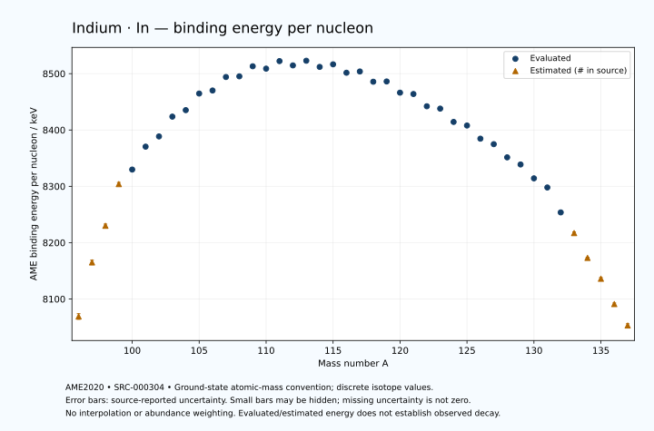

# Indium — Atomic Masses and Reaction Energies

<!-- generated-by: sync-ame2020.mjs -->

**Dated evaluated data · scientific coverage remains partial.** 42 ground-state nuclides from AME2020. Values and uncertainties are transcribed from the retained unrounded analysis files; estimated quantities remain labelled.

- [Parent Indium record](0049-Indium-In.md) · [NUBASE states and decays](0049-Indium-In-Nuclear-Evaluation.md)
- [Structured data](data/isotopes/0049-Indium-In-AME2020-Evaluation.yaml)
- [Original mass table](../../data/catalog/sources/ame2020-mass_1.mas20.txt) · [Original reaction table](../../data/catalog/sources/ame2020-rct1.mas20.txt)
- [AME2020 methods](https://doi.org/10.1088/1674-1137/abddb0) (SRC-000303) · [Tables and definitions](https://doi.org/10.1088/1674-1137/abddaf) (SRC-000304)

## Reading the data

All table energies and uncertainties are in keV; binding energy is per nucleon. A # replaces a decimal point in the original estimated value. UNKNOWN (*) retains the source's not-calculable entry; it is neither zero nor automatically NOT APPLICABLE. Source lines are one-based in the retained files. Uncertainties remain those published by the evaluation, with no replacement by independent-mass quadrature.

Atomic-mass conventions apply. Qα is total decay energy, not alpha-particle kinetic energy. Positive Q alone does not establish a decay branch, rate or observation. He-4's source Qα of zero is a bookkeeping identity. These tables describe ground-state combinations, not isomer or excited-daughter transitions. Nuclear state and daughter lookups are explicit in the structured companion. The binding quantity follows [Z M(¹H) + N mₙ − M(A,Z)]c²/A; it has not been converted to a bare-nucleus convention.

## Mass and binding table

| Nuclide | N | Atomic mass excess / keV | AME binding per nucleon / keV | Mass-file line |
|---|---:|---|---|---:|
| In-96 | 47 | -38090# ± 500# | 8069# ± 5# | 1114 |
| In-97 | 48 | -47390# ± 401# | 8165# ± 4# | 1129 |
| In-98 | 49 | -53906# ± 304# | 8230# ± 3# | 1144 |
| In-99 | 50 | -61376# ± 298# | 8304# ± 3# | 1158 |
| In-100 | 51 | -64178.146 ± 2.236 | 8329.7495 ± 0.0224 | 1173 |
| In-101 | 52 | -68544.901 ± 11.662 | 8370.4260 ± 0.1155 | 1188 |
| In-102 | 53 | -70694.896 ± 4.573 | 8388.5719 ± 0.0448 | 1202 |
| In-103 | 54 | -74632.397 ± 8.980 | 8423.7199 ± 0.0872 | 1217 |
| In-104 | 55 | -76182.675 ± 5.775 | 8435.2380 ± 0.0555 | 1232 |
| In-105 | 56 | -79640.582 ± 10.246 | 8464.7045 ± 0.0976 | 1247 |
| In-106 | 57 | -80608.150 ± 12.226 | 8470.1213 ± 0.1153 | 1262 |
| In-107 | 58 | -83566.667 ± 9.654 | 8494.0439 ± 0.0902 | 1278 |
| In-108 | 59 | -84119.828 ± 8.641 | 8495.2516 ± 0.0800 | 1293 |
| In-109 | 60 | -86489.526 ± 3.969 | 8513.1027 ± 0.0364 | 1309 |
| In-110 | 61 | -86469.969 ± 11.553 | 8508.9087 ± 0.1050 | 1324 |
| In-111 | 62 | -88392.050 ± 3.424 | 8522.2824 ± 0.0308 | 1339 |
| In-112 | 63 | -87990.127 ± 4.251 | 8514.6674 ± 0.0380 | 1355 |
| In-113 | 64 | -89367.123 ± 0.188 | 8522.9297 ± 0.0017 | 1371 |
| In-114 | 65 | -88569.807 ± 0.301 | 8511.9742 ± 0.0027 | 1387 |
| In-115 | 66 | -89536.357 ± 0.012 | 8516.5472 ± 0.0003 | 1403 |
| In-116 | 67 | -88249.758 ± 0.220 | 8501.6177 ± 0.0019 | 1419 |
| In-117 | 68 | -88943.035 ± 4.881 | 8503.8653 ± 0.0417 | 1435 |
| In-118 | 69 | -87228.177 ± 7.752 | 8485.6670 ± 0.0657 | 1451 |
| In-119 | 70 | -87698.658 ± 7.310 | 8486.1387 ± 0.0614 | 1467 |
| In-120 | 71 | -85727.741 ± 40.011 | 8466.2575 ± 0.3334 | 1483 |
| In-121 | 72 | -85834.593 ± 27.419 | 8463.8767 ± 0.2266 | 1499 |
| In-122 | 73 | -83571.361 ± 50.060 | 8442.1079 ± 0.4103 | 1516 |
| In-123 | 74 | -83429.034 ± 19.832 | 8437.9362 ± 0.1612 | 1532 |
| In-124 | 75 | -80867.778 ± 30.561 | 8414.3243 ± 0.2465 | 1548 |
| In-125 | 76 | -80412.308 ± 1.770 | 8407.9365 ± 0.0142 | 1565 |
| In-126 | 77 | -77809.377 ± 4.192 | 8384.6067 ± 0.0333 | 1581 |
| In-127 | 78 | -76879.897 ± 10.001 | 8374.8212 ± 0.0788 | 1598 |
| In-128 | 79 | -74190.117 ± 1.322 | 8351.4361 ± 0.0103 | 1615 |
| In-129 | 80 | -72834.889 ± 1.971 | 8338.7590 ± 0.0153 | 1632 |
| In-130 | 81 | -69906.530 ± 1.790 | 8314.1760 ± 0.0138 | 1649 |
| In-131 | 82 | -68024.369 ± 2.205 | 8297.9544 ± 0.0168 | 1667 |
| In-132 | 83 | -62411.554 ± 60.033 | 8253.7162 ± 0.4548 | 1684 |
| In-133 | 84 | -57690# ± 200# | 8217# ± 2# | 1701 |
| In-134 | 85 | -51970# ± 200# | 8173# ± 1# | 1718 |
| In-135 | 86 | -47110# ± 300# | 8136# ± 2# | 1735 |
| In-136 | 87 | -40970# ± 300# | 8091# ± 2# | 1752 |
| In-137 | 88 | -35830# ± 400# | 8053# ± 3# | 1769 |

## Q-values and separation energies

| Nuclide | Qβ− / keV | Qα / keV | S₂n / keV | S₂p / keV | Reaction-file line |
|---|---|---|---|---|---:|
| In-96 | UNKNOWN (*) | -2985# ± 640# | UNKNOWN (*) | 265# ± 640# | 1113 |
| In-97 | UNKNOWN (*) | -3415# ± 566# | UNKNOWN (*) | 2062# ± 566# | 1128 |
| In-98 | UNKNOWN (*) | -3929# ± 503# | 31959# ± 586# | 3973# ± 317# | 1143 |
| In-99 | -13400# ± 500# | -3895# ± 499# | 30129# ± 499# | 5050# ± 298# | 1157 |
| In-100 | -7030.0000 ± 240.0000 | -2091.4166 ± 90.1116 | 26414# ± 304# | 5689.6636 ± 32.9831 | 1172 |
| In-101 | -8239.2770 ± 300.2313 | -65.7903 ± 16.7449 | 23311# ± 298# | 6410.3606 ± 13.2384 | 1187 |
| In-102 | -5760.0000 ± 100.0000 | -53.3868 ± 33.2235 | 22659.3856 ± 5.0901 | 7134.8683 ± 6.7757 | 1201 |
| In-103 | -7540# ± 100# | -344.8300 ± 10.9499 | 22230.1318 ± 14.7191 | 7875.9550 ± 10.2008 | 1216 |
| In-104 | -4555.6174 ± 8.1461 | -469.6211 ± 7.6389 | 21630.4151 ± 7.3665 | 8513.9152 ± 10.0059 | 1231 |
| In-105 | -6302.5807 ± 10.9891 | -731.1138 ± 11.3313 | 21150.8212 ± 13.6249 | 9415.8219 ± 11.0357 | 1246 |
| In-106 | -3254.4521 ± 13.2439 | -786.3640 ± 14.7054 | 20568.1112 ± 13.5218 | 10069.6219 ± 12.8393 | 1261 |
| In-107 | -5054.4281 ± 11.0175 | -1188.8804 ± 10.4877 | 20068.7209 ± 14.0778 | 11073.7607 ± 10.6635 | 1277 |
| In-108 | -2049.8794 ± 9.8365 | -1428.2741 ± 9.6154 | 19654.3147 ± 14.9718 | 11755.3710 ± 9.1523 | 1292 |
| In-109 | -3859.3453 ± 8.8866 | -1843.5933 ± 6.0331 | 19065.4950 ± 10.4378 | 12660.7683 ± 4.6290 | 1308 |
| In-110 | -627.9769 ± 17.9802 | -1952.4859 ± 11.9404 | 18492.7774 ± 14.4262 | 13441.1201 ± 11.7974 | 1323 |
| In-111 | -2453.4692 ± 6.3368 | -2410.2661 ± 4.1708 | 18045.1602 ± 2.7002 | 14250.5613 ± 3.6368 | 1338 |
| In-112 | 664.9224 ± 4.2434 | -2808.2511 ± 4.8755 | 17662.7934 ± 12.3061 | 15110.7627 ± 4.4341 | 1354 |
| In-113 | -1038.9941 ± 1.5733 | -3072.6086 ± 1.2925 | 17117.7097 ± 3.4191 | 15729.6185 ± 1.4584 | 1370 |
| In-114 | 1989.9281 ± 0.3018 | -3537.4168 ± 1.3141 | 16722.3165 ± 4.2571 | 16564.0203 ± 2.4405 | 1386 |
| In-115 | 497.4892 ± 0.0097 | -3745.8253 ± 1.4587 | 16311.8692 ± 0.1881 | 17087.4738 ± 16.6428 | 1402 |
| In-116 | 3276.2204 ± 0.2397 | -4090.9453 ± 2.4319 | 15822.5874 ± 0.3728 | 17896.8899 ± 4.5696 | 1418 |
| In-117 | 1454.7073 ± 4.8567 | -4341.1261 ± 17.3436 | 15549.3147 ± 4.8806 | 18538.3905 ± 18.9083 | 1434 |
| In-118 | 4424.6664 ± 7.7396 | -4722.2819 ± 8.9962 | 15121.0544 ± 7.7555 | 19263.4547 ± 8.4100 | 1450 |
| In-119 | 2366.3263 ± 7.3381 | -5140.9875 ± 19.6708 | 14898.2593 ± 5.8390 | 20094.6825 ± 15.4065 | 1466 |
| In-120 | 5370.0000 ± 40.0000 | -5609.9926 ± 40.1432 | 14642.2002 ± 40.7531 | 20751.8807 ± 40.0895 | 1482 |
| In-121 | 3362.0331 ± 27.4098 | -6077.5908 ± 30.5905 | 14278.5707 ± 28.3535 | 21766.7764 ± 31.1115 | 1498 |
| In-122 | 6368.5921 ± 50.0000 | -6442.4745 ± 50.1230 | 13986.2561 ± 64.0743 | 22497.7911 ± 50.2592 | 1515 |
| In-123 | 4385.6489 ± 19.8392 | -7208.1908 ± 24.6873 | 13737.0768 ± 33.7629 | 23604.1449 ± 23.2370 | 1531 |
| In-124 | 7363.6970 ± 30.5668 | -7641.1824 ± 30.8859 | 13439.0538 ± 58.6446 | 24339.6025 ± 48.9134 | 1547 |
| In-125 | 5481.3495 ± 2.2131 | -8434.3928 ± 12.2381 | 13125.9103 ± 19.9111 | 25421.6692 ± 32.6503 | 1564 |
| In-126 | 8205.7585 ± 11.4802 | -9128.1749 ± 38.4206 | 13084.2348 ± 30.8467 | 26157.3685 ± 251.5383 | 1580 |
| In-127 | 6589.6810 ± 12.0260 | -9736.2320 ± 34.1019 | 12610.2251 ± 10.1568 | 26937.8999 ± 433.2602 | 1597 |
| In-128 | 9171.3131 ± 17.7194 | -10385.0819 ± 251.5069 | 12523.3758 ± 4.3953 | 28048# ± 200# | 1614 |
| In-129 | 7755.7081 ± 17.2376 | -10739.8656 ± 433.1492 | 12097.6281 ± 10.1938 | 28763# ± 200# | 1631 |
| In-130 | 10225.6870 ± 2.5905 | -11611# ± 200# | 11859.0492 ± 2.2251 | 29774# ± 300# | 1648 |
| In-131 | 9240.2095 ± 4.2397 | -11800# ± 200# | 11332.1166 ± 2.9580 | 30732# ± 400# | 1666 |
| In-132 | 14135.0000 ± 60.0000 | -10126# ± 306# | 8647.6600 ± 60.0592 | 31092# ± 428# | 1683 |
| In-133 | 13184# ± 200# | -8245# ± 447# | 5808# ± 200# | 31518# ± 539# | 1700 |
| In-134 | 14464# ± 200# | -8497# ± 469# | 5701# ± 209# | 32148# ± 539# | 1717 |
| In-135 | 13522# ± 300# | -8785# ± 583# | 5563# ± 361# | 32608# ± 583# | 1734 |
| In-136 | 15200# ± 361# | -8995# ± 583# | 5143# ± 361# | UNKNOWN (*) | 1751 |
| In-137 | 14320# ± 500# | -9175# ± 640# | 4862# ± 500# | UNKNOWN (*) | 1768 |

Qβ− comes from the mass-file line in the first table. The other three columns come from the reaction-file line. Definitions and original source strings are retained in the structured data.

## Binding-energy chart

Discrete source values and source-reported uncertainties. No interpolation, natural-abundance weighting or observed-decay claim is implied. This quantitative chart supplements the 22 separate illustrative panels.

## Remaining review

Later measurements, state-specific decay branches, isomer Q-values, additional reaction channels and full claim-level review remain open. Existing authored values retain their own provenance; this companion does not overwrite them.
