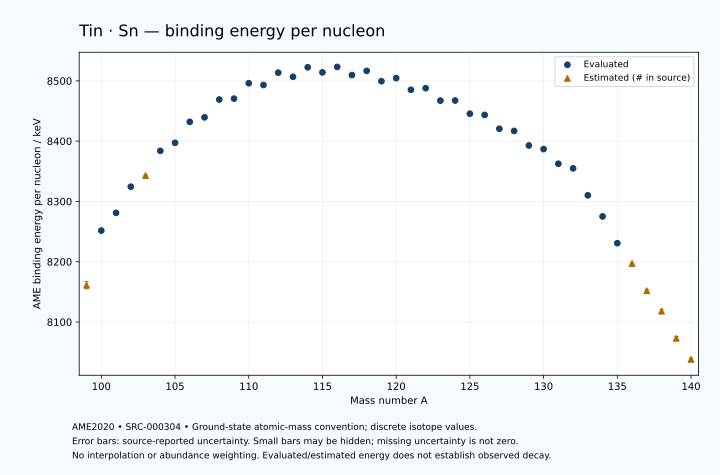

# Tin — Atomic Masses and Reaction Energies

<!-- generated-by: sync-ame2020.mjs -->

**Dated evaluated data · scientific coverage remains partial.** 42 ground-state nuclides from AME2020. Values and uncertainties are transcribed from the retained unrounded analysis files; estimated quantities remain labelled.

- [Parent Tin record](0050-Tin-Sn.md) · [NUBASE states and decays](0050-Tin-Sn-Nuclear-Evaluation.md)
- [Structured data](data/isotopes/0050-Tin-Sn-AME2020-Evaluation.yaml)
- [Original mass table](../../data/catalog/sources/ame2020-mass_1.mas20.txt) · [Original reaction table 1](../../data/catalog/sources/ame2020-rct1.mas20.txt) · [Original reaction table 2](../../data/catalog/sources/ame2020-rct2.mas20.txt)
- [AME2020 methods](https://doi.org/10.1088/1674-1137/abddb0) (SRC-000303) · [Tables and definitions](https://doi.org/10.1088/1674-1137/abddaf) (SRC-000304)

## Reading the data

All table energies and uncertainties are in keV; binding energy is per nucleon. A # replaces a decimal point in the original estimated value. UNKNOWN (*) retains the source's not-calculable entry; it is neither zero nor automatically NOT APPLICABLE. Source lines are one-based in the retained files. Uncertainties remain those published by the evaluation, with no replacement by independent-mass quadrature.

Atomic-mass conventions apply. Qα is total decay energy, not alpha-particle kinetic energy. Positive Q alone does not establish a decay branch, rate or observation. He-4's source Qα of zero is a bookkeeping identity. These tables describe ground-state combinations, not isomer or excited-daughter transitions. Nuclear state and daughter lookups are explicit in the structured companion. The binding quantity follows [Z M(¹H) + N mₙ − M(A,Z)]c²/A; it has not been converted to a bare-nucleus convention.

## Mass and binding table

| Nuclide | N | Atomic mass excess / keV | AME binding per nucleon / keV | Mass-file line |
|---|---:|---|---|---:|
| Sn-99 | 49 | -47976# ± 582# | 8161# ± 6# | 1159 |
| Sn-100 | 50 | -57148.146 ± 240.010 | 8251.6260 ± 2.4001 | 1174 |
| Sn-101 | 51 | -60305.624 ± 300.005 | 8281.1030 ± 2.9703 | 1189 |
| Sn-102 | 52 | -64934.896 ± 100.105 | 8324.4313 ± 0.9814 | 1203 |
| Sn-103 | 53 | -67092# ± 100# | 8343# ± 1# | 1218 |
| Sn-104 | 54 | -71627.057 ± 5.745 | 8383.9114 ± 0.0552 | 1233 |
| Sn-105 | 55 | -73338.001 ± 3.971 | 8397.2290 ± 0.0378 | 1248 |
| Sn-106 | 56 | -77353.698 ± 5.091 | 8432.0383 ± 0.0480 | 1263 |
| Sn-107 | 57 | -78512.239 ± 5.310 | 8439.4946 ± 0.0496 | 1279 |
| Sn-108 | 58 | -82069.949 ± 5.382 | 8469.0273 ± 0.0498 | 1294 |
| Sn-109 | 59 | -82630.180 ± 7.949 | 8470.5183 ± 0.0729 | 1310 |
| Sn-110 | 60 | -85841.993 ± 13.777 | 8496.0875 ± 0.1252 | 1325 |
| Sn-111 | 61 | -85938.581 ± 5.336 | 8493.1310 ± 0.0481 | 1340 |
| Sn-112 | 62 | -88655.049 ± 0.294 | 8513.6189 ± 0.0026 | 1356 |
| Sn-113 | 63 | -88328.129 ± 1.575 | 8506.8117 ± 0.0139 | 1372 |
| Sn-114 | 64 | -90559.735 ± 0.029 | 8522.5671 ± 0.0004 | 1388 |
| Sn-115 | 65 | -90033.846 ± 0.015 | 8514.0702 ± 0.0003 | 1404 |
| Sn-116 | 66 | -91525.979 ± 0.096 | 8523.1166 ± 0.0009 | 1420 |
| Sn-117 | 67 | -90397.742 ± 0.483 | 8509.6120 ± 0.0041 | 1436 |
| Sn-118 | 68 | -91652.843 ± 0.499 | 8516.5341 ± 0.0042 | 1452 |
| Sn-119 | 69 | -90064.985 ± 0.725 | 8499.4494 ± 0.0061 | 1468 |
| Sn-120 | 70 | -91097.741 ± 0.920 | 8504.4880 ± 0.0077 | 1484 |
| Sn-121 | 71 | -89196.626 ± 0.978 | 8485.1964 ± 0.0081 | 1500 |
| Sn-122 | 72 | -89939.953 ± 2.448 | 8487.8968 ± 0.0201 | 1517 |
| Sn-123 | 73 | -87814.683 ± 2.479 | 8467.2313 ± 0.0202 | 1533 |
| Sn-124 | 74 | -88231.475 ± 1.314 | 8467.3997 ± 0.0106 | 1549 |
| Sn-125 | 75 | -85893.657 ± 1.329 | 8445.5285 ± 0.0106 | 1566 |
| Sn-126 | 76 | -86015.135 ± 10.688 | 8443.5227 ± 0.0848 | 1582 |
| Sn-127 | 77 | -83469.578 ± 9.226 | 8420.5482 ± 0.0726 | 1599 |
| Sn-128 | 78 | -83361.430 ± 17.682 | 8416.9749 ± 0.1381 | 1616 |
| Sn-129 | 79 | -80590.597 ± 17.270 | 8392.8161 ± 0.1339 | 1633 |
| Sn-130 | 80 | -80132.217 ± 1.873 | 8386.8170 ± 0.0144 | 1650 |
| Sn-131 | 81 | -77264.579 ± 3.621 | 8362.5183 ± 0.0276 | 1668 |
| Sn-132 | 82 | -76546.554 ± 1.976 | 8354.8726 ± 0.0150 | 1685 |
| Sn-133 | 83 | -70873.890 ± 1.904 | 8310.0890 ± 0.0143 | 1702 |
| Sn-134 | 84 | -66433.759 ± 3.167 | 8275.1719 ± 0.0236 | 1719 |
| Sn-135 | 85 | -60632.252 ± 3.074 | 8230.6877 ± 0.0228 | 1736 |
| Sn-136 | 86 | -56170# ± 200# | 8197# ± 1# | 1753 |
| Sn-137 | 87 | -50150# ± 300# | 8152# ± 2# | 1770 |
| Sn-138 | 88 | -45510# ± 400# | 8118# ± 3# | 1786 |
| Sn-139 | 89 | -39310# ± 400# | 8073# ± 3# | 1803 |
| Sn-140 | 90 | -34490# ± 300# | 8038# ± 2# | 1820 |

## Q-values and separation energies

| Nuclide | Qβ− / keV | Qα / keV | S₂n / keV | S₂p / keV | Reaction-file line |
|---|---|---|---|---|---:|
| Sn-99 | UNKNOWN (*) | -3345# ± 812# | UNKNOWN (*) | 1820# ± 718# | 1158 |
| Sn-100 | UNKNOWN (*) | -4001# ± 475# | UNKNOWN (*) | 4089.6636 ± 245.5359 | 1173 |
| Sn-101 | UNKNOWN (*) | -1996.5133 ± 516.2821 | 28472# ± 655# | 4952.4347 ± 300.0089 | 1188 |
| Sn-102 | -13835# ± 412# | 276.6132 ± 112.7111 | 23929.3856 ± 260.0498 | 5318.2423 ± 100.1185 | 1202 |
| Sn-103 | -10422# ± 316# | 414# ± 100# | 22929# ± 316# | 5834# ± 100# | 1217 |
| Sn-104 | -12332# ± 102# | 142.6223 ± 5.9847 | 22834.7977 ± 100.2692 | 6545.2978 ± 5.9807 | 1232 |
| Sn-105 | -9322.5103 ± 22.1849 | 73.5483 ± 4.2416 | 22388# ± 100# | 7264.3172 ± 4.3644 | 1247 |
| Sn-106 | -10880.3964 ± 9.0249 | -118.9119 ± 5.3555 | 21869.2765 ± 7.6761 | 7963.2484 ± 5.3588 | 1262 |
| Sn-107 | -7858.9903 ± 6.7377 | -285.5283 ± 5.6097 | 21316.8735 ± 6.6303 | 8756.3315 ± 5.4889 | 1278 |
| Sn-108 | -9624.6079 ± 7.6925 | -526.4734 ± 5.6364 | 20858.8874 ± 7.4086 | 9515.7381 ± 5.4944 | 1293 |
| Sn-109 | -6379.1940 ± 8.8074 | -721.2469 ± 8.0700 | 20260.5778 ± 9.5592 | 10217.7971 ± 8.1205 | 1309 |
| Sn-110 | -8392.2480 ± 15.0117 | -1134.7556 ± 13.8213 | 19914.6798 ± 14.7912 | 11167.5121 ± 13.8228 | 1324 |
| Sn-111 | -5101.8340 ± 10.3337 | -1373.1710 ± 5.5887 | 19451.0363 ± 9.5671 | 12012.1923 ± 5.5519 | 1339 |
| Sn-112 | -7056.0760 ± 17.8317 | -1827.5424 ± 1.1545 | 18955.6928 ± 13.7803 | 12885.0218 ± 0.3548 | 1355 |
| Sn-113 | -3911.1637 ± 17.1206 | -2248.7147 ± 2.1976 | 18532.1848 ± 5.5524 | 13653.8244 ± 1.5891 | 1371 |
| Sn-114 | -6063.1189 ± 19.7724 | -2636.6816 ± 0.3805 | 18047.3222 ± 0.2951 | 14562.8200 ± 0.2514 | 1387 |
| Sn-115 | -3030.4336 ± 16.0253 | -3206.5145 ± 0.3575 | 17848.3525 ± 1.5748 | 15568.5015 ± 0.2444 | 1403 |
| Sn-116 | -4703.9591 ± 5.1540 | -3376.0374 ± 0.2664 | 17108.8797 ± 0.0980 | 16088.9870 ± 0.2899 | 1419 |
| Sn-117 | -1758.1788 ± 8.4449 | -3779.3719 ± 0.5399 | 16506.5328 ± 0.4831 | 16891.2048 ± 0.8098 | 1435 |
| Sn-118 | -3656.6393 ± 2.9745 | -4062.8250 ± 0.5688 | 16269.5003 ± 0.4907 | 17518.2963 ± 0.5074 | 1451 |
| Sn-119 | -589.4452 ± 6.9937 | -4405.4207 ± 0.9735 | 15809.8783 ± 0.5595 | 18224.5297 ± 1.2390 | 1467 |
| Sn-120 | -2680.6076 ± 7.1399 | -4810.1677 ± 0.9324 | 15587.5338 ± 1.0157 | 18974.0339 ± 20.0217 | 1483 |
| Sn-121 | 402.5306 ± 2.5239 | -5203.1449 ± 1.4071 | 15274.2776 ± 1.1586 | 19797.6296 ± 37.7032 | 1499 |
| Sn-122 | -1605.7483 ± 3.2135 | -5663.2197 ± 20.1498 | 14984.8482 ± 2.3489 | 20560.5297 ± 4.4582 | 1516 |
| Sn-123 | 1408.2079 ± 2.4203 | -6262.6598 ± 37.7732 | 14760.6926 ± 2.3913 | 21318.7881 ± 3.1494 | 1532 |
| Sn-124 | -612.4067 ± 0.4101 | -6699.0260 ± 3.9507 | 14434.1586 ± 2.4020 | 22197.0333 ± 2.6477 | 1548 |
| Sn-125 | 2361.4366 ± 2.1661 | -7244.7366 ± 2.3532 | 14221.6109 ± 2.4062 | 23057.4161 ± 3.0038 | 1565 |
| Sn-126 | 378.0000 ± 30.0000 | -7827.6671 ± 10.9321 | 13926.2962 ± 10.6066 | 23893.6412 ± 11.0011 | 1581 |
| Sn-127 | 3228.7160 ± 10.1668 | -8480.3104 ± 9.6113 | 13718.5567 ± 9.2949 | 24699.4299 ± 9.6669 | 1598 |
| Sn-128 | 1268.4219 ± 13.3175 | -9086.9092 ± 17.8733 | 13488.9304 ± 20.6600 | 25683.6449 ± 17.8314 | 1615 |
| Sn-129 | 4038.7874 ± 27.3634 | -9667.4226 ± 17.5097 | 13263.6551 ± 19.5797 | 26427.3399 ± 18.3493 | 1632 |
| Sn-130 | 2153.4702 ± 14.1129 | -10301.4055 ± 2.9690 | 12913.4230 ± 17.7808 | 27471.9138 ± 6.6991 | 1649 |
| Sn-131 | 4716.8328 ± 3.9621 | -10948.2956 ± 7.1803 | 12816.6181 ± 17.6455 | 28720.3792 ± 6.4267 | 1667 |
| Sn-132 | 3088.7280 ± 3.1606 | -11733.2244 ± 6.7286 | 12556.9730 ± 2.7224 | 30006.8982 ± 22.4430 | 1684 |
| Sn-133 | 8049.6228 ± 3.6617 | -10176.6645 ± 5.6406 | 9751.9477 ± 4.0910 | 30240.0721 ± 19.3324 | 1701 |
| Sn-134 | 7585.2453 ± 4.4136 | -7741.0770 ± 22.5791 | 6029.8413 ± 3.7328 | 30546.2715 ± 60.1510 | 1718 |
| Sn-135 | 9058.0800 ± 4.0522 | -7845.4077 ± 19.4825 | 5900.9980 ± 3.6158 | 31070# ± 200# | 1735 |
| Sn-136 | 8337# ± 200# | -8130# ± 209# | 5879# ± 200# | 31288# ± 361# | 1752 |
| Sn-137 | 9911# ± 304# | -8435# ± 361# | 5660# ± 300# | 31907# ± 500# | 1769 |
| Sn-138 | 9140# ± 500# | -8475# ± 500# | 5483# ± 447# | UNKNOWN (*) | 1785 |
| Sn-139 | 10740# ± 565# | -8915# ± 565# | 5303# ± 500# | UNKNOWN (*) | 1802 |
| Sn-140 | 9900# ± 671# | UNKNOWN (*) | 5123# ± 500# | UNKNOWN (*) | 1819 |

## Additional decay-energy combinations

| Nuclide | Q₂β− / keV | Q₄β− / keV | Qεp / keV | Qβ−n / keV | Part 1 / part 2 line |
|---|---|---|---|---|---|
| Sn-99 | UNKNOWN (*) | UNKNOWN (*) | 12371# ± 584# | UNKNOWN (*) | 1158 / 1175 |
| Sn-100 | UNKNOWN (*) | UNKNOWN (*) | 5494.0146 ± 240.0156 | UNKNOWN (*) | 1173 / 1190 |
| Sn-101 | UNKNOWN (*) | UNKNOWN (*) | 6599.9999 ± 300.0000 | UNKNOWN (*) | 1188 / 1205 |
| Sn-102 | UNKNOWN (*) | UNKNOWN (*) | 3612.5989 ± 100.1156 | UNKNOWN (*) | 1202 / 1219 |
| Sn-103 | UNKNOWN (*) | UNKNOWN (*) | 5278# ± 100# | -24064# ± 412# | 1217 / 1235 |
| Sn-104 | -22000.2266 ± 317.6614 | UNKNOWN (*) | 1735.5980 ± 6.0235 | -23028# ± 300# | 1232 / 1250 |
| Sn-105 | -20526.4928 ± 300.0460 | UNKNOWN (*) | 3341.4188 ± 4.3091 | -22115# ± 102# | 1247 / 1265 |
| Sn-106 | -19133.9387 ± 100.6694 | UNKNOWN (*) | -308.8192 ± 5.2778 | -21409.5245 ± 22.4125 | 1262 / 1280 |
| Sn-107 | -17855# ± 101# | UNKNOWN (*) | 1330.9430 ± 5.4230 | -20110.2557 ± 9.1500 | 1278 / 1296 |
| Sn-108 | -16288.2725 ± 7.6321 | -39437.5923 ± 379.5353 | -2368.5944 ± 5.6326 | -19488.0184 ± 6.7952 | 1293 / 1312 |
| Sn-109 | -14914.7811 ± 9.0770 | -36460.6341 ± 300.2129 | -666.7289 ± 8.0272 | -18256.1576 ± 9.6639 | 1309 / 1328 |
| Sn-110 | -13612.1720 ± 15.2657 | -33919.3561 ± 101.9237 | -4626.6331 ± 13.8625 | -17662.3241 ± 14.7489 | 1324 / 1343 |
| Sn-111 | -12351.0937 ± 8.3539 | -31419# ± 116# | -2879.5822 ± 5.3401 | -16560.1542 ± 8.0011 | 1339 / 1358 |
| Sn-112 | -11087.5311 ± 8.3886 | -28628.7016 ± 8.2878 | -6691.7732 ± 0.3237 | -15889.6206 ± 8.8541 | 1355 / 1374 |
| Sn-113 | -9981.0918 ± 27.9892 | -26124.5030 ± 7.0185 | -5042.2430 ± 1.5650 | -14800.4742 ± 17.8987 | 1371 / 1391 |
| Sn-114 | -8670.0588 ± 24.4282 | -23473.8365 ± 11.1780 | -8805.4199 ± 0.2457 | -14214.0878 ± 17.1929 | 1387 / 1407 |
| Sn-115 | -7971.0783 ± 27.9448 | -21377.0885 ± 12.1094 | -7307.8829 ± 0.2763 | -13608.5475 ± 19.7724 | 1403 / 1423 |
| Sn-116 | -6262.1863 ± 24.2060 | -18479.1015 ± 13.0175 | -10730.4702 ± 0.6573 | -12593.8847 ± 16.0256 | 1419 / 1439 |
| Sn-117 | -5302.2421 ± 13.4618 | -16212.3956 ± 10.3897 | -8974.2246 ± 0.4916 | -11647.0407 ± 5.1764 | 1435 / 1456 |
| Sn-118 | -3962.0852 ± 18.3121 | -13573.7759 ± 10.3905 | -12523.4171 ± 1.1214 | -11084.5975 ± 8.4458 | 1451 / 1472 |
| Sn-119 | -2882.4452 ± 7.2741 | -11270.4965 ± 10.4038 | -10652.3067 ± 20.0134 | -10140.0989 ± 3.0241 | 1467 / 1488 |
| Sn-120 | -1735.5805 ± 1.7575 | -8925.3065 ± 11.8532 | -14409.7732 ± 37.7017 | -9693.5194 ± 7.0529 | 1483 / 1504 |
| Sn-121 | -653.5155 ± 25.8366 | -6715.6295 ± 10.2893 | -12528.2318 ± 3.8523 | -8850.8110 ± 7.1480 | 1499 / 1521 |
| Sn-122 | 373.3289 ± 2.4254 | -4584.9648 ± 11.3775 | -16155.0874 ± 3.1249 | -8412.1142 ± 3.2160 | 1516 / 1538 |
| Sn-123 | 1356.2951 ± 2.4196 | -2566.4249 ± 9.8096 | -14491.2694 ± 3.3810 | -7551.7960 ± 3.2113 | 1532 / 1554 |
| Sn-124 | 2292.6663 ± 0.3885 | -564.0705 ± 0.4098 | -18106.2632 ± 2.9971 | -7079.9030 ± 0.4053 | 1548 / 1570 |
| Sn-125 | 3128.1366 ± 0.4380 | 1305.7034 ± 0.6064 | -16483.1920 ± 2.9265 | -6345.9066 ± 0.4563 | 1565 / 1588 |
| Sn-126 | 4049.0321 ± 10.6141 | 3131.2514 ± 10.6876 | -19956.0165 ± 11.0709 | -5831.3597 ± 10.8237 | 1581 / 1604 |
| Sn-127 | 4810.9190 ± 9.2977 | 4851.3053 ± 10.0752 | -18502.8219 ± 9.5088 | -5147.7604 ± 33.1490 | 1598 / 1621 |
| Sn-128 | 5632.3638 ± 17.6841 | 6499.1045 ± 17.6819 | -21909.2018 ± 18.7375 | -4734.4540 ± 18.3969 | 1615 / 1638 |
| Sn-129 | 6414.2874 ± 17.2846 | 8105.4729 ± 17.2700 | -20641.3228 ± 18.4289 | -4032.0632 ± 25.5191 | 1632 / 1656 |
| Sn-130 | 7220.7430 ± 1.8730 | 9748.2577 ± 1.8729 | -24299.0461 ± 5.6302 | -3574.1506 ± 21.3076 | 1649 / 1673 |
| Sn-131 | 7946.4427 ± 3.6215 | 11148.9961 ± 3.6210 | -23435.9524 ± 22.6472 | -3050.2100 ± 14.6664 | 1667 / 1691 |
| Sn-132 | 8641.6435 ± 4.0072 | 12732.4210 ± 1.9758 | -28623.7642 ± 19.3396 | -2636.4600 ± 2.8715 | 1684 / 1708 |
| Sn-133 | 12063.2425 ± 2.8096 | 16769.6927 ± 3.0635 | -27697.4321 ± 60.0977 | 690.0732 ± 3.1162 | 1701 / 1726 |
| Sn-134 | 16099.9936 ± 4.1920 | 21692.0758 ± 3.1671 | -29583# ± 200# | 4418.4363 ± 4.4513 | 1718 / 1743 |
| Sn-135 | 17096.5380 ± 3.5235 | 25781.1125 ± 4.7861 | -28461# ± 300# | 5315.4337 ± 4.3472 | 1735 / 1760 |
| Sn-136 | 18255# ± 200# | 30259# ± 200# | -30639# ± 447# | 5449# ± 200# | 1752 / 1777 |
| Sn-137 | 19154# ± 300# | 32234# ± 300# | UNKNOWN (*) | 6286# ± 300# | 1769 / 1795 |
| Sn-138 | 20186# ± 400# | 34462# ± 400# | UNKNOWN (*) | 6479# ± 403# | 1785 / 1811 |
| Sn-139 | 20895# ± 400# | 36335# ± 400# | UNKNOWN (*) | 7269# ± 500# | 1802 / 1828 |
| Sn-140 | 21877# ± 300# | 38496# ± 300# | UNKNOWN (*) | 7488# ± 500# | 1819 / 1845 |

## Single-nucleon separation and reaction energies

| Nuclide | Sₙ / keV | Sₚ / keV | Q(d,α) / keV | Q(p,α) / keV | Q(n,α) / keV | Part 2 line |
|---|---|---|---|---|---|---:|
| Sn-99 | UNKNOWN (*) | 1359# ± 657# | 10124# ± 707# | -5022# ± 768# | 13242# ± 712# | 1175 |
| Sn-100 | 17243# ± 630# | 3061# ± 383# | 7469# ± 388# | -4894# ± 467# | 9232.2830 ± 483.8899 | 1190 |
| Sn-101 | 11228.7963 ± 384.1976 | 3416.4493 ± 300.0130 | 11781# ± 423# | -1535# ± 427# | 12977.2025 ± 304.4433 | 1205 |
| Sn-102 | 12700.5893 ± 316.2653 | 3678.9653 ± 100.7815 | 9954.0576 ± 100.1295 | 1305# ± 314# | 10642.6384 ± 100.1170 | 1219 |
| Sn-103 | 10229# ± 142# | 3686# ± 101# | 12163# ± 101# | 1950# ± 100# | 12749# ± 100# | 1235 |
| Sn-104 | 12606# ± 101# | 4283.6312 ± 10.6608 | 9778.6454 ± 7.3428 | 1781.8994 ± 13.0003 | 9855.8106 ± 5.9352 | 1250 |
| Sn-105 | 9782.2623 ± 6.9839 | 4444.2978 ± 7.0088 | 12005.2026 ± 9.8193 | 2220.9494 ± 6.0565 | 11968.1023 ± 4.3051 | 1265 |
| Sn-106 | 12087.0142 ± 6.4566 | 5002.0865 ± 11.4415 | 9539.7841 ± 7.6988 | 2142.7547 ± 10.3231 | 8944.3309 ± 5.4033 | 1280 |
| Sn-107 | 9229.8593 ± 7.3559 | 5193.0601 ± 13.3295 | 11839.1504 ± 11.5404 | 2534.4910 ± 7.8450 | 11102.5547 ± 5.5668 | 1296 |
| Sn-108 | 11629.0281 ± 7.5605 | 5792.2530 ± 11.0528 | 9249.0079 ± 13.3587 | 2434.6885 ± 11.5741 | 7910.3028 ± 5.5595 | 1312 |
| Sn-109 | 8631.5497 ± 9.5998 | 5799.3233 ± 11.7408 | 11647.2935 ± 12.5052 | 2842.0244 ± 14.5833 | 10148.3746 ± 8.0253 | 1328 |
| Sn-110 | 11283.1301 ± 15.9059 | 6641.4378 ± 14.3375 | 8988.6427 ± 16.2628 | 2588.7296 ± 16.8227 | 6794.7351 ± 13.8768 | 1343 |
| Sn-111 | 8167.9061 ± 14.7745 | 6757.5822 ± 12.7220 | 11261.7522 ± 6.6536 | 3045.3028 ± 10.1555 | 8960.2442 ± 5.4519 | 1358 |
| Sn-112 | 10787.7866 ± 5.3283 | 7551.9704 ± 3.4299 | 8525.7273 ± 11.5525 | 2698.5318 ± 3.9850 | 5495.6835 ± 1.5599 | 1374 |
| Sn-113 | 7744.3982 ± 1.5617 | 7626.9736 ± 4.5208 | 10774.7275 ± 3.7630 | 3005.8954 ± 11.6567 | 7666.2424 ± 1.5954 | 1391 |
| Sn-114 | 10302.9240 ± 1.5749 | 8481.5829 ± 0.1898 | 8141.1985 ± 4.2508 | 2696.3698 ± 3.4239 | 4338.9140 ± 0.3583 | 1407 |
| Sn-115 | 7545.4285 ± 0.0250 | 8753.0096 ± 0.3011 | 10044.0847 ± 0.1883 | 2820.3362 ± 4.2507 | 6187.4138 ± 0.2503 | 1423 |
| Sn-116 | 9563.4512 ± 0.0948 | 9278.5934 ± 0.0953 | 7754.6353 ± 0.3154 | 2705.1998 ± 0.2103 | 3163.7098 ± 0.2602 | 1439 |
| Sn-117 | 6943.0816 ± 0.4743 | 9436.9550 ± 0.5309 | 9849.4212 ± 0.4832 | 3036.1199 ± 0.5688 | 5263.5937 ± 0.5548 | 1456 |
| Sn-118 | 9326.4187 ± 0.1299 | 9998.7790 ± 4.8582 | 7307.7224 ± 0.5456 | 2747.5687 ± 0.4992 | 2078.0389 ± 0.8195 | 1472 |
| Sn-119 | 6483.4596 ± 0.5455 | 10125.7790 ± 7.7203 | 9588.8576 ± 4.8887 | 3048.8290 ± 0.7580 | 4293.9065 ± 0.7315 | 1488 |
| Sn-120 | 9104.0742 ± 1.1098 | 10688.0535 ± 7.2528 | 6841.2430 ± 7.7982 | 2709.3496 ± 4.9610 | 967.0584 ± 1.3673 | 1504 |
| Sn-121 | 6170.2034 ± 0.3394 | 10757.8564 ± 40.0014 | 9212.8393 ± 7.2607 | 2895.6058 ± 7.8053 | 3151.4251 ± 20.0245 | 1521 |
| Sn-122 | 8814.6449 ± 2.3436 | 11394.3310 ± 27.3094 | 6498.5949 ± 40.0689 | 2622.7607 ± 7.6234 | -316.6121 ± 37.7710 | 1538 |
| Sn-123 | 5946.0478 ± 1.1550 | 11532.2929 ± 50.0133 | 8730.7174 ± 27.3338 | 2777.1134 ± 40.0716 | 1789.0849 ± 4.4754 | 1554 |
| Sn-124 | 8488.1109 ± 2.3979 | 12091.4128 ± 19.8311 | 6050.6924 ± 50.0577 | 2467.1728 ± 27.4149 | -1511.2367 ± 2.3447 | 1570 |
| Sn-125 | 5733.5000 ± 0.2000 | 12314.8500 ± 30.5675 | 8246.1834 ± 19.8321 | 2541.7587 ± 50.0581 | 365.1291 ± 2.6553 | 1588 |
| Sn-126 | 8192.7963 ± 10.6085 | 12891.7988 ± 10.8332 | 5563.4499 ± 32.3548 | 2277.9533 ± 22.4894 | -2954.5500 ± 11.0219 | 1604 |
| Sn-127 | 5525.7604 ± 14.1016 | 12949.1719 ± 10.1332 | 7653.5370 ± 9.3938 | 2262.2557 ± 31.9198 | -1123.7392 ± 9.5872 | 1621 |
| Sn-128 | 7963.1700 ± 19.9438 | 13770.5040 ± 20.3145 | 5158.7543 ± 18.1720 | 1914.9332 ± 17.7703 | -4366.9375 ± 17.9162 | 1638 |
| Sn-129 | 5300.4851 ± 24.7164 | 13689.4512 ± 17.3205 | 7000.1070 ± 19.9570 | 2082.8354 ± 17.7714 | -2688.4676 ± 17.4230 | 1656 |
| Sn-130 | 7612.9379 ± 17.3712 | 14586.2990 ± 2.7192 | 4768.7070 ± 2.2927 | 1611.7353 ± 10.1753 | -5744.6155 ± 6.4771 | 1673 |
| Sn-131 | 5203.6802 ± 4.0767 | 14647.0202 ± 4.0391 | 6281.1170 ± 4.1228 | 1789.5931 ± 3.8549 | -4379.9316 ± 7.3812 | 1691 |
| Sn-132 | 7353.2928 ± 4.1249 | 15811.1554 ± 2.9610 | 4070.7832 ± 2.6658 | 1152.3904 ± 2.7910 | -7778.0097 ± 5.6652 | 1708 |
| Sn-133 | 2398.6548 ± 2.7438 | 15751.3079 ± 60.0627 | 7861.2859 ± 2.9136 | 3896.6946 ± 2.6130 | -4109.8906 ± 22.4368 | 1726 |
| Sn-134 | 3631.1864 ± 3.6953 | 16033# ± 200# | 6688.6019 ± 60.1160 | 6454.6658 ± 3.8593 | -5575.5961 ± 19.4974 | 1743 |
| Sn-135 | 2269.8116 ± 4.4136 | 15951# ± 200# | 7769# ± 200# | 6643.3565 ± 60.1112 | -4520.4208 ± 60.1461 | 1760 |
| Sn-136 | 3609# ± 200# | 16349# ± 361# | 6511# ± 283# | 6384# ± 283# | -6384# ± 283# | 1777 |
| Sn-137 | 2051# ± 361# | 16469# ± 424# | 7671# ± 424# | 6684# ± 361# | -5043# ± 424# | 1795 |
| Sn-138 | 3432# ± 500# | 16969# ± 565# | 6171# ± 500# | 6464# ± 500# | -7043# ± 565# | 1811 |
| Sn-139 | 1871# ± 565# | UNKNOWN (*) | 7231# ± 565# | 6524# ± 500# | UNKNOWN (*) | 1828 |
| Sn-140 | 3252# ± 500# | UNKNOWN (*) | UNKNOWN (*) | 6204# ± 500# | UNKNOWN (*) | 1845 |

Qβ− comes from the mass-file line in the first table. Qα, S₂n, S₂p, Q₂β−, Qεp and Qβ−n come from reaction part 1; Q₄β− and the last table come from part 2. Qεp is electron-capture/proton energy balance; Qβ−n is beta-minus/neutron energy balance. These are evaluated mass combinations, not observations of decay modes, cross sections or reaction rates. Light-nuclide zero entries can be bookkeeping identities, without a physical A=0 residual. Definitions and original source strings are retained in the structured data.

## Binding-energy chart

Discrete source values and source-reported uncertainties. No interpolation, natural-abundance weighting or observed-decay claim is implied. This quantitative chart supplements the 22 separate illustrative panels.

## Remaining review

Later measurements, state-specific decay branches, isomer Q-values, reaction rates, applicability and full claim-level review remain open. Existing authored values retain their own provenance; this companion does not overwrite them.
