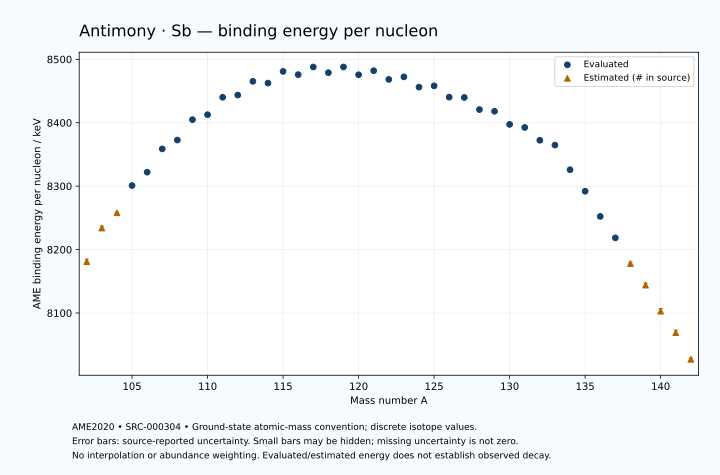

# Antimony — Atomic Masses and Reaction Energies

<!-- generated-by: sync-ame2020.mjs -->

**Dated evaluated data · scientific coverage remains partial.** 41 ground-state nuclides from AME2020. Values and uncertainties are transcribed from the retained unrounded analysis files; estimated quantities remain labelled.

- [Parent Antimony record](0051-Antimony-Sb.md) · [NUBASE states and decays](0051-Antimony-Sb-Nuclear-Evaluation.md)
- [Structured data](data/isotopes/0051-Antimony-Sb-AME2020-Evaluation.yaml)
- [Original mass table](../../data/catalog/sources/ame2020-mass_1.mas20.txt) · [Original reaction table](../../data/catalog/sources/ame2020-rct1.mas20.txt)
- [AME2020 methods](https://doi.org/10.1088/1674-1137/abddb0) (SRC-000303) · [Tables and definitions](https://doi.org/10.1088/1674-1137/abddaf) (SRC-000304)

## Reading the data

All table energies and uncertainties are in keV; binding energy is per nucleon. A # replaces a decimal point in the original estimated value. UNKNOWN (*) retains the source's not-calculable entry; it is neither zero nor automatically NOT APPLICABLE. Source lines are one-based in the retained files. Uncertainties remain those published by the evaluation, with no replacement by independent-mass quadrature.

Atomic-mass conventions apply. Qα is total decay energy, not alpha-particle kinetic energy. Positive Q alone does not establish a decay branch, rate or observation. He-4's source Qα of zero is a bookkeeping identity. These tables describe ground-state combinations, not isomer or excited-daughter transitions. Nuclear state and daughter lookups are explicit in the structured companion. The binding quantity follows [Z M(¹H) + N mₙ − M(A,Z)]c²/A; it has not been converted to a bare-nucleus convention.

## Mass and binding table

| Nuclide | N | Atomic mass excess / keV | AME binding per nucleon / keV | Mass-file line |
|---|---:|---|---|---:|
| Sb-102 | 51 | -51100# ± 400# | 8181# ± 4# | 1204 |
| Sb-103 | 52 | -56670# ± 300# | 8234# ± 3# | 1219 |
| Sb-104 | 53 | -59295# ± 101# | 8258# ± 1# | 1234 |
| Sb-105 | 54 | -64015.491 ± 21.827 | 8300.9923 ± 0.2079 | 1249 |
| Sb-106 | 55 | -66473.301 ± 7.452 | 8322.0124 ± 0.0703 | 1264 |
| Sb-107 | 56 | -70653.248 ± 4.148 | 8358.7344 ± 0.0388 | 1280 |
| Sb-108 | 57 | -72445.341 ± 5.496 | 8372.6666 ± 0.0509 | 1295 |
| Sb-109 | 58 | -76250.986 ± 5.265 | 8404.8161 ± 0.0483 | 1311 |
| Sb-110 | 59 | -77449.745 ± 5.962 | 8412.6821 ± 0.0542 | 1326 |
| Sb-111 | 60 | -80836.747 ± 8.849 | 8440.1203 ± 0.0797 | 1341 |
| Sb-112 | 61 | -81598.973 ± 17.829 | 8443.6330 ± 0.1592 | 1357 |
| Sb-113 | 62 | -84416.966 ± 17.193 | 8465.2762 ± 0.1521 | 1373 |
| Sb-114 | 63 | -84496.616 ± 19.772 | 8462.5191 ± 0.1734 | 1389 |
| Sb-115 | 64 | -87003.412 ± 16.025 | 8480.9156 ± 0.1394 | 1405 |
| Sb-116 | 65 | -86822.020 ± 5.154 | 8475.8208 ± 0.0444 | 1421 |
| Sb-117 | 66 | -88639.564 ± 8.437 | 8487.8981 ± 0.0721 | 1437 |
| Sb-118 | 67 | -87996.204 ± 3.016 | 8478.9156 ± 0.0256 | 1453 |
| Sb-119 | 68 | -89475.539 ± 6.998 | 8487.9218 ± 0.0588 | 1469 |
| Sb-120 | 69 | -88417.133 ± 7.199 | 8475.6300 ± 0.0600 | 1485 |
| Sb-121 | 70 | -89599.157 ± 2.506 | 8482.0574 ± 0.0207 | 1501 |
| Sb-122 | 71 | -88334.205 ± 2.503 | 8468.3222 ± 0.0205 | 1518 |
| Sb-123 | 72 | -89222.890 ± 1.356 | 8472.3196 ± 0.0110 | 1534 |
| Sb-124 | 73 | -87619.069 ± 1.358 | 8456.1517 ± 0.0110 | 1550 |
| Sb-125 | 74 | -88255.094 ± 2.515 | 8458.1612 ± 0.0201 | 1567 |
| Sb-126 | 75 | -86393.135 ± 31.847 | 8440.3136 ± 0.2528 | 1583 |
| Sb-127 | 76 | -86698.294 ± 5.083 | 8439.8110 ± 0.0400 | 1600 |
| Sb-128 | 77 | -84629.852 ± 18.788 | 8420.7724 ± 0.1468 | 1617 |
| Sb-129 | 78 | -84629.384 ± 21.225 | 8418.0598 ± 0.1645 | 1634 |
| Sb-130 | 79 | -82285.687 ± 14.212 | 8397.3641 ± 0.1093 | 1651 |
| Sb-131 | 80 | -81981.412 ± 2.084 | 8392.5525 ± 0.0159 | 1669 |
| Sb-132 | 81 | -79635.282 ± 2.467 | 8372.3452 ± 0.0187 | 1686 |
| Sb-133 | 82 | -78923.513 ± 3.128 | 8364.7302 ± 0.0235 | 1703 |
| Sb-134 | 83 | -74019.004 ± 3.074 | 8325.9398 ± 0.0229 | 1720 |
| Sb-135 | 84 | -69690.332 ± 2.640 | 8291.9894 ± 0.0196 | 1737 |
| Sb-136 | 85 | -64506.890 ± 5.830 | 8252.2533 ± 0.0429 | 1754 |
| Sb-137 | 86 | -60060.392 ± 52.164 | 8218.4764 ± 0.3808 | 1771 |
| Sb-138 | 87 | -54650# ± 300# | 8178# ± 2# | 1787 |
| Sb-139 | 88 | -50050# ± 400# | 8144# ± 3# | 1804 |
| Sb-140 | 89 | -44390# ± 600# | 8103# ± 4# | 1821 |
| Sb-141 | 90 | -39540# ± 500# | 8069# ± 4# | 1838 |
| Sb-142 | 91 | -33610# ± 300# | 8027# ± 2# | 1855 |

## Q-values and separation energies

| Nuclide | Qβ− / keV | Qα / keV | S₂n / keV | S₂p / keV | Reaction-file line |
|---|---|---|---|---|---:|
| Sb-102 | UNKNOWN (*) | 382# ± 502# | UNKNOWN (*) | 1500# ± 400# | 1203 |
| Sb-103 | UNKNOWN (*) | 2281# ± 423# | UNKNOWN (*) | 2703# ± 300# | 1218 |
| Sb-104 | -9668# ± 333# | 2458# ± 101# | 24337# ± 412# | 3178# ± 102# | 1233 |
| Sb-105 | -11203.9825 ± 300.8126 | 2104.4944 ± 24.7468 | 23488# ± 301# | 3961.0362 ± 23.6019 | 1248 |
| Sb-106 | -8253.5423 ± 100.8163 | 1796.6786 ± 8.7432 | 23321# ± 102# | 4868.5687 ± 9.4279 | 1263 |
| Sb-107 | -9996# ± 101# | 1554.2327 ± 9.8921 | 22780.3935 ± 22.2172 | 5590.6085 ± 11.0542 | 1279 |
| Sb-108 | -6663.6646 ± 7.7125 | 1312.4179 ± 7.9723 | 22114.6758 ± 9.2594 | 6415.1333 ± 13.4048 | 1294 |
| Sb-109 | -8535.5871 ± 6.8502 | 964.6798 ± 11.5200 | 21740.3741 ± 6.7026 | 7262.2617 ± 10.9961 | 1310 |
| Sb-110 | -5219.9240 ± 8.8753 | 733.4893 ± 13.6024 | 21147.0398 ± 8.1083 | 7907.8584 ± 10.4981 | 1325 |
| Sb-111 | -7249.2597 ± 10.9370 | 305.0044 ± 13.0959 | 20728.3963 ± 10.2970 | 8925.1630 ± 9.6986 | 1340 |
| Sb-112 | -4031.4550 ± 19.7019 | 95.9392 ± 19.8130 | 20291.8647 ± 18.7996 | 9706.9458 ± 21.2453 | 1356 |
| Sb-113 | -6069.9281 ± 32.8102 | -352.3556 ± 17.6457 | 19722.8551 ± 19.3366 | 10602.8579 ± 17.5293 | 1372 |
| Sb-114 | -2606.9398 ± 31.4275 | -451.5627 ± 22.9004 | 19040.2793 ± 26.6239 | 11084.4317 ± 20.2242 | 1388 |
| Sb-115 | -4940.6447 ± 32.2137 | -1036.2782 ± 16.3870 | 18729.0827 ± 23.5033 | 12214.2308 ± 16.0264 | 1404 |
| Sb-116 | -1558.2272 ± 24.7485 | -1256.8089 ± 6.6813 | 18468.0396 ± 20.4332 | 12830.1548 ± 5.1632 | 1420 |
| Sb-117 | -3544.0634 ± 13.0785 | -1697.3561 ± 8.4388 | 17778.7876 ± 18.1105 | 13681.1492 ± 8.4367 | 1436 |
| Sb-118 | -305.4459 ± 18.5521 | -1851.3124 ± 3.0310 | 17316.8201 ± 5.9716 | 14324.3874 ± 3.0241 | 1452 |
| Sb-119 | -2293.0000 ± 2.0000 | -2364.0987 ± 6.9982 | 16978.6119 ± 10.9579 | 15110.4464 ± 8.5098 | 1468 |
| Sb-120 | 945.0271 ± 7.3530 | -2592.2906 ± 7.2023 | 16563.5656 ± 7.8011 | 15766.8986 ± 10.5731 | 1484 |
| Sb-121 | -1056.0462 ± 25.7587 | -3081.0375 ± 5.4839 | 16266.2534 ± 7.4308 | 16478.4405 ± 7.6726 | 1500 |
| Sb-122 | 1979.0772 ± 2.1265 | -3530.9438 ± 8.1422 | 16059.7075 ± 7.5654 | 17184.4060 ± 40.0781 | 1517 |
| Sb-123 | -51.9128 ± 0.0661 | -3949.1480 ± 7.3794 | 15766.3699 ± 2.1314 | 17966.2397 ± 27.4169 | 1533 |
| Sb-124 | 2905.0730 ± 0.1317 | -4316.2439 ± 40.0233 | 15427.5003 ± 2.1284 | 18625.6501 ± 50.0588 | 1549 |
| Sb-125 | 766.7000 ± 2.1213 | -4845.4168 ± 27.4986 | 15174.8395 ± 2.1247 | 19404.0024 ± 19.9470 | 1566 |
| Sb-126 | 3671.0321 ± 31.8223 | -5246.6906 ± 59.3150 | 14916.7029 ± 31.8224 | 20103.2992 ± 44.1229 | 1582 |
| Sb-127 | 1582.2030 ± 4.9102 | -5694.1761 ± 20.4319 | 14585.8361 ± 5.3521 | 20863.9282 ± 5.3826 | 1599 |
| Sb-128 | 4363.9419 ± 18.7862 | -6186.9891 ± 35.8734 | 14379.3523 ± 36.9749 | 21398.4167 ± 19.2495 | 1616 |
| Sb-129 | 2375.5000 ± 21.2132 | -6641.9923 ± 21.2988 | 14073.7265 ± 21.8230 | 22327.4295 ± 23.4634 | 1633 |
| Sb-130 | 5067.2728 ± 14.2124 | -6901.2257 ± 14.8177 | 13798.4713 ± 23.5577 | 22673.5123 ± 14.2738 | 1650 |
| Sb-131 | 3229.6099 ± 2.0845 | -7526.4307 ± 10.2162 | 13494.6636 ± 21.3271 | 23724.4650 ± 2.8684 | 1668 |
| Sb-132 | 5552.9155 ± 4.2708 | -7870.0808 ± 2.7990 | 13492.2309 ± 14.4249 | 24306.6940 ± 3.0477 | 1685 |
| Sb-133 | 4013.6198 ± 3.5179 | -8513.5402 ± 3.6972 | 13084.7376 ± 3.7583 | 25477.0860 ± 3.8271 | 1702 |
| Sb-134 | 8514.7483 ± 4.1221 | -6537.3901 ± 3.5569 | 10526.3585 ± 3.9414 | 26185.3925 ± 60.1112 | 1719 |
| Sb-135 | 8038.4581 ± 3.1524 | -4090.8788 ± 3.4402 | 6909.4552 ± 4.0932 | 26578# ± 200# | 1736 |
| Sb-136 | 9918.3897 ± 6.2599 | -4520.2518 ± 60.3149 | 6630.5217 ± 6.5903 | 27115# ± 200# | 1753 |
| Sb-137 | 9243.3698 ± 52.2059 | -4795# ± 207# | 6512.6963 ± 52.2304 | 27528# ± 304# | 1770 |
| Sb-138 | 11046# ± 300# | -5105# ± 361# | 6286# ± 300# | 28258# ± 424# | 1786 |
| Sb-139 | 10155# ± 400# | -5365# ± 500# | 6132# ± 403# | 28798# ± 565# | 1803 |
| Sb-140 | 11977# ± 600# | -5845# ± 671# | 5883# ± 671# | UNKNOWN (*) | 1820 |
| Sb-141 | 11129# ± 640# | -6135# ± 640# | 5633# ± 640# | UNKNOWN (*) | 1837 |
| Sb-142 | 12939# ± 583# | UNKNOWN (*) | 5362# ± 671# | UNKNOWN (*) | 1854 |

Qβ− comes from the mass-file line in the first table. The other three columns come from the reaction-file line. Definitions and original source strings are retained in the structured data.

## Binding-energy chart

Discrete source values and source-reported uncertainties. No interpolation, natural-abundance weighting or observed-decay claim is implied. This quantitative chart supplements the 22 separate illustrative panels.

## Remaining review

Later measurements, state-specific decay branches, isomer Q-values, additional reaction channels and full claim-level review remain open. Existing authored values retain their own provenance; this companion does not overwrite them.
