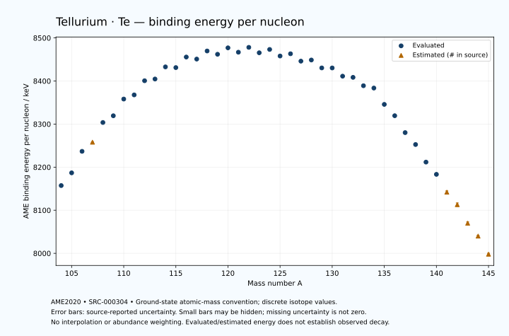

# Tellurium — Atomic Masses and Reaction Energies

<!-- generated-by: sync-ame2020.mjs -->

**Dated evaluated data · scientific coverage remains partial.** 42 ground-state nuclides from AME2020. Values and uncertainties are transcribed from the retained unrounded analysis files; estimated quantities remain labelled.

- [Parent Tellurium record](0052-Tellurium-Te.md) · [NUBASE states and decays](0052-Tellurium-Te-Nuclear-Evaluation.md)
- [Structured data](data/isotopes/0052-Tellurium-Te-AME2020-Evaluation.yaml)
- [Original mass table](../../data/catalog/sources/ame2020-mass_1.mas20.txt) · [Original reaction table 1](../../data/catalog/sources/ame2020-rct1.mas20.txt) · [Original reaction table 2](../../data/catalog/sources/ame2020-rct2.mas20.txt)
- [AME2020 methods](https://doi.org/10.1088/1674-1137/abddb0) (SRC-000303) · [Tables and definitions](https://doi.org/10.1088/1674-1137/abddaf) (SRC-000304)

## Reading the data

All table energies and uncertainties are in keV; binding energy is per nucleon. A # replaces a decimal point in the original estimated value. UNKNOWN (*) retains the source's not-calculable entry; it is neither zero nor automatically NOT APPLICABLE. Source lines are one-based in the retained files. Uncertainties remain those published by the evaluation, with no replacement by independent-mass quadrature.

Atomic-mass conventions apply. Qα is total decay energy, not alpha-particle kinetic energy. Positive Q alone does not establish a decay branch, rate or observation. He-4's source Qα of zero is a bookkeeping identity. These tables describe ground-state combinations, not isomer or excited-daughter transitions. Nuclear state and daughter lookups are explicit in the structured companion. The binding quantity follows [Z M(¹H) + N mₙ − M(A,Z)]c²/A; it has not been converted to a bare-nucleus convention.

## Mass and binding table

| Nuclide | N | Atomic mass excess / keV | AME binding per nucleon / keV | Mass-file line |
|---|---:|---|---|---:|
| Te-104 | 52 | -49626.831 ± 317.609 | 8157.3256 ± 3.0539 | 1235 |
| Te-105 | 53 | -52811.509 ± 300.020 | 8186.8368 ± 2.8573 | 1250 |
| Te-106 | 54 | -58219.759 ± 100.541 | 8236.7682 ± 0.9485 | 1265 |
| Te-107 | 55 | -60657# ± 101# | 8258# ± 1# | 1281 |
| Te-108 | 56 | -65781.676 ± 5.411 | 8303.7221 ± 0.0501 | 1296 |
| Te-109 | 57 | -67715.399 ± 4.382 | 8319.3305 ± 0.0402 | 1312 |
| Te-110 | 58 | -72229.821 ± 6.575 | 8358.1160 ± 0.0598 | 1327 |
| Te-111 | 59 | -73587.487 ± 6.427 | 8367.7635 ± 0.0579 | 1342 |
| Te-112 | 60 | -77567.518 ± 8.383 | 8400.6527 ± 0.0749 | 1358 |
| Te-113 | 61 | -78347.037 ± 27.945 | 8404.6366 ± 0.2473 | 1374 |
| Te-114 | 62 | -81889.676 ± 24.428 | 8432.7885 ± 0.2143 | 1390 |
| Te-115 | 63 | -82062.767 ± 27.945 | 8431.1504 ± 0.2430 | 1406 |
| Te-116 | 64 | -85263.793 ± 24.206 | 8455.6435 ± 0.2087 | 1422 |
| Te-117 | 65 | -85095.500 ± 13.455 | 8450.9203 ± 0.1150 | 1438 |
| Te-118 | 66 | -87690.758 ± 18.306 | 8469.6970 ± 0.1551 | 1454 |
| Te-119 | 67 | -87182.539 ± 7.278 | 8462.0785 ± 0.0612 | 1470 |
| Te-120 | 68 | -89362.160 ± 1.751 | 8476.9857 ± 0.0146 | 1486 |
| Te-121 | 69 | -88543.111 ± 25.835 | 8466.8641 ± 0.2135 | 1502 |
| Te-122 | 70 | -90313.282 ± 1.357 | 8478.1315 ± 0.0111 | 1519 |
| Te-123 | 71 | -89170.978 ± 1.355 | 8465.5370 ± 0.0110 | 1535 |
| Te-124 | 72 | -90524.142 ± 1.352 | 8473.2705 ± 0.0109 | 1551 |
| Te-125 | 73 | -89021.794 ± 1.352 | 8458.0361 ± 0.0108 | 1568 |
| Te-126 | 74 | -90064.168 ± 1.354 | 8463.2397 ± 0.0107 | 1584 |
| Te-127 | 75 | -88280.497 ± 1.365 | 8446.1090 ± 0.0108 | 1601 |
| Te-128 | 76 | -88993.794 ± 0.706 | 8448.7536 ± 0.0055 | 1618 |
| Te-129 | 77 | -87004.884 ± 0.711 | 8430.4098 ± 0.0055 | 1635 |
| Te-130 | 78 | -87352.960 ± 0.011 | 8430.3251 ± 0.0003 | 1652 |
| Te-131 | 79 | -85211.022 ± 0.061 | 8411.2339 ± 0.0005 | 1670 |
| Te-132 | 80 | -85188.197 ± 3.486 | 8408.4859 ± 0.0264 | 1687 |
| Te-133 | 81 | -82937.133 ± 2.066 | 8389.0255 ± 0.0155 | 1704 |
| Te-134 | 82 | -82533.752 ± 2.746 | 8383.6442 ± 0.0205 | 1721 |
| Te-135 | 83 | -77728.790 ± 1.722 | 8345.7384 ± 0.0128 | 1738 |
| Te-136 | 84 | -74425.279 ± 2.281 | 8319.4301 ± 0.0168 | 1755 |
| Te-137 | 85 | -69303.762 ± 2.100 | 8280.2357 ± 0.0153 | 1772 |
| Te-138 | 86 | -65695.995 ± 3.787 | 8252.5786 ± 0.0274 | 1788 |
| Te-139 | 87 | -60205.080 ± 3.540 | 8211.7716 ± 0.0255 | 1805 |
| Te-140 | 88 | -56367.449 ± 14.377 | 8183.3567 ± 0.1027 | 1822 |
| Te-141 | 89 | -50670# ± 400# | 8142# ± 3# | 1839 |
| Te-142 | 90 | -46550# ± 500# | 8113# ± 4# | 1856 |
| Te-143 | 91 | -40530# ± 500# | 8070# ± 3# | 1873 |
| Te-144 | 92 | -36220# ± 300# | 8040# ± 2# | 1890 |
| Te-145 | 93 | -30010# ± 300# | 7998# ± 2# | 1908 |

## Q-values and separation energies

| Nuclide | Qβ− / keV | Qα / keV | S₂n / keV | S₂p / keV | Reaction-file line |
|---|---|---|---|---|---:|
| Te-104 | UNKNOWN (*) | 5096.3997 ± 208.0163 | UNKNOWN (*) | -730.1229 ± 333.0116 | 1234 |
| Te-105 | UNKNOWN (*) | 5069.1999 ± 3.0000 | UNKNOWN (*) | 297# ± 316# | 1249 |
| Te-106 | -14920# ± 412# | 4290.2208 ± 9.3537 | 24735.5644 ± 333.1429 | 1170.6438 ± 100.7046 | 1264 |
| Te-107 | -11227# ± 316# | 4010.3533 ± 4.6097 | 23988# ± 316# | 1897# ± 101# | 1280 |
| Te-108 | -13011# ± 101# | 3420.4650 ± 7.6044 | 23704.5535 ± 100.6861 | 3005.9209 ± 7.4294 | 1295 |
| Te-109 | -10042.8941 ± 8.0301 | 3197.6861 ± 5.7000 | 23201# ± 101# | 3781.1028 ± 6.8845 | 1311 |
| Te-110 | -11761.9766 ± 62.2875 | 2698.9612 ± 7.7506 | 22590.7804 ± 8.5152 | 4737.8138 ± 8.4971 | 1326 |
| Te-111 | -8633.6922 ± 7.9943 | 2499.8360 ± 8.3367 | 22014.7236 ± 7.7791 | 5535.2486 ± 10.2224 | 1341 |
| Te-112 | -10504.1795 ± 13.2390 | 2077.5148 ± 9.9626 | 21480.3337 ± 10.6543 | 6303.4677 ± 16.1274 | 1357 |
| Te-113 | -7227.5210 ± 29.0704 | 1858.2272 ± 29.0534 | 20902.1867 ± 28.6744 | 6986.3989 ± 28.4498 | 1373 |
| Te-114 | -9250.7417 ± 31.5883 | 1527.4002 ± 28.0454 | 20464.7945 ± 25.8267 | 7812.5694 ± 24.4299 | 1389 |
| Te-115 | -5724.9628 ± 40.1840 | 1450.8973 ± 28.4498 | 19858.3661 ± 39.5199 | 8312.5803 ± 27.9892 | 1405 |
| Te-116 | -7843.1388 ± 75.3230 | 966.3408 ± 24.2076 | 19516.7522 ± 34.3898 | 9281.9994 ± 24.2058 | 1421 |
| Te-117 | -4656.9321 ± 28.1284 | 807.7132 ± 13.5470 | 19175.3689 ± 31.0154 | 9639.5967 ± 13.4551 | 1437 |
| Te-118 | -6719.7015 ± 26.9364 | 444.0616 ± 18.3062 | 18569.6014 ± 30.3486 | 10742.7211 ± 18.3064 | 1453 |
| Te-119 | -3404.8080 ± 22.8941 | 426.3905 ± 7.2784 | 18229.6753 ± 15.2961 | 11362.7391 ± 7.2685 | 1469 |
| Te-120 | -5615.0000 ± 15.0000 | -261.0973 ± 1.7537 | 17814.0386 ± 18.2222 | 12287.2594 ± 1.8126 | 1485 |
| Te-121 | -2297.4615 ± 25.9856 | -570.2840 ± 25.8386 | 17503.2073 ± 26.8397 | 13056.0681 ± 25.8435 | 1501 |
| Te-122 | -4234.0000 ± 5.0000 | -1085.3546 ± 1.4351 | 17093.7576 ± 1.1073 | 13793.4832 ± 1.3648 | 1518 |
| Te-123 | -1228.3898 ± 3.4448 | -1530.9090 ± 1.5142 | 16770.5032 ± 25.8005 | 14552.2937 ± 1.3974 | 1534 |
| Te-124 | -3159.5870 ± 1.8593 | -1851.3168 ± 1.3595 | 16353.4960 ± 0.1238 | 15162.1309 ± 2.4227 | 1550 |
| Te-125 | -185.7700 ± 0.0600 | -2250.0837 ± 1.3946 | 15993.4523 ± 0.0995 | 15785.0534 ± 2.4184 | 1567 |
| Te-126 | -2153.6712 ± 3.6717 | -2549.1306 ± 2.4240 | 15682.6621 ± 0.0854 | 16410.6344 ± 0.3976 | 1583 |
| Te-127 | 702.7199 ± 3.5652 | -2890.7301 ± 2.4261 | 15401.3391 ± 0.1959 | 16964.7816 ± 0.4796 | 1600 |
| Te-128 | -1255.7634 ± 3.6807 | -3187.2340 ± 1.4587 | 15072.2620 ± 1.4923 | 17556.6002 ± 10.7064 | 1617 |
| Te-129 | 1502.2919 ± 3.1358 | -3536.1428 ± 1.4745 | 14867.0235 ± 1.5048 | 18113.2485 ± 9.2521 | 1634 |
| Te-130 | -416.7716 ± 3.1537 | -3762.7400 ± 10.6876 | 14501.8022 ± 0.7064 | 18569.4720 ± 17.6819 | 1651 |
| Te-131 | 2231.7057 ± 0.6077 | -4166.3596 ± 9.2257 | 14348.7735 ± 0.7134 | 19198.3668 ± 17.2701 | 1669 |
| Te-132 | 515.3046 ± 3.4830 | -4251.6832 ± 18.0223 | 13977.8735 ± 3.4863 | 19633.9225 ± 3.9575 | 1686 |
| Te-133 | 2920.1690 ± 6.2531 | -4771.4519 ± 17.3931 | 13868.7475 ± 2.0670 | 20250.4962 ± 4.1690 | 1703 |
| Te-134 | 1509.6875 ± 4.9335 | -4826.4515 ± 3.3242 | 13488.1914 ± 4.4381 | 20565.1409 ± 3.3832 | 1720 |
| Te-135 | 6050.3894 ± 2.6850 | -2889.1273 ± 4.0097 | 10934.2935 ± 2.6898 | 21432.8421 ± 2.5674 | 1737 |
| Te-136 | 5119.9455 ± 14.1880 | -303.6415 ± 3.0177 | 8034.1630 ± 3.5701 | 22569.4626 ± 3.9030 | 1754 |
| Te-137 | 7052.5063 ± 8.6426 | -854.7877 ± 2.8350 | 7717.6080 ± 2.7163 | 23249.4520 ± 3.7230 | 1771 |
| Te-138 | 6283.9149 ± 7.0625 | -1687.1519 ± 4.9366 | 7413.3516 ± 4.4206 | 24104# ± 200# | 1787 |
| Te-139 | 8265.8835 ± 5.3454 | -1997.7438 ± 4.6881 | 7043.9542 ± 4.1160 | 24633# ± 300# | 1804 |
| Te-140 | 7238.7734 ± 18.7976 | -2622# ± 201# | 6814.0906 ± 14.8678 | 25435# ± 400# | 1821 |
| Te-141 | 9257# ± 400# | -2945# ± 500# | 6607# ± 400# | 25938# ± 565# | 1838 |
| Te-142 | 8253# ± 500# | -3464# ± 640# | 6325# ± 500# | 26637# ± 583# | 1855 |
| Te-143 | 10259# ± 539# | -3645# ± 640# | 6003# ± 640# | UNKNOWN (*) | 1872 |
| Te-144 | 9110# ± 500# | -4155# ± 424# | 5813# ± 583# | UNKNOWN (*) | 1889 |
| Te-145 | 11120# ± 583# | UNKNOWN (*) | 5622# ± 583# | UNKNOWN (*) | 1907 |

## Additional decay-energy combinations

| Nuclide | Q₂β− / keV | Q₄β− / keV | Qεp / keV | Qβ−n / keV | Part 1 / part 2 line |
|---|---|---|---|---|---|
| Te-104 | UNKNOWN (*) | UNKNOWN (*) | 10177# ± 333# | UNKNOWN (*) | 1234 / 1252 |
| Te-105 | UNKNOWN (*) | UNKNOWN (*) | 11526.5775 ± 300.0747 | UNKNOWN (*) | 1249 / 1267 |
| Te-106 | UNKNOWN (*) | UNKNOWN (*) | 7829.2714 ± 100.6189 | UNKNOWN (*) | 1264 / 1282 |
| Te-107 | UNKNOWN (*) | UNKNOWN (*) | 9408# ± 101# | -25429# ± 412# | 1280 / 1298 |
| Te-108 | -23149.3198 ± 379.5357 | UNKNOWN (*) | 5441.5914 ± 7.5808 | -24423# ± 300# | 1295 / 1314 |
| Te-109 | -21545.8530 ± 300.1397 | UNKNOWN (*) | 7065.5784 ± 6.9408 | -23016# ± 101# | 1311 / 1330 |
| Te-110 | -20307.1841 ± 101.2021 | UNKNOWN (*) | 3111.3889 ± 10.3159 | -22628.6333 ± 9.4079 | 1326 / 1345 |
| Te-111 | -19067# ± 116# | UNKNOWN (*) | 4965.5346 ± 15.2026 | -21190.9611 ± 62.2721 | 1341 / 1360 |
| Te-112 | -17541.1705 ± 11.7849 | UNKNOWN (*) | 1082.0914 ± 9.9378 | -20685.0414 ± 9.6375 | 1357 / 1376 |
| Te-113 | -16143.4112 ± 28.7696 | -38637# ± 301# | 3019.0407 ± 27.9464 | -19355.0169 ± 29.7641 | 1373 / 1393 |
| Te-114 | -14803.7778 ± 26.8641 | -35984.2399 ± 105.5420 | -850.5183 ± 24.4789 | -18841.4781 ± 25.7082 | 1389 / 1409 |
| Te-115 | -13406.0102 ± 30.4557 | -33143# ± 202# | 1207.9968 ± 27.9448 | -17495.1507 ± 34.3802 | 1405 / 1425 |
| Te-116 | -12216.9152 ± 27.4421 | -30884# ± 202# | -2518.9179 ± 24.2058 | -16997.3059 ± 37.6797 | 1421 / 1441 |
| Te-117 | -10910.1534 ± 16.9927 | -27637.5939 ± 250.7000 | -858.4925 ± 13.4551 | -15746.1646 ± 76.2341 | 1437 / 1458 |
| Te-118 | -9611.6907 ± 21.0435 | -25491# ± 201# | -4581.9865 ± 18.3117 | -15323.5078 ± 31.4374 | 1453 / 1474 |
| Te-119 | -8388.0513 ± 12.6763 | -22592.4433 ± 200.4013 | -2818.6674 ± 7.2677 | -14282.8011 ± 21.0578 | 1469 / 1490 |
| Te-120 | -7189.7260 ± 11.9466 | -20473.5117 ± 300.1707 | -6586.1468 ± 1.8775 | -13655.7469 ± 21.7769 | 1485 / 1506 |
| Te-121 | -6062.1140 ± 27.7911 | -17798.2637 ± 144.2305 | -4734.3409 ± 25.8347 | -12867.2683 ± 29.8537 | 1501 / 1523 |
| Te-122 | -4958.2937 ± 11.1936 | -15704.3302 ± 27.9778 | -8405.6268 ± 1.3996 | -12138.9508 ± 4.5236 | 1518 / 1540 |
| Te-123 | -3922.7200 ± 9.5565 | -13516.0145 ± 12.1850 | -6519.9959 ± 2.4241 | -11163.0139 ± 5.0006 | 1534 / 1556 |
| Te-124 | -2856.7368 ± 0.1304 | -11434.3561 ± 12.5702 | -9998.4302 ± 2.4182 | -10652.8719 ± 3.4461 | 1550 / 1572 |
| Te-125 | -1822.4332 ± 0.4217 | -9352.8180 ± 11.0751 | -8079.2896 ± 0.3897 | -9728.5572 ± 1.8596 | 1567 / 1590 |
| Te-126 | -917.7807 ± 1.3536 | -7394.2544 ± 12.5704 | -11459.4814 ± 0.4451 | -9299.4618 ± 0.1000 | 1583 / 1606 |
| Te-127 | 40.3864 ± 4.0450 | -5462.5418 ± 11.4386 | -9554.3324 ± 10.6156 | -8441.3184 ± 3.6744 | 1600 / 1623 |
| Te-128 | 866.7407 ± 0.7063 | -3624.6380 ± 1.7585 | -12813.1868 ± 9.2518 | -8081.8949 ± 3.6805 | 1617 / 1640 |
| Te-129 | 1691.1856 ± 0.7109 | -1944.0185 ± 10.5276 | -10932.4255 ± 17.6843 | -7338.1721 ± 3.6816 | 1634 / 1658 |
| Te-130 | 2527.5147 ± 0.0113 | -96.1833 ± 0.2873 | -14051.3339 ± 17.2700 | -6917.1016 ± 3.1534 | 1651 / 1675 |
| Te-131 | 3202.5534 ± 0.0608 | 1467.9367 ± 0.4197 | -12367.7759 ± 1.8739 | -6346.1516 ± 3.1542 | 1669 / 1693 |
| Te-132 | 4090.7775 ± 3.4863 | 3246.7060 ± 3.6419 | -15212.5893 ± 5.0265 | -5816.7879 ± 3.5383 | 1686 / 1710 |
| Te-133 | 4706.4502 ± 3.1668 | 4616.3791 ± 2.2919 | -13679.5504 ± 2.8587 | -5304.9493 ± 4.5603 | 1703 / 1728 |
| Te-134 | 5592.0821 ± 2.7464 | 6416.2498 ± 2.7578 | -18948.8330 ± 3.3418 | -4747.7685 ± 6.5096 | 1720 / 1745 |
| Te-135 | 8684.5745 ± 4.0526 | 10121.8645 ± 1.7397 | -18584.0026 ± 3.6051 | -1756.6685 ± 5.1531 | 1737 / 1762 |
| Te-136 | 12003.8910 ± 2.2810 | 14461.8000 ± 2.2941 | -21081.9980 ± 3.8278 | 1282.5824 ± 3.0734 | 1754 / 1779 |
| Te-137 | 13079.6519 ± 2.1030 | 18417.6387 ± 2.1151 | -20423# ± 200# | 2170.1444 ± 14.3427 | 1771 / 1797 |
| Te-138 | 14276.2495 ± 4.7119 | 22565.8111 ± 3.7949 | -22835# ± 300# | 2588.9557 ± 9.1990 | 1787 / 1813 |
| Te-139 | 15439.5059 ± 4.1376 | 24708.8374 ± 3.5487 | -21984# ± 400# | 3703.5113 ± 6.9332 | 1804 / 1830 |
| Te-140 | 16619.0122 ± 14.5649 | 26900.4559 ± 16.4047 | -24346# ± 400# | 4032.1965 ± 14.9250 | 1821 / 1847 |
| Te-141 | 17528# ± 400# | 29063# ± 400# | -23468# ± 500# | 4865# ± 400# | 1838 / 1865 |
| Te-142 | 18680# ± 500# | 31293# ± 500# | UNKNOWN (*) | 5306# ± 500# | 1855 / 1882 |
| Te-143 | 19673# ± 500# | 33407# ± 500# | UNKNOWN (*) | 6201# ± 500# | 1872 / 1899 |
| Te-144 | 20652# ± 300# | 35547# ± 300# | UNKNOWN (*) | 6498# ± 361# | 1889 / 1916 |
| Te-145 | 21483# ± 300# | 37506# ± 300# | UNKNOWN (*) | 7249# ± 500# | 1907 / 1935 |

## Single-nucleon separation and reaction energies

| Nuclide | Sₙ / keV | Sₚ / keV | Q(d,α) / keV | Q(p,α) / keV | Q(n,α) / keV | Part 2 line |
|---|---|---|---|---|---|---:|
| Te-104 | UNKNOWN (*) | 246# ± 437# | 12184# ± 510# | UNKNOWN (*) | 16325.1960 ± 436.8966 | 1252 |
| Te-105 | 11255.9961 ± 436.9069 | 806# ± 317# | 14570# ± 424# | 3152# ± 500# | 17769.7892 ± 316.2795 | 1267 |
| Te-106 | 13479.5684 ± 316.4178 | 1493.2389 ± 102.8825 | 11786# ± 143# | 3315# ± 316# | 14519# ± 142# | 1282 |
| Te-107 | 10509# ± 142# | 1473# ± 101# | 14069# ± 103# | 3501.6663 ± 13.7927 | 16616# ± 101# | 1298 |
| Te-108 | 13196# ± 101# | 2417.3989 ± 6.8178 | 11402.4319 ± 9.2092 | 3097.8700 ± 21.1453 | 13202.7273 ± 6.7118 | 1314 |
| Te-109 | 10005.0412 ± 6.9630 | 2559.0296 ± 7.0291 | 13648.6561 ± 6.0341 | 3621.9570 ± 8.6450 | 15284.7004 ± 6.7173 | 1330 |
| Te-110 | 12585.7392 ± 7.9016 | 3267.8051 ± 8.4233 | 10926.3274 ± 8.5694 | 3287.4831 ± 7.7741 | 11928.8204 ± 8.4512 | 1345 |
| Te-111 | 9428.9845 ± 9.1946 | 3426.7135 ± 8.7664 | 13374.3066 ± 8.3085 | 3721.9092 ± 8.4566 | 14128.8641 ± 8.3834 | 1360 |
| Te-112 | 12051.3493 ± 10.5637 | 4019.7426 ± 12.1898 | 10593.0334 ± 10.2870 | 3547.5235 ± 9.8996 | 10709.0645 ± 11.5529 | 1376 |
| Te-113 | 8850.8374 ± 29.1753 | 4037.0354 ± 33.1481 | 13200.5162 ± 29.3125 | 3966.7623 ± 28.5736 | 13141.3573 ± 31.1564 | 1393 |
| Te-114 | 11613.9571 ± 37.1167 | 4761.6820 ± 29.8719 | 10420.1037 ± 30.2427 | 3811.1253 ± 25.9816 | 9695.3063 ± 25.0042 | 1409 |
| Te-115 | 8244.4090 ± 37.1167 | 4855.1222 ± 34.2325 | 13065.0052 ± 32.8102 | 4400.2609 ± 33.1481 | 12238.6840 ± 27.9464 | 1425 |
| Te-116 | 11272.3432 ± 36.9707 | 5549.3514 ± 29.0298 | 9943.6308 ± 31.2549 | 4017.2282 ± 29.6904 | 8710.7390 ± 24.2570 | 1441 |
| Te-117 | 7903.0258 ± 27.6941 | 5562.4516 ± 14.4084 | 12618.7189 ± 20.9249 | 4265.1713 ± 23.9163 | 11110.6372 ± 13.4552 | 1458 |
| Te-118 | 10666.5756 ± 22.7190 | 6340.1653 ± 20.1566 | 9842.0690 ± 18.9989 | 4176.7095 ± 24.3295 | 7989.4901 ± 18.3061 | 1474 |
| Te-119 | 7563.0996 ± 19.6990 | 6475.3068 ± 7.8529 | 12167.8313 ± 11.1389 | 4503.5356 ± 8.9187 | 9989.8416 ± 7.2781 | 1490 |
| Te-120 | 10250.9389 ± 7.4836 | 7175.5919 ± 7.2114 | 9344.8505 ± 3.4833 | 4141.4585 ± 8.6162 | 6681.9843 ± 1.8088 | 1506 |
| Te-121 | 7252.2683 ± 25.8117 | 7414.9485 ± 26.8032 | 11643.2359 ± 26.7650 | 4317.1484 ± 26.0095 | 8756.1347 ± 25.8389 | 1523 |
| Te-122 | 9841.4893 ± 25.8004 | 8003.0962 ± 2.1304 | 8814.6584 ± 7.2692 | 4026.3128 ± 7.1259 | 5398.1050 ± 1.5162 | 1540 |
| Te-123 | 6929.0139 ± 0.0795 | 8125.7441 ± 2.1271 | 11138.9861 ± 2.1310 | 4110.2107 ± 7.2688 | 7573.1653 ± 1.3625 | 1556 |
| Te-124 | 9424.4821 ± 0.0949 | 8590.2223 ± 0.1156 | 8520.8699 ± 2.1290 | 3939.0702 ± 2.1330 | 4318.8866 ± 1.3944 | 1572 |
| Te-125 | 6568.9703 ± 0.0300 | 8691.6962 ± 0.1351 | 10911.9036 ± 0.1195 | 4176.4659 ± 2.1292 | 6564.5612 ± 2.4229 | 1590 |
| Te-126 | 9113.6918 ± 0.0800 | 9098.0448 ± 2.1228 | 8265.7081 ± 0.1570 | 4022.7781 ± 0.1438 | 3396.9171 ± 2.4196 | 1606 |
| Te-127 | 6287.6472 ± 0.1788 | 9176.3324 ± 31.8228 | 10685.4041 ± 2.1303 | 4202.6271 ± 0.2380 | 5597.3808 ± 0.4359 | 1623 |
| Te-128 | 8784.6148 ± 1.5027 | 9584.4707 ± 5.1223 | 8110.1490 ± 31.8532 | 4125.3555 ± 2.5928 | 2546.2660 ± 1.4723 | 1640 |
| Te-129 | 6082.4087 ± 0.0813 | 9664.0036 ± 18.7864 | 10404.2167 ± 5.1230 | 4252.3065 ± 31.8533 | 4656.6535 ± 10.7067 | 1658 |
| Te-130 | 8419.3935 ± 0.7109 | 10012.5465 ± 21.2251 | 7987.6990 ± 18.7875 | 4209.3894 ± 5.0833 | 1763.0204 ± 9.2255 | 1675 |
| Te-131 | 5929.3800 ± 0.0600 | 10214.3058 ± 14.2125 | 10129.1697 ± 21.2252 | 4282.8853 ± 18.7876 | 3796.8104 ± 17.6820 | 1693 |
| Te-132 | 8048.4936 ± 3.4868 | 10495.7565 ± 4.0615 | 7808.2968 ± 14.6337 | 4305.2423 ± 21.5095 | 1048.8020 ± 17.6184 | 1710 |
| Te-133 | 5820.2539 ± 4.0525 | 10590.8223 ± 3.2178 | 9755.0858 ± 2.9343 | 4212.6092 ± 14.3618 | 2841.4860 ± 2.7886 | 1728 |
| Te-134 | 7667.9375 ± 3.4368 | 10899.2103 ± 4.1624 | 7812.3363 ± 3.6917 | 4311.7145 ± 3.4473 | 377.2287 ± 4.5447 | 1745 |
| Te-135 | 3266.3560 ± 3.2417 | 10998.7574 ± 3.5235 | 11905.5299 ± 3.5706 | 6770.5465 ± 3.0087 | 4464.1655 ± 2.6210 | 1762 |
| Te-136 | 4767.8070 ± 2.8582 | 12023.9180 ± 3.4891 | 10304.5318 ± 3.8278 | 9362.2891 ± 3.8712 | 2095.0134 ± 2.9712 | 1779 |
| Te-137 | 2949.8010 ± 3.1008 | 12085.8437 ± 6.1964 | 11097.3771 ± 3.3739 | 9579.2970 ± 3.7230 | 2776.3987 ± 3.8003 | 1797 |
| Te-138 | 4463.5506 ± 4.3303 | 12924.5734 ± 52.3009 | 9521.7019 ± 6.9514 | 8858.3927 ± 4.6163 | 582.6598 ± 4.8773 | 1813 |
| Te-139 | 2580.4036 ± 5.1835 | 12844# ± 300# | 10566.1192 ± 52.2836 | 9165.8645 ± 6.8200 | 1611# ± 200# | 1830 |
| Te-140 | 4233.6870 ± 14.8068 | 13606# ± 400# | 8993# ± 300# | 8556.9984 ± 54.1088 | -571# ± 300# | 1847 |
| Te-141 | 2373# ± 400# | 13568# ± 721# | 10091# ± 565# | 8844# ± 500# | 487# ± 565# | 1865 |
| Te-142 | 3951# ± 640# | 14298# ± 707# | 8552# ± 781# | 8365# ± 640# | -1593# ± 640# | 1882 |
| Te-143 | 2052# ± 707# | 14209# ± 583# | 9721# ± 707# | 8724# ± 781# | -393# ± 583# | 1899 |
| Te-144 | 3761# ± 583# | UNKNOWN (*) | 8101# ± 424# | 8184# ± 583# | UNKNOWN (*) | 1916 |
| Te-145 | 1861# ± 424# | UNKNOWN (*) | UNKNOWN (*) | 8464# ± 424# | UNKNOWN (*) | 1935 |

Qβ− comes from the mass-file line in the first table. Qα, S₂n, S₂p, Q₂β−, Qεp and Qβ−n come from reaction part 1; Q₄β− and the last table come from part 2. Qεp is electron-capture/proton energy balance; Qβ−n is beta-minus/neutron energy balance. These are evaluated mass combinations, not observations of decay modes, cross sections or reaction rates. Light-nuclide zero entries can be bookkeeping identities, without a physical A=0 residual. Definitions and original source strings are retained in the structured data.

## Binding-energy chart

Discrete source values and source-reported uncertainties. No interpolation, natural-abundance weighting or observed-decay claim is implied. This quantitative chart supplements the 22 separate illustrative panels.

## Remaining review

Later measurements, state-specific decay branches, isomer Q-values, reaction rates, applicability and full claim-level review remain open. Existing authored values retain their own provenance; this companion does not overwrite them.
