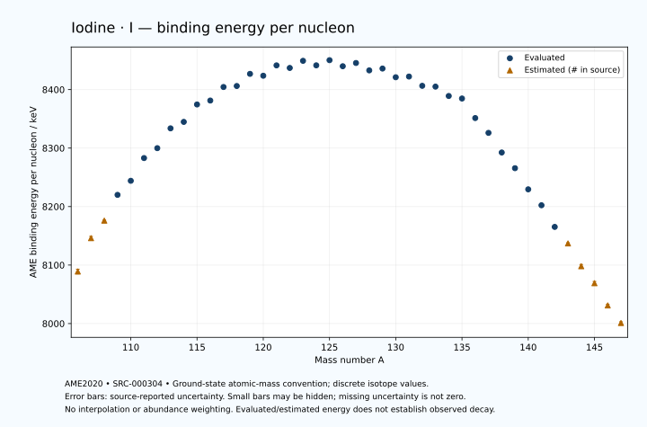

# Iodine — Atomic Masses and Reaction Energies

<!-- generated-by: sync-ame2020.mjs -->

**Dated evaluated data · scientific coverage remains partial.** 42 ground-state nuclides from AME2020. Values and uncertainties are transcribed from the retained unrounded analysis files; estimated quantities remain labelled.

- [Parent Iodine record](0053-Iodine-I.md) · [NUBASE states and decays](0053-Iodine-I-Nuclear-Evaluation.md)
- [Structured data](data/isotopes/0053-Iodine-I-AME2020-Evaluation.yaml)
- [Original mass table](../../data/catalog/sources/ame2020-mass_1.mas20.txt) · [Original reaction table](../../data/catalog/sources/ame2020-rct1.mas20.txt)
- [AME2020 methods](https://doi.org/10.1088/1674-1137/abddb0) (SRC-000303) · [Tables and definitions](https://doi.org/10.1088/1674-1137/abddaf) (SRC-000304)

## Reading the data

All table energies and uncertainties are in keV; binding energy is per nucleon. A # replaces a decimal point in the original estimated value. UNKNOWN (*) retains the source's not-calculable entry; it is neither zero nor automatically NOT APPLICABLE. Source lines are one-based in the retained files. Uncertainties remain those published by the evaluation, with no replacement by independent-mass quadrature.

Atomic-mass conventions apply. Qα is total decay energy, not alpha-particle kinetic energy. Positive Q alone does not establish a decay branch, rate or observation. He-4's source Qα of zero is a bookkeeping identity. These tables describe ground-state combinations, not isomer or excited-daughter transitions. Nuclear state and daughter lookups are explicit in the structured companion. The binding quantity follows [Z M(¹H) + N mₙ − M(A,Z)]c²/A; it has not been converted to a bare-nucleus convention.

## Mass and binding table

| Nuclide | N | Atomic mass excess / keV | AME binding per nucleon / keV | Mass-file line |
|---|---:|---|---|---:|
| I-106 | 53 | -43300# ± 400# | 8089# ± 4# | 1266 |
| I-107 | 54 | -49430# ± 300# | 8146# ± 3# | 1282 |
| I-108 | 55 | -52771# ± 101# | 8176# ± 1# | 1297 |
| I-109 | 56 | -57672.505 ± 6.729 | 8220.0164 ± 0.0617 | 1313 |
| I-110 | 57 | -60467.844 ± 61.940 | 8244.0767 ± 0.5631 | 1328 |
| I-111 | 58 | -64953.795 ± 4.754 | 8282.9343 ± 0.0428 | 1343 |
| I-112 | 59 | -67063.339 ± 10.246 | 8299.8801 ± 0.0915 | 1359 |
| I-113 | 60 | -71119.517 ± 8.011 | 8333.7528 ± 0.0709 | 1375 |
| I-114 | 61 | -72638.935 ± 20.027 | 8344.7790 ± 0.1757 | 1391 |
| I-115 | 62 | -76337.805 ± 28.876 | 8374.5651 ± 0.2511 | 1407 |
| I-116 | 63 | -77420.654 ± 75.037 | 8381.2858 ± 0.6469 | 1423 |
| I-117 | 64 | -80438.568 ± 25.558 | 8404.4307 ± 0.2184 | 1439 |
| I-118 | 65 | -80971.056 ± 19.760 | 8406.1203 ± 0.1675 | 1455 |
| I-119 | 66 | -83777.731 ± 21.706 | 8426.8924 ± 0.1824 | 1471 |
| I-120 | 67 | -83747.160 ± 15.102 | 8423.6745 ± 0.1258 | 1487 |
| I-121 | 68 | -86245.649 ± 4.723 | 8441.4111 ± 0.0390 | 1503 |
| I-122 | 69 | -86079.282 ± 5.181 | 8437.0139 ± 0.0425 | 1520 |
| I-123 | 70 | -87942.588 ± 3.686 | 8449.1896 ± 0.0300 | 1536 |
| I-124 | 71 | -87364.555 ± 2.299 | 8441.4807 ± 0.0185 | 1552 |
| I-125 | 72 | -88836.024 ± 1.353 | 8450.2911 ± 0.0108 | 1569 |
| I-126 | 73 | -87910.496 ± 3.778 | 8439.9379 ± 0.0300 | 1585 |
| I-127 | 74 | -88983.217 ± 3.621 | 8445.4820 ± 0.0285 | 1602 |
| I-128 | 75 | -87738.030 ± 3.621 | 8432.8309 ± 0.0283 | 1619 |
| I-129 | 76 | -88507.176 ± 3.153 | 8435.9908 ± 0.0244 | 1636 |
| I-130 | 77 | -86936.188 ± 3.154 | 8421.1011 ± 0.0243 | 1653 |
| I-131 | 78 | -87442.727 ± 0.605 | 8422.2977 ± 0.0046 | 1671 |
| I-132 | 79 | -85703.502 ± 4.065 | 8406.4628 ± 0.0308 | 1688 |
| I-133 | 80 | -85857.302 ± 5.902 | 8405.0993 ± 0.0444 | 1705 |
| I-134 | 81 | -84043.440 ± 4.857 | 8389.0722 ± 0.0362 | 1722 |
| I-135 | 82 | -83779.180 ± 2.060 | 8384.7609 ± 0.0153 | 1739 |
| I-136 | 83 | -79545.225 ± 14.188 | 8351.3242 ± 0.1043 | 1756 |
| I-137 | 84 | -76356.268 ± 8.383 | 8326.0033 ± 0.0612 | 1773 |
| I-138 | 85 | -71979.910 ± 5.962 | 8292.4450 ± 0.0432 | 1789 |
| I-139 | 86 | -68470.964 ± 4.005 | 8265.6100 ± 0.0288 | 1806 |
| I-140 | 87 | -63606.223 ± 12.109 | 8229.4740 ± 0.0865 | 1823 |
| I-141 | 88 | -59926.666 ± 15.835 | 8202.2562 ± 0.1123 | 1840 |
| I-142 | 89 | -54802.969 ± 4.937 | 8165.2517 ± 0.0348 | 1857 |
| I-143 | 90 | -50790# ± 200# | 8137# ± 1# | 1874 |
| I-144 | 91 | -45330# ± 400# | 8098# ± 3# | 1891 |
| I-145 | 92 | -41130# ± 500# | 8069# ± 3# | 1909 |
| I-146 | 93 | -35540# ± 300# | 8031# ± 2# | 1926 |
| I-147 | 94 | -31200# ± 300# | 8001# ± 2# | 1943 |

## Q-values and separation energies

| Nuclide | Qβ− / keV | Qα / keV | S₂n / keV | S₂p / keV | Reaction-file line |
|---|---|---|---|---|---:|
| I-106 | UNKNOWN (*) | 5375# ± 565# | UNKNOWN (*) | -1417# ± 412# | 1265 |
| I-107 | UNKNOWN (*) | 4816# ± 424# | UNKNOWN (*) | -8# ± 301# | 1281 |
| I-108 | -10139# ± 393# | 4098.6662 ± 4.6084 | 25614# ± 412# | 876# ± 102# | 1296 |
| I-109 | -11502.9589 ± 300.1831 | 3918.0699 ± 20.7635 | 24385# ± 300# | 1597.1990 ± 7.9046 | 1312 |
| I-110 | -8545.2075 ± 118.4700 | 3580.5414 ± 61.4896 | 23839# ± 119# | 2600.4452 ± 62.1829 | 1327 |
| I-111 | -10434# ± 116# | 3274.5378 ± 5.1866 | 23423.9256 ± 8.2388 | 3280.7504 ± 7.0936 | 1342 |
| I-112 | -7036.9910 ± 13.1754 | 2957.0864 ± 11.6273 | 22738.1308 ± 62.7813 | 4191.5362 ± 11.8545 | 1358 |
| I-113 | -8915.8902 ± 10.5334 | 2706.5541 ± 9.5861 | 22308.3579 ± 9.3152 | 4860.7120 ± 11.9366 | 1374 |
| I-114 | -5553.0360 ± 22.9354 | 2385.8939 ± 20.8956 | 21718.2323 ± 22.4961 | 5617.9037 ± 26.8136 | 1390 |
| I-115 | -7681.0475 ± 31.3126 | 2074.0261 ± 30.2018 | 21360.9243 ± 29.9669 | 6498.7812 ± 33.6071 | 1406 |
| I-116 | -4373.7764 ± 75.8444 | 1753.4036 ± 77.1264 | 20924.3551 ± 77.6639 | 7501.9795 ± 77.5986 | 1422 |
| I-117 | -6253.2213 ± 27.5845 | 1553.4816 ± 30.8024 | 20243.3996 ± 38.5621 | 8013.0981 ± 30.1663 | 1438 |
| I-118 | -2891.9893 ± 22.3197 | 1100.6441 ± 27.9536 | 19693.0388 ± 77.5955 | 8726.9787 ± 20.4212 | 1454 |
| I-119 | -4983.2433 ± 24.0598 | 800.7649 ± 26.9810 | 19481.7994 ± 33.5314 | 9716.1099 ± 23.2882 | 1470 |
| I-120 | -1574.7260 ± 19.1760 | 649.9436 ± 15.9346 | 18918.7401 ± 24.8701 | 10328.8987 ± 15.3991 | 1486 |
| I-121 | -3764.6525 ± 11.2790 | -31.0013 ± 9.6683 | 18610.5537 ± 22.2141 | 11348.0517 ± 8.4404 | 1502 |
| I-122 | -724.2937 ± 12.2596 | -507.9940 ± 5.9923 | 18474.7576 ± 15.8501 | 12240.0908 ± 8.8228 | 1519 |
| I-123 | -2694.3302 ± 9.6829 | -891.9643 ± 7.9072 | 17839.5749 ± 5.6854 | 12921.3733 ± 4.0493 | 1535 |
| I-124 | 302.8501 ± 1.8639 | -1372.3374 ± 7.5022 | 17427.9090 ± 5.3360 | 13608.2922 ± 2.8266 | 1551 |
| I-125 | -1636.6632 ± 0.4259 | -1661.7830 ± 2.1340 | 17036.0721 ± 3.4467 | 14191.0755 ± 0.1337 | 1568 |
| I-126 | 1235.8904 ± 3.7779 | -2001.2077 ± 4.2415 | 16688.5778 ± 4.1161 | 14869.3698 ± 3.6745 | 1584 |
| I-127 | -662.3336 ± 2.0442 | -2185.2421 ± 3.5651 | 16289.8290 ± 3.5638 | 15306.0650 ± 4.1469 | 1601 |
| I-128 | 2122.5041 ± 3.6211 | -2543.8773 ± 3.5659 | 15970.1698 ± 2.7403 | 15922.8368 ± 32.0196 | 1618 |
| I-129 | 188.8936 ± 3.1534 | -2676.9981 ± 4.0260 | 15666.5955 ± 4.7975 | 16386.8244 ± 5.9768 | 1635 |
| I-130 | 2944.2864 ± 3.1537 | -2967.9684 ± 32.0018 | 15340.7940 ± 4.7978 | 16884.2785 ± 19.0416 | 1652 |
| I-131 | 970.8477 ± 0.6046 | -3169.3493 ± 5.1191 | 15078.1873 ± 3.2109 | 17391.2852 ± 21.2337 | 1670 |
| I-132 | 3575.4729 ± 4.0654 | -3498.5658 ± 19.2223 | 14909.9497 ± 5.1452 | 17995.7569 ± 14.7824 | 1687 |
| I-133 | 1786.2812 ± 6.3712 | -3652.8335 ± 22.0304 | 14557.2107 ± 5.9328 | 18453.8323 ± 6.2589 | 1704 |
| I-134 | 4082.3946 ± 4.8567 | -4182.6688 ± 15.0193 | 14482.5743 ± 6.3337 | 18986.1003 ± 5.4474 | 1721 |
| I-135 | 2634.1851 ± 3.8284 | -4222.6839 ± 2.9300 | 14064.5140 ± 6.2510 | 19433.6087 ± 3.7452 | 1738 |
| I-136 | 6883.9455 ± 14.1880 | -2334.8589 ± 14.4009 | 11644.4210 ± 14.9963 | 20104.1628 ± 14.5172 | 1755 |
| I-137 | 6027.1455 ± 8.3841 | 142.3287 ± 8.9479 | 8719.7249 ± 8.6328 | 21243.8784 ± 8.7894 | 1772 |
| I-138 | 7992.3346 ± 6.5881 | -385.8215 ± 6.7074 | 8577.3211 ± 15.3896 | 22050.9622 ± 8.3381 | 1788 |
| I-139 | 7173.6224 ± 4.5424 | -1205.5474 ± 4.7974 | 8257.3314 ± 9.2912 | 22988.5135 ± 52.3172 | 1805 |
| I-140 | 9380.2388 ± 12.3313 | -1524.2490 ± 13.4396 | 7768.9492 ± 13.4974 | 23534# ± 300# | 1822 |
| I-141 | 8270.6430 ± 16.0965 | -2291.1892 ± 54.5143 | 7598.3381 ± 16.3341 | 24454# ± 400# | 1839 |
| I-142 | 10426.6792 ± 5.6276 | -2578# ± 300# | 7339.3828 ± 13.0771 | 24991# ± 600# | 1856 |
| I-143 | 9413# ± 200# | -3165# ± 447# | 7006# ± 201# | 25828# ± 539# | 1873 |
| I-144 | 11542# ± 400# | -3365# ± 721# | 6670# ± 400# | 26298# ± 500# | 1890 |
| I-145 | 10363# ± 500# | -4015# ± 707# | 6483# ± 539# | UNKNOWN (*) | 1908 |
| I-146 | 12415# ± 301# | -4355# ± 424# | 6353# ± 500# | UNKNOWN (*) | 1925 |
| I-147 | 11199# ± 361# | UNKNOWN (*) | 6213# ± 583# | UNKNOWN (*) | 1942 |

Qβ− comes from the mass-file line in the first table. The other three columns come from the reaction-file line. Definitions and original source strings are retained in the structured data.

## Binding-energy chart

Discrete source values and source-reported uncertainties. No interpolation, natural-abundance weighting or observed-decay claim is implied. This quantitative chart supplements the 22 separate illustrative panels.

## Remaining review

Later measurements, state-specific decay branches, isomer Q-values, additional reaction channels and full claim-level review remain open. Existing authored values retain their own provenance; this companion does not overwrite them.
